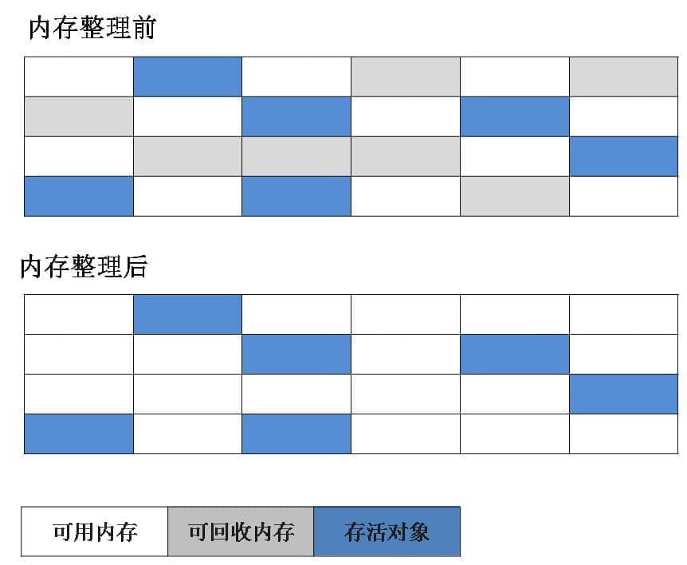

# JVM内存区域详解

## 区别

> 关系：JDK包含JRE，而JRE包含JVM

### 1.JDK

JDK(Java Development Kit)，即Java开发工具包，是一个编写Java应用程序的**开发环境**，是java的**核心**所在。它包括了Java运行环境JRE，Java开发工具比如在bin目录下的编译器javac.exe，还有Java基础的类库（即Java API 包括rt.jar）

>  jdk1.8目录包含：
>
>  bin：存放exe文件，最主要的是编译器javac.exe
>
>  jre：java运行环境，包括JVM与Java基础和核心类库 。
>
>  lib：本地资源库
>
>  include：java和JVM交互用的头文件

### 2.JRE

JRE，即Java运行环境，包含JVM标准实现与Java基础和核心类库。

单独有JVM不能执行.class字节码文件，因为在解释.class文件的时候JVM需要调用解释所需要的类库，类库里面有java.exe可以运行Java程序。但类库里面没有javac.exe，所以无法编译Java程序只能运行Java程序。

> jre1.8目录包含：
>
> bin：可以把这个bin目录理解成JVM。
>
> lib：Java基础和核心类库，如rt.jar，也包含JVM运行时需要的类库。

### 3.JVM

JVM，即Java虚拟机，是JRE的一部分。它是整个java实现跨平台的最核心的部分，负责解释和执行.class字节码文件。不同平台实现了其相应的java虚拟机，而编译器只需要面向该平台的Java虚拟机来编译，编译后的Java字节码.class文件就可以在该平台上运行，这就是Java能够“一次编译，到处运行”的原因。JVM自己无法执行，必须要联合JRE中的lib目录下的Java基础和核心类库才能使用。将java程序编译成标准字节码（class文件）而后通过JVM转为对应平台的机器码来屏蔽底层差异实现此特性

## 架构图


## 执行流程

```
public class example {

    public static final int age = 20;

    public static int sex = 1;	// 0=女 1=男

    public int add(){
        int number1 = 1;
        int number2 = 2;
        int result = (number1 + number2) * 100;
        return  result;
    }

    public static void main(String[] args) {
        example example = new example();
        int mainResult = example.add();
        System.out.println(mainResult);
    }
}
```

### 类加载器

1.**启动类加载器**  BootstrapClassLoader：最顶层的加载器，由 C++实现，负责加载 `JAVA_HOME\lib`目录下的 jar 包和类或者被 `-Xbootclasspath`参数指定的路径下的所有类

2.**扩展类加载器**  ExtClassLoader：负责加载 `%JRE_HOME%/lib/ext` 目录下的 jar 包和类。

3.**应用程序加载器** ：面向我们用户的加载器，负责加载当前应用 classpath 下的 jar 包和类。

4.**用户自定义加载器**  ：自定义加载器的话，需要继承 `ClassLoader` 。如果我们不想打破双亲委派模型，就重写 `ClassLoader` 类中的 `findClass()` 方法即可，无法被父类加载器加载的类最终会通过这个方法被加载。但是，如果想打破双亲委派模型则需要重写 `loadClass()` 方法

```java
public class Task {
    public static void main(String[] args) {
        Task task = new Task();
        Class<? extends Task> aClass = task.getClass();

        System.out.println(aClass.getClassLoader());//AppClassLoader 应用程序加载器
        ClassLoader classLoader = aClass.getClassLoader();
        System.out.println(classLoader.getParent());//ExtClassLoader 扩展类加载器 \jre\lib\ext
        System.out.println(classLoader.getParent().getParent());//null 1、不存在  2、java程序获取不到 -rt.jar
    }
}
```

### 类加载过程*

>  Java 语言通过字节码的方式，在一定程度上解决了传统解释型语言执行效率低的问题，同时又保留了解释型语言可移植的特点。所以 Java 程序运行时比较高效，而且，由于字节码并不针对一种特定的机器，因此，Java 程序无须重新编译便可在多种不同操作系统的计算机上运行。

当我们点击Run运行时，前端编译器会负责从文件系统或网络中编译生成**符合规范**的字节码，也就是扩展名为.class的文件交付于classLoader类加载器加载。

JVM类加载机制分为三个阶段，分别为**加载阶段、连接阶段、初始化阶段**，连接阶段会进行验证、准备、解析。当所有类流程都走一遍后，加载的类信息存放于元空间实现的方法区中（除了类信息、还会存放运行时常量池信息）。


#### 1、Loding 加载

&emsp;&emsp;加载阶段就是通过一个类的全限定名获取定义此类的二进制字节流，将这个字节流的静态存储结构转换为方法区的运行时数据结构，并且生成一个代表这个类的java.lang.Class对象，作为方法区这个类的各种数据的访问入口。有了这个class对象可以通过`反射`在**程序运行过程中**动态**获取类信息**和**调用类方法**。

&emsp;&emsp;加载的阶段还涉及到了**双亲委派机制**。概念是指：一个类加载器如果收到了类的加载请求，自身不会先去加载，而是向上层递交请求委托。如果父类还存在上级，就继续递交，直到请求到达最顶层的类加载器（根据加载路径判断）。如果此时父类无法完成加载任务，自身才会加载。

&emsp;&emsp; 双亲委派机制保证了 Java 程序的稳定运行，避免了类的重复加载，也保证了 Java 的核心 API 不被篡改，保证了程序安全。如果没有使用双亲委派模型，而是每个类加载器加载自己的目录下的文件的话就会出现一些问题，比如我们编写一个称为 `java.lang.Object` 类的话，那么程序运行的时候，系统就会出现多个不同的 `Object` 类。

#### 2、Linking 连接

加载阶段和连接阶段的部分内容是交叉进行的，加载阶段尚未结束，连接阶段可能就已经开始了。连接阶段会进行验证、准备、解析。

- 验证（Verify）：是对字节流进行四种验证：文件格式验证、元数据验证、字节码验证、符号引用验证。

  


- 准备Prepare：

  **准备阶段正式为类变量分配内存并设置类变量初始值**，这些内存都将在方法区中分配。准备阶段要注意两点：

  - 这时候进行内存分配的仅包括类变量（ Class Variables ，即静态变量，被 `static` 关键字修饰的变量，只与类相关，因此被称为类变量），而不包括实例变量（用final修饰的实例变量也不行）。实例变量会在对象实例化时随着对象一块分配在 Java 堆中。
  - 设置的初始值通常情况下是数据类型默认的零值（如0，null，false），编译器会收集所有静态变量的赋值语句、所有静态代码块，合并成一个方法，即<clinit>方法。赋值语句编译后存放到类构造器< clinit>方法中，会在初始化阶段进行赋值。但有个特殊情况不是赋零值，比如给静态变量加上了 final 关键字的时候赋值的是真实值。

- 解析Resolve ：解析阶段的工作很简单，就是将运行时常量池中的符号引用转换为直接引用。

> 符号引用就是指在编译过程中，java类不知道引用类的实际地址，故用符号引用来替代。 
>
> 1. 类和接口的全限定名（Fully Qualified Name）
> 2. 字段的名称和描述符（Descriptor）
> 3. 方法的名称和描述符
>
> 直接引用是指：
>
> 1. 直接指向目标的指针。（个人理解为：指向对象，类变量和类方法的指针）
> 2. 相对偏移量。（指向实例的变量，方法的指针）
> 3. 一个间接定位到对象的句柄。

```
CONSTANT_Class_info
CONSTANT_Field_info
// 等类型的常量, 符号引用应用的目标并不一定已经加载到内存中
// 直接引用是可以指向目标的指针，如果有了直接引用那引用的目标必定在内存之中
```

#### 3、Initliation 初始化

  到了初始化阶段，才真正执行类中定义的Java程序代码。只有主动去使用类，而且类中有对静态变量赋值或者存在静态代码块才会进入此阶段。初始化阶段是负责执行**类构造器**< clinit>方法， 也就是为准备阶段的类变量和对静态代码块的赋值操作。

```
//也就是
prepare阶段:  public static int sex = 0;			//initial阶段中 sex --> 1  	
```


### 执行引擎

>[虚拟机](https://so.csdn.net/so/search?q=%E8%99%9A%E6%8B%9F%E6%9C%BA&spm=1001.2101.3001.7020)是相对于物理机的概念，两者都有执行代码的能力。 物理机的执行引擎是建立在处理器、缓存、指令集合和操作系统层面上的。而虚拟机的执行引擎则是由软件实现的。

类加载完成后，执行引擎与JVM运行时数据区一起完成代码执行流程。
JVM的执行引擎有两种，一种是历史悠久的解释器，另一种则是JIT即时编译器:

- 当Java虚拟机启动时解释器会根据预定义的规范对字节码采用逐行解释的方式执行，将每条字节码指令编译成对应的本地机器指令并执行。
- 而JIT是将有价值的字节码编译成本地机器指令缓存起来，它只负责热点代码的编译工作。JIT即时编译的目的是**避免方法被解释执行，将整个方法编译成本地机器指令后，每次执行该方法时，只执行经过即时编译后的本地机器指令**，这种方式可以使执行效率大幅度提升

解释器与JIT通常是一起工作的，当程序启动后，解释器可以立刻执行，响应速度快。随着程序的运行，JIT会逐渐发挥作用，根据热点探测功能将有价值的字节码编译成本地机器指令缓存起来，换取更高的程序执行效率。热点探测功能是根据方法调用计数器或者回边计数器来确定热点代码， 一般而言for循环内的循环体会被确认为热点代码。

> 方法调用计数器统计方法的调用次数，回边计数器统计循环体的循环次数

大致执行情况如下：


## 生命周期示例

此时我们再看到示例代码，当类加载阶段执行完毕后，运行时常量池会填充完毕，这里保存着各种字面量和符号引用。随后执行引擎中的解释器会率先启动，对ClassFile字节码采用**逐行解释**的方式加载机器码，并配合运行时数据区的**程序计数器**与**操作数栈**来支持java.exe程序的执行。

简单查看main()方法的运行过程：

```
public static void main(String[] args) {
     example example = new example();
     int mainResult = example.add();
     System.out.println(mainResult);
 }
```


执行过程如下：1、为main方法创建栈帧：

局部变量表长度为3， slot0存放参数args， slot1存放局部变量example，slot2存放局部变量mainResult，操作数栈最大深度为2.

2、 new #2  <com/jvm/learn/example> 指令， 在java堆中创建java对象

继续补充知识：

- 堆：所有的对象实例以及数组都应该在运行时分配到堆上。注意：

  ①、堆区是线程共享的区域，任何线程都可以访问到堆区中的共享数据，但由于对象实例在堆区创建非常频繁，因此在并发环境下从堆区中划分内存空间时线程不安全的。因此额外需要一块**空间加锁来避免死锁**——这块空间叫**TLAB**， 仅占Eden区的百分之一。

  ②、堆区**不是唯一的分配区域**，这涉及到逃逸分析： 假设一个对象没有逃逸出该方法，那么就可能被优化为栈上分析，会使运行速度更快。当一个对象在方法中被定义后，对象只在方法内部使用，那就是没有发生逃逸。若对象在方法中被定义后，对象在方法外被引用了，那就是发送了逃逸，如下：

```
StringBuffer sb = new StringBuffer();
return sb;              //逃逸
return sb.toString();   //未逃逸
```

回到代码，new#2指令，在堆中创建了一个example对象，并将其引用值放入操作数栈，即：


3、invokespecial #3 <com/jvm/learn/example.< init>>调用的是< init>方法，编译器将调用父类的< init> 的语句、构造代码块、实例字段赋值语句，以及自己编写的构造方法中的语句整合在一起生成一个方法。这里调用的是默认构造函数，只是向上调用父类Object的init方法：

```
0 aload_0
1 invokespecial #1 <java/lang/Object.<init>>
4 return
```

（注：**final修饰实例变量**是在实例构造器方法里面赋值的，也就是对象创建的时候赋值（此时赋值））

4、第一行代码执行完毕， 将example返回给局部变量表，继续执行add方法此时可以看到：

```
astore_1            //将slot1处的引用类型值入局部表
aload_1             //将example加载到操作数栈
invokevirtual #4 <com/jvm/learn/example.add>        //调用example的add方法
```

**5、add方法**创建add()方法的栈帧， 即：


有了上面的理解，直接看字节码指令：

```
 0 iconst_1         // 直接将slot1的常量1压入操作数栈
 1 istore_1         // 存入局部变量表
 2 iconst_2         // 直接将slot2的常量2压入操作数栈
 3 istore_2         // 存入局部变量表
 4 iload_1          // 从局部变量表中加载
 5 iload_2          // 从局部变量表中加载
 6 iadd             // 相加
 7 bipush 100       // 将100如栈
 9 imul             // 与add结果相乘
10 istore_3         // 将结果保存到局部变量表汇总
11 iload_3          // 加载局部变量index为3的数据
12 ireturn          // 返回结果
```

6、 到这就剩下打印语句的执行  过程也很简单，将add方法返回的结果入局部变量表，从运行时常量池中获取System.out的类元信息，从局部变量表中加载mainResult，调用PrintStream.println方法，返回结束。

**总结：**

一个Class File文件首先经过ClassLoader的加载、链接、初始化加载到元空间，一些符号引用被解析为直接引用或等到运行时分派（动态绑定）。然后程序通过class对象来访问元空间里的各种类型数据，当加载完之后，执行引擎发现main方法，也就是程序入口，那么就会创建相应的栈帧，执行引擎逐行读取方法内的代码转换为机器码，而这些指令大多已经被解析为直接引用了，那么执行引擎通过持有这些直接引用去元空间寻找变量对应的字面量来进行方法操作。完成操作后，栈帧出栈，内存空间被GC回收。

全流程包括以下步骤： 源码编写——编译（javac编译）----> 类文件被加载到虚拟机（内存） —> 虚拟机执行引擎执行二进制字节码 —> 形成运行时数据区 -----> 垃圾回收（JVM回收机制）

## JVM内存区域模型

  运行时数据区：


### PC寄存器

又可以称为程序计数器，它是一块很小的内存空间，可以看作是当前线程所执行的字节码的行号指示器。其主要作用是**记录当前线程执行的代码行号**。在进行线程切换的时候可以通过PC寄存器来获取要执行的代码行号。

> **PC寄存器是线程私有的内存区域**，即每个线程都有一个PC寄存器

### 虚拟机栈

与程序计数器一样，Java 虚拟机栈也是**线程私有**的，它的生命周期和线程相同，随着线程的创建而创建，随着线程的死亡而死亡。

方法调用的数据需要通过栈来进行传递，每一次方法调用都会有一个对应的栈帧被压入栈中，每一次方法调用结束后都会有一个栈帧被弹出。**无论方法正常完成还是异常完成都算作方法结束。**

栈帧由局部变量表，操作数栈，动态链接，方法返回地址组成。

- 局部变量表被定义为一个数组， 保存返回地址参数、方法参数类型和方法体内的局部变量

  >  注意： 基本数据类型（如byte/short/char）在存储前会被转换为int，boolean类型也会，对应的是0为false，1为true）

- 操作数栈根据字节码指令，往栈中写入数据或提取数据。主要用于保存计算过程的中间结果，同时作为计算过程中临时变量的存储空间。

- 动态链接指向运行时常量池的方法引用。

  > 比如，描述一个方法调用了另外的其他方法时，就是通过常量池中指向方法的符号引用来表示的，动态链接的作用就是为了将这些符号引用转换为调用方法的直接引用

- 方法返回地址保存了PC寄存器的地址值，也就是调用者的PC寄存器的值作为返回地址

  

  注意： 方法的调用分为静态调用和动态调用

  - ①、静态调用是指编译器确定的，是非虚方法（静态方法、私有方法 、final方法、实例构造器、父类方法
  - ②、动态调用是指运行期确定的，是虚方法

  ​


> 堆栈区别：
>
> 增长方向、空间大小、管理方式
>
> 栈是由系统自动分配的一块连续的内存空间，申请速率快，由栈编译器自动管理，无需程序员手工控制，申请后只要栈的剩余空间大于申请空间，系统就为内存提供空间，否则将报异常提示栈溢出。堆是由程序员申请的不连续的内存空间，因为对于堆来讲，频繁的malloc/free（new/delete）势必会造成内存空间的不连续，堆申请速率慢，但受程序员控制，空间灵活也较大。
>
> 数据结构方面：
>
> （查看数据结构.md)

### 本地方法栈

本地方法栈和虚拟机栈所发挥的作用非常相似，区别是： **虚拟机栈为虚拟机执行 Java 方法服务，而本地方法栈则为虚拟机使用到的 Native 本地方法服务。**

### 堆

Java 堆是所有线程共享的一块内存区域，在虚拟机启动时创建。**此内存区域的唯一目的就是存放对象实例，几乎所有的对象实例以及数组都在这里分配内存。**

但从 JDK 1.7 开始已经默认开启**逃逸分析**，如果某些方法中的对象引用没有被返回或者未被外面使用，也就是未逃逸出去，那么对象可以直接在栈上分配内存，加快了运行速度。

Java 堆是垃圾收集器管理的主要区域，因此也被称作**GC 堆（Garbage Collected Heap）**。从垃圾回收的角度，由于现在收集器基本都采用分代垃圾收集算法，所以 Java 堆还可以细分为：新生代和老年代，新生代又可以细分为Eden区 、From Survivor区、To Survivor区 等。**进一步划分的目的是更好地回收内存，或者更快地分配内存。**

> səˈvaɪvə(r)

### 方法区！！！


方法区是所有线程共享的一块内存区域。当虚拟机要使用一个类时，它需要读取并解析 Class 文件获取类的相关信息，再将信息存入到方法区。方法区会存储已被虚拟机加载的**类元信息**，**运行时常量池**，**JIT编译代码产物**。类元信息有类型信息，方法信息，方法表等，运行时常量池有文本字符串，final常量值，基本数据类型值还有类和方法的符号引用。

> 字符串常量池

**字符串常量池** 是 JVM 为了**提升性能**和**减少内存消耗**针对字符串（String 类）专门开辟的一块区域，主要目的是为了避免字符串的重复创建。在声明一个字符串字面量时，如果字符串常量池中能够找到该字符串字面量，则直接返回该引用。如果找不到的话，则在常量池中创建该字符串字面量的对象并返回其引用。

```
String aa = "ab"; // 放在常量池中
String bb = "ab"; // 从常量池中查找
System.out.println(aa==bb);// true
```

JDK1.7 之前运行时常量池包含字符串常量池存放在方法区。JDK1.7 的时候，字符串常量池被从方法区拿到了堆中。


## 直接内存

直接内存是一块由操作系统直接管理的内存，也叫堆外内存，属于“内核态”。这样做的好处是能够在一定程度上减少垃圾回收对应用程序造成的影响。而且因为在内核态，就减少了在写数据时由用户态复制到内核态这一过程，提升了io效率。但是，既然是内存就会受到**本机总内存大小**以及**处理器寻址空间**的限制。

一般我们使用Unsafe和NIO包下ByteBuffer来创建堆外内存。

JDK1.4 中新加入的 **NIO(New Input/Output) 类**，引入了一种基于**通道（Channel）与缓存区（Buffer）的 I/O 方式，它可以直接使用 Native 函数库直接分配堆外内存，然后通过一个存储在 Java 堆中的 DirectByteBuffer 对象作为这块内存的引用进行操作。这样就能在一些场景中显著提高性能，因为避免了在 Java 堆和 Native 堆之间来回复制数据**。


## JDK内存区域的变化

**JDK1.6 到 JDK1.8 方法区的变化：**

| **版本**    | **变化**                                   |
| --------- | ---------------------------------------- |
| jdk1.6及之前 | 有永久代（Permanent generation），字符串常量池、静态变量存放在永久代 |
| jdk1.7    | 字符串常量池、静态变量移出永久代，存放在堆中                   |
| jdk1.8及之后 | 去除了永久代，被用本地内存的元空间（Metaspace）取代           |

**JDK 1.7 为什么要将字符串常量池移动到堆中？**

主要是因为永久代的垃圾回收效率太低，只有在整堆收集也就是Full GC的时候才会被执行收集。Java 程序中通常会有大量的被创建的字符串等待回收，将字符串常量池放到堆中，能够更高效及时地回收字符串内存。

**为什么方法区的实现要将永久代 替换为元空间呢?**

1、因为永久代有一个 JVM 设置的固定大小的内存上限，无法进行调优，而且合适的大小难于确定，而元空间使用的是本地内存，受本机可用内存的限制，虽然元空间仍然可能溢出，但是比原来出现的几率会更小。

> 当元空间溢出时会得到如下错误： `java.lang.OutOfMemoryError: MetaSpace`

你可以使用 `-XX：MaxMetaspaceSize` 标志设置最大元空间大小，默认值为 unlimited，这意味着它只受系统内存的限制。`-XX：MetaspaceSize` 调整标志定义元空间的初始大小，如果未指定此标志，则 Metaspace 将根据运行时的应用程序需求动态地重新调整大小。

2、元空间里面存放的是类的元数据，这样加载多少类的元数据就不由 `MaxPermSize` 控制了, 而由系统的实际可用空间来控制，这样能加载的类就更多了。


## HotSpot 虚拟机对象探秘

### 对象创建过程

**第一步：类加载检查**

虚拟机遇到一条 new 指令时，首先将去检查这个指令的参数是否能在运行时常量池中定位到这个类的符号引用，并且检查这个符号引用代表的类是否已被加载、连接和初始化过。如果没有，那必须先执行相应的类加载过程。

**第二步：分配内存**

在**类加载检查**通过后，接下来虚拟机将为新生对象**分配内存**。对象所需的内存大小在类加载完成后便可确定，为对象分配内存的任务等同于把一块确定大小的内存从 Java 堆中划分出来。**分配方式**有 **“指针碰撞”** 和 **“空闲列表”** 两种，**选择哪种分配方式由 Java 堆是否规整决定，而 Java 堆是否规整又由所采用的垃圾收集器是否带有压缩整理功能决定**。

**内存分配的两种方式** （补充内容，需要掌握）：

- 指针碰撞 ：
  - 适用场合 ：堆内存规整（即没有内存碎片）的情况下。
  - 原理 ：用过的内存全部整合到一边，没有用过的内存放在另一边，中间有一个分界指针，只需要向着没用过的内存方向将该指针移动对象内存大小位置即可。
  - 使用该分配方式的 GC 收集器：Serial, ParNew
- 空闲列表 ：
  - 适用场合 ： 堆内存不规整的情况下。
  - 原理 ：虚拟机会维护一个列表，该列表中会记录哪些内存块是可用的，在分配的时候，找一块儿足够大的内存块儿来划分给对象实例，最后更新列表记录。
  - 使用该分配方式的 GC 收集器：CMS

选择以上两种方式中的哪一种，取决于 Java 堆内存是否规整。而 Java 堆内存是否规整，取决于 GC 收集器的算法是"标记-清除"，还是"标记-整理"（也称作"标记-压缩"），值得注意的是，复制算法内存也是规整的。

**第三步：初始化零值**

分配完内存后，需要对对象的字段进行初始化零值，对象头除外。这也就解释了为什么这些字段在不需要进程初始化时候就能直接使用。

**第四步：设置对象头**

初始化零值完成之后，**虚拟机要设置对象头**。Java的对象头由**标记字段**和**指向类的指针**组成。标记字段包含：哈希值、GC分代年龄、锁状态标识等。指向类的指针指向方法区中该对象的类数据，虚拟机通过这个指针来确定这个对象是哪个类的实例。 


**第五步：执行对象初始化方法init**

init方法包含成员变量、构造代码块的初始化，按照声明的顺序执行。

**第六步：对象的访问定位**

Java 程序通过虚拟机栈的局部变量表上的 reference 数据来操作堆上的具体对象。对象的访问方式有：**使用句柄**和**直接指针**两种。

### 对象的访问定位

**句柄**

如果使用句柄的话，那么 Java 堆中将会划分出一块内存来作为句柄池，reference 中存储的就是对象的句柄地址，而句柄中包含了对象实例数据与类型数据各自的具体地址。


**直接指针**

如果使用直接指针访问，reference 中存储的直接就是对象的地址。那么 Java 堆对象的布局中就必须考虑如何放置访问类数据的相关信息。


这两种对象访问方式各有优势。使用句柄来访问的最大好处是 reference 中存储的是稳定的句柄地址，在对象被移动时只会改变句柄中的实例数据指针，而 reference 本身不需要修改。使用直接指针访问方式最大的好处就是速度快，它节省了一次指针定位的时间开销。

### **堆内存分配并发问题** ！！！

Java堆是线程共享区域，任何线程都可以访问到堆中的共享数据，在虚拟机中创建对象并分配内存是一个很频繁的操作，所以在java堆中分配内存并发情况下不是线程安全的。通常来讲，虚拟机采用两种方法来保证线程安全：

- **第一种方法是加锁**：给分配内存这个操作加锁，采用CAS+失败重试机制来保证操作的原子性， 如果因为冲突导致失败就重试，直到成功为止。但是在虚拟机中创建对象并分配内存是一个很频繁的操作，每次都要进行安全同步的话效率会很低。
- **第二种方法是线程隔离**：为每一个线程在 Eden 区预先分配一块区域，这区域叫做本地线程分配缓存TLAB（Thread Local Allocation Buffer）。虚拟机在给线程中的对象分配内存时，首先在 TLAB 上分配，当对象内存大于 TLAB 中的剩余内存或 TLAB 的内存已用尽时，再采用上述的 加锁方式进行内存分配。

### 对象的内存布局

在 Hotspot 虚拟机中，对象在内存中的布局可以分为 3 块区域：**对象头**、**实例数据**和**对齐填充**。


**对象头**

Java的对象头由**标记字段**、**指向类的指针**组成。

标记字段包含：哈希值、GC分代年龄、锁状态标识。


指向类的指针指向方法区中该对象类型数据，虚拟机通过这个指针来确定这个对象是哪个类的实例。

**实例数据**

对象的实例数据就是对象属性的属性值。

**对齐填充**

对齐填充部分仅仅起占位作用。 因为JVM要求Java对象的大小必须是 8 字节的整数倍。当对象大小不是8的倍数时，就需要通过对齐填充来补全。

注：标记字段和指向类的指针在32位机器上默认是4字节,64位默认是8字节。

但为了减少64位平台下指针内存的消耗，会启用指针压缩功能（编码+解码），将64位指针压缩成32位。


# JVM垃圾回收详解

当需要排查各种内存溢出问题、当垃圾收集成为系统达到更高并发的瓶颈时，我们就需要对这些“自动化”的技术实施必要的监控和调节。

## 内存分配与回收策略

### 对象优先在 eden 区分配

大多数情况下，对象在新生代中 eden 区分配。**当 eden 区没有足够空间进行分配时，虚拟机将发起一次 Young GC**，将Eden区和From Survivor区存活对象送到未使⽤的To Survivor区，并且年龄还会加1，当它的年龄增加到一定程度（默认为大于 15 岁），就会被晋升到老年代中。对象晋升到老年代的年龄阈值，可以通过参数 `-XX:MaxTenuringThreshold` 来设置。

如果YoungGC之后还是没有足够空间，则直接通过**空间分配担保机制**进入老年代分配。如果⽼年代也⽆法分配空间，触发FullGC，FullGC之后还是放不下则报出OOM异常。

> 添加`-XX:+PrintGCDetails` 打印GC信息

### 空间分配担保

空间分配担保是为了确保在 Minor GC 之前老年代本身还有容纳新生代所有对象的剩余空间。

在发生 Young GC 之前，虚拟机必须先检查老年代最大可用的连续空间是否大于新生代所有对象总空间，如果这个条件成立，那这一次 Minor GC 可以确保是安全的。如果不成立，则虚拟机会先查看 `-XX:HandlePromotionFailure` 参数的设置值是否允许担保失败(Handle Promotion Failure);如果允许，那会继续检查老年代最大可用的连续空间是否大于历次晋升到老年代对象的平均大小，如果大于，将尝试进行一次 Minor GC，尽管这次 Minor GC 是有风险的;如果小于，或者 `-XX: HandlePromotionFailure` 设置不允许冒险，那这时就要改为进行一次 Full GC。

> JDK 6 Update 24 之后的规则变为只要老年代的连续空间大于新生代对象总大小或者历次晋升的平均大小，就会进行 Minor GC，否则将进行 Full GC。

### GC分类

**总结：**

针对 HotSpot VM 的实现，它里面的 GC 其实准确分类只有两大种：

部分收集 (Partial GC)：

- 新生代收集（Minor GC(ˈmaɪnə(r)) / Young GC）：只对新生代进行垃圾收集；
- 老年代收集（Major GC (ˈmeɪdʒə(r))/ Old GC）：只对老年代进行垃圾收集。需要注意的是 Major GC 在有的语境中也用于指代整堆收集；
- 混合收集（Mixed GC）：对整个新生代和部分老年代进行垃圾收集。

整堆收集 (Full GC)：收集整个 Java 堆和**方法区**。

### 垃圾回收触发条件

**Minor GC触发条件：**

- Eden区域满了，会触发Minor GC；
- 新生对象需要分配到新生代的Eden，当Eden区的内存不够时需要进行MinorGC。

**Major GC触发条件：**

- 老年代区域设置的阈值空间满了，会触发Major GC；
- 新对象需要分配到老年代，此时老年代设置阈值可用空间不足时触发Major GC。

**Full GC触发条件：**

- 内存担保机制 ，Survivor空间不足时，判断是否允许担保失败，如果不允许则进行Full GC。如果允许，并且每次晋升到老年代的对象平均大小>老年代最大可用连续内存空间，也会进行Full GC；
- MinorGC后存活的对象超过了老年代剩余空间；
- **方法区内存不足时；**
- **程序中调用了System.gc()方法**，可用通过-XX:+ DisableExplicitGC来禁止调用System.gc；
- CMS GC异常，CMS运行期间预留的内存无法满足程序需要，就会出现一次“Concurrent Mode Failure”失败，会触发Full GC。

### 内存溢出

> https://juejin.cn/post/7083517117491839007

内存溢出（OutOfMemory，简称OOM）是一个令人头疼的问题，它通常出现在某一块内存空间耗尽的时候。

**栈内存溢出**

简单总结一下程序运行中栈可能会出现两种错误：

- **StackOverFlowError：** 若栈的内存大小不允许动态扩展，那么当线程请求栈的深度超过当前 Java 虚拟机栈的最大深度的时候，就抛出 `StackOverFlowError` 错误。(无限递归)。
- **OutOfMemoryError：** 如果栈的内存大小可以动态扩展， 如果虚拟机在动态扩展栈时无法申请到足够的内存空间，则抛出`OutOfMemoryError`异常。

我们常见的HotSpot虚拟机不支持扩展，所以一般都是StackOverFlowError错误，除非创建线程申请内存时就因无法获得足够内存才会出现OutOfMemoryError异常。

可以通过-Xss来调节栈内存容量。

**堆内存溢出**

堆这里最容易出现的就是 `OutOfMemoryError` 错误，并且出现这种错误之后的表现形式还会有几种，比如：

1. **java.lang.OutOfMemoryError: GC Overhead Limit Exceeded** ： 当 JVM 花太多时间执行垃圾回收并且只能回收很少的堆空间时，就会发生此错误。
2. **java.lang.OutOfMemoryError: Java heap space** :假如在创建新的对象时, 堆内存中的空间不足以存放新创建的对象, 就会引发此错误。(死循环执行list添加元素)

应当检查 Java 虚拟机的堆参数（-Xmx与-Xms）设置，与机器的内存对比，看看是否还有向上调整的空间。再从代码上检查是否存在某些对象生命周期过长、持有状态时间过长、存储结构设计不合理等情况，尽量减少程序运行期的内存消耗。

-Xms2g：JVM启动初始化堆大小为2g，Xms的默认是物理内存的1/64但小于1G。

-Xmx2g：JVM最大的堆大小为2g，Xmx默认是物理内存的1/4但小于1G。

**方法区和运行时常量池溢出**

运行时常量池属于方法区的一部分。JDK8之后方法区的实现已经改为了直接内存。

```
-XX:MetaspaceSize=N //设置Metaspace的初始（和最小大小）
-XX:MaxMetaspaceSize=N //设置Metaspace的最大大小，默认为-1，即不限制， 或者说只受限于本地内存大小
```

如果不指定大小的话，随着更多类的创建，虚拟机会耗尽所有可用的系统内存。


**直接内存溢出**

直接内存是一块由操作系统直接管理的内存，也叫堆外内存，属于“内核态”。这样做的好处是能够在一定程度上减少垃圾回收对应用程序造成的影响。而且因为在内核态，就减少了在写数据时由用户态复制到内核态这一过程，提升了io效率。但是，既然是内存就会受到**本机总内存大小**以及**处理器寻址空间**的限制。

直接内存（DirectMemory）容量可以通过 -XX:MaxDirectMemorySize=1g 指定，如果不指定，则默认为与 Java 堆的最大值（-Xmx指定）一样

### 内存泄漏**

> 若cpu占用过高，可能是空轮循，或者发生了频繁的垃圾回收，或者程序访问压力过大
>
> 服务器内存使用持续增长且增长速率大，可能是内存泄露导致的。

**排错步骤**

1.查看内存使用，对相隔一段时间的应用内存使用情况进行对比（top命令等），确认内存存在缓慢上升的情况

2.jstat -gccapacity 【pid】查看JVM各部分内存使用增长是否符合top命令展示的应用内存使用增长。

- 如果符合，则使用MAT工具分析JVM堆栈情况，对比隔一段时间的堆栈对象增长情况，对于增加的对象进行内存泄露排查。

  

- 如不符合，这说明内存使用很大概率不是JVM堆栈导致的，可能程序中使用了堆外内存，堆外内存持续增长的这种情况不容易排查，最好开启JVM的NMA功能，使用jcmd命令对堆外内存进行分析。

注：常见的堆外内存泄漏：

- JNI
- gzip
- 线程栈
- 不良代码
- ThreadLocal
- NIO directbuffer泄漏

**linux查看内存相关命令**

-  free / free -m / free -g

- cat /proc/meminfo

-  jstat -gccapacity 【pid】 —— 查看堆内存使用情况，包括元空间，老年代，年轻代

  ```
  - NGCMN：新生代最小容量
  - NGCMX：新生代最大容量
  - NGC：当前新生代容量
  - S0C：第一个幸存区大小
  - S1C：第二个幸存区的大小
  - EC：伊甸园区的大小
  - OGCMN：老年代最小容量
  - OGCMX：老年代最大容量
  - OGC：当前老年代大小
  - OC:当前老年代大小
  - MCMN:最小元数据容量
  - MCMX：最大元数据容量
  - MC：当前元数据空间大小
  - CCSMN：最小压缩类空间大小
  - CCSMX：最大压缩类空间大小
  - CCSC：当前压缩类空间大小
  - YGC：年轻代gc次数
  - FGC：老年代GC次数
  ```

- top / top 【pid】/ top -Hp【pid】

- ps -aux | grep 【pid】

- jmap命令

  jmap -heap 【pid】 —— 查看JVM呈现堆栈使用
  jmap -histo 【pid】—— 查看堆中对象数量和大小
  jmap -dump:format=b,file=heapdump pid：将内存使用的详细情况输出到文件

**什么是内存泄漏**

内存泄漏的标准定义是当应用程序不再使用对象，但垃圾回收器无法将它们从工作内存中删除时发生的一种情况，因为仍在引用它们。 结果，应用程序消耗了越来越多的资源，最终导致OutOfMemory。如果是内存泄漏， 可进一步通过工具查看泄漏对象到 GC Roots 的引用链， 找到泄漏对象是通过怎样的引用路径、 与哪些 GC Roots 相关联， 才导致垃圾收集器无法回收它们， 根据泄漏对象的类型信息以及它到 GC Roots 引用链的信息， 一般可以比较准确地定位到这些对象创建的位置，进而找出产生内存泄漏的代码的具体位置。

**例子：**

**长生命周期的对象持有短生命周期的引用**。这里的object对象其实只期望它存在于method1（）方法中，但是只有Simple类创建的对象被释放后才会释放。

```
public class Simple {
	Object object;
	public void method1(){
		object = new Object();
		//...其他代码
	}
}
```

单例模式是一个长周期的对象，如果这个对象持有其他对象的引用，很容易发生内存泄漏。

还有数据连接、IO、Socket连接等等，它们必须显示释放（用代码 close 掉），否则不会被 GC 回收。

### JVM调优

调优步骤：

- 分析日志，确认是否需要调优
- 确认调优目标及调优参数
- 反复测试并进行追踪

JVM相关参数：

```
-Xms2g：JVM启动初始化堆大小为2g，Xms的默认是物理内存的1/64但小于1G。

-Xmx2g：JVM最大的堆大小为2g，Xmx默认是物理内存的1/4但小于1G

-Xmn512M：堆中的新生代大小为512M

-Xss128K：每个线程的堆栈大小为128K

-XX:PermSize=128M：JVM持久代的初始化大小为128M

-XX:MaxPermSize=128M：JVM持久代的最大大小为128M

-XX:MetaspaceSize=N //设置 Metaspace 的初始（和最小大小）

-XX:MaxMetaspaceSize=N //设置 Metaspace 的最大大小

-XX:NewRatio=4：JVM堆的新生代和老年代的大小比例为1：4

-XX:SurvivorRatio=4：新生代Surivor区（新生代有2个Surivor区）和Eden区的比例为2：4

-XX:MaxTenuringThreshold=1：新生代的对象经过几次垃圾回收后（如果还存活），进入老年代。如果该参数设置为0，这表示新生代的对象在垃圾回收后，不进入survivor区，直接进入老年代

-XX:+UseParallelGC -XX:ParallelGCThread=4 -XX:+UseParallelOldGC -XX:MaxGCPauseMillis=100 -XX:+UseAdaptiveSizePolicy

-XX:+UseParallelGC：使用并行的垃圾收集器，但仅针对新生代有效，老年代仍然使用串行收集器
-XX:ParallelGCThread=4：设置并行垃圾回收器的线程为4个，该设置最好与处理器的数目相同
-XX:+UseParalleOldGC：配置老年代使用并行垃圾收集器，JDK1.6支持老年代使用并行收集器
-XX:MaxGCPauseMillis=100：设置每次新生代每次收集器垃圾回收的最长时间，如果无法满足该时间，JVM会自动调整新生代区的大小，以满足该值
-XX:+UseAdaptiveSizePolicy：设置此值后，JVM会自动调整新生代大小以及相应的surivor区的比例，以达到设置的最低响应时间或者收集频率等
```

JVM调优参数：

- 针对 JVM 堆的设置，一般可以通过 -Xms 和 -Xmx 限定其最小值和最大值，为了防止垃圾收集器在最小、最大之间收缩堆而产生额外的时间，我们通常把最小值和最大值设置为相同的值。
- 年轻代和年老代的内存将根据默认的比例（本着Full GC尽量少的原则，让年老代尽量缓存常用对象，所以二者的默认比例是 1：2）分配堆内存， 可以通过调整二者之间的比率 NewRadio 来调整二者之间的大小。除此之外也可以通过其他方式来进行设置，比如年轻代，通过 -XX:newSize -XX:MaxNewSize 来设置其绝对大小。同样，我们为了防止年轻代的堆收缩，通常会把-XX:newSize -XX:MaxNewSize 设置为同样大小。
- 年轻代和年老代的内存大小是相关牵制的，二者就像是一个跷跷板的关系（一个内存变高就会导致另外一个内存变低），所以在设置二者的内存大小时就需要格外谨慎了，我们可以通过观察应用一段时间，看应用在峰值时年老代会占多少内存，在保证不影响 Full GC 的前提下，可以根据实际情况加大年轻代内存，比如可以把比例控制在1：1。有一点需要注意，我们在调节内存大小时，要保证年老代有足够的增长空间。
- 在配置比较高的服务器上（比如多核、大内存），我们可以为年老代选择并行收集算法： -XX:+UseParallelOldGC 。
- 在应用运行时，每个线程默认会开启 1M 的堆栈，用于存放栈帧、调用参数、局部变量等，对大多数应用而言这个默空间就太大了，所以在设置线程堆栈空间时一般设置成 256K 就足够了。
- 如果应用在运行时报 java.lang.OutOfMemoryError: Direct buffer memory 的异常，我们可以上调 -XX:MaxDirectMemorySize 的值，增大直接内存。

**如果还是不知道该对哪个参数进行调整的话，我们可以选择使用分析工具（例如 GCViewer）来帮助我们，使用调优工具可以非常直观地分析出待调优点。（这招可以称之为绝招了，哈哈哈哈😄）**

> [jvm调优命令](https://juejin.cn/post/6844903778546630669)

### **监控和故障处理工具**  *

> [csdn](https://blog.csdn.net/qq_32649581/article/details/123208339?ops_request_misc=%257B%2522request%255Fid%2522%253A%2522166048131916782350819483%2522%252C%2522scm%2522%253A%252220140713.130102334.pc%255Fall.%2522%257D&request_id=166048131916782350819483&biz_id=0&utm_medium=distribute.pc_search_result.none-task-blog-2~all~first_rank_ecpm_v1~rank_v31_ecpm-3-123208339-null-null.142^v40^new_blog_pos_by_title,185^v2^control&utm_term=%E6%9C%89%E5%93%AA%E4%BA%9B%E5%B8%B8%E7%94%A8%E7%9A%84%E5%91%BD%E4%BB%A4%E8%A1%8C%E6%80%A7%E8%83%BD%E7%9B%91%E6%8E%A7%E5%92%8C%E6%95%85%E9%9A%9C%E5%A4%84%E7%90%86%E5%B7%A5%E5%85%B7&spm=1018.2226.3001.4187)
>
> 频繁FullGC怎么解决？


- jps：显示系统内所有的HotSpot虚拟机进程

- top：找到占用内存(RES列)高的Java进程PID。

- jmap  -heap PID：查看堆内存使用情况，会打印一个堆的摘要信息，包括使用的GC算法、堆配置信息和各内存区域内存使用信息。

  导出堆文件：

  jmap -dump:live,format=b,file=heap_dump.hprof PID 

  用eclipse的mat工具分析快照，用来查内存泄漏

- jstat：用于监视内存各个区域的使用情况、垃圾回收情况

  

  jstat -gc PID 1000：收集每秒堆的各个区域具体占用大小的gc信息。

- jstack：Java堆栈跟踪工具

  jstack（Stack Trace for Java）命令用于生成虚拟机当前时刻的线程快照（一般称为threaddump或者javacore文件）。线程快照就是当前虚拟机内每一条线程正在执行的方法堆栈集合，生成线程快照的主要目的是定位线程出现长时间停顿的原因，如线程间死锁、死循环、请求外部资源导致的长时间等待都是导致线程长时间停顿的常见原因。线程出现停顿的时候通过jstack来查看各个线程的调用堆栈，就可以知道没有响应的线程到底在后台做了什么事情，或者等待着什么资源。

jstack 命令格式：

jstack [option] vmid


**一些常见的，可以提高垃圾回收效率的方法：**

- 对象不再使用时，及时将它显式置为null，方便垃圾收集器快速判断
- 少用 System.gc()，因为它会触发Full GC
- 少用静态变量。静态变量会作为GC Roots，永远不会回收。
- 对于String的操作，使用StringBuilder或者StringBuffer，不要直接拼接字符串。因为会在堆上产生很多额外的字符串对象
- 分散对象创建和销毁的时机，不要突然创建或销毁大量对象，因为这样可能会触发Full GC
- 少用finalize()方法，会加重垃圾回收的负担
- 善用弱引用与软引用类型，不要全部使用强引用
- 能用基本数据类型，就不要使用包装类型。因为包装类型占用了更大的内存
- 增大堆内存，可以减少垃圾回收的频率。


## 判断对象是否死亡

堆中几乎放着所有的对象实例，对堆垃圾回收前的第一步就是要判断哪些对象已经死亡（即不能再被任何途径使用的对象）。

### 引用计数法

给对象中添加一个引用计数器，每当有一个地方引用它，计数器就加 1；当引用失效，计数器就减 1；计数器为 0 就表示该对象没有被使用，可以被回收。

**这个方法实现简单，效率高，但是目前主流的虚拟机中并没有选择这个算法来管理内存，其最主要的原因是它很难解决对象之间相互循环引用的问题。** 比如有2个对象 objA 和 objB ，除了相互引用着对方之外，这两个对象之间再无任何引用。但是他们因为互相引用对方，导致它们的引用计数器都不为 0，于是引用计数算法无法通知 GC 回收器回收他们。

```
public class ReferenceCountingGc {
    Object instance = null;
	public static void main(String[] args) {
		ReferenceCountingGc objA = new ReferenceCountingGc();
		ReferenceCountingGc objB = new ReferenceCountingGc();
		objA.instance = objB;
		objB.instance = objA;
		objA = null;
		objB = null;
	}
}
```

### 可达性分析算法

这个算法的基本思想就是通过一系列的称为 **“GC Roots”** 的对象作为起点，从这些节点开始向下搜索，节点所走过的路径称为引用链，当一个对象到 GC Roots 没有任何引用链相连的话，则证明此对象是不可用的，需要被回收。


**哪些对象可以作为 GC Roots 呢？**

- 虚拟机栈(栈帧中的本地变量表)中引用的对象
- 本地方法栈(Native 方法)中引用的对象
- 方法区中类静态属性引用的对象
- 方法区中常量引用的对象
- 所有被同步锁持有的对象

**对象可以被回收，就代表一定会被回收吗？**

即使在可达性分析法中不可达的对象，也并非是“非死不可”的，这时候它们暂时处于“缓刑阶段”，要真正宣告一个对象死亡，至少要经历两次标记过程；可达性分析法中不可达的对象被第一次标记并且进行一次筛选，筛选出覆盖了finalize方法的对象，将它们放在一个队列中进行第二次标记，除非这个对象与引用链上的任何一个对象建立关联，否则就会被被回收。

> `Object` 类中的 `finalize` 方法用来关闭某些资源，可以获得一次重生机会，不过一直被认为是一个糟糕的设计，成为了 Java 语言的负担，影响了 Java 语言的安全和 GC 的性能。JDK9 版本及后续版本中各个类中的 `finalize` 方法会被逐渐弃用移除。

### 对象的引用

JDK1.2 之前，Java 中引用的定义很传统：如果栈上的 reference 的数据存储的数值代表的是另一块内存的起始地址，就称这块内存代表一个引用。

JDK1.2 以后，Java 对引用的概念进行了扩充，将引用分为强引用、软引用、弱引用、虚引用四种（引用强度逐渐减弱）

**1．强引用（StrongReference）**

强引用是java中最常见的引用方式。如果一个对象具有强引用，垃圾回收器绝不会回收它。当内存空间不足，Java 虚拟机宁愿抛出 OutOfMemoryError 错误，使程序异常终止，也不会靠随意回收具有强引用的对象来解决内存不足问题。

> 下面三种引用都是java.lang.ref.Reference的子类，这个类有四种方法：
>
> void clean();清除此参考对象。（此方法仅由Java代码调用; 当垃圾收集器清除引用时，它直接执行，而不调用此方法。）
>
> boolean enqueue();将此引用对象添加到其注册的队列（如果有）。
>
> T get();返回此引用对象的指示。(通过这个方法可以返回Reference所引用的对象，可以重新变成强引用)例如：软引用引用的一个对象
>
> boolean isEnqueued();通过程序或垃圾收集器来告知这个引用对象是否已经入队;

```
MyObject aRef = new MyObject();
SoftReference aSoftRef=new SoftReference(aRef);
aRef = null;
//现在只有一个软引用指向MyObject的这个对象，
//如果这个对象还没有被回收，可以把他再次变为强引用
if(aSoftRef.get() != null)
  MyObject bRef = aSoftRef.get();
//这个时候MyObject这个对象又变成强引用
```


**2．软引用（SoftReference）**

如果一个对象只具有软引用，如果内存空间足够，垃圾回收器就不会回收它，如果内存空间不足了，就会回收这些对象的内存。只要垃圾回收器没有回收它，该对象就可以被程序使用。软引用可用来实现内存敏感的**高速缓存**，保证了使用缓存的同时，不会耗尽内存。

软引用可以和一个引用队列（ReferenceQueue）联合使用，如果软引用所引用的对象被垃圾回收，JAVA 虚拟机就会把这个这个对象的软引用加入到引用队列中，检查是否有它所关心的对象被回收。

**3．弱引用（WeakReference）**

弱引用与软引用的区别在于：只具有弱引用的对象拥有更短暂的生命周期。在垃圾回收器线程扫描到只具有弱引用的对象时，不管当前内存空间足够与否，都会回收它的内存。不过，由于垃圾回收器是一个优先级很低的线程， 因此不一定会很快发现那些只具有弱引用的对象。

弱引用同样可以和一个引用队列（ReferenceQueue）联合使用。ThreadLocalMap 没有采用链地址法来解决hash冲突，使用的是开放地址法解决hash冲突，可以及时将key清理掉。

```
//测试弱引用会被消灭
public class Main {
    public static void main(String[] args) {
        String str = new String("测试弱引用");
        // 创建一个弱引用，让此引用指向"测试弱引用"字符串
        WeakReference wr = new WeakReference(str);
        str = null;// 切断str和"测试弱引用"字符串之间的引用
        System.out.println(wr.get());// 取出弱引用所引用的对象,为“测试弱引用”
        System.gc();
        System.runFinalization();
        System.out.println(wr.get());// 再次取出弱引用所引用的对象，为null
    }
}
```

**4．虚引用（PhantomReference）** ？？？

如果一个对象仅持有虚引用，那么它就和没有任何引用一样，在任何时候都可能被垃圾回收。虚引用必须和引用队列（ReferenceQueue）联合使用。当垃圾回收器准备回收一个对象时，如果发现它还有虚引用，就会在回收对象的内存之前，把这个虚引用加入到与之关联的引用队列中。程序可以通过判断引用队列中是否已经加入了虚引用，来了解被引用的对象是否将要被垃圾回收。如果程序发现某个虚引用已经被加入到引用队列，那么就可以在所引用的对象的内存被回收之前采取一些程序行动。

**虚引用主要用来跟踪对象被垃圾回收的活动**。因为当一个虚引用关联的对象被垃圾收集器回收之前会收到一条系统通知

特别注意，在程序设计中一般很少使用弱引用与虚引用，使用软引用的情况较多，这是因为**软引用可以加速 JVM 对垃圾内存的回收速度，可以维护系统的运行安全，防止内存溢出（OutOfMemory）等问题的产生**。

### 如何判断一个常量是废弃常量？

运行时常量池主要回收的是废弃的常量。那么，我们如何判断一个常量是废弃常量呢？

假如在字符串常量池中存在字符串 "abc"，如果当前没有任何 String 对象引用该字符串常量的话，就说明常量 "abc" 就是废弃常量，如果这时发生内存回收的话而且有必要的话，"abc" 就会被系统清理出常量池。

### 如何判断一个类是无用的类

方法区主要回收的是无用的类，那么如何判断一个类是无用的类的呢？

类需要同时满足下面 3 个条件才能算是 **“无用的类”** ：

- 该类所有的实例都已经被回收，也就是 Java 堆中不存在该类的任何实例。
- 加载该类的 `ClassLoader` 已经被回收。
- 该类对应的 `java.lang.Class` 对象没有在任何地方被引用，无法在任何地方通过反射访问该类的方法。

虚拟机可以对满足上述 3 个条件的无用类进行回收，这里说的仅仅是“可以”，而并不是和对象一样不使用了就会必然被回收。

## 垃圾收集算法

### 标记-清除算法

该算法分为“标记”和“清除”两个阶段：首先标记出所有不需要回收的对象，在标记完成后从头到尾进行线性遍历，统一回收掉所有没有被标记的对象。它是最基础的垃圾收集算法，这种垃圾收集算法会带来两个明显的问题：

1. **效率问题**
2. **空间问题：标记清除后会产生大量不连续的碎片**



### 标记-复制算法

将内存分为大小相同的两块，每次使用其中的一块。当这一块的内存使用完后，就将还存活的对象复制到另一块去，然后再把使用的空间一次清理掉。这样就可以让每次的内存回收都是对内存区间的一半进行回收，内存分配时不需要考虑内存空间碎片等问题。

虚拟机一般都采用这种算法来处理新生代，因为新生代的对象存活率低，大多数对象都会被清理，只有少数对象存活进行复制。


### 标记-整理算法

根据老年代的特点提出的一种标记算法，标记过程仍然与“标记-清除”算法一样，但后续步骤不是直接对可回收对象进行回收回收，而是让所有存活的对象向一端移动，然后直接清理掉边界以外的内存。


### 分代收集算法

根据对象存活周期的不同将内存分为几块。一般将 java 堆分为新生代和老年代，这样我们就可以根据各个代的特点选择合适的垃圾收集算法。

**比如在新生代中，每次收集都会有大量对象死去，所以可以选择”标记-复制“算法，只需要付出少量对象的复制成本就可以完成每次垃圾收集。而老年代的对象存活几率是比较高的，而且没有额外的空间对它进行分配担保，所以我们必须选择“标记-清除”或“标记-整理”算法进行垃圾收集。**

**延伸面试问题：** HotSpot 为什么要分为新生代和老年代？

根据上面的对分代收集算法的介绍回答。

## 垃圾收集器  


### Serial 收集器

Serial（[ˈsɪəriəl] ）串行收集器是最基本、历史最悠久的垃圾收集器。这个收集器是一个单线程收集器，只限定在单核CPU才可以使用。所以它没有线程交互的开销，自然可以获得很高的**单线程收集效率**。Serial 收集器对于运行在 **Client 客户端模式下**的虚拟机来说是个不错的选择。缺点是它在进行垃圾收集工作的时候必须暂停其他所有的工作线程，直到它收集结束。

**新生代采用标记-复制算法，老年代采用标记-整理算法。**


```
在JVM中可以通过参数-XX:+UseSerialGC 去设置
```

### Serial Old 收集器

**Serial 收集器的老年代版本**，它同样是一个单线程收集器。JDK1.5之前和Parallel Scavenge搭配使用，但因为拖了后腿，后面被Parallel Old取代。

### ParNew 收集器

**Serial 收集器的多线程版本**，除了使用多线程进行垃圾收集外，其余行为（控制参数、收集算法、回收策略等等）和 Serial 收集器完全一样。**ParNew 和 CMS 在 jdk1.7 之前作为系统中首选的垃圾收集器。**

> 而在 G1 收集器取代了 CMS 后，jdk1.99 官方已经不推荐使用 ParNew 与 CMS 的收集器解决方案了。

**新生代采用标记-复制算法，老年代采用标记-整理算法。**


**并行和并发概念补充：**

- **并行（Parallel）**：指多条垃圾收集线程并行工作，但此时用户线程仍然处于等待状态。
- **并发（Concurrent）**：指用户线程与垃圾收集线程同时执行（但不一定是并行，可能会交替执行），用户程序在继续运行，而垃圾收集器运行在另一个 CPU 上。

### Parallel Scavenge 收集器

Parallel(并行[ˈpærəlel]) Scavenge（ [ˈskævɪndʒ] ） 收集器也是使用标记-复制算法的多线程收集器，和ParNew 不同的是，

**Parallel Scavenge 收集器关注点是吞吐量，为了高效率的利用 CPU。所谓吞吐量就是 CPU 中用于运行用户代码的时间与 CPU 总消耗时间的比值。** Parallel Scavenge 收集器提供了两个参数来精确的控制吞吐量，分别是控制最大垃圾收集停顿时间：`-XX:MaxGCPauseMillis`和直接设置吞吐量大小：`XX:GCRatio`。而且可以配合自适应调节策略，虚拟机根据当前系统的运行情况收集性能监控信息，动态的调整这些参数以提供最合适的停顿时间或者最大的吞吐量。

> -XX:+UseAdaptiveSizePolicy：**一个开关参数，当这个参数打开之后，就不需要手工指定新生代的大小（-Xmn）、Eden与Survivor区的比例（-XX:SurvivorRatio）、晋升老年代对象年龄（-XX:PretenureSizeThreshold）等细节参数了**。

**新生代采用标记-复制算法，老年代采用标记-整理算法。**

```
-XX:+UseParallelGC   //jdk1.8默认
    使用 Parallel 收集器+ 老年代串行
-XX:+UseParallelOldGC
    使用 Parallel 收集器+ 老年代并行
```


使用 java -XX:+PrintCommandLineFlags -version 命令查看

```
-XX:InitialHeapSize=262921408 -XX:MaxHeapSize=4206742528 -XX:+PrintCommandLineFlags -XX:+UseCompressedClassPointers -XX:+UseCompressedOops -XX:+UseParallelGC
java version "1.8.0_211"
Java(TM) SE Runtime Environment (build 1.8.0_211-b12)
Java HotSpot(TM) 64-Bit Server VM (build 25.211-b12, mixed mode)

```

JDK1.8 默认使用的是 Parallel Scavenge + Parallel Old，如果指定了-XX:+UseParallelGC 参数，则默认指定了-XX:+UseParallelOldGC，可以使用-XX:-UseParallelOldGC 来禁用该功能

### Parallel Old 收集器

Parallel Scavenge 收集器的老年代版本。使用多线程和“标记-整理”算法。**JDK8就是默认使用Parallel Scavenge 收集器和 Parallel Old 收集器。比较适合在注重吞吐量以及 CPU 资源的场合**

### CMS 收集器

> 要gc几次？

**CMS（Concurrent Mark Sweep，并发标记清除）收集器是一种以获取最短回收停顿时间为目标的收集器。它非常符合在注重用户体验的应用上使用。**它实现了让垃圾收集线程与用户线程基本上同时工作。

CMS收集器仅作用于**老年代**的收集，是基于`标记-清除算法`的。整个过程分为四个步骤：

- **初始标记：** 暂停所有的其他线程，记录下直接与 GCRoots 相连的对象和新生代对象引用的老年代对象，速度很快 。CMS是老年代垃圾收集器，新生代的对象引用对于老年代对象来说依然属于老年代外部的引用，因此仍然有必要认为其引用链是有效的。
- **并发标记：** 同时开启 GC 和用户线程，以初始标记阶段所标记的对象为根节点进行引用链分析。并标记（黑色标记）引用链上的对象为存活。第二件是记录引用链分析标记过程中老年代引用关系产生变化的对象[注1]。因为并发标记和用户线程同步进行，这就意味着标记过程中可能会发生有新生代对象晋升入老年代，有新对象直接被分配入老年代，这种晋升的情况在重新标记阶段会重新扫描GC Roots对象以及新生代对象避免漏标。
- **重新标记：** 重新标记阶段就是为了修正并发标记期间因为用户程序继续运行而导致标记产生变动的那一部分对象的标记记录，这个阶段的停顿时间一般会比初始标记阶段的时间稍长，远远比并发标记阶段时间短
- **并发清除：** 开启用户线程，同时 GC 线程开始对未标记的区域做清扫。


但是它有下面的缺点：

- 空间需要预留：CMS垃圾收集器可以一边回收垃圾，一边处理用户线程，那需要在这个过程中保证有充足的内存空间供用户使用。如果CMS运行过程中预留的空间不够用，会报错，这时会启动Serial Old垃圾收集器进行老年代的垃圾回收，会导致停顿的时间很长。
- **它使用的回收算法-“标记-清除”算法会导致收集结束时会有大量空间碎片产生。**CMS收集器之所以能够做到并发，根本原因在于**采用基于“标记-清除”的算法并对算法过程进行了细粒度的分解**。这对新生代来说是难以接受的，因此新时代的收集器并未提供CMS版本。

> 内存碎片过多，导致空间利用率降低，空间本身就需要预留给用于线程使用，现在碎片化又加剧了空间的问题，可能导致垃圾收集器降级为Serial Old，卡顿时间更长；要处理内存碎片问题，同样会卡顿。
> 所以，目前企业中一般都使用G1。

> 扩展：**为什么 CMS 采用标记-清除？**
>
> 在实现并发的垃圾回收时，如果采用标记整理算法，那么还涉及到对象的移动（对象的移动必定涉及到引用的变化，这个需要**暂停业务线程**来处理栈信息，这样使得并发收集的暂停时间更长，而CMS的主要目的就是为了降低STW的时间），所以使用简单的标记-清除算法才可以降低 CMS 的 STW 的时间。该垃圾回收器适合回收堆空间几个G~ 20G 左右。

### G1 收集器！！！

**G1 (Garbage-First) 是一款面向服务器的垃圾收集器,**专门针对于拥有多核处理器和大内存的机器。在JDK9中更被指定为默认GC收集器。以极高概率满足 GC 停顿时间要求的同时,还具备高吞吐量性能特征。

G1收集器有计划地避免在整个Java 堆中进行全区域的垃圾收集。G1跟踪各个Region（[ˈriːdʒən] ） 里面的垃圾堆积的价值大小，在后台维护了一个优先列表，每次根据允许的收集时间，优先选择回收价值最大的 Region(这也就是它的名字 Garbage-First 的由来)。这种使用 Region 划分内存空间以及有优先级的区域回收方式，保证了 G1 收集器在有限时间内可以尽可能高的收集效率（把内存化整为零）。

**G1收集器使用的是 整体上使用标记整理 两个Region 之间 标记复制算法。**

G1 收集器的运作大致分为以下几个步骤：

- **初始标记**：标记GC ROOT能关联到的对象，需要停顿，
- **并发标记**：从GCRoots的直接关联对象开始遍历整个对象图的过程，扫描完成后还会重新处理并发标记过程中产⽣变动的对象
- **重新标记**：主要修正在并发标记阶段因为用户线程继续运行而导致标记记录产生变动的那一部分对象的标记记录。stop the word，需要短暂暂停⽤户线程。
- **筛选回收**：更新Region的统计数据，对每个Region的回收价值和成本排序，根据⽤户设置的停顿
  时间制定回收计划。再把需要回收的Region中存活对象复制到空的Region，同时清理旧的Region。需要暂停用户线程

总的来说除了并发标记之外，其他⼏个过程也还是需要短暂的暂停用户线程，G1的⽬标是在停顿和延迟可控的情
况下尽可能提⾼吞吐量

> [G1详细讲解](https://juejin.cn/post/7000763469209272333)

