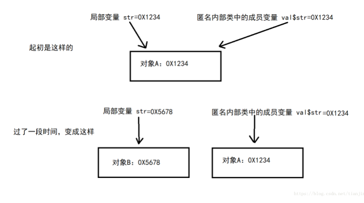
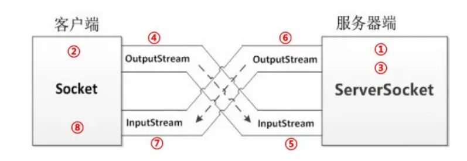
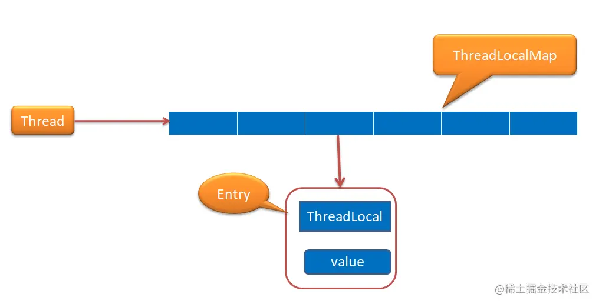
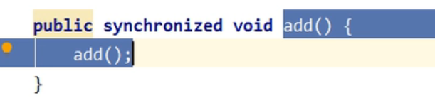

typora-copy-images-to: ..\img

# Java

## Java基础

### java亮眼特点

1.简单性 还摒弃了C++里难以理解的多继承、指针、操作符重载、虚基类等概念。

2.java有丰富的类库：JSON解析库，JUnit单元测试库、HTTP网络类库、字节码库等等。

3.可移植性？？？

4.多线程

5.垃圾回收


因此Java语言具有功能强大和简单易用两个特征。Java语言作为静态面向对象编程语言的代表，极好地实现了面向对象理论，允许程序员以优雅的思维方式进行复杂的编程 。
Java具有简单性、面向对象、分布式、健壮性、安全性、平台独立与可移植性、多线程、动态性等特点 。Java可以编写桌面应用程序、Web应用程序、分布式系统和嵌入式系统应用程序等。


### java8新特性

- Lambda表达式和函数式接口

  Lambda表达式允许我们将函数当成参数传递给某个方法，或者把代码本身当作数据处理。函数式接口指的是只有一个函数的接口，这样的接口可以隐式转换为Lambda表达式。java.lang.Runnable和java.util.concurrent.Callable是函数式接口的最佳例子。@FunctionalInterface修饰接口可用于检查函数式接口。（让面向对象也支持面向过程）


- 接口的默认方法，默认方法可以不需要实现。

  ```
  private interface Defaulable {
      // Interfaces now allow default methods, the implementer may or 
      // may not implement (override) them.
      default String notRequired() { 
          return "Default implementation"; 
      }        
  }
  ```

- 支持重复注解，反射API提供了一个新的方法：getAnnotationsByType()，可以返回某个类型的重复注解

- 新增了很多Stream API


### 8大基础类型 


#### **基本数据类型分类**

- 字符型（char）
- 布尔类型（boolean）
- 数字型
  - 整形
    - 字节型（byte）
    - 短整形（short）
    - 整形（int）
    - 长整形（long）
  - 浮点型
    - 单精度浮点型（float）
    - 双精度浮点型（double）

引用类型：

- 类（class）

- 接口（interface)

- 数组（array）

- 枚举（enum）

  ​

#### **值传递和引用传递**

**值传递：** 

值存放在当前方法的栈帧中的局部变量表中，无论如何修改只会修改当前栈帧的值，方法执行结束对方法外不会做任何改变；如果需要改变外层的变量，必须返回结果并主动赋值。

**引用传递：**

实际参数的引用也就是地址被传递给方法中相对应的形参，函数接受的是原始值的内存地址。形参和实参内容相同，指向同一块内存地址，方法执行时对引用的操作会影响到实际对象。 

> 我的理解是java里面只有值传递，没有引用传递。
>
> 传递引用类型时，也是像值传递一样，将实参的引用进行了复制，传递给了形参。
>
> 如果传递的是引用的话，在传递参数后重新申请了新的对象对形参赋值，然而原实参并未受新赋值的影响，按理来说共享同一个引用应该同步改变。
>
> 
>
> print in pass , Tom
> print in main , Mr.Q
>
> （传递的地址值发生了变化）
>
> [ 链接 ](https://blog.csdn.net/weixin_43232955/article/details/106082129?ops_request_misc=&request_id=&biz_id=102&utm_term=java%E5%87%BD%E6%95%B0%E5%8F%82%E6%95%B0%E9%83%BD%E6%98%AF%E5%BC%95%E7%94%A8%E4%BC%A0%E9%80%92%E5%90%97&utm_medium=distribute.pc_search_result.none-task-blog-2~all~sobaiduweb~default-0-106082129.142^v39^new_blog_pos_by_title,185^v2^control&spm=1018.2226.3001.4187)


#### Boolean占几个字节 

未精确定义字节。单个boolean值，在编译之后都使用Java虚拟机中的int数据类型来代替，而boolean数组将会被编码成Java虚拟机的byte数组，每个数组元素boolean占一个字节。

#### 执行顺序

- 类加载

  main（）方法作为程序的主进口，当main方法运行时，不会先执行main方法中的代码，而是首先进行类的加载。首先加载父类的静态变量和静态代码块，按声明顺序执行，然后加载自身的静态变量和静态代码块。

- 执行main方法中的第一行代码

- 类实例化为对象

  实例化后首先执行父类的非静态代码块，父类的**空参**构造器，再执自身的非静态代码块，自身的构造器 （根据调用情况决定是空参还是实参）

注：静态方法，实例方法只有在调用的时候才会去执行


#### 装箱拆箱：

- 装箱：将基本数据类型用它们对应的**引用类型**包装起来；

- 拆箱：将包装类型转换为**基本数据类型**；

- valueOf

  ```
  // This method will always cache values in the range -128 to 127,
  public static Integer valueOf(int i) {
      if (i >= IntegerCache.low && i <= IntegerCache.high) // 条件
          return IntegerCache.cache[i + (-IntegerCache.low)];// 取缓存，
          // Integeer的源码中：
          // static final int low = -128; IntegerCache.low = -128
      return new Integer(i);
  }

  ```

> 当使用自动装箱方式创建一个Integer对象时（Integer i4 = 127==》Integer i4 = Integer.valueOf(127)），当数值在-128 ~127时，会将创建的 Integer 对象缓存起来，当下次再出现该数值时，直接从缓存中取出对应的Integer对象。所以上述代码中，x和y引用的是相同的Integer对象。Long和String也会有对应的缓存类。

##### **int和Integer的区别：**

- 最基本的一点是，int是基础数据类型，默认值为0，而Integer是包装数据类型，默认值是null，所以需要实例化才能使用。
- 内存中存储的方式不同：int 在内存中存储的是数据值，存在当前栈帧中的局部变量表里面。而 Integer 在内存中存储的是**对象引用**，当 new 一个 Integer对象 时实际上是生成一个reference指针指向堆中的对象
- 变量的比较方式不同：int 可以使用 == 来对比两个变量是否相等，而 Integer 一定要使用 equals 来比较两个变量是否相等。
- 当使用自动装箱方式创建一个Integer对象，数值在-128 ~127时，会将创建的 Integer 对象缓存起来，当下次再出现该数值时，直接从缓存中取出对应的Integer对象。


##### **为什么要有包装类：**

因为 Java 的设计理念是一切皆是对象，在很多情况下，需要以对象的形式操作，比如 hashCode() 获取哈希值， getClass() 获取类等。**包装类的存在解决了基本数据类型无法做到的事情比如泛型类型参数、序列化、高频区间数据缓存等问题**。


#### 类型转换

Java是强类型语言，所以要进行有些运算的时候需要用到类型转换

低--------------------------------------------------------------高

byte，short，char-->int-->long-->float-->double 

运算中，不同类型的数据先转化成同一类型，然后进行运算

允许把容量小的类型转换为容量大的类型

容量大的类型转换为容量小的类型要使用强制类型转换

```
int i= 128 ;  
//强制转换(高到低)
byte b = (byte) i ;//内存溢出
```


> 扩展：赋值运算“=”的作用
>
> int num = 10;
> String str = "hello";
>
> 
>
> num = 20;
> str = "java";
>
> 
>
> 对于基本类型 `num`，赋值运算符会直接改变变量的值，原来的值被覆盖掉。
>
> 对于引用类型 `str`，赋值运算符会改变引用中所保存的地址，原来的地址被覆盖掉。**但是原来的对象不会被改变**，因为没有任何引用所指向的对象是垃圾，会被垃圾回收器GC回收。

### ==、equals 

#### == 

它的作用是**判断两个对象的内存地址是不是相等**。即，判断两个对象是不是同一个对象：

- 基本数据类型==比较的是**值**
- 引用数据类型==比较的是**内存地址**，所以判断字符串相等不能用==，因为我们想比较的是字面量是否相等，而不是地址，地址一般都是不同的。

#### equals 

引用数据类型才能使用equals，它的作用也是判断两个对象是否相等。但它一般有两种使用情况：

- 当类没有覆盖 equals() 方法时，通过 equals() 比较该类的两个对象，等价于通过==比较这两个对象。
- 当类覆盖了 equals() 方法时，一般来说，我们都会覆盖 equals() 方法来比较两个对象的内容是否相等；若它们的内容相等，则返回 true (即，认为这两个对象相等)，String类就是个典型的例子。


> Long和Integer在-128到127可以用==比较，其他用equal比较，因为自动装箱时对常见的数做的缓存


**为什么重写equals方法的时候需要重写hashCode方法？**

为了让HashMap，HashSet这样hash类的值可以正常使用，必须保证：如果两个对象通过equals方法比较是相等的，那么它们用hashCode方法比较应该也是相等的，hashCode值相同才能映射到同一个entry实体。所以就只用找这个entry下的链表即可。

Object类默认的equals方法是比较对象的内存地址是否相同，hashCode方法是根据对象的内存地址生成唯一值。这2个方法是配套的，默认的时候满足上述规范。当重写equals方法的时候，一定要重写hashCode方法使其满足相等的实例有相同的哈希码这一条件。


### 面向对象 

#### 理解

一个对象包含了数据以及对数据操作的方法，这其实是将日常生活中的对象概念应用在软件设计的发展模式中，比如真实世界的一本书，在代码中描述就要抽象书这个概念，将书的特性抽象成属性，比如String name，String  price。而类则描述具有相同特性和行为的对象的集合，是对象的一种抽象，用来定义对象的结构。

面向对象的要素就是**封装，继承与多态**。

#### 封装 

封装把一个对象的**属性私有化**，同时提供一些可以**被外界访问的属性的方法**。

#### 继承 

- 继承是指某子类继承已经存在的父类，子类拥有父类对象**所有的属性和方法**，但是**父类中的私有属性和私有方法子类是无法访问，只是拥有**。

- 新类可以根据自己的情况拓展属性或方法。

- 子类可以用自己的方式实现父类的方法。（多态）。

  > java不支持多继承：
  >
  > Java中类不能多继承类是为了安全，当类可以多继承类时，被继承的不同的父类可能会有同名同参的方法，如果子类也没有重写这个同名同参的方法，则在子类的实例调用这个方法的时候就会出现冲突。

#### 多态？？？ 

父类和子类都有的一个同名的方法，而在继承关系下，不同的对象采取不同的实现方式。

为什么要统一用一个方法名呢？

虽然简单的把子类的方法名重新命名也能实现功能，但在继承关系复杂的情况下，假如产品需要派生出不同的版本，同一个开发小组的成员每个人承担其中一个版本的工作，组长负责最后的产品整合，每个成员实现各自的父类函数的功能并赋予不同的方法名，组长就得牢牢的记住每一个方法名，随着派生的类越来越多，组长就得崩溃了。而如果使用多态，程序运行期间可以根据对象类型分辨出并该**引用变量发出的方法调用到底是哪个类中实现的方法** ，动态调用底层是依靠方法表来实现的。

##### 重载和重写

- 重载发生在同一个类中，**方法名必须相同，参数的类型、个数、和顺序不同，方法返回值和访问修饰符也可以不同**。

- 重写是子类对父类允许访问的方法进行重新编写，发生在子类中。方法名、参数列表必须相同，抛出的异常范围和返回值范围小于等于父类，访问修饰符范围大于等于父类。重写是多态的一种体现。动态调用底层是依靠方法区中的方法表来实现的。

  > 方法名、参数列表必须相同，返回值范围小于等于父类，抛出的异常范围小于等于父类，访问修饰符范围大于等于父类。另外，如果父类方法访问修饰符为 private 则子类就不能重写该方法。也就是说方法提供的行为改变，而方法的外貌并没有改变。

##### 底层

首先当程序运行需要某个类时，类加载器会将相应的class文件载入到JVM中，并在方法区建立该类的类元信息，里面有类的类型信息，**方法表**，和方法信息。


**方法表是实现动态调用的核心。为了优化对象调用方法的速度，方法区中类的类型信息会增加一个指针，该指针指向记录该类方法的方法表，方法表中的每一个项都是对应方法的指针**。

到这里：就要分情况讨论了，一个是方法调用，一个是接口调用

###### 方法调用

由于Java的单继承机制，一个类只能继承一个父类，而所有的类又都继承自Object类。所以方法表中**最先存放的是Object类的方法**，接下来是该类的父类的方法，最后是该类本身的方法，这样排列使得方法表的偏移量总是固定的。

方法调用的时候：

1. 首先是在运行时常量池里找到方法调用的**符号引用**，肯定先看到父类定义引用类型，因为父类比子类先加载。
2. 然后查看父类的方法表，得到方法在该**方法表的偏移量**（假设为15），偏移量是直接引用的一种，这样就得到该方法的直接引用，。
3. 根据this（invoker this字节码）指针得到**具体的对象** ，根据对象得到该对象对应的方法表，根据偏移量查看**有无重写（override）该方法**，如果重写，则直接调用该方法表项指向的方法；如果没有重写，则需要拿到按照继承关系从下往上的基类的方法表，同样按照这个偏移量查看有无该方法。

###### 接口调用

一个类可以实现多个接口，这样的话，在方法表中的索引就会不一样，所以Java 对于接口方法的调用是采用**搜索方法表**的方式。

补充一下：

- **Java的方法重载，就是在类中可以创建多个方法，它们具有相同的名字，但可具有不同的参数列表、返回值类型。调用方法时通过传递的参数类型来决定具体使用哪个方法**，这就是多态性。
- **Java的方法重写，是父类与子类之间的多态性，子类可继承父类中的方法，但有时子类并不想原封不动地继承父类的方法，而是想作一定的修改，这就需要采用方法的重写。重写的参数列表和返回类型均不可修改**。这也是多态性。


#### 接口和抽象类的区别！！！

> 应用场景举例

##### **抽象类：**

抽象方法使用 abstract 关键字修饰，仅有声明没有方法体的方法。

```
public abstract void f();    //没有内容
```


```
public abstract class BaseActivity {
    private final String TAG = this.getClass().getSimpleName(); //抽象类可以有成员

    void log(String msg){   //抽象类可以有具体方法
        System.out.println(msg);
    }

//    abstract void initView();     //抽象类也可以没有抽象方法
}
```

抽象类是用abstract修饰的类，抽象类只能被继承，不能被实例化，抽象类可以有具体方法和成员，也可以没有抽象方法。

抽象类是对一种事物的抽象，即对类抽象，抽象类和子类之间必须存在”is a”的关系。**抽象类可以用来进行类型隐藏**，比如动物是一个抽象类，有很多种具体的实现方式，比如人、猴子、老虎就是具体实现的派生类，我们就可以用动物类型来隐藏人、猴子和老虎的类型。抽象类的使用场景一般为：抽象类知道其子类应该包含哪些方法，但又不知道 这些子类的方法是如何实现的情况。

> 实例：动物作为一个抽象类，具备了吃饭行为，具体怎么吃饭的需要子类来实现：

##### **接口：** 

接口使用interface修饰

```
public interface OnClickListener {
    void onClick(View v);
}
```

接口比抽象类更抽象，**接口是一些方法特征的集合**，是对行为的一种抽象，表示的是”like a”的关系。如果一个类实现了多个接口，那这个类就有了多种类型，比如我项目中就定义了常量接口，工具方法接口，需要使用常量或者工具方法实现这些接口就行。

**它们的区别是**：

1. 方法是否能实现：所有**方法在接口中不能有实现**，而**抽象类可以有非抽象的方法**。
2. 接口中除了**static、final变量**，不能有其他变量，而且方法默认修饰符是public，而抽象类可以有其他变量，抽象方法可以有public、protected和default这些修饰符（要给实现类访问所以不能private）
3. 实现：一个类可以实现**多个接口**，但**只能实现一个抽象类**。
4. 抽象类的演化比接口的演化要容易的多，抽象类添加一个方法，其所有实现类都自动的提供了这个新的方法。而接口添加一个方法，所有实现类必须实现这个方法，这样就比较麻烦。
5. 抽象类是对一种事物的抽象，即对类抽象，而接口是对行为的抽象。抽象类是对整个类整体进行抽象，包括属性、行为，但是接口却是对类局部（行为）进行抽象。

> 关于2抽象类：
>
> 1.子类重写父类方法时，方法的访问权限不能小于原访问权限，在接口中，方法的默认权限就是public，所以子类重写后只能是public，因为接口必须要具体类实现才有意义，所以必须是public，具体类才能访问到。
>
> 2.static修饰就表示它属于类的，随的类的加载而存在的， 如果是非static的话，就表示属于对象的，只有建立对象时才有它，而接口是不能建立对象的 ，所以接口的常量必须定义为static。
>
> 3.final修饰就是保证接口定义的常量不能被实现类去修改，如果没有final的话，由子类随意去修改的话，接口建立这个常量就没有意义了。

### String   ！！！！！ 

#### StringBuilder和String StringBuffer 

1.可变性

- String类中使用 final关键字修饰字符数组来保存字符串，所以 String 对象是不可变的。
- `StringBuilder` 与 `StringBuffer` 使用字符数组没有用 `final` 关键字修饰，并且数组可以扩容，所以这两种对象都是可变的。

2.线程安全

- `String` 中的对象是不可变的，也就可以理解为常量，线程安全。

- `AbstractStringBuilder` 是 `StringBuilder` 与 `StringBuffer` 的公共父类，定义了一些字符串的基本操作，如 `append`、`insert`、`indexOf` 等公共方法。`StringBuffer` 对方法加了同步锁所以是线程安全的。`StringBuilder` 并没有对方法加同步锁，所以是非线程安全的。

3.性能

-  `String` 类型进行改变的时候，都会生成一个新的 `String` 对象，然后将指针指向新的 `String` 对象。所以不适合用来字符串拼接。
-  StringBuilder不需要进行同步操作所以比StringBuffer性能更好，但StringBuffer每次调用toString都会直接使用缓存区的 toStringCache值来构造一个字符串。StringBuilder 则每次都需要复制一次字符数组，再构造一个字符串。所以说StringBuffer利用缓存区进行了部分优化操作，平衡了与StringBufilder的性能。

**注：**操作少量的数据: 适用String，单线程操作字符串缓冲区下操作大量数据: 适用StringBuilder，多线程操作字符串缓冲区下操作大量数据: 适用StringBuffer

```
   //StringBuffer每次更新操作toStringCache会被置null
   @Override
    public synchronized String toString() {
        if (toStringCache == null) {
            toStringCache = Arrays.copyOfRange(value, 0, count);
        }
        return new String(toStringCache, true);
    }
```


#### String对象和常量池

```
public class StringTest {
    public static void main(String[] args) {
        String str1 = "todo"; // 常量池
        String str2 = "todo"; // 从常量池找了str1
        String str3 = "to"; // 常量池
        String str4 = "do"; // 常量池
        String str5 = str3 + str4; // 内部用StringBuilder拼接了一波。 因此， 并非常量池
        String str6 = new String(str1); //  创建对象了， 那还能是常量池的引用？
    }
}
```

基于jdk1.6分析一波：

- 成的class文件中会在常量池中**保存“todo”、“to”和“do”三个String常量**。
- 变量str1和str2均保存的是常量池中“todo”的引用，所以str1==str2成立；
- 在执行 str5 = str3 + str4这句时，**JVM会先创建一个StringBuilder对象，通过StringBuilder.append()方法将str3与str4的值拼接**，然后通过StringBuilder.toString()返回一个堆中的String对象的引用，赋值给str5，因此str1和str5指向的不是同一个String对象，str1 == str5不成立；
- String str6 = new String(str1)一句显式创建了一个新的String对象，因此str1 == str6不成立便是显而易见的事了。

#### intern

- jdk6： 执行intern()方法时，**若常量池中不存在等值的字符串，JVM就会在常量池中创建一个等值的字符串，然后返回该字符串的引用**。
- jdk7： 执行intern操作时，如果常量池已经存在该字符串，则直接返回字符串引用，否则**复制该字符串对象的引用到常量池中并返回**。


string创建对象用new以及不用的区别？？？


### final 和 static

- static的作用：

  - 静态变量： 也叫类变量，该类所有实例共用同一个static变量。在类加载阶段正式为类变量分配内存并设置类变量初始值，静态变量编译后存放在类构造器clint方法中，在初始化阶段赋值。但是static无法保证可见性，线程访问该变量时还是从主内存拷贝一份回工作内存，至于什么时候同步回主内存那就不好说了。想要保证可见性还是得靠volatile。**静态变量**存放在 Java 内存区域的方法区。

  - 静态方法：

    声明为static的静态方法只能调用静态方法，只能访问静态数据，不能以任何方式引用this或super；

  - 静态类：通常一个普通类不允许声明为静态，只有一个内部类才可以（main方法就是一个典型），这时这个声明的静态类可以直接作为一个普通类来使用，而不需要实例一个外部类。


- final的作用：

  常量，只能访问，不能修改，一般使用全大写，同样，final的作用从变量、方法、类三个方面来理解、

  - final修饰的变量的值不能被修改，是一个常量，如果是引用类型的变量，则在对其初始化之后便**不能再让其指向另一个对象**。
  - final修饰的方法不能被重写；
  - final修饰的类不能被继承，final类中的所有成员方法都会被隐式地指定为final方法。


**注：**实例对象支持调用静态变量和静态方法，但并不推荐这么用。通过实例对象支持调用静态变量和静态方法，最终都会在编译后转换为类直接调用静态变量或静态方法。


### 异常！！！！

Exception和Error都是继承了Throwable类，在java中只有Throwable类型的实例才可以被抛出（throw）或者捕获（catch），他是异常处理机制的基本组成类型。

#### Error

error是致命性的**、是用户无法处理的系统程序错误**。出现Error是系统的内部错误或资源耗尽，Error不能在程序运行过程中被动态处理，一旦出现Error，系统能做的只有记录错误的原因和安全终止。常见是错误有StackOverFlowError，OutOfMemoryError，AWTError（AWT组件出错）。

#### **Exception**

exception不是致命的，表示在运行中的程序发生了程序员不期望发生的事情，异常分为可分为检查型异常和非检查型异常，检查型异常是编译器要求对可能出现的异常必须做出相应的处理，在源代码里必须显式地进行捕获，比如标准I/O输入时就必须捕获IOException异常。非检查异常就是所谓的运行时异常，常见的如数组越界、除零等

**异常类型：**


#### 捕获异常

面试官：如何捕获异常？

我：

第一种方法是使用try{...}catche(...){...}块

- `try` 块： 用于捕获异常。其后可接零个或多个`catch`块，如果没有`catch`块，则必须跟一个`finally`块。
- `catch` 块： 用于处理`try`捕获到的异常。
- `finally` 块： 无论是否捕获或处理异常，`finally`块里的语句**都会**被执行。当在`try`块或`catch`块中遇到`return`语句时，`finally`语句块**将在方法返回之前被执行**。可以用来做一些资源回收工作，比如说把一个线程抢到锁后的操作代码放在try代码块里，把解锁放在finally里，防止因为操作异常导致未能及时解锁。

第二种方法是声明抛出异常，在方法名后面加上throws 来抛出异常,出现异常时会沿着**调用层次**向上传递，交给**调用**它的上一层方法来处理。

> 与 throws 不同，可以直接使用 throw 抛出一个异常，抛出时直接抛出异常类的实例化对象即可，需配合throws或try，catch使用
>
> ```
> public class Test{
>     public static void main(String[] args) {
>         try {
>             throw new Exception("自己抛出异常！");//抛出异常的实例化对象
>         }catch (Exception e){//捕获异常
>             System.out.println(e);
>         }
>     }
> }
> ```
>
> 虽然 throw 关键字的使用完全符合异常的处理机制，但是一般来讲用户都在避免异常的产生，所以不会手工抛出一个新的异常类的实例，往往会抛出程序中已经产生的异常类实例。

<https://blog.csdn.net/efei7968/article/details/87077218>

<https://blog.csdn.net/efei7968/article/details/87174324?>

### 空指针场景及解决

**场景类型：**

1、数据库空数据

数据库存null值，其实还是比较容易发现的。但是安全保险，还是建议还是先确认下当前所要使用字段的含义。同时去数据库中抽样遍历下所要使用的字段。注意要，不要只关注一张表，最好涉及到的表都要看下。记住作为一名CRUD选手，也要时刻保持一个谨慎心的。

2、容器空指针

使用上层业务返回的容器时，一定要进行空指针校验。可以自己写一个Util，或者使用开源打Util包进行判断。

```
//1、本身为空。
List<String> list = null;
//2、map本身key不存在，对于返回值没有校验，直接使用。
Map<String,String> map = new HashMap<>();
map.put("1","1");
String s = map.get(2);
// s为null，调用其方法必然空指针异常
s.length();
```

一个非常好的技术是创建返回一个空集合的方法，而不是一个null值。你的应用程序的代码可以遍历空集合并使用它的方法和字段，而不会抛出一个NullPointerException。Collections类提供了方便的空 List，Set 和 Map: `Collections.EMPTY_LIST`，`Collections.EMPTY_SET`，`Collections.EMPTY_MAP`。

```
public class Example {
   private static List<Integer> numbers = null;

   public static List<Integer> getList() {
     if (numbers == null){
         return Collections.EMPTY_LIST;
     } else {
         return numbers;
     }
   }
}
```

3、xx.valueOf()

在接口调用的过程中，会存在类型不同，需要转换的场景。最常见的是：将Long类型，转换成String类型，这时候便会调用
String.valueOf(xx);。你不保证别人传递给你的参数会不会有脏数据，即使已经约定好不能传空数据。但是一定要记住，别人的服务一定是不可靠的，可靠性要由自己来保证。

```
Long temp = null;
String.valueOf(temp ==null ? "" : temp);
```

4、注解注入

对于Java的项目，现在基本都基于Spring的。这就避免不了使用Spring提供的IOC功能。记住，当使用注解（@Autowired等等）进行对象注入的时候，一定要先将类提供给IOC进行管理。可以通过注解方式（@Service等等）也可以使用配置文件的方式。推荐使用注解的方式，简单便于维护。

**equals和equalsIgnoreCase()方法**

Object类中的equals 方法在非空对象引用上实现相等关系，具有对称性 x.equals(y) 和 y.equals(x) 结果是一样的，但当x == null时会抛出空指针异常。所以我们要把确定不为null的对象或值放在前面。

```
String x = null;
String y = "world";
if(x.equals(y)){ // java.lang.NullPointerException
	
}

if(y.equals(x)){//即便 x 是 null也能避免 NullPointerException
    
}
```

**使用null安全的方法和库**

有很多开源库已经为您做了繁重的空指针检查工作。其中最常用的一个的是Apache commons 中的`StringUtils`。你可以使用`StringUtils.isBlank()`，`isNumeric()`，`isWhiteSpace()`以及其他的工具方法而不用担心空指针异常。

```
//StringUtils方法是空指针安全的，他们不会抛出空指针异常
System.out.println(StringUtils.isEmpty(null));
System.out.println(StringUtils.isBlank(null));
System.out.println(StringUtils.isNumeric(null));
System.out.println(StringUtils.isAllUpperCase(null));

输出:
true
true
false
false
```

**断言**

断言是用来检查程序的安全性的，在使用之前进行检查条件，如果不符合条件就报异常，符合就继续。Java 中自带的断言关键字：assert，如：

```
assert name == null : "名称不能为空";
```

输出：

```
Exception in thread "main" java.lang.AssertionError: 名称不正确
```

不过默认是不启动断言检查的，需要要带上 JVM 参数：-enableassertions 才能生效。

Java 中这个用的很少，建议使用 Spring 中的，更强大，更方便好用。Spring中的用法：

```
Assert.notNull(name,"名称不能为空");
```


### 文件流？？？？

#### 读取文件

```
public class Main {
    public static void main(String[] args) throws IOException {

        String fileName ="C:\\Users\\lin\\Desktop\\English.txt";
        //FileReader继承于InputStreamRead,该父类方法实现了read方法
        FileReader fileReader = new FileReader(fileName);
        //采用BufferedReader包装FileReader，更高效
        BufferedReader bufferedReader = new BufferedReader(fileReader);

        String line =bufferedReader.readLine();

        while (line!=null){
            System.out.println(line);
            line = bufferedReader.readLine();
        }

        bufferedReader.close();
        fileReader.close();

    }
}
```


### 反射 

> [反射 ](https://juejin.cn/post/6864324335654404104)

#### 反射是什么

我：在Java的反射机制中是指在**运行状态**中，对于任意一个类都能够知道这个类所有的**属性和方法**；并且对于任意一个对象，都能够调用它的**任意一个方法**；这种在**程序运行过程**中**动态获取类信息和调用类方法**的功能成为 Java 语言的反射机制。

#### 反射有什么好处

对于在`编译期`无法确定使用哪个数据类的场景，通过`反射`可以在**程序运行过程**中动态**获取类信息**和**调用类方法**。

```
    public static Map<Integer,Integer> getMap(String className) {
        Class aClass = Class.forName(className);
        Constructor constructor = aClass.getConstructor();
        return (Map<Integer,Integer>)constructor.newInstance();
    }
    public static void main(String[] args) {
        Map<Integer, Integer> map = getMap("HashMap");
    }
```

首先通过类名查找类，然后找到这个类的构造方法，执行这个构造方法就能创建所需要的类。


#### 获取class对象的三种方式

- 类名.class：会使 JVM 将使用类装载器将类装入内存（前提是类还没有装入内存），不做类的初始化工作，返回 Class 对象。

```
Class clazz = SmallPineapple.class;
复制代码
```

- 实例.getClass()：通过实例化对象获取该实例的 Class 对象。会对类进行静态初始化、非静态初始化，返回引用运行时真正所指的对象（因为子对象的引用可能会赋给父对象的引用变量中）所属的类的 Class 对象。

```
SmallPineapple sp = new SmallPineapple();
Class clazz = sp.getClass();
复制代码
```

- Class.forName(className)：通过类的**全限定名**获取该类的 Class 对象，会装入类并做类的静态初始化，返回 Class 对象。

```
Class clazz = Class.forName("com.bean.smallpineapple");
```

> 静态属性初始化是在加载类的时候初始化，而非静态属性初始化是 new 类实例对象的时候初始化。它们三种情况在生成 Class 对象的时候都会先判断内存中是否已经加载此类。

#### 反射的API

1. Class 类：反射的核心类，任何运行在内存中的所有类都是该 Class 类的实例对象，可以获取类的属性，方法等信息。
2. Field 类：表示类的成员变量，可以用来获取和设置类之中的属性值。
   - Field[] getFields()：获取类中所有被`public`修饰的所有变量
   - Field getField(String name)：根据**变量名**获取类中的一个变量，该**变量必须被public修饰**
   - Field[] getDeclaredFields()：获取类中所有的变量，但**无法获取继承下来的变量**
   - Field getDeclaredField(String name)：根据姓名获取类中的某个变量，**无法获取继承下来的变量**
3. Method 类：表示类的方法，它可以用来获取类中的方法信息或者执行方法。
   - Method[] getMethods()：获取类中被`public`修饰的所有方法
   - Method getMethod(String name, Class...<?> paramTypes)：根据**名字和参数类型**获取对应方法，该方法必须被**public**修饰
   - Method[] getDeclaredMethods()：获取`所有`方法，但**无法获取继承下来的方法**
   - Method getDeclaredMethod(String name, Class...<?> paramTypes)：根据**名字和参数类型**获取对应方法，**无法获取继承下来的方法**
4. Constructor 类：表示类的构造方法
   - Constuctor[] getConstructors()：获取类中所有被`public`修饰的构造器
   - Constructor getConstructor(Class...<?> paramTypes)：根据`参数类型`获取类中某个构造器，该构造器必须被`public`修饰
   - Constructor[] getDeclaredConstructors()：获取类中所有构造器
   - Constructor getDeclaredConstructor(class...<?> paramTypes)：根据`参数类型`获取对应的构造器

#### 反射应用场景

- Spring 实例化对象：当程序启动时，Spring 会读取配置文件`applicationContext.xml`并解析出里面所有的  标签实例化到`IOC`容器中。
- 反射 + 工厂模式：通过`反射`消除工厂中的多个分支，如果需要生产新的类，无需关注工厂类，工厂类可以应对各种新增的类，`反射`可以使得程序更加健壮。
- JDBC连接数据库：使用JDBC连接数据库时，指定连接数据库的`驱动类`时用到反射加载驱动类

##### Spring 的 IOC 容器

在 Spring 中，经常会编写一个上下文配置文件`applicationContext.xml`，里面就是关于`bean`的配置，程序启动时会读取该 xml 文件，解析出所有的 `<bean>`标签，并实例化对象放入`IOC`容器中。

```
<?xml version="1.0" encoding="UTF-8"?>
<beans xmlns="http://www.springframework.org/schema/beans"
       xmlns:xsi="http://www.w3.org/2001/XMLSchema-instance"
       xsi:schemaLocation="http://www.springframework.org/schema/beans http://www.springframework.org/schema/beans/spring-beans.xsd">
    <bean id="smallpineapple" class="com.bean.SmallPineapple">
        <constructor-arg type="java.lang.String" value="小菠萝"/>
        <constructor-arg type="int" value="21"/>
    </bean>
</beans>
```

IOC 容器本质上就是一个工厂，通过该工厂传入 <bean> 标签的`id`属性获取到对应的实例。

```
public class Main {
    public static void main(String[] args) {
        ApplicationContext ac =
                new ClassPathXmlApplicationContext("applicationContext.xml");
        SmallPineapple smallPineapple = (SmallPineapple) ac.getBean("smallpineapple");
        smallPineapple.getInfo(); // [小菠萝的年龄是：21]
    }
}
```

Spring 在实例化对象的过程经过简化之后，可以理解为反射实例化对象的步骤：

- **获取Class对象的构造器**
- 通过构造器**调用 newInstance()** 实例化对象

当然 Spring 在实例化对象时，做了非常多额外的操作，才能够让现在的开发足够的**便捷且稳定**。

> 在之后的文章中会专门写一篇文章讲解如何利用反射实现一个`简易版`的`IOC`容器，IOC容器原理很简单，只要掌握了反射的思想，了解反射的常用 API 就可以实现，我可以提供一个简单的思路：利用 HashMap 存储所有实例，key 代表 <bean> 标签的 `id`，value 存储对应的实例，这对应了 Spring IOC容器管理的对象默认是**单例**的。

##### 反射 + 抽象工厂模式

传统的工厂模式，如果需要生产新的子类，**需要修改工厂类，在工厂类中增加新的分支**；

```
public class MapFactory {
    public Map<Object, object> produceMap(String name) {
        if ("HashMap".equals(name)) {
            return new HashMap<>();
        } else if ("TreeMap".equals(name)) {
            return new TreeMap<>();
        } // ···
    }
}
```

反射 + 抽象工厂的**核心思想**是：

- **在运行时通过参数传入不同子类的全限定名获取到不同的 Class 对象，调用 newInstance() 方法返回不同的子类。细心的读者会发现提到了子类**这个概念，所以反射 + 抽象工厂模式，一般会用于有**继承**或者**接口实现**关系。

例如，在运行时才确定使用哪一种 `Map` 结构，我们可以利用反射传入某个具体 Map 的全限定名，实例化一个特定的子类。

```
public class MapFactory {
    /**
     * @param className 类的全限定名
     */
    public Map<Object, Object> produceMap(String className) {
        Class clazz = Class.forName(className);
        Map<Object, Object> map = clazz.newInstance();
        return map;
    }
}
```

`className` 可以指定为 java.util.HashMap，或者 java.util.TreeMap 等等，根据业务场景来定。

##### JDBC 加载数据库驱动类

在导入第三方库时，JVM不会主动去加载外部导入的类，而是**等到真正使用时，才去加载需要的类**，正是如此，我们可以在获取数据库连接时传入驱动类的全限定名，交给 JVM 加载该类。

```
public class DBConnectionUtil {
    /** 指定数据库的驱动类 */
    private static final String DRIVER_CLASS_NAME = "com.mysql.jdbc.Driver";
    
    public static Connection getConnection() {
        Connection conn = null;
        // 加载驱动类
        Class.forName(DRIVER_CLASS_NAME);
        // 获取数据库连接对象
        conn = DriverManager.getConnection("jdbc:mysql://···", "root", "root");
        return conn;
    }
}
```

`application.yml`中的数据库配置：


这里的 **driver-class-name**，和我们一开始加载的类是不是觉得很相似，这是因为**MySQL**版本不同引起的**驱动类不同**，这体现使用反射的好处：不需要修改源码，**仅加载配置文件就可以完成驱动类的替换**。

#### 反射的优势及缺陷

反射的**优点**：

- **增加程序的灵活性**：面对需求变更时，可以灵活地实例化不同对象

但是，有得必有失，一项技术不可能只有优点没有缺点，反射也有**两个比较隐晦的缺点**：

- **破坏类的封装性**：可以强制访问 private 修饰的信息
- **性能损耗**：反射相比直接实例化对象、调用方法、访问变量，中间需要非常多的**检查步骤和解析步骤**，JVM无法对它们优化。

注：反射破坏饿汉式和懒汉式单例模式，所以之后用了`枚举`避免被反射KO。


### 深浅拷贝！！！

clone（）方法是object对象类的protected保护方法，它不是public，所以要使用该方法的类需要实现重写clone方法，将该方法的属性设置为public。而且还需要用该类来实现Cloneable接口，来指示Object类中的clone()方法可以用来合法的进行克隆，这样就不会报CloneNotSupportedException异常。

> clone方法是native方法，native方法的效率一般远高于非native方法。

> 引用拷贝即直接赋值

拷贝的两种模式：

- **浅拷贝**：在内存中开辟一块和原始对象一样的内存空间，然后原样拷贝原始对象中的内容。也就是对**基本数据类型进行值传递**，对**引用数据类型拷贝地址值** ，2个引用指向同一内存地址，拷贝对象会被原始对象影响。
- **深拷贝**：对**基本数据类型进行值传递**，对**引用数据类型，创建一个新的对象，并复制其内容** ，拷贝对象不会被原始对象影响。
- 也就二者对引用数据类型有区别

[个人写的例子](https://dreamcater.gitee.io/javabooks/#/codes/%E6%B5%85%E6%8B%B7%E8%B4%9D%E5%92%8C%E6%B7%B1%E6%8B%B7%E8%B4%9D%E4%BE%8B%E5%AD%90)

### Object 

```
public final native Class<?> getClass();
public native int hashCode(); // 返回对象的哈希代码值。
public boolean equals(Object obj) 
protected native Object clone() // 创建并返回此对象的副本。
public String toString() // 返回对象的字符串表示形式。
public final native void wait(); // 使当前线程等待，直到另一个线程调用此对象的方法或方法。
public final native void notify(); // 唤醒正在该对象的监视器上等待的单个线程。
public final native void notifyAll(); // 唤醒正在该对象的监视器上等待的全部线程。
protected void finalize(); // 当垃圾回收确定不再有对对象的引用时，由对象上的垃圾回收器调用。
```

**为什么wait, notify,notifyAll保存在Object类中，而不是Thread类?**

- wait 和 notify是 Java 中两个线程之间的通信机制。在 Object 类每个对象都可上锁，也就是线程通信机制对每个对象可用。
- JAVA提供的锁是对象级的而不是线程级的，每个对象都有锁，通过线程获得。每一个对象实例都会关联一个Monitor对象。这个Monitor对象既可以与对象一起创建销毁，也可以在线程试图获取对象锁时自动生成。当这个Monitor对象被线程持有后，它便处于锁定状态。
- 如果wait()方法定义在Thread类中，线程正在等待的是哪个锁就不明显了。

**sleep为什么定义在Thread类里面？**
sleep的作用是：让线程在预期的时间内执行，其他时候不要来占用CPU资源。可以理解为sleep是属于线程级别的，它是为了让线程在限定的时间后去执行。而且sleep方法是不会去释放锁的


### 四种修饰符的限制范围

1. public：可以被所有其他类所访问。
2. protected：自身，子类及同一个包中类可以访问。
3. default（默认）：同一包中的类可以访问
4. private：只能被自己访问和修改。

### 内部类

> [引用链接](https://juejin.cn/post/6844903870062149646)

使用场景：

- 每个内部类都可以独立的继承一个类，所以无论外部类是否继承了某个类，内部类依然可以继承其他类，这就完美的解决了java没有多继承的问题。
- 可以有效的将有一定关系的类组织在一起，又可以对外界有所隐藏。
- 内部类有访问外部类成员变量的能力
- 方便编写多线程代码

java有三种类型的内部类

- 普通内部类

  ```
  public class Demo {

      // 普通内部类
      public class DemoRunnable implements Runnable {
          @Override
          public void run() {
          }
      }
  }
  ```

- 匿名内部类

  ```
  public class Demo {

      // 匿名内部类
      private Runnable runnable = new Runnable() {
          @Override
          public void run() {

          }
      };
  }
  ```

- 方法内局部内部类

  ```
  public class Demo {

      // 局部内部类
      public void work() {
          class InnerRunnable implements Runnable {
              @Override
              public void run() {

              }
          }
          InnerRunnable runnable = new InnerRunnable();
      }

  }
  ```

**实现：**

```
public class Demo {
    // 普通内部类
    public class DemoRunnable implements Runnable {
        @Override
        public void run() {
        }
    }
}
```

字节码文件：

```
package inner;

public class Demo$DemoRunnable implements Runnable {
    public Demo$DemoRunnable(Demo var1) {
        this.this$0 = var1;
    }

    public void run() {
    }
}
```

使用javap反编译查看字节码文件可以看出，普通内部类会自动生成一个构造器，参数就是外部类的类型，而且保存到内部类本身的this$0字段中。内部类持有的外部类引用就是通过这个构造器传递进来的，它是一个强引用。

匿名内部类和普通内部类实现基本一致，只是编译器自动给它拼了个类名，所以匿名内部类不能自定义构造器，因为类名编译完成后才能确定。 方法局部内部类原理也是一样的。

**JDK8之前为什么匿名内部类访问的局部变量必须要用final修饰？**

用final修饰实际上就是为了保护数据的一致性。用final修饰后，引用变量就无法再指向其它对象了。

>  注：引用类型变量其本质是存入的是一个引用地址，说白了还是一个值（可以理解为内存中的地址值）

将数据拷贝完成后，如果不用final修饰，则原先的局部变量可以发生变化。这里到了问题的核心了，如果局部变量发生变化后，匿名内部类是不知道的（因为他只是拷贝了局部变量的值，并不是直接使用的局部变量）。这里举个栗子：原先局部变量指向的是对象A，在创建匿名内部类后，匿名内部类中的成员变量也指向A对象。但过了一段时间局部变量的值指向另外一个B对象，但此时匿名内部类中还是指向原先的A对象。那么程序再接着运行下去，可能就会导致程序运行的结果与预期不同。


JDK1.8之后，匿名内部类中需要访问的局部变量不需要用final修饰符修饰，因为底层还是帮我们加了final，改变了局部变量的引用值就会编译报错。

**如何创建内部类实例?**

由于内部类对象需要持有外部类对象的引用，所以必须得先有外部类对象

```
Demo.DemoRunnable demoRunnable = new Demo().new DemoRunnable();
```

**如何继承内部类？**

```
    public class Demo2 extends Demo.DemoRunnable {
        public Demo2(Demo demo) {
            demo.super();
        }

        @Override
        public void run() {
            super.run();
        }
    }
```

必须在构造器中传入一个Demo对象，并且还需要调用demo.super()

**Lambda表达式是如何实现的？**

Java8引入了Lambda表达式，一定程度上可以简化我们的代码，使代码结构看起来更优雅。

```
public class Animal {
    public void run(Runnable runnable) {
    }
}
```

JDK8之前使用匿名内部类：

```
run(new Runnable() {
            @Override
            public void run() {
            }
});
```

JDK8之后使用Lambda表达式：

```
 public void run(Runnable runnable) {
    }

    public void test() {
        run(() -> {});
    }
```

Lambda表达式并不是匿名内部类的语法糖，它是基于invokedynamic指令，在运行时使用ASM生成类文件来实现的。


### 序列化 

- **序列化：将对象写入到IO流中**
- **反序列化：从IO流中恢复对象**

如果需要将某个对象保存到磁盘上或者通过网络传输，那么这个类应该实现**Serializable**（ [ˈsɪərɪəlaɪzəbl] ）接口。并且对象如果有引用类型，引用类型**必须**也是要可以序列化的。如果不想要序列化对象的某些属性，可以使用**transient**（transient）关键字修饰对象的属性，或者重写writeObject与readObject方法实现自定义序列化。

所有保存到磁盘的对象都有一个序列化编码号，当程序试图序列化一个对象时，会先检查这个对象是否已经序列化过，只有这个对象在虚拟机没有被序列化过，才会将此对象序列化为字节序列。所以说对象序列化后更改了对象内容，再次序列化后会造成修改的数据丢失。

**JDK类库提供的序列化API**

- java.io.ObjectOutputStream：表示对象输出流
  它的writeObject(Object obj)方法可以对参数指定的obj对象进行序列化，把得到的字节序列写到一个目标输出流中。
- java.io.ObjectInputStream：表示对象输入流
  它的readObject()方法从源输入流中读取字节序列，再把它们反序列化成为一个对象，并将其返回。


> [Jackson之ObjectMapper对象的使用](https://blog.csdn.net/qq_41834086/article/details/111152470?ops_request_misc=%257B%2522request%255Fid%2522%253A%2522166346931216782412594268%2522%252C%2522scm%2522%253A%252220140713.130102334..%2522%257D&request_id=166346931216782412594268&biz_id=0&utm_medium=distribute.pc_search_result.none-task-blog-2~all~top_positive~default-1-111152470-null-null.142^v47^body_digest,201^v3^control_2&utm_term=ObjectMapper%20&spm=1018.2226.3001.4187)


<https://juejin.im/post/5ce3cdc8e51d45777b1a3cdf#heading-9>

### 泛型 

泛型意思是泛指的类型，也叫参数化类型，也就是说把所操作的数据类型被指定为一个参数。

我们可以通过泛指一种类型T,来代替我们需要的所有类型，把我们需要的类型作为参数传递到容器里面，这样我们算法只需要写一套就可以适应所有的类型。最典型的的例子就是ArrayList了，这个集合我们无论传递什么数据类型，它都能很好的工作。

**Java泛型介绍**

- Java泛型类和Java泛型方法

  ```
  class DataHolder<T>{
      T item;
      
      public void setData(T t) {
      	this.item=t;
      }
      
      public T getData() {
      	return this.item;
      }
      
      /**
       * 泛型方法
       * @param e
       */
      public <E> void PrinterInfo(E e) {
      	System.out.println(e);
      }
  }
  ```

- Java泛型接口

  > 实现泛型接口的时候要将泛型的声明定义也加入到类中

  ```
  //定义一个泛型接口
  public interface Generator<T> {
      public T next();
  }
  ```

- Java泛型擦除

  Java泛型擦除目的是为了和 Java 1.5 之前版本进行兼容。**在编译期间所有的泛型信息都会被擦除掉，**譬如 List<Integer> 在运行时仅用一个 List 来表示，所以我们可以通过反射 add 方法来向 Integer 的泛型列表添加字符串，因为编译后都成了 Object。

  泛型擦除具体来说就是在编译成字节码时**首先进行类型检查，通过后接着进行类型擦除**，编译器会把类型参数替换为它的第一个边界的类型。如果没有指明边界，那么类型参数将被擦除到Object。

  ```
  //设置了上边界
  public class Manipulator<T extends HasF> {
  }  //擦除为HasF类型
  ```

- Java泛型通配符

  ```
  public void showKeyValue1(Generic<?> obj){
      Log.d("泛型测试","key value is " + obj.getKey());
  }
  ```

  ​

### Socket


**在Java中，提供了两个类用于实现TCP通信程序：**

1. **客户端**：`java.net.Socket` 类表示。创建`Socket`对象，向服务端发出连接请求，服务端响应请求，两者建立连接开始通信。

   ```
   Socket client = new Socket("127.0.0.1", 6666);
   ```

   成员方法:

   ```
   public InputStream getInputStream() ： 返回此套接字的输入流。
   public OutputStream getOutputStream() ： 返回此套接字的输出流。
   public void close() ：关闭此套接字。
   public void shutdownOutput() ： 禁用此套接字的输出流。
   ```

2. **服务端**：`java.net.ServerSocket` 类表示。创建`ServerSocket`对象，相当于开启一个服务，并等待客户端的连接。

   ```
   public void shutdownOutput() ： 禁用此套接字的输出流。
   ```

   成员方法：

   ```
   public Socket accept() 
   ```

**流程：**

1. 【服务端】启动,创建ServerSocket对象，等待连接。`ServerSocket ss = new ServerSocket(6666);`
2. 【客户端】启动,创建Socket对象，请求连接。`Socket client = new Socket("localhost", 6666);`
3. 【服务端】接收连接,调用accept方法，并返回一个Socket对象。`Socket server = ss.accept();`
4. 【客户端】Socket对象，获取OutputStream，向服务端写出数据。`OutputStream os = client.getOutputStream();`
5. 【服务端】Scoket对象，获取InputStream，读取客户端发送的数据。`InputStream is = server.getInputStream();`

> 到此，客户端向服务端发送数据成功。



> 自此，服务端向客户端回写数据。

1. 【服务端】Socket对象，获取OutputStream，向客户端回写数据。
2. 【客户端】Scoket对象，获取InputStream，解析回写数据。
3. 【客户端】释放资源，断开连接。


### 堆和栈*

- 栈是编译时就分配了空间，所以栈在程序运行过程中省去了很多空间分配时间。 而堆是运行时分配空间，如果存储器分区分配算法采用的是首次适应算法的话，操作系统有一个记录空闲内存地址的链表，当系统收到程序的申请时，会 遍历该链表，寻找第一个空间大于所申请空间的堆结点，然后将该结点的空间分配给程序并从空闲结点链表中删除。
- 因为栈的物理地址空间是连续的，而堆不是，查找堆的链表也会耗费较多时间，所以堆的存储寻址速度慢。但堆获得的空间比较灵活，也比较大。
- cpu有专门的寄存器（esp，ebp）来操作栈，而堆是使用间接寻址的，需要访问两次内存。所以栈CPU硬件操作速度快


### IO

> 同步还是异步其实是指CPU时间片的利用，主要看请求发起方对响应结果的获取是主动发起的还是被动通知的。调用第三方支付下支付单后，如果支付单创建成功，第三方支付会回调支付结果接口，告知我们支付状态，这个回调就是异步的。因为"支付状态"这个响应结果并不是支付发起线程主动获取的。

> [参考](https://juejin.cn/post/6844903729754308616)

#### 适用场景

`BIO`适用于连接数目比较小且固定的架构，这种方式对服务器资源要求比较高，并发局限于应用中，JDK1.4以前的唯一选择，但程序直观简单易理解。

`NIO`适用于连接数目比较多且连接比较短的架构，比如聊天服务器，并发局限于应用中，编程比较复杂，JDK1.4开始支持。

`AIO`方式适用于连接数目多且连接比较长的架构，比如相册服务器，充分调用OS参与并发操作，编程比较复杂，JDK7开始支持。

#### BIO

在 JDK1.4以前，用 Java 编写网络请求，都是建立一个 `ServerSocket`，客户端建立 `socket`时会询问是否有线程可以处理，如果没有，要么等待，要么被拒绝。

**写文件**

```
public class WriteFileTest {
    public static void main(String[] args) throws IOException {
        User user = new User();
        user.setAge(10);
        user.setName("feiyangyang");

        ObjectOutputStream oos = null;

        try {
            oos = new ObjectOutputStream(new FileOutputStream("bioFile"));
            oos.writeObject(user);
        } catch (IOException e) {
            e.printStackTrace();
        } finally {
            oos.close();
        }
    }
}
```

读文件：

```
public class ReadFileTest {
    public static void main(String[] args) throws IOException {
        File bioFile = new File("bioFile");
        ObjectInputStream ois = null;
        try {
            ois = new ObjectInputStream(new FileInputStream(bioFile));
            User user = (User) ois.readObject();
            System.out.println(user);
        } catch (IOException | ClassNotFoundException e) {
            e.printStackTrace();
        }finally {
            ois.close();
        }
    }
}
```

#### NIO

> java中的NIO其实是对底层操作系统【非阻塞IO】和【多路复用IO】的一种封装。

在Java中，在JDK1.4以后提供了一套API专门操作非阻塞I/O，我们可以在 java.nio 包及其子包中找到相关类和接口。

NIO主要有buffer、channel、selector三种技术的整合，通过零拷贝的buffer取得数据，每一个客户端通过channel在selector（多路复用器）上进行注册。服务端不断轮询channel来获取客户端的信息。channel上有connect,accept（阻塞）、read（可读）、write(可写)四种状态标识。根据标识来进行后续操作。所以一个服务端可接收无限多的channel。不需要新开一个线程。大大提升了性能。

这套 API 由三个主要部分组成：

- 缓冲区 (Buffers)

- 通道 (Channels)

  Channel有四种实现：

  - FileChannel:是从文件中读取数据。
  - DatagramChannel:从UDP网络中读取或者写入数据。
  - SocketChannel:从TCP网络中读取或者写入数据。
  - ServerSocketChannel:允许你监听来自TCP的连接，就像服务器一样。每一个连接都会有一个SocketChannel产生。

- 多路复用器Selector

**写文件：**

```
public class WriteFileTest {
    public static void main(String[] args) {
        String fileName = "nioFile";
        try (FileOutputStream fos = new FileOutputStream(new File(fileName))) {
            FileChannel channel = fos.getChannel();
            ByteBuffer byteBuffer = StandardCharsets.UTF_8.encode("你好你好..");
            int length = 0;
            while ((length = channel.write(byteBuffer)) != 0) {
                System.out.println("写入长度：" + length);
            }
        } catch (IOException e) {
            e.printStackTrace();
        }
    }
}
```

**读文件：**

```
public class ReadFileTest {
    public static void main(String[] args) throws IOException {
        String fileName = "C:\IODemo\nioFile";
        try (FileInputStream fis = new FileInputStream(new File(fileName)); FileChannel channel = fis.getChannel()) {
            int capacity = 100;
            ByteBuffer byteBuffer = ByteBuffer.allocate(capacity);
            int length = -1;
            while ((length = channel.read(byteBuffer)) != -1) {
                byteBuffer.clear();
                byte[] array = byteBuffer.array();
                System.out.write(array, 0, length);
                System.out.println();
            }
        } catch (FileNotFoundException e) {
            e.printStackTrace();
        }
    }
}
```

#### AIO

使用 `java.nio` 包中的 `AsynchronousFileChannel` 类和 `CompletionHandler` 分别做 通道 和 处理器。

**写文件：**

```
public class WriteFileTest {
    public static void main(String[] args) throws IOException {
        AsynchronousFileChannel fileChannel = AsynchronousFileChannel.open(
                Paths.get("aioFile.txt"), StandardOpenOption.READ,
                StandardOpenOption.WRITE, StandardOpenOption.CREATE);
        CompletionHandler<Integer, Object> handler = new CompletionHandler<Integer, Object>() {

            @Override
            public void completed(Integer result, Object attachment) {
                System.out.println("Attachment: " + attachment + " " + result
                        + " bytes written");
                System.out.println("CompletionHandler Thread ID: "
                        + Thread.currentThread().getId());
            }

            @Override
            public void failed(Throwable e, Object attachment) {
                System.err.println("Attachment: " + attachment + " failed with:");
                e.printStackTrace();
            }
        };

        System.out.println("Main Thread ID: " + Thread.currentThread().getId());
        fileChannel.write(ByteBuffer.wrap("Sample".getBytes()), 0, "First Write",
                handler);
        fileChannel.write(ByteBuffer.wrap("Box".getBytes()), 0, "Second Write",
                handler);
    }
}
```

**读文件：**

```
public class ReadFileTest {
    public static void main(String[] args) throws ExecutionException, InterruptedException, IOException {
        Path file = Paths.get("aioFile.txt");
        AsynchronousFileChannel channel = AsynchronousFileChannel.open(file);

        ByteBuffer buffer = ByteBuffer.allocate(10);
        Future<Integer> result = channel.read(buffer, 0);

        while (!result.isDone()) {
            ProfitCalculator.calculateTax();
        }
        Integer bytesRead = result.get();
        System.out.println("Bytes read [" + bytesRead + "]");
    }
}

class ProfitCalculator {
    public ProfitCalculator() {
    }

    public static void calculateTax() {
    }
}
```


#### Netty

**Netty是什么？**

1、Netty提供了比NIO更简单易用的API，我们可以利用这些封装好的API快速开发自己的网络通信程序。

2、Netty在NIO的基础上还做了很多优化，比如零拷贝机制、、内存池管理等等，因此，总体运行性能会比原生的NIO更高。

3、Netty内置支持了多种通信协议，如HTTP、WebSocket等，并且针对数据通信的拆包、黏包问题，Netty还内置了解决方案。

**为什么要有Netty？**

1、Netty提供统一的 API，支持多种通信模型，如阻塞、非阻塞， 以及epoll、poll等模型。

2、Netty可以使用很少的代码实现Reactor多线程模型以及主从线程模型。

3、可以使用自带的编解码器解决 TCP 拆包/粘包问题。

4、Netty默认提供了多协议的通信支持。

5、Netty处理高吞吐量、低延迟、低资源消耗，比Java原生NIO的API更有优势。

6、经典的开源项目底层也使用到了Netty通信框架， 比如Zookeeper、Dubbo、RocketMQ等等，经历了大型项目的使用和考验更加成熟稳定。

7、Netty对安全性支持也不错，比如支持SSL/TLS等。


Netty 是一个基于 NIO 的 client-server(客户端服务器)框架，使用它可以快速简单地开发网络应用程序。
它极大地简化并简化了 TCP 和 UDP 套接字服务器等网络编程,并且性能以及安全性等很多方面甚至都要更好。
支持多种协议如 FTP，SMTP，HTTP 以及各种二进制和基于文本的传统协议。使用 Netty 能做什么？
这个应该是老铁们最关心的一个问题了，凭借自己的了解，简单说一下，理论上 NIO 可以做的事情 ，使用 Netty 都可以做并且更好。Netty 主要用来做网络通信 :

作为 RPC 框架的网络通信工具 ： 我们在分布式系统中，不同服务节点之间经常需要相互调用，这个时候就需要 RPC 框架了。不同服务指点的通信是如何做的呢？可以使用 Netty 来做。比如我调用另外一个节点的方法的话，至少是要让对方知道我调用的是哪个类中的哪个方法以及相关参数吧！
实现一个自己的 HTTP 服务器 ：通过 Netty 我们可以自己实现一个简单的 HTTP 服务器，这个大家应该不陌生。说到 HTTP 服务器的话，作为 Java 后端开发，我们一般使用 Tomcat 比较多。一个最基本的 HTTP 服务器可要以处理常见的 HTTP Method 的请求，比如 POST 请求、GET 请求等等。
实现一个即时通讯系统 ： 使用 Netty 我们可以实现一个可以聊天类似微信的即时通讯系统，这方面的开源项目还蛮多的，可以自行去 Github 找一找。
消息推送系统 ：市面上有很多消息推送系统都是基于 Netty 来做的。

**哪些开源项目用到了 Netty？**

我们平常经常接触的 Dubbo、RocketMQ、Elasticsearch、gRPC 等等都用到了 Netty。

可以说大量的开源项目都用到了 Netty，所以掌握 Netty 有助于你更好的使用这些开源项目并且让你有能力对其进行二次开发。


### 其他

- BigDecimal(double) 创建一个具有参数所指定双精度值的对象。 //不推荐使用double，推荐使用String

  因为参数类型为double的构造方法的结果有一定的不可预知性，虽然表面上等于0.1，但是它实际上等于0.1000000000000000055511151231257827021181583404541015625。这是因为0.1无法准确地表示为 double（0.1的十进制不能有效的转换为二进制）。这样，传入到构造方法的值不会正好等于 0.1（虽然表面上等于该值）。

- 经常用到的java jdk命令

  javac xxx.java

  javap xxx.class

  jstack：显示堆栈信息

  jstat：

  - jstat -gc : 可以显示gc的信息，查看gc的次数，及时间
  - jstat -gcnew :年轻代对象的信息
  - jstat -gcnewcapacity: 年轻代对象的信息及其占用量
  - jstat -gcold ：old代对象的信息
  - jstat -gcoldcapacity : old代对象的信息及其占用量
  - jstat -gcpermcapacity: perm对象的信息及其占用量
  - jstat -printcompilation ：当前VM执行的信息

- Java1.7之后的版本才开始支持switch字符串，但是内部实现case还是基于整形变量的匹配。整形变量是hashcode值。

- 32位数存储方式：低位优先和高位优先。取决于cpu，大多数计算机按高位优先顺序存储32位的数，但基于**Intel CPU**的计算机按低位优先顺序存储32位的数。


[泛型擦除原理](https://www.jianshu.com/p/328efeb01940)

## 负载均衡

> https://juejin.cn/post/6992210674780749837


> 将外部发送过来的请求均匀分配到对称结构中的某一台服务器上，而接收到请求的服务器独立地回应客户的请求。
>
> 负载均衡也是**高可用**架构的一个关键组件，主要用来提高性能和可用性，通过负载均衡将流量分发到多个服务器，同时多服务器能够消除这部分的**单点故障**。

**负载均衡算法：**

### 随机算法

- 简单随机算法

  适用于每天机器的性能差不多的时候，实际上，生产中可能某些机器的性能更高一点，它可以处理更多的情况，所以，我们可以对每台服务器设置一个权重。

  ```
  int randomPos = random.nextInt(ServerList.size())
  return ServerList.get(randomPos);
  ```

- 加权随机算法

  这种实现方法在遇到权重之和特别大的时候就会比较消耗内存，因为需要对ip地址进行复制，权重之和越大那么上文中的ips就需要越多的内存。

  - v1版本


  ```
    1.遍历服务器，拿到每个服务器对应的权值
    2.根据weight值，往list集合添加weight个服务器数据
    3.根据list大小，生成一个随机数
  ```

  - v2版本

    算出权重和，将权重值平铺在一维坐标上，然后再从[0,权重和]之间取随机数。

### 轮询算法

- 简单轮询算法

  简单轮询算法很公平，每台服务器轮流来进行服务，但是有的机器性能好，所以**能者多劳**，和随机算法一样，所以，我们可以对每台服务器设置一个权重。

- 加权轮询算法

  将权重值平铺在一维坐标值上，发起请求时判断该请求是第几次请求，然后对总权重做取余运算，通过取余后的值落在一维坐标上判断调用哪台服务器。

  缺陷：如果一台服务器的权重特别大，会进行连续的处理请求，事实上不需要进行连续发访问。

- 平滑加权轮询

  1.每个服务器对应两个权重，分别为weight和currentWeight。其中weight是固定的，currentWeight会动态调整，初始值为0

  2.当有新的请求进来时，遍历服务器列表，让它的currentWeight加上自身权重，遍历完成后，找到最大的currentWeight。

  3.并将最大的currentWeight减去权重总和，然后返回相应的服务器即可。

  

  > 第八次又变回了5,1,1

### 哈希一致性算法？？？

> hash（key）% N
>
> [实现](https://juejin.cn/post/7036166213390565383)

**hash的问题**

传统的哈希然后对机器数量取模算法虽然使用简单，但对机器数量取模，在集群扩容和收缩时却有一定的局限性，因为在生产环境中根据业务量的大小，调整服务器数量是常有的事；而服务器数量N发生变化后，这个key的缓存位置大概率会发生改变，那么之前缓存key的数据也会失去作用与意义。大量缓存在同一时间失效，造成缓存的雪崩，进而导致整个缓存系统的不可用，这基本上是不能接受的，为了解决优化上述情况，一致性hash算法应运而生


**一致性哈希算法**

服务器集群接收到一次请求调用时，可以根据请求的信息，比如客户端的ip地址，或请求路径与参数等信息进行哈希，可以得出一个哈希值，顺时针查找到的第一个节点就是上游服务器IP地址。特点是对于相同的ip地址，或请求路径和请求参数哈希出来的值是一样，取余后落到同一个上游服务器上。


如果在特定时刻我们需要做扩容，那么只需要在这个环中确定一个范围将新加入的服务器放入其中，这样受到缓存重算影响的用户节点会被限定在一个很小的范围内。比如在node1和node2之间新增了一个服务器node3，整个扩容过程受影响的只有node1和node2之间的一小部分数据。

**数据偏斜问题**

在服务器节点数量太少的情况下，很容易因为节点分布不均匀而造成**数据倾斜**问题。也就是被缓存的对象大部分缓存在某些服务器上，导致其他节点资源浪费，系统压力大部分集中在某些节点上，这样的集群是非常不健康的。

虚拟节点的hash计算通常可以采用，对应节点的IP地址加数字编号后缀（10.24.23.227#1) 的方式。


引入虚拟节点的同时也增加了新的问题，要做虚拟节点和真实节点间的映射，`对象key->虚拟节点->实际节点`之间的转换。


**一致性hash的应用场景**

- 负载均衡的首选算法，它的实现比较灵活，既可以在客户端实现，也可以在中间件上实现
- 分布式关系数据库分库分表：数据与节点的映射关系
- `LVS`负载均衡调度器


### 最小活跃数算法

> 前面几种方法主要目标是使服务端分配到的调用次数尽量均衡，但是实际情况是这样吗? 调用次数相同，服务器的负载就均衡吗? 当然不是，这里还要考虑每次调用的时间，而最小活跃数算法则是解决这种问题的。

活跃调用数越小，表明该服务提供者效率越高，单位时间内可处理更多的请求。此时应优先将请求分配给该服务提供者。

在具体实现中，每个服务提供者对应一个活跃数。初始情况下，所有服务提供者活跃数均为0。每收到一个请求，活跃数加1，完成请求后则将活跃数减1。在服务运行一段时间后，性能好的服务提供者处理请求的速度更快，因此活跃数下降的也越快，此时这样的服务提供者能够优先获取到新的服务请求、这就是最小活跃数负载均衡算法的基本思想。


## Nginx

**Nginx** 是一款轻量级的 HTTP 服务器，采用**事件驱动**的**异步非阻塞**处理方式框架，这让其具有极好的 IO 性能，时常用于服务端的**反向代理**和**负载均衡**。具有高并发、高可用、高性能等优点并且支持热部署。

**Nginx** 既可以做 http 层面的负载均衡，对于传输层 TCP、UDP的流量也可以做转发，对应用层的转发就是大家常说的七层负载，对传输层的转发就是四层负载均衡。

- 四层负载均衡工作在OSI模型的**传输层**，主要工作是转发，它在接收到客户端的流量以后，通过报文中的目标地址和端口，通过负载均衡设备设置的服务器选择方式选择内部服务器。并对报文中**目标IP地址进行修改** ，改为后端服务器IP），直接转发给该服务器。此种负载均衡器不会处理应用协议，主要的有nginx， lvs， f5。
- 七层负载均衡工作在OSI模型的**应用层**，主要通过**报文中的真正有意义的应用层内容**，再加上负载均衡设备设置的服务器选择方式，决定最终选择的内部服务器。因为要得到真正的应用层内容，所以要先代理最终的服务器和客户端建立三次握手连接后，才可能接受到客户端发送的应用层内容的报文。负载均衡设备在这种情况下，更类似于一个代理服务器。负载均衡和前端的客户端以及后端的服务器会分别建立TCP连接。所以从这个技术原理上来看，七层负载均衡明显的对负载均衡**设备的要求更高**，处理七层的能力也必然会低于四层模式的部署方式。
- 实现七层负载均衡。比如 nginx， apache，haproxy。

一般是lvs做4层负载；nginx做7层负载。其中 **LVS** 一般用作最前端服务器负责顶住压力，后续再通过 **Nginx** 转发到各个服务器集群。优点就是便宜且扩充方便，缺点就是没有硬件负载均衡性能强并且安全性不足。硬件负载的特点就是可以提供一定的防火墙安全功能，并且其性能也是相当强悍，唯一的问题就是贵，非常贵。另外其基本没有扩展能力，访问量如果变化频繁的话他基本没法做动态扩容。


## Java集合 

java容器分为两大部分：Collection和Map。Collection是单个元素的集合，又可以分为List、Queue和Set。Map用来存储一组键值对，又可以分为HashMap和TreeMap。


> 数组在内存中时连续的，速度较快，操作简单。
>
> 但定义数组时要定义其长度，不是很灵活，过长过短都会造成问题。不方便进行数据的添加、插入和移除

**多线程：**

在Java中，**同步容器**主要包括2类：

- 1、Vector、Stack、HashTable
- 2、Collections类中提供的synchronizedXxxx 方法创建的类

1.同步容器的所有公有方法全都是synchronized的，在多线程场景中单独使用这些方法是线程安全的。但是无法保证复合操作的线程安全，遇到这种情况时，必须要通过主动加锁的方式来实现。

```
public Object deleteLast(Vector v){
    int lastIndex  = v.size()-1;
    v.remove(lastIndex);
}
```

2.同步容器存在的并发度低的问题，从Java5开始，java.util.concurent包下，提供了大量支持高效并发的访问的集合类，我们称之为**并发容器**。其中的ConcurrentHashMap定义了线程安全的复合操作。

另外，并发包中的CopyOnWriteArrayList和CopyOnWriteArraySet是Copy-On-Write的两种实现。

3.还有一种并发容器是**阻塞队列**

在并发编程中，有时候需要使用线程安全的队列。如果要实现一个线程安全的队列有两 种方式：一种是使用阻塞算法，另一种是使用非阻塞算法。使用阻塞算法的队列可以用一个锁 （入队和出队用同一把锁）或两个锁（入队和出队用不同的锁）等方式来实现。非阻塞的实现方式则可以使用循环CAS的方式来实现。

阻塞队列（BlockingQueue）是一个支持两个附加操作的队列。这两个附加的操作支持阻塞的插入和移除方法。

1. 支持阻塞的插入方法：意思是当队列满时，队列会阻塞插入元素的线程，直到队列不满。
2. 支持阻塞的移除方法：意思是在队列为空时，获取元素的线程会等待队列变为非空。

Java里的阻塞队列

- ArrayBlockingQueue：一个由数组结构组成的有界阻塞队列。
- LinkedBlockingQueue：一个由链表结构组成的有界阻塞队列。
- PriorityBlockingQueue：一个支持优先级排序的无界阻塞队列。
- DelayQueue：一个使用优先级队列实现的无界阻塞队列。
- SynchronousQueue：一个不存储元素的阻塞队列。
- LinkedTransferQueue：一个由链表结构组成的无界阻塞队列。
- LinkedBlockingDeque：一个由链表结构组成的双向阻塞队列。

> [源码](https://blog.csdn.net/xiaolyuh123/article/details/103288004?ops_request_misc=&request_id=&biz_id=102&utm_term=java%E6%97%A0%E7%95%8C%E9%98%BB%E5%A1%9E%E9%98%9F%E5%88%97%E5%AE%B9%E5%99%A8&utm_medium=distribute.pc_search_result.none-task-blog-2~all~sobaiduweb~default-1-103288004.142^v51^control_1,201^v3^add_ask&spm=1018.2226.3001.4187)


### ArrayList和LinkedList的区别

- ArrayList是实现了基于**动态数组**的数据结构，因为数组长度固定，每次添加数据都要进行扩容检查，超过固定长度时需要新建数组，然后将老数组的数据拷贝到新数组，如果不是在尾部添加或者删除数据还会涉及到元素的移动。
- 而LinkedList是基于**双向链表**的数据结构。适合做添加和删除操作。但对于需要随机访问的get和set方法，ArrayList优于LinkedList，因为LinkedList要遍历链表。

### ArrayList源代码 

#### 底层数据结构 

```
private static final int DEFAULT_CAPACITY = 10; // 默认容量
transient Object[] elementData; // Object 数组
private int size; // 大小
```

#### 构造方法 

- 无参数：空数组，容量默认为10

  ```
  public ArrayList() {
          this.elementData = DEFAULTCAPACITY_EMPTY_ELEMENTDATA;
      }
  ```

- 有参数：创建了指定大小的Object[]数组来创建集合 

  ```
  public ArrayList(int initialCapacity) {
          if (initialCapacity > 0) {
              this.elementData = new Object[initialCapacity];
          } else if (initialCapacity == 0) {
              this.elementData = EMPTY_ELEMENTDATA;
          } else {
              throw new IllegalArgumentException("Illegal Capacity: "+
                                                 initialCapacity);
          }
      }
  ```

- 有参数：将集合转换为ArrayList

  ```
  ArrayList(Collection<? extends E> c);
  ```

  ​

#### 扩容检查 

数组有个明显的特点就是它的容量是**固定不变**的，一旦数组被创建则容量则无法改变。所以在往数组中添加指定元素前，会通过私有方法 **ensureCapacityInternal** （ [ɪnˈʃʊə(r)]   kəˈpæsəti [ɪnˈtɜːnl]）检验内部数组容量并**选择性地**进行数组扩容。

扩容的本质其实就是创建一个旧容量加上旧容量右移一位大小的新数组，再将旧数组的元素**复制**到新数组当中去。

```
public boolean add(E e) {
	// 关键 -> 添加之前，校验容量
	ensureCapacityInternal(size + 1); 
	
	// 修改 size，并在数组末尾添加指定元素
	elementData[size++] = e;
	return true;
}
```

- 扩容操作的第一步会去判断当前 ArrayList 内部数组是否为空，为空则将最小容量 minCapacity 设置为 默认的大小10。

```
// 内部数组的默认容量
private static final int DEFAULT_CAPACITY = 10;

// 空的内部数组
private static final Object[] EMPTY_ELEMENTDATA = {};

// 关键 -> minCapacity = seize+1，即表示执行完添加操作后，数组中的元素个数 
private void ensureCapacityInternal(int minCapacity) {
	// 判断内部数组是否为空
	if (elementData == EMPTY_ELEMENTDATA) {
		// 设置数组最小容量（>=10）
		minCapacity = Math.max(DEFAULT_CAPACITY, minCapacity);
	}
	ensureExplicitCapacity(minCapacity);
}
```

- 接着判断添加操作会不会导致内部数组的容量饱和。

```
private void ensureExplicitCapacity(int minCapacity) {
	modCount++;
	
	// 判断结果为 true，则表示接下来的添加操作会导致元素数量超出数组容量
	if (minCapacity - elementData.length > 0){
		// 真正的扩容操作
		grow(minCapacity);
	}
}
```

- 数组容量不足，则进行扩容操作，关键的地方有两个：**扩容公式**、通过从旧数组复制元素到新数组完成扩容操作。

```
private static final int MAX_ARRAY_SIZE = Integer.MAX_VALUE - 8;

private void grow(int minCapacity) {
	
	int oldCapacity = elementData.length;
	
	// 关键-> 容量扩充公式
	int newCapacity = oldCapacity + (oldCapacity >> 1);
	
	// 针对新容量的一系列判断
	if (newCapacity - minCapacity < 0){
		newCapacity = minCapacity;
	}
	if (newCapacity - MAX_ARRAY_SIZE > 0){
		newCapacity = hugeCapacity(minCapacity);
	}
		
	// 关键 -> 复制旧数组元素到新数组中去
	elementData = Arrays.copyOf(elementData, newCapacity);
}

private static int hugeCapacity(int minCapacity) {
	if (minCapacity < 0){
		throw new OutOfMemoryError();
	}
			
	return (minCapacity > MAX_ARRAY_SIZE) ? Integer.MAX_VALUE : MAX_ARRAY_SIZE;
}
public static int[] copyOf(int[] original, int newLength) {
        int[] copy = new int[newLength];
        System.arraycopy(original, 0, copy, 0,
                         Math.min(original.length, newLength));
        return copy;
 }

```

#### 添加方法 

ArrayList 的添加操作，首先判断要添加的位置是否超出了数组的容量，如果当前已经没有位置进行存放的时候，ArrayList进行自动的扩容，扩容成功后进行进行添加操作。

该操作可分为两种方式：**指定位置（添加到数组指定位置）、不指定位置（添加到数组末尾）**。

- 不指定位置时，则默认将新元素存放到数组的末尾位置。过程相对简单，这里不再分析。
- 指定位置时，即将新元素存在到数组的指定位置。若该位置不是数组末尾（即该位置后面还存有元素），则需要将该位置及之后的元素**后移一位**，以腾出空间来存放新元素。

**指定位置（添加到数组指定位置）**

```
public void add(int index, E element) {

	// 校验添加位置，必须在内部数组的容量范围内
	rangeCheckForAdd(index);
	
	// 扩容检测
	ensureCapacityInternal(size + 1);
	
	// 关键 -> 数组内位置为 index 到 （size-1）的元素往后移动一位，这里仍然采用数组复制实现
	System.arraycopy(elementData, index, elementData, index + 1, size - index);
	
	// 腾出新空间添加新元素
	elementData[index] = element;
	
	// 修改数组内的元素数量
	size++;
}

private void rangeCheckForAdd(int index) {
	if (index > size || index < 0){
		// 抛出异常...
	}
}
```


#### **修改方法**

修改方法，就是替换指定位置上的元素。原理相对简单，这里直接贴出源码。

```
public E set(int index, E element) {
	rangeCheck(index);
	
	E oldValue = elementData(index);
	elementData[index] = element;
	return oldValue;
}
```

#### 删除方法

ArrayList 的删除操作首先进行索引合法性的判断，如果索引不合法抛出IndexOutOfBoundsException异常。然后同样存在两种方式：删除指定位置的元素、删除指定元素。后者相较于前者多了一个查询指定元素所处位置的过程。

删除指定位置的元素时，需判断该位置是否在数组末尾，若是则将该位置的元素置空让 GC 自动回收；若不是，则需要将该位置之后的元素**前移一位**，覆盖掉该元素以到达删除的效果，同时需要清空末尾位置的元素。

```
public E remove(int index) {
	
	rangeCheck(index);
	modCount++;
	
	// 取得该位置的元素
	E oldValue = elementData(index);

	// 判断该位置是否为数组末尾
	int numMoved = size - index - 1;

	// 若是，则将数组中位置为 idnex+1 到 size -1 元素前移一位
	if (numMoved > 0){
		System.arraycopy(elementData, index + 1, elementData, index, numMoved);
	}
		
	// 关键 -> 清空末尾元素让 GC 生效，并修改数组中的元素个数（实现的十分巧妙）
	elementData[--size] = null; 

	return oldValue;
}

E elementData(int index) {
	return (E) elementData[index];
}
```

分析代码，若指定位置不在数组末尾时的删除过程如下：

#### 获取方法

```
// 一般获取元素，第一步都要判断索引是否越界
public E get(int index) {
    rangeCheck(index); // 判断给定索引是否越界
    return elementData(index);
}
```

#### 并发问题 

其实就是size++ 这一步的问题。 越界的情况就是两个线程本来都刚好满足条件，都往最后的位置添加，于是一个线程size++导致的另外一个线程就溢出了。还有可能值遭到覆盖，第一个线程刚赋完值,还没来得及size++，第二个线程就在原先的索引上把值给覆盖了。


#### Fair-Fast机制

> https://juejin.cn/post/7084540901246107661

ArrayList也采用了快速失败的机制。无论是添加还是删除元素内部维护的`modCount`计数字段都会进行自增操作，迭代器的**next操作**对这个`modCount`作了校验。当发现数据的结构上有了修改就会抛出`ConcurrentModificationException`并发修改异常，迭代器很快就会完全失败，而不是冒着在将来某个不确定时间发生任意不确定行为的风险。

> 规避掉hasNext（）方法，也就是删除第二个元素就不会报异常。

```
public class Main {

    public static void main(String[] args) throws ClassNotFoundException {
        List<String> list = new ArrayList<String>();
        list.add("1");
        list.add("2");
        list.add("3");
        list.add("4");
        list.add("5");
        list.add("6");
        deleteItem2(list);

    }
    private static void deleteItem(List<String> list) {
        for (String item: list) {
            if ("2".equals(item)) {
                list.remove(item);
            }
        }
    }

    public static void deleteItem2(List<String> list) {
        for (int i = 0; i < list.size(); i++) {
            String item = list.get(i);
            if ("2".equals(item)) {
                list.remove(item);
            }
        }
    }
}
```


#### 解决办法

- vector
- collections方法
- copyonwriteArrayList

### LinkedList源代码

LinkedList类是List接口的实现类，它是一个集合，可以根据索引来随机的访问集合中的元素，LinkedList是基于双向循环链表实现的，除了可以当做链表来操作外，它还可以当做栈、队列和双端队列来使用。


JDK1.7时已经将双向循环链表改为了双向链表。

循环链表的优势：快速的找到最后一个结点，并从后往前遍历链表

#### 底层数据结构

```
transient int size = 0;     //LinkedList中存放的元素个数
transient Node<E> first;    //头节点
transient Node<E> last;     //尾节点

private static class Node<E> {
        E item;
        Node<E> next;
        Node<E> prev;

        Node(Node<E> prev, E element, Node<E> next) {
            this.item = element;
            this.next = next;
            this.prev = prev;
        }
    }
```


#### 构造方法

```
LinkedList() 
LinkedList(Collection<? extends E> c)
```

> LinkedList没有长度的概念，所以不存在容量不足的问题，因此不需要提供初始化大小的构造方法，因此值提供了两个方法，一个是无参构造方法，初始一个LinkedList对象，和将指定的集合元素转化为LinkedList构造方法。

#### getFirst和getLast

> 说白了，getFirst就是获取全局变量的first，getLast就是获取全局变量的last

```
public E getFirst() {
    final Node<E> f = first; // 第一个节点
    if (f == null)
        throw new NoSuchElementException();
    return f.item;
}
public E getLast() {
    final Node<E> l = last; // 最后一个节点
    if (l == null)
        throw new NoSuchElementException();
    return l.item;
}
```


#### 添加方法

```
public boolean add(E e) {
     linkLast(e);
     return true;
}
void linkLast(E e) {
     final Node<E> l = last;
     final Node<E> newNode = new Node<>(l, e, null);
     last = newNode;
     if (l == null)
         first = newNode;
     else
          l.next = newNode;
     size++;
     modCount++;
}
```

> 添加方法默认是添加到LinkedList的尾部，首先将last指定的节点赋值给l节点，然后新建节点newNode ,此节点的前驱指向l节点，data = e , next = null , 并将新节点赋值给last节点，它成为了最后一个节点，根据当前List是否为空做出相应的操作。若不为空将l的后继指针修改为newNodw。 size +1 , modCount＋１

#### 删除方法

```
public boolean remove(Object o) {
        if (o == null) {
            for (Node<E> x = first; x != null; x = x.next) {
                if (x.item == null) {
                    unlink(x);
                    return true;
                }
            }
        } else {
            for (Node<E> x = first; x != null; x = x.next) {
                if (o.equals(x.item)) {
                    unlink(x);
                    return true;
                }
            }
        }
        return false;
}

```

> 删除方法，先循环遍历列表，找到item == o 的节点，在调用unlink()方法删除


#### List实现类的使用场景

- ArrayList，底层采用数组实现，如果需要遍历集合元素，应该使用随机访问的方式，对于LinkedList集合应该采用迭代器的方式
- 如果需要经常的插入。删除操作可以考虑使用LinkedList集合
- 如果有多个线程需要同时访问List集合中的元素，开发者可以考虑使用Collections将集合包装成线程安全的集合。

#### 补充说明

1. 从源码中很明显可以看出，LinkedList的实现是基于双向循环链表的，且头结点中不存放数据。

2. 注意两个不同的构造方法。无参构造方法直接建立一个仅包含head节点的空链表，包含Collection的构造方法，先调用无参构造方法建立一个空链表，而后将Collection中的数据加入到链表的尾部后面。

3. 在查找和删除某元素时，源码中都划分为该元素为null和不为null两种情况来处理，LinkedList中允许元素为null。

4. LinkedList是基于链表实现的，因此不存在容量不足的问题，所以这里没有扩容的方法。

5. 注意源码中的Entry<E> entry(int index)方法。该方法返回双向链表中指定位置处的节点，而链表中是没有下标索引的，要指定位置出的元素，就要遍历该链表，从源码的实现中，我们看到这里有一个加速动作。源码中先将index与长度size的一半比较，如果index<size/2，就只从位置0往后遍历到位置index处，而如果index>size/2，就只从位置size往前遍历到位置index处。这样可以减少一部分不必要的遍历，从而提高一定的效率（实际上效率还是很低）。

6. 注意链表类对应的数据结构Entry。

7. LinkedList是基于链表实现的，因此插入删除效率高，查找效率低（虽然有一个加速动作）。

8. 要注意源码中还实现了栈和队列的操作方法，因此也可以作为栈、队列和双端队列来使用。

   ​

> [HashMap基础解析](https://juejin.cn/post/6876105622274703368)

### HashMap！！！记住


> 并且允许使用空key和空value，因为key不允许重复，因此只能有一个键为null

HashMap基于Map接口实现，元素以键值对的方式存储，HashMap不能保证放入元素的顺序，它是无序的，和放入的顺序并不能相同。而且HashMap是线程不安全的。

在jdk1.7时，HashMap由数组加链表组成，数组是hashMap的主体，链表则是为了解决Hash冲突而存在的，如果定位到的数组位置不含链表，就是当前entry实体的next指针指向为空，那么对于查找、插入等操作就很快，仅需一次寻址即可，如果定位到的数组位置包含链表，对于插入操作来说，要线性遍历这个链表，然后用key对象的equals方法对比key值，存在则覆盖，不存在则新增，1.7是头插法，1.8是尾插法。在jdk1.8后，添加了红黑树这一结构，当链表长度超过阈值8的时候，将链表转换为红黑树，在性能上进一步得到提升。


#### 常见参数 

```
static final int DEFAULT_INITIAL_CAPACITY = 1 << 4; //默认参数化大小16
static final float DEFAULT_LOAD_FACTOR = 0.75f; // 默认负载因子0.75
// Map在使用过程中不断的往里面存放数据，当数量达到了16 * 0.75 = 12就需要将当前16的容量进行扩容，
static final int TREEIFY_THRESHOLD = 8;// 成为红黑树的阈值，为什么是8？
static final int UNTREEIFY_THRESHOLD = 6; // 红黑树转链表阈值6
static final int MIN_TREEIFY_CAPACITY = 64;

```

<https://zhuanlan.zhihu.com/p/90816780>

- 为什么红黑树的阈值是8？？？？？？

> 红黑树虽然查询效率比链表高，但是结点占用的空间大，只有达到一定的数目才有树化的意义，这是**基于时间和空间的平衡考虑**的。在 hash 函数设计合理的情况下，根据泊松分布，发生 hash 碰撞 8 次的几率小于百万分之 一，所以大于等于8的时候才进行转换。

- 为什么退化链表的阈值6？

> 6是因为如果 hash 碰撞次数在 8 附近徘徊，会一直发生链表和红黑树的转化，为了预防这种情况的发生。

#### 构造方法

HashMap提供了四个构造方法，构造方法中 ，依靠第三个方法来执行的，但是前三个方法都没有进行数组的初始化操作，即使调用了构造方法，此时存放HaspMap中数组元素的table表长度依旧为0 。在第四个构造方法中调用了inflateTable()方法完成了table的初始化操作，并将m中的元素添加到HashMap中。

```
HashMap()    //无参构造方法
HashMap(int initialCapacity)  //指定初始容量的构造方法 
HashMap(int initialCapacity, float loadFactor) //指定初始容量和负载因子
HashMap(Map<? extends K,? extends V> m)  //指定集合，转化为HashMap
```

#### hash！！！ 

> hashMap是怎么拿到数组索引的下标的？

```
//index = (n - 1) & hash()
static final int hash(Object key) {
    int h;
    return (key == null) ? 0 : (h = key.hashCode()) ^ (h >>> 16);
}

```

首先键值对的key先作为参数执行hash函数，hash 函数是先拿到通过 key 的 hashcode，**是 32 位的 int 值**，然后让 **hashcode 的高 16 位和低 16 位进行异或操作**。这个也叫扰动函数，加大了低位数据的随机性，混合后的低位数据掺杂了高位数据的部分特征，使高位的信息也被保留下来，解决碰撞问题。如果不使用扰动函数，就单纯的只截取了低位数据。hash函数执行完后，然后hash函数返回值与（n-1)相与就得到了数组索引的下标值，不采用取模运算是因为位运算更高效。

#### put！！！记住 

> jdk1.8

```
public V put(K key, V value) {
    //调用putVal()方法完成
    return putVal(hash(key), key, value, false, true);
}

final V putVal(int hash, K key, V value, boolean onlyIfAbsent,
               boolean evict) {
    Node<K,V>[] tab; Node<K,V> p; int n, i;
    //判断table是否初始化，否则初始化操作
    if ((tab = table) == null || (n = tab.length) == 0)
        n = (tab = resize()).length;
    //计算存储的索引位置，如果没有元素，直接赋值
    if ((p = tab[i = (n - 1) & hash]) == null)
        tab[i] = newNode(hash, key, value, null);
    else {
        Node<K,V> e; K k;
        //节点若已经存在，执行赋值操作
        if (p.hash == hash &&
            ((k = p.key) == key || (key != null && key.equals(k))))
            e = p;
        //判断链表是否是红黑树
        else if (p instanceof TreeNode)
            //红黑树对象操作
            e = ((TreeNode<K,V>)p).putTreeVal(this, tab, hash, key, value);
        else {
            //为链表，
            for (int binCount = 0; ; ++binCount) {
                if ((e = p.next) == null) {
                    p.next = newNode(hash, key, value, null);
                    //链表长度8，将链表转化为红黑树存储
                    if (binCount >= TREEIFY_THRESHOLD - 1) // -1 for 1st
                        treeifyBin(tab, hash);
                    break;
                }
                //key存在，直接覆盖
                if (e.hash == hash &&
                    ((k = e.key) == key || (key != null && key.equals(k))))
                    break;
                p = e;
            }
        }
        if (e != null) { // existing mapping for key
            V oldValue = e.value;
            if (!onlyIfAbsent || oldValue == null)
                e.value = value;
            afterNodeAccess(e);
            return oldValue;
        }
    }
    //记录修改次数
    ++modCount;
    //判断是否需要扩容
    if (++size > threshold)
        resize();
    //空操作
    afterNodeInsertion(evict);
    return null;
}
```


- 判断数组是否为空，为空进行初始化;（初始化）
- 不为空，计算应当存放在数组中的下标 index;（可以巴拉巴拉）
- 查看 table[index] 是否存在数据，没有数据就构造一个 Node 节点存放在 table[index] 中；（查看数组中是否哈希冲突）
- 存在数据，说明发生了 hash 冲突(存在二个节点 key 的 hash 值一样), 继续判断 key 是否相等，相等，用新的 value 替换原数据(onlyIfAbsent 为 false)；（冲突，判断key是否相等，相等则替换）
- 如果不相等，判断当前节点类型是不是树型节点，如果是树型节点，创造树型节点插入红黑树中；（判断是否红黑树）
- 如果不是树型节点，创建普通 Node 加入链表中，1.7采用头插法，1.8使用尾插法；插入完成后判断链表长度是否大于 8， 大于的话链表转换为红黑树；（判断是否转成红黑树）
- 插入完成之后判断当前节点数是否大于阈值，如果大于开始扩容为原数组的二倍。（扩容）

#### get 

```
 public V get(Object key) {
        Node<K,V> e;
        return (e = getNode(hash(key), key)) == null ? null : e.value;
    }
    
 final Node<K,V> getNode(int hash, Object key) {
        Node<K,V>[] tab; Node<K,V> first, e; int n; K k;
        if ((tab = table) != null && (n = tab.length) > 0 &&
            (first = tab[(n - 1) & hash]) != null) {
            if (first.hash == hash && // always check first node
                ((k = first.key) == key || (key != null && key.equals(k))))
                return first;
            if ((e = first.next) != null) {
                if (first instanceof TreeNode)
                    return ((TreeNode<K,V>)first).getTreeNode(hash, key);
                do {
                    if (e.hash == hash &&
                        ((k = e.key) == key || (key != null && key.equals(k))))
                        return e;
                } while ((e = e.next) != null);
            }
        }
        return null;
    }   
```

> get比较简单，定位桶，逻辑来了。

1. 判断：是否为空，为空，返回null
2. 不为空，判断第一个位置是否为查询key，是，返回value
3. 不是，下一个节点继续判断是否为红黑树，是，按树查找
4. 不是，按链表查找

#### 扩容！！！！ 

默认容量为16，默认负载因子是0.75，当HashMap的大小大于容量*负载因子的时候，会进行扩容操作。

>  **为什么负载因子是0.75？**
>
>  负载因子过低，频繁扩容，扩容会重新哈希，性能下降;负载因子过高，在产生很多hash冲突问题

扩容操作的第一步是先创建一个新的Entry数组，长度是原数组的2倍。保证了容量一直是2的整数次幂。

> **为什么容量要是 2 的整数次幂？**
>
>  因为获取 key 在数组中对应的下标是通过 key 的哈希值与数组长度 -1 进行与运算，如：tab[i = (n - 1) & hash]
>
> - n 为 2 的整数次幂，这样 n-1 后之前为 1 的位后面全是 1，这样就能保证 (n-1) & hash的值想与完全取决于 hash 的值，这样能保证散列的均匀，同时**与**运算效率高。
> - 如果 n 不是 2 的整数次幂，n-1展开为二进制必然会有的0的位，与0相与都为0，这一位就不取决于hash值了，会造成更多的 hash 冲突

第二步是进行ReHash，遍历原来的Entry数组，把所有的Entey重新Hash到新数组。JDK1.7时是Hash函数的返回值与新容量-1相与。

而JDK1.8就有点巧妙了。因为容量扩大为了2倍，比如原来length是16，length-1就为0000 1111。扩大后就变为了0001 1111，也就是说扩大之后低位掩码高位多了一个 1 ，与1相与等于本身，所以新的索引值取决于多的那位的值，如果为0就不变，为1则是桶原位置+原数组长度（oldCap）。具体计算过程就是Hash函数返回值与**旧容量**相与，刚好得到那一位的值。


#### 1.8的优化！！！ 

- 数组+链表改成了**数组+链表或红黑树**；
- 头插法改为了尾插法。
- 扩容的时候newIndex的计算过程不一样。
- 在插入时，**1.7 先判断是否需要扩容，再插入，1.8 先进行插入，插入完成再判断是否需要扩容**；

#### 并发问题！！！记住 

- 在jdk1.7的时候，采用的是头插法，在线程并发执行扩容操作的时候容易形成环形链表，因为头插法**同一位置上的新元素总会被放在链表的头部位置。**在**旧数组**中同一条Entry链上的元素，在重新计算索引位置后，有可能被放到了**新数组**的不同位置上。比如第一个线程让a->b，第二个线程让b->a，这样就形成了环形链表，导致在get请求的时候如果计算出的索引位置正好是环形链表的下标就会出现死循环。

- 在jdk1.8改成了尾插法解决了这个问题，但是在线程并发执行put操作的时候会出现数据丢失问题。比如a，b节点都要插入到c节点后面，先执行c.next = a，然后另外一个线程执行c.next = b，导致a节点被覆盖然后丢失了。

  **解决HashMap线程安全问题**

- Collections.synchronizedMap 创建线程安全的map集合

  在SynchronizedMap内部维护了一个普通对象Map，还有个对象排斥锁mutex，再操作Map的时候，就会对方法上锁。

  

  

- HashTable 

- ConcurrentHashMap 

### Hashtable

Hashtable相比HashMap是线程安全的，适合在多线程的情况下使用，但是效率不太乐观。

因为它是直接在操作方法上加 synchronized 关键字，锁住整个Entry数组，粒度比较大。


**HashMap和Hashtable的区别：**

- HashMap性能高于Hashtable，但不是线程安全的。Hashtable是解决HashMap线程安全的一种解决方案。


- Hashtable是不允许键或值为null的，HashMap的键和值则都可以为null

  从代码层面上来看是因为Hashtable在外面put空值的时候会直接抛空指针异常，但是HashMap却做了特殊处理。

  从底层上来看，

- **实现方式不同**：Hashtable 继承了 Dictionary类，而 HashMap 继承的是 AbstractMap 类。Dictionary 是 JDK 1.0 添加的，貌似没人用过这个，我也没用过。

- **初始化容量不同**：HashMap 的初始容量为：16，Hashtable 初始容量为：11，两者的负载因子默认都是：0.75。

- **扩容机制不同**：当现有容量大于总容量 * 负载因子时，HashMap 扩容规则为当前容量翻倍，Hashtable 扩容规则为当前容量翻倍 + 1。

- **迭代器不同**：HashMap 中的 Iterator 迭代器是 fail-fast 的，而 Hashtable 的 Enumerator 不是 fail-fast 的。所以，当其他线程改变了HashMap 的结构，如：增加、删除元素，将会抛出ConcurrentModificationException 异常，而 Hashtable 则不会。

**快速失败**

是java集合中的一种机制，使用迭代器进行遍历集合时，除了通过迭代器自身的 `remove()` 方法之外，对集合进行任何其他方式的修改，则会抛出 ConcurrentModificationException 异常。

在 `java.util` 包下的集合类都采用的是快速失败机制，不能在多线程下发生并发修改（迭代过程中被修改）。

**原理**

为了保证不被修改，迭代器内部维护了一个 modCount 变量 ，当集合内容发生修改，就会改变 modCount 的值。每当迭代器**遍历下一个元素**之前，都会检查 modCount 的值是否等于 expectedmodCount 的值，当检测到不相等时，抛出 ConcurrentModificationException 异常，反之继续遍历。

> 注意: 不能依赖于这个异常是否抛出而进行并发操作的编程，这个异常只建议用于检测并发修改的bug。这里异常的抛出条件是检测到 `modCount != expectedmodCount` 这个条件。如果集合发生变化时 modCount 的值刚好等于 expectedmodCount 的值，则异常不会抛出。

**优缺点**

- 单线程下效率相对较高。
- 多线程环境下，线程不安全。

**安全失败**

采用安全失败机制的集合容器，使用迭代器进行遍历时不是直接在集合内容上访问的，而是将原有集合内容进行拷贝，在拷贝的集合上进行遍历。

**原理**

迭代器在遍历时访问的是拷贝的集合，所以在遍历过程中对原集合所作的修改并不能被迭代器检测到，所以不会触发 ConcurrentModificationException 异常。

**优缺点**

- 由于对集合进行了拷贝，避免了 ConcurrentModificationException 异常，但拷贝时产生大量的无效对象，开销大。
- 无法保证读取到的数据是原集合中最新的数据，即迭代器进行遍历的是拷贝的集合，在遍历期间原集合发生的修改，迭代器是检测不到的。

### ConcurrentHashMap

> 有时间再学深入一点

**继承关系**

```
public class ConcurrentHashMap<K,V> 
    extends AbstractMap<K,V>
        implements ConcurrentMap<K,V>, Serializable
```

ConcurrentHashMap 继承了AbstractMap ,并且实现了ConcurrentMap接口。

**与hashMap对比：**

- 相同点：都继承了AbstractMap接口
- 不同点：HashMap实现了Map接口，ConcurrentHashMap实现了ConcurrentMap接口，而ConcurrentMap继承了Map接口，使用default关键字定义了一些方法 。

从继承关系上看ConcurrentHashMap与HashMap并没有太大的区别。

#### 基本属性

```
private static final int MAXIMUM_CAPACITY = 1 << 30; //最大容量2的30次方
private static final int DEFAULT_CAPACITY = 16; //默认容量  1<<4

private static final float LOAD_FACTOR = 0.75f;  //负载因子
static final int TREEIFY_THRESHOLD = 8;  //链表转为红黑树
static final int UNTREEIFY_THRESHOLD = 6;  //树转列表
static final int MIN_TREEIFY_CAPACITY = 64; //
private static final int MIN_TRANSFER_STRIDE = 16;
private static int RESIZE_STAMP_BITS = 16;
private static final int MAX_RESIZERS = (1 << (32 - RESIZE_STAMP_BITS)) - 1;
private static final int RESIZE_STAMP_SHIFT = 32 - RESIZE_STAMP_BITS;
static final int MOVED     = -1; // forwarding nodes 的hash值
static final int TREEBIN   = -2; // roots of trees 的hash值
static final int RESERVED  = -3; // transient reservations 的hash值
static final int HASH_BITS = 0x7fffffff; // usable bits of normal node hash
static final int NCPU = Runtime.getRuntime().availableProcessors(); //可用处理器数量
```

```
//表初始化或者扩容的一个控制标识位
//负数代表正在进行初始化或者扩容的操作
// -1 代表初始化
// -N 代表有n-1个线程在进行扩容操作
//正数或者0表示没有进行初始化操作，这个数值表示初始化或者下一次要扩容的大小。

//transient 修饰的属性不会被序列化，volatile保证可见性
private transient volatile int sizeCtl;
```

**构造方法**

```
 //无参构造方法，没有进行任何操作
 public ConcurrentHashMap() {}
 //指定初始化大小构造方法，判断参数的合法性，并创建了计算初始化的大小
 public ConcurrentHashMap(int initialCapacity) {}
 //将指定的集合转化为ConcurrentHashMap
 public ConcurrentHashMap(Map<? extends K, ? extends V> m) {}
 //指定初始化大小和负载因子的构造方法
 public ConcurrentHashMap(int initialCapacity, float loadFactor) {
        this(initialCapacity, loadFactor, 1);
    }
 //指定初始化大小，负载因子和concurrentLevel并发更新线程的数量，也可以理解为segment的个数
 public ConcurrentHashMap(int initialCapacity,float loadFactor, int concurrencyLevel) {}
```

> ConcurrentHashMap的构造方法并没做太多的工作，主要是进行了参数的合法性校验，和初始值大小的转换。这个方法 tableSizeFor()说明一下， 主要的功能就是将指定的初始化参数转换为2的幂次方形式， 如果初始化参数为9 ，转换后初始大小为16 。

#### 内部数据结构

**node**

首当其冲，因为它是ConcurrentHashMap的核心，它包装了key-value的键值对，所有插入的数据都包装在这里面，与HashMap很相似，但是有一些差别：

```
static class Node<K,V> implements Map.Entry<K,V> {
     final int hash;
     final K key;
     volatile V val;
     volatile Node<K,V> next;

     Node(int hash, K key, V val, Node<K,V> next) {
         this.hash = hash;
         this.key = key;
         this.val = val;
         this.next = next;
     }
}
```

value 和 next使用了volatile修饰，保证了线程之间的可见性。也不允许调用setValue()方法直接改变Node的值。并增加了find()方法辅助map.get()方法。

**TreeNode**

树节点类，另外一个核心的数据结构。当链表长度过长的时候，会转换为TreeNode。但是与HashMap不相同的是，它并不是直接转换为红黑树，而是把这些结点包装成TreeNode放在TreeBin对象中，由TreeBin完成对红黑树的包装。而且TreeNode在ConcurrentHashMap集成自Node类，而并非HashMap中的集成自LinkedHashMap.Entry类，也就是说TreeNode带有next指针，这样做的目的是方便基于TreeBin的访问。

**TreeBin**

这个类并不负责包装用户的key、value信息，而是包装的很多TreeNode节点。它代替了TreeNode的根节点，也就是说在实际的ConcurrentHashMap“数组”中，存放的是TreeBin对象，而不是TreeNode对象，这是与HashMap的区别。另外这个类还带有了读写锁。

**ForwardingNode**

一个用于连接两个table的节点类。它包含一个nextTable指针，用于指向下一张表。而且这个节点的key value next指针全部为null，它的hash值为-1. 这里面定义的find的方法是从nextTable里进行查询节点，而不是以自身为头节点进行查找

#### 1.7和1.8区别！！！记住

- JDK1.7中的ConcurrentHashMap由Segment和HashEntry组成，也就是ConcurrentHashMap把将一个大的table分割成多个小的table也就是Segment来进行加锁 ，每一个Segment元素存储的是一个HashEntry数组，每个HashEntry又是一个链表结构。

  Jdk1.7使用**分段锁**，降低了锁粒度，让并发度大大提高。其中 Segment 继承于 `ReentrantLock`。每当一个线程占用锁访问一个 Segment 时，不会影响到其他的 Segment。HashEntry跟HashMap差不多，不同点是它使用了volatile修饰数据value和下一个节点next，保证了获取时的可见性。

- JDK1.8中的ConcurrentHashMap由数组+链表+红黑树组成。在锁的角度讲，JDK1.8抛弃了原有的Segment分段锁，采用**synchronized+CAS**实现更加细粒度的锁。将锁的级别控制在了链表**头节点**， 大大提高了并发度。并且也引入了红黑树，默认情况下在链表大于8的时候会转换。


#### 1.7 


##### initTable

初始化方法是很重要的一个方法，因为在ConcurrentHashMap的构造方法中只是简单的进行了一些参数校验和参数转换的操作。整个Map的初始化是在插入元素的时候触发的。这一点在下面的put方法中会进行说明。

```
//执行初始化操作，单线程操作
private final Node<K,V>[] initTable() {
        Node<K,V>[] tab; int sc;
        while ((tab = table) == null || tab.length == 0) {
            if ((sc = sizeCtl) < 0)
                //sizeCtl < 0 表示有线程正在进行初始化操作，从运行状态变为就绪状态。
                Thread.yield(); // lost initialization race; just spin
                
            //设置SIZECTL的值为-1，阻塞其他线程的操作
            //该方法有四个参数
            //第一个参数：需要改变的对象
            //第二个参数：偏移量
            //第三个参数：期待的值
            //第四个参数：更新后的值
            else if (U.compareAndSwapInt(this, SIZECTL, sc, -1)) {
                try {
                    //再次检查是否有线程进行了初始化操作
                    if ((tab = table) == null || tab.length == 0) {
                        int n = (sc > 0) ? sc : DEFAULT_CAPACITY;
                        @SuppressWarnings("unchecked")
                        //初始化Node对象数组
                        Node<K,V>[] nt = (Node<K,V>[])new Node<?,?>[n];
                        table = tab = nt;
                        //sc的值设置为n的0.75倍
                        sc = n - (n >>> 2);  //相当于n*0.75
                    }
                } finally {
                    sizeCtl = sc;  //更改sizeCtl的值
                }
                break; //中断循坏返回
            }
        }
    return tab; //返回初始化的值
}
```

##### 扩容方法

当ConcurrentHashMap 容量不足的时候，需要对table进行扩容，这个方法是支持多个线程并发扩容的，我们所说的扩容，从本质上来说，无非是从一个数组到另外一个数组的拷贝。

扩容方法分为两个部分：

- 创建扩容后的新数组，容量变为原来的两倍 ，新数组的创建时单线程完成
- 将原来的数组元素复制到新的数组中，这个是多线程操作。

##### put

- 虽然HashEntry中的value是用volatile关键字修饰的，但是并不能保证并发的原子性，所以put操作仍然需要加锁处理。

- 首先第一步的时候会尝试获取锁，如果获取失败肯定就是其他线程存在竞争，则利用 `scanAndLockForPut()` 自旋获取锁。


  - 如果重试的次数达到了`MAX_SCAN_RETRIES` 则改为阻塞锁获取，保证能获取成功。

总的来说：

- 将当前的Segment中的table通过key的hashcode定位到HashEntry
- 遍历该HashEntry，如果不为空则判断传入的key和当前遍历的key是否相等，相等则覆盖旧的value
- 不为空则需要新建一个HashEntry并加入到Segment中，同时会先判断是否需要扩容
- 最后会解除在1中所获取当前Segment的锁。

##### get

- 只需要将 Key 通过 Hash 之后定位到具体的 Segment ，再通过一次 Hash 定位到具体的元素上。
- 由于 HashEntry 中的 value 属性是用 volatile 关键词修饰的，保证了内存可见性，所以每次获取时都是最新值。
- ConcurrentHashMap 的 get 方法是非常高效的，因为使用了**volatile**关键字，保证了内存的可见性，所以整个过程都不需要加锁。

##### size

在 JDK1.7 中，第一种方案他会使用不加锁的模式去尝试多次计算 ConcurrentHashMap 的 size，最多三次，比较前后两次计算的结果，结果一致就认为当前没有元素加入，计算的结果是准确的。 第二种方案是如果第一种方案不符合，他就会给每个 Segment 加上锁，然后计算 ConcurrentHashMap 的 size 返回

#### 1.8 

##### put 

- 根据key计算出hashcode
- 判断是否需要进行初始化
- 然后为当前 key 定位出 Node，如果为空表示当前位置可以写入数据，利用 CAS 尝试写入，失败则自旋保证成功。
- 如果当前位置的hash值为-1，说明当前f是ForwardingNode节点，意味有其它线程正在扩容，则一起进行扩容操作。
- 如果都不满足，则利用`synchronized`锁写入数据
- 如果数量大于TREEIFY_THRESHOLD 则要转换为红黑树。


##### get

- 根据计算出来的 hashcode 寻址，如果就在桶上那么直接返回值。
- 如果是红黑树那就按照树的方式获取值。
- 就不满足那就按照链表的方式遍历获取值。


##### size 

ConcurrentHashMap 提供了 baseCount、counterCells 两个辅助变量和一个 CounterCell 辅助内部类。sumCount() 就是迭代 counterCells 来统计 sum 的过程。 put 操作时，肯定会影响 size()，在 put() 方法最后会调用 addCount() 方法。

在addCount()方法中：

- 如果 counterCells == null, 则对 baseCount 做 CAS 自增操作。
- 如果并发导致 baseCount CAS 失败了使用 counterCells。
- 如果counterCells CAS 失败了，在 fullAddCount 方法中，会继续死循环操作，直到成功。
- CounterCell使用了 @sun.misc.Contended 标记的类

> 缓存系统中是以缓存行（cache line）为单位存储的。缓存行是2的整数幂个连续字节，一般为32-256个字节。最常见的缓存行大小是64个字节。当多线程修改互相独立的变量时，如果这些变量共享同一个缓存行，就会无意中影响彼此的性能，这就是伪共享。

实际上：

- JDK1.8 size 是通过对 baseCount 和 counterCell 进行 CAS 计算，最终通过 baseCount 和 遍历 CounterCell 数组得出 size。
- JDK 8 推荐使用mappingCount 方法，因为这个方法的返回值是 long 类型，不会因为 size 方法是 int 类型限制最大值。

JDK7中的ConcurrentHashmap主要使用Segment来实现减小锁粒度，把HashMap分割成若干个Segment，在put的时候需要锁住Segment，get时候不加锁，使用volatile来保证可见性，当要统计全局时（比如size），首先会尝试多次计算modcount来确定，这几次尝试中，是否有其他线程进行了修改操作，如果没有，则直接返回size。如果有，则需要依次锁住所有的Segment来计算。

jdk7中ConcurrentHashmap中，当长度过长，碰撞会很频繁，链表的增改删查操作都会消耗很长的时间，影响性能，所以jdk8 中完全重写了concurrentHashmap,代码量从原来的1000多行变成了 6000多 行，实现上也和原来的分段式存储有很大的区别。

主要设计上的变化有以下几点:

1. 不采用segment而采用node，锁住node来实现减小锁粒度。
2. 设计了MOVED状态 当resize的中过程中 线程2还在put数据，线程2会帮助resize。
3. 使用3个CAS操作来确保node的一些操作的原子性，这种方式代替了锁。
4. sizeCtl的不同值来代表不同含义，起到了控制的作用。


#### 问题

**1.ConcurrentHashMap不支持key或value为空的原因是什么？**

ConcurrentHashmap和Hashtable都是支持并发的，这样会有一个问题，当你通过get(k)获取对应的value时，如果获取到的是null时，你无法判断，它是put（k,v）的时候value为null，还是这个key从来没有做过映射。

HashMap是非并发的，可以通过contains(key)来做这个判断来进一步分析

而支持并发的ConcurrentHashmap和Hashtable在调用m.contains（key）和m.get(key)时，m可能已经不同了


**2.ConcurrentHashMap迭代器是强一致性还是弱一 致性?**

与**HashMap迭代器是强一致性**不同， **ConcurrentHashMap 迭代器是弱一致性**。

ConcurrentHashMap的迭代器创建后，就会按照哈希表结构遍历每个元素

但在遍历过程中，内部元素可能发生变化，如果变化发生在已遍历过的部分，迭代器就不会反映出来

而如果变化发生在未遍历过的部分，迭代器就会发现并反映出来，这就是弱一致性。

这样**迭代器线程可以使用原来老的数据，而写线程也可以并发的完成改变**，保证了多个线程并发执行的连续性和扩展性，是性能提升的关键。


3.JDK 8中为什么使用同步锁synchronized替换ReentrantLock？

**synchronized性能提升**

在JDK6中对synchronized锁的实现引入了大量的优化，会从无锁->偏向锁->轻量级锁->重量级锁一步步转换就是锁膨胀的优化，以及有锁的粗化锁消除自适应自旋等优化

**提升并发度**和**减少内存开销**

CAS + synchronized方式时加锁的对象是每个链条的头结点，相对Segment再次提高了并发度

如果使用可重入锁达到同样的效果，则需要大量继承自ReentrantLock的对象，造成巨大内存浪费。


4.ConcurrentHashMap的并发度是怎么设计的？

并发度可以理解为程序运行时**能够同时更新ConcurrentHashMap且不产生锁竞争的最大线程数**

在JDK7中，实际上就是ConcurrentHashMap中的**分段锁个数**，即**Segment[的数组长度**，默认是**16**，这个值可以在构造函数中设置。

> 如果自己设置了并发度，ConcurrentHashMap会使用大于等于该值的最小的2的幂指数作为实际并发度
>
> 如果并发度设置的**过小**，会带来严重的**锁竞争**问题
>
> 如果并发度设置的**过大**，原本位于同一个Segment内的访问会扩散到不同的Segment中，引起程序**性能下降**

因为有着种种限制和问题，在jdk8中进行了优化，抛弃了segment和分段锁，转而锁头结点，结构为数组+链表+红黑树


5.ConcurrentHashMap和Hashtable的效率哪个更高？为什么？

**ConcurrentHashMap比Hashtable效率更高**

因为**Hashtable给整个哈希表加锁**从而实现线程安全

而**ConcurrentHashMap的锁粒度更低**

- 1.7的分段锁
- 1.8的CAS+Synchronized锁头结点


6.多线程下安全的操作Map还有其它方法吗？

使用Hashtable代替

new一个Hashtable用作map，对全表上锁，效率不高，参考上一条问题

```
Map<String, String> hashtable = new Hashtable<>();
复制代码
```

使用Collections.synchronizedMap转为SynchronizedMap

Collections的synchronizedMap将HashMap转为线程安全的SynchronizedMap

本质上也是对全表上锁，效率不如ConcurrentHashMap

```
        HashMap<String, String> map = new HashMap<>();
        Map<String, String> synchronizedMap = Collections.synchronizedMap(map);
```


<https://zhuanlan.zhihu.com/p/40627259>

### HashSet 

HashSet中不允许有重复元素，这是因为HashSet是基于HashMap实现的，HashSet中的元素都存放在HashMap的key上面，而value中的值都是统一的一个`private static final Object PRESENT = new Object();`。 HashSet跟HashMap一样，都是一个存放链表的数组。

#### **基本属性**

```
private transient HashMap<E,Object> map;  //map集合，HashSet存放元素的容器
private static final Object PRESENT = new Object(); //map，中键对应的value值
```

**构造方法**

```
//无参构造方法，完成map的创建
public HashSet() {
    map = new HashMap<>();
}
//指定集合转化为HashSet, 完成map的创建
public HashSet(Collection<? extends E> c) {
   map = new HashMap<>(Math.max((int) (c.size()/.75f) + 1, 16));
   addAll(c);
}
//指定初始化大小，和负载因子
public HashSet(int initialCapacity, float loadFactor) {
    map = new HashMap<>(initialCapacity, loadFactor);
}
//指定初始化大小
public HashSet(int initialCapacity) {
    map = new HashMap<>(initialCapacity);
}
//指定初始化大小和负载因子，dummy 无实际意义
HashSet(int initialCapacity, float loadFactor, boolean dummy) {
    map = new LinkedHashMap<>(initialCapacity, loadFactor);
}
```

**Add**

PRESENT为HashSet类中定义的一个使用static final 修饰的常量，并无实际的意义，HashSet的add方法调用HashMap的put()方法实现，如果键已经存在，map.put()放回的是旧值，添加失败，如果添加成功map.put()方法返回的是null ,HashSet.add()方法返回true,要添加的元素可作为map中的key 。

```
public boolean add(E e) {
    return map.put(e, PRESENT)==null;
}
```

**remove**

删除方法，调用map.remove()方法实现，map.remove()能找到指定的key,则返回key对应的value,对于Hashset而言，它所有的key对应的值都是PRESENT。

```
public boolean remove(Object o) {
    return map.remove(o)==PRESENT;
}
```

#### 并发解决

- CopyOnWriteArraySet


## 多线程

### 并行与并发！！！？？？

- 并发：**同一时间段**，多个任务都在执行。

  比如我们用单cpu的计算机，一边玩游戏，一边听歌。在单核cpu中，同一时间只能干一件事。这时候Windows这种操作系统会把CPU的时间划分成长短基本相同的时间区间，即”时间片”，通过操作系统的管理，把这些时间片依次轮流地分配给各个应用使用。实际上，在操作系统中，CPU是在游戏进程和音乐播放器进程之间来回切换执行的。

  操作系统时间片的使用是有规则的：某个作业在时间片结束之前,整个任务还没有完成，那么该作业就被暂停下来，放弃CPU，等待下一轮循环再继续做。此时CPU又分配给另一个作业去使用。

  现实生活中的例子就是在吃午饭，吃米粉，蔬菜，肉这三件事就是并发执行的，在吃不同的东西之间来回切换。

  那如果2个人一起吃午饭，我们两个人之间的吃放就是并行的

- 并行：**单位时间内**，当系统有一个以上CPU时，当一个CPU执行一个进程时，另一个CPU可以执行另一个进程，两个进程互不抢占CPU资源，可以同时进行。


### 多线程有什么了解

- 首先是多线程的使用场景


### 多线程使用场景！！！

> 为什么要使用多线程

从用户的角度考虑，就是为了得到更好的系统服务；从程序自身的角度考虑，就是使目标任务能够尽可能快的完成，**更有效的利用系统资源**。综合考虑，一般以下场合需要使用多线程：

- 应用程序包含**复杂的计算任务**，需要很长的阻塞过程，需要采用多线程来**并行计算**，利用多线程来获取更多的cpu资源来加快处理（比如：分片上传）。
- **IO密集型任务**，为了等待网络、文件系统、用户或其他I/O响应而耗费大量的执行时间。这个时候采用多线程，让IO后台执行，用户不需要等待，线程执行完后执行回调函数。
- 程序设计自身的需要。比如多用户多请求系统就应该使用多线程来实现。

多线程的缺点:

1.　上下文切换与线程调度开销，线程安全、会发生线程死锁情况。


### Java线程周期！！！


- 线程创建之后它将处于**新建**(New)状态，调用 start() 方法后开始运行，线程这时候处于 **可运行**(Ready) 状态。可运行状态的线程获得了 CPU 时间片后就处于**运行** (Running)状态。
- 当运行状态的线程执行  wait() 方法之后，线程进入**等待**(Watting)状态。进入等待状态的线程需要依靠其他线程的通知才能够返回到运行状态，而**超时等待**(Time_Wait)状态相当于在等待状态的基础上增加了超时限制，比如通过执行有时间参数的 sleep（long millis）方法或 wait（long millis）方法可以将 Java 线程置于**超时等待**状态。当超时时间到达后 Java 线程将会返回到 可运行状态。
- 当线程调用同步方法时，在没有获取到锁的情况下，线程将会进入到**阻塞**(Blocked)状态。
- 线程在执行 完Runnable 的run()方法之后，或者出现了异常，将会进入到**终止**(Terminated) 状态。

#### start方法和run方法

**start**

通过start方法启动线程的同时**也创建了一个线程，真正实现了多线程**。此时创建的这个线程处于**就绪状态**，当得到CPU的时间片后就会执行其中的run()方法。这个run()方法包含了要执行的这个线程的内容，run()方法运行结束，此线程也就终止了。无需等待run()方法中的代码执行完毕，就可以接着执行主线程下面的代码

从源码当中可以看到： 当一个线程启动的时候，它的状态（threadStatus）被设置为0，如果不为0，则抛出`IllegalThreadStateException`异常。正常的话，将该**线程加入线程组**，最后尝试调用start0方法进行启动，**而start0方法是私有的native方法**。

```
public synchronized void start() {
        /**
         * This method is not invoked for the main method thread or "system"
         * group threads created/set up by the VM. Any new functionality added
         * to this method in the future may have to also be added to the VM.
         *
         * A zero status value corresponds to state "NEW".
         */
        if (threadStatus != 0)
            throw new IllegalThreadStateException();

        /* 
        the group's list of threads
         */
        group.add(this);

        boolean started = false;
        try {
            start0();
            started = true;
        } finally {
            try {
                if (!started) {
                    group.threadStartFailed(this);
                }
            } catch (Throwable ignore) {
                /* do nothing. If start0 threw a Throwable then
                  it will be passed up the call stack */
            }
        }
    }
```

**run**

通过run方法启动线程其实就是调用一个类中的方法，**当作普通的方法的方式调用**。并没有创建一个线程，程序中依旧只有一个主线程，必须等到run()方法里面的代码执行完毕，主线程才会继续执行下面的代码，这样就没有达到创建线程的目的。

### wait/notify 和 sleep 方法的异同？ ！！！！记住

相同点：

1. 它们都可以让线程阻塞。
2. 它们都可以响应 interrupt 中断：在等待的过程中如果收到中断信号，都可以进行响应，并抛出 InterruptedException 异常。

不同点：

- wait/notify 是 Object 类的方法，而 sleep 是 Thread 类的方法。

- wait 方法必须在 synchronized 保护的代码中使用，而 sleep 方法并没有这个要求。

-  在同步代码中执行 wait 方法时会主动释放 monitor 管程锁。执行 sleep 方法时，并不会释放 monitor 锁，
-  对于没有参数的 wait 方法而言，意味着永久等待，直到被中断或被唤醒才能恢复，它并不会主动恢复，进入的是 等待(Waiting)状态。而sleep 方法中会要求必须定义一个时间，时间到期后会主动恢复，线程会进入超时等待(Time_Waiting)状态。

   ​

### 线程通信**

> [链接](https://juejin.cn/post/6900428838497419278)

> 线程间的通信目的主要是用于线程同步，所以线程没有像进程通信中的用于数据交换的通信机制。多线程为程序引入了异步行为，相应的就必须提供一种线程同步机制来保障在需要时能够强制多线程同步的方法。

#### **锁机制**

包括Synchronize实现的监视器和`java.util.concurrent.locks.Lock` 接口的实现类实现的显式锁。

锁能够保护共享数据以实现线程安全，起的作用包括保障原子性、保障可见性和保障有序性。

- 锁通过互斥来保障原子性。锁保证了临界区代码一次只能被一个线程执行，临界区代码被执行期间其它线程无法访问相应的共享数据。
- 可见性的保障是通过写线程冲刷处理器缓存和读线程刷新处理器缓存这两个动作实现的。在 Java 平台。锁的获得隐含着刷新处理器缓存这个动作，这使得读线程在获得锁之后且执行临界区代码之前，可以将写线程对共享变量所做的更新同步到该线程执行处理器的高速缓存中；而锁的释放隐含着冲刷处理器缓存这个动作，这使得写线程对共享变量所做的更新能够被推送到该线程执行处理器的高速缓存中，从而对读线程可见。
- 锁能够保障有序性。由于锁对原子性和可见性的保障，使得锁的持有线程对临界区内对各个共享数据的更新同时对外部线程可见，相当于临界区中执行的一系列操作在外部线程看来就是完全按照源代码顺序执行的，即外部线程对这些操作的感知顺序与源代码顺序一致，所以说锁保障了临界区的有序性。尽管锁能够保障有序性，但临界区内依然可能存在重排序，但临界区代码不会被重排序到临界区之外，而临界区之外的代码有可能被重排序到临界区之内。

#### **wait/notify 等待**

等待通知机制是基于wait和notify方法来实现的，wait()方法可以让当前线程释放对象锁并进入阻塞状态。notify()方法用于唤醒一个正在等待相应对象锁的线程，使其进入就绪队列，以便在当前线程释放锁后竞争锁，进而得到CPU的执行。

> 每个锁对象都有两个队列，一个是就绪队列，一个是阻塞队列。就绪队列存储了已就绪（将要竞争锁）的线程，阻塞队列存储了被阻塞的线程。当一个阻塞线程被唤醒后，才会进入就绪队列，进而等待CPU的调度。反之，当一个线程被wait后，就会进入阻塞队列，等待被唤醒。

为什么要必须获取锁？因为调用wait方法时，必须要先释放锁，如果没有持有锁将会抛出异常。

```
//在调用 wait 方法前获得相应对象的内部锁
synchronized(someObject){
    while (保护条件不成立) {
        //调用 wait 方法暂停当前线程，并同时释放已持有的锁
        someObject.wait()
    }
    //能执行到这里说明保护条件已经满足
    //执行目标动作
    doAction()
}
```

#### 辅助类!!!！

##### CountDownLatch

CountDownLatch 可用来实现一个或多个线程等待其它线程完成特定操作后才继续运行的功能。当每个先决条件完成时，先决条件的执行线程就通过调用 `CountDownLatch.countDown()` 来使计算器减一。当计数器的值达到 0 之后，该计数器的值就不再发生变化，`CountDownLatch.await()`方法阻塞的线程会被唤醒，继续执行。

```
        CountDownLatch countDownLatch = new CountDownLatch(6);
        //创建6个线程执行操作
        for(int i = 0; i < 6; i++){
            new Thread(() -> {
                System.out.println("线程"+Thread.currentThread().getName()+"执行了先决条件");
                countDownLatch.countDown();
            },String.valueOf(i)).start();
        }
        countDownLatch.await();
        System.out.println("线程全部执行完毕");
```

##### CyclicBarrier

CyclicBarrier(循环栅栏) 可用于这么一种场景：假设存在一个集合点，在**所有**线程均执行到集合点之前，**每个**执行到指定集合点的线程均会被暂停。当所有线程均执行到指定集合点时，所有被暂停的线程都会自动被唤醒并继续执行

```
    public static final int NUM = 7;
    public static void main(String[] args) {
        CyclicBarrier cyclicBarrier = new CyclicBarrier(NUM,()->{
            System.out.println("所有执行完毕，唤醒所有线程");
        });
        for(int i = 0; i < 7; i++){
            new Thread(() -> {
                System.out.println("线程"+Thread.currentThread().getName()+"执行了先决条件");
                try {
                    cyclicBarrier.await();
                } catch (InterruptedException | BrokenBarrierException e) {
                    e.printStackTrace();
                }
                System.out.println("线程"+Thread.currentThread().getName()+"被唤醒");
            },String.valueOf(i)).start();
        }

    }
```

##### Semaphore

> [ˈseməfɔː(r)] Semaphore同步信号量

用于控制同时访问特定资源的线程数量，通过协调各个线程，以保证合理的使用公共资源。

acquire()用于消耗信号量，release()用于增加信号量

```
  Semaphore semaphore = new Semaphore(2);
        for(int i = 0; i < 10; i++){
            new Thread(() -> {
                try {
                    semaphore.acquire();
                    System.out.println("线程"+Thread.currentThread().getName()+"抢到了锁");
                } catch (InterruptedException e) {
                    e.printStackTrace();
                }finally {
                    System.out.println("线程"+Thread.currentThread().getName()+"释放了锁");
                    semaphore.release();
                }
            },String.valueOf(i)).start();
        }
```

> 用的是AQS

#### **Volatile 内存共享**

volatile有两大特性，一是可见性，二是有序性，禁止指令重排序，其中可见性就是可以让线程之间进行通信。


### 线程的4种创建方式！！！

1.继承Thread类实现多线程，这种方式实现多线程很简单，但因为java只支持**单继承**所以可扩展性比较差。

```
public class Test extents Thread {
    public void run() {
      // 重写Thread的run方法
      System.out.println("dream");
    }
    
    public static void main(String[] args) {
        new Test().start();
    }
}

```

2.实现Runnable接口方式实现多线程，这种方式实现了Thread类与Runnable类的解耦，Thread类负责属性设置和线程启动等内容，Runable中的run方法负责执行内容的实现。这其中还可以用lambda表达式实现Runnable。

```
public class Test {
    public static void main(String[] args) {
        new Thread(() -> {
            System.out.println("dream");
        }).start();
    } 
}

```

源码：

```
@FunctionalInterface
public interface Runnable {
   /**
    * 被线程执行，没有返回值也无法抛出异常
    */
    public abstract void run();
}

//当传入一个Runnable target参数给Thread后，Thread的run()方法就会调用target.run()
public void run() {
　　if (target != null) {
　　 target.run();
　　}
}
```

3.实现Callable接口方式实现多线程，这种方式创建线程可以有返回值，无法计算时会返回异常。具体实现方式是创建一个类实现Callable接口并实现call（）方法，并创建一个实例注册进FutureTask类中，然后将FutureTask类的实例注册进入Thread中运行。最后可以采用FutureTask<V>中的get方法获取自定义线程的返回值


```
public class Test {
    public static void main(String[] args) {
        // FutureTask 构造方法包装了Callable和Runnable。
        FutureTask<Integer> task = new FutureTask<>(() -> {
            System.out.println("dream");
            return 0;
        });
        new Thread(task).start();
        while(task.isDone()){
          System.out.println("wait....");
        }
        System.out.println(task.get());
    }
}

```


源码：

```
@FunctionalInterface
public interface Callable<V> {
    /**
     * 计算结果，或在无法这样做时抛出异常。
     * @return 计算得出的结果
     * @throws 如果无法计算结果，则抛出异常
     */
    V call() throws Exception;
}


public class FutureTask<V> implements RunnableFuture<V>{ 
 
 public FutureTask(Callable<V> callable) {
        if (callable == null)
            throw new NullPointerException();
        this.callable = callable;
        this.state = NEW;  // ensure visibility of callable
    }
}

public interface RunnableFuture<V> extends Runnable, Future<V> {
    /**
     * Sets this Future to the result of its computation
     * unless it has been cancelled.
     */
    void run();
}
```

4.线程池创建线程：

```
public class Test {
    public static void main(String[] args) {
        ExecutorService threadPool = Executors.newFixedThreadPool(1);
        threadPool.submit(() -> {
            System.out.println("dream");
        });
        threadPool.shutdown();
    }
}
```

**扩展：**Future接口及其实现类FutureTask的get方法会阻塞当前主线程的运行，但不影响已经执行的其他线程。

主要方法：

```
//以下五个方法实现接口Future中方法
public boolean isCancelled(); 
public boolean isDone(); 
public boolean cancel();
public V get() throws InterruptedException, ExecutionException;
public V get(long timeout, TimeUnit unit);
//实现接口Runnable中方法
public void run();
```

状态信息：

```
//futureTask执行状态
private volatile int state;
//具体的执行任务，会在run方法中抵用callable.call()
private Callable<V> callable;
//执行结果
private Object outcome; 
//获取结果的等待线程节点
private volatile WaitNode waiters;
```

```
/**
* Possible state transitions:
* NEW -> COMPLETING -> NORMAL
* NEW -> COMPLETING -> EXCEPTIONAL
* NEW -> CANCELLED
* NEW -> INTERRUPTING -> INTERRUPTED
*/
private static final int NEW = 0;
private static final int COMPLETING = 1;
private static final int NORMAL = 2;
private static final int EXCEPTIONAL = 3;
private static final int CANCELLED = 4;
private static final int INTERRUPTING = 5;
private static final int INTERRUPTED = 6;
```

构造函数：

```
public FutureTask(Callable<V> callable) {
	if (callable == null)
	throw new NullPointerException();
	this.callable = callable;
	this.state = NEW;
	// ensure visibility of callable
}
public FutureTask(Runnable runnable, V result) {
	//构造函数传入runnable对象时调用静态工具类Executors的方法转换为一个callable对象
	this.callable = Executors.callable(runnable, result);
	this.state = NEW;
	// ensure visibility of callable
}
```

run方法的逻辑：

```
public void run() {
	//1.如果执行状态不是NEW或者有其他线程执行该任务，直接返回
	if (state != NEW ||
	!UNSAFE.compareAndSwapObject(this, runnerOffset,
	null, Thread.currentThread()))
	return;
	try {
		Callable<V> c = callable;
		//2.如果执行状态是NEW,即任务还没执行，直接调用callable.call()方法获取执行结果
		if (c != null && state == NEW) {
			V result;
			Boolean ran;
			try {
				result = c.call();
				ran = true;
			}
			catch (Throwable ex) {
				result = null;
				ran = false;
				//3.发生异常，更新status为EXCEPTIONAL，唤醒挂起线程
				setException(ex);
			}
			//4.如果结果成功返回，调用set方法将设置outcome，更改status执行状态，唤醒挂起线程
			if (ran)
			set(result);
		}
	}
	finally {
		// runner must be non-null until state is settled to
		// prevent concurrent calls to run()
		runner = null;
		// state must be re-read after nulling runner to prevent
		// leaked interrupts
		int s = state;
		if (s >= INTERRUPTING)
		handlePossibleCancellationInterrupt(s);
	}
}

protected void set(V v) {
	//将执行状态变更为COMPLETING
	if (UNSAFE.compareAndSwapint(this, stateOffset, NEW, COMPLETING)) {
		//设置执行结果
		outcome = v;
		//设置执行状态为NORMAL
		UNSAFE.putOrderedint(this, stateOffset, NORMAL);
		// final state
		//执行完成后处理操作，具体就是遍历阻塞链表，删除链表节点，并唤醒每个节点关联的线程
		finishCompletion();
	}
}
```

get方法逻辑：

```
public V get(long timeout, TimeUnit unit)
throws InterruptedException, ExecutionException, TimeoutException {
	if (unit == null)
	throw new NullPointerException();
	int s = state;
	//执行状态是NEW或者COMPLETING时执行awaitDone将线程加入等待队列中并挂起线程
	if (s <= COMPLETING &&
	(s = awaitDone(true, unit.toNanos(timeout))) <= COMPLETING)
	throw new TimeoutException();
	//根据执行状态status进行结果封装
	return report(s);
}
//我理解这块是get的核心逻辑
private int awaitDone(Boolean timed, long nanos)
throws InterruptedException {
	//如果设置了超时时间，计算还有多长时间超时
	final long deadline = timed ? System.nanoTime() + nanos : 0L;
	WaitNode q = null;
	Boolean queued = false;
	for (;;) {
		//如果当前线程被中断，删除等待队列中的节点，并抛出异常
		if (Thread.interrupted()) {
			removeWaiter(q);
			throw new InterruptedException();
		}
		int s = state;
		//如果执行状态已经完成或者发生异常，直接跳出自旋返回
		if (s > COMPLETING) {
			if (q != null)
			q.thread = null;
			return s;
		}
		//如果执行状态是正在执行，说明线程已经被加入到等待队列中，放弃cpu进入下次循环(真正的自旋) else if (s == COMPLETING) // cannot time out yet
		Thread.yield();
		//第一次进入循环，创建节点 else if (q == null)
		q = new WaitNode();
		//将节点加入到等待队列中，waiters相当于头阶段，不断将头结点更新为新节点 else if (!queued)
		queued = UNSAFE.compareAndSwapObject(this, waitersOffset,
		q.next = waiters, q); else if (timed) {
			//如果设置了超时时间，在进行下次循环前查看是否已经超时，如果超时删除该节点进行返回
			nanos = deadline - System.nanoTime();
			if (nanos <= 0L) {
				removeWaiter(q);
				return state;
			}
			//挂起当前节点
			LockSupport.parkNanos(this, nanos);
		} else
		LockSupport.park(this);
	}
}
```

FutureTask中的阻塞队列新加入的节点都在头结点并且next指向之前的头结点，waitars指针总是指向新加入节点，通过waitars可以遍历整个等待队列。


### 线程池！！！

#### 优点

- **线程的重用**。通过重复利用已创建的线程降低线程创建和销毁造成的资源消耗。而且提高了响应速度。当任务到达时，任务可以不需要等待线程创建就能立即执行。
- **控制线程的并发数。**通过设置最大核心线程数和最大线程数可以实现在空闲或者繁忙时合理的控制线程的并发数。
- **线程池可以对线程进行管理**。线程池可以提供定时定期、单线程、拒绝新任务、关闭线程池等功能。比如通过ScheduledThreadPool线程池来执行S秒后，每隔N秒执行一次的任务。

#### 线程池的使用

线程池的实现被封装到了ThreadPoolExecutor（[θred]）([[ɪɡˈzekjətə(r)] ]) 中，我们可以通过ThreadPoolExecutor的构造方法来实例化出一个线程池，代码如下：

```
// 实例化一个线程池
ThreadPoolExecutor executor = new ThreadPoolExecutor(3, 10, 60,
        TimeUnit.SECONDS, new ArrayBlockingQueue<>(20));
// 使用线程池执行一个任务        
executor.execute(() -> {
    // Do something
});
// 关闭线程池,会阻止新任务提交，但不影响已提交的任务
executor.shutdown();
// 关闭线程池，阻止新任务提交，并且中断当前正在运行的线程
executor.showdownNow();

```

创建好线程池后直接调用execute方法并传入一个Runnable参数即可将任务交给线程池执行，通过shutdown/shutdownNow方法可以关闭线程池。

Executors提供了很多简便的创建线程池的方法:

```
// 实例化一个单线程的线程池
ExecutorService singleExecutor = Executors.newSingleThreadExecutor();
// 创建固定线程个数的线程池
ExecutorService fixedExecutor = Executors.newFixedThreadPool(10);
// 创建一个可重用固定线程数的线程池
ExecutorService executorService2 = Executors.newCachedThreadPool();

```


#### **线程池的生命周期**（状态)

> //线程池状态
> private static final int RUNNING    = -1 << COUNT_BITS;
> private static final int SHUTDOWN   =  0 << COUNT_BITS;
> private static final int STOP       =  1 << COUNT_BITS;
> private static final int TIDYING    =  2 << COUNT_BITS;
> private static final int TERMINATED =  3 << COUNT_BITS;

线程池从诞生到死亡，中间会经历RUNNING、SHUTDOWN、STOP、TIDYING、TERMINATED五个生命周期状态。

- **RUNNING** 表示线程池处于运行状态，能够接受新提交的任务且能对已添加的任务进行处理。RUNNING状态是线程池的初始化状态，线程池一旦被创建就处于RUNNING状态。
- **SHUTDOWN** 线程处于关闭状态，不接受新任务，但可以处理已添加的任务。RUNNING状态的线程池调用shutdown后会进入SHUTDOWN状态。
- **STOP** 线程池处于停止状态，不接收任务，不处理已添加的任务，且会中断正在执行任务的线程。RUNNING状态的线程池调用了shutdownNow后会进入STOP状态。
- **TIDYING**([ˈtaɪdiɪŋ])当所有任务已终止，且任务数量为0时，线程池会进入TIDYING。当线程池处于SHUTDOWN状态时，阻塞队列中的任务被执行完了，且线程池中没有正在执行的任务了，状态会由SHUTDOWN变为TIDYING。当线程处于STOP状态时，线程池中没有正在执行的任务时则会由STOP变为TIDYING。
- **TERMINATED** ([ˈtɜːmɪneɪtɪd])线程终止状态。处于TIDYING状态的线程执行terminated()后进入TERMINATED状态。


#### 线程池的工作原理

线程池提交任务是从execute方法开始的，我们可以从execute方法来分析线程池的工作流程。

（1）当execute方法提交一个任务时，如果线程池中线程数小于corePoolSize,那么不管线程池中是否有空闲的线程，都会创建一个新的线程来执行任务。


（2）如果线程池中的线程数已经达到了corePoolSize,且此时没有空闲的线程，那么则会将新提交任务存储到workQueue阻塞队列中。


（3）如果workQueue已满，那么则会创建新的线程来执行任务，但总线程数应该小于maximumPoolSize。


（4）如果线程池中的线程执行完了当前的任务，则会尝试从workQueue阻塞队列中取出**第一个任务**来执行。如果workQueue为空则会阻塞线程。


（5）如果execute提交任务时，线程池中的线程数达到了maximumPoolSize，且workQueue已满，此时会执行拒绝策略来拒绝接受任务。


（6）如果线程池中的线程数超过了corePoolSize，那么空闲时间超过keepAliveTime的线程会被销毁，但程池中线程个数会保持为corePoolSize。


（7）如果线程池存在空闲的线程，并且设置了allowCoreThreadTimeOut为true。那么空闲时间超过keepAliveTime的线程包括核心线程都会被销毁。


`execute()`是如何执行任务的：


以上`execute()`方法的执行步骤可以总结为3步：

1. 如果有效线程数workerCount小于核心线程数，则尝试增加一个线程执行当前任务，如果成功，则会在新线程中执行任务，如果失败，则执行下一步；
2. 如果线程池状态是running，则尝试加入到等待队列，如果入队成功，则需要重新检查线程池状态是否是running，如果已经不是running则要将任务从队列中remove并按照拒绝策略处理；如果重新检查线程池状态是running，则要判断workCount是不是等于0，如果等于0则需要创建一个新的Worker用于执行刚入队的任务；
3. 如果在第二步入队失败，会再次尝试增加一个Worke线程执行该任务，如果这里还是不行，则表示线程池确实shutdown或者等待队列满了，就执行拒绝策略。


线程池维护的线程便是`Worker`线程对象，`runWorker()`和`getTask()`两个方法，一个是`Worker`线程对象的执行方法，一个是从工作队列中获取任务线程的方法，其中最本质区分非核心线程和核心线程的逻辑便是在`getTask()`中完成的。

1.**JDK线程池具体是如何区分核心线程和非核心线程?**

分情况讨论，如果allowCoreThreadTimeOut为true，那么对于线程池而言，核心线程和非核心线程最终的处理是一模一样的，没有差别；allowCoreThreadTimeOut默认为false，则是根据工作线程数量是否大于corePoolSize属性，大于则为非核心线程，否则为核心线程。

如果Worker对象被判断为非核心线程，从workQueue工作任务队列中获取任务线程时会有时间限制，如果超出keepAliveTime时间还没有获取到任务线程，Worker对象将会消亡；但是allowCoreThreadTimeOut为false核心线程使用的是阻塞获取，将永远不会返回null，因此核心线程这种情况可以一直存在。

2.**非核心线程的存活时间由什么控制?**
答：由`keepAliveTime`属性，非核心线程在这个时间内未获取到任务线程，将会消亡。

3.**线程池中 submit()和 execute()方法有什么区别？**

execute和submit都属于线程池的方法，execute只能提交Runnable类型的任务，而submit既能提交Runnable类型任务也能提交Callable类型任务。

execute会直接抛出任务执行时的异常，submit会吃掉异常，可以通过Future的get方法将任务执行时的异常重新抛出。不过异常最好还是通过try...catch捕获

execute所属顶层接口是Executor,submit所属顶层接口是ExecutorService，实现类ThreadPoolExecutor重写了execute方法,抽象类AbstractExecutorService重写了submit方法。


### Executors自带的线程池

> 阿里的Java开发手册中这样说：“**线程池不允许使用 Executors 去创建，而是通过 ThreadPoolExecutor 的方式，这样的处理方式让写的同学更加明确线程池的运行规则，规避资源耗尽的风险。**”

#### FixedThreadPool

```
/**
 * 创建一个可重用固定数量线程的线程池
 */
public static ExecutorService newFixedThreadPool(int nThreads, ThreadFactory threadFactory) {
    return new ThreadPoolExecutor(nThreads, nThreads,
                                  0L, TimeUnit.MILLISECONDS,
                                  new LinkedBlockingQueue<Runnable>(),
                                  threadFactory);
}


```

**从上面源代码可以看出新创建的 FixedThreadPool 的 corePoolSize 和 maximumPoolSize 都被设置为 nThreads，这个 nThreads 参数是我们使用的时候自己传递的。**

- 如果当前运行的线程数小于 corePoolSize， 如果再来新任务的话，就创建新的线程来执行任务；
- 当前运行的线程数等于 corePoolSize 后， 如果再来新任务的话，会将任务加入 `LinkedBlockingQueue`；
- 线程池中的线程执行完 手头的任务后，会在循环中反复从 `LinkedBlockingQueue` 中获取任务来执行；

不推荐使用：

newFixedThreadPool使用了无界的阻塞队列**LinkedBlockingQueue**，如果线程获取一个任务后，任务的执行时间比较长，会导致队列的任务越积越多，导致机器内存使用不停飙升， 最终导致OOM。

#### SingleThreadExecutor

```
 new ThreadPoolExecutor/**
 *返回只有一个线程的线程池
 */
public static ExecutorService newSingleThreadExecutor(ThreadFactory threadFactory) {
    return new FinalizableDelegatedExecutorService
        (new ThreadPoolExecutor(1, 1,
                                0L, TimeUnit.MILLISECONDS,
                                new LinkedBlockingQueue<Runnable>(),
                                threadFactory));
}
//核心线程数为1
//最大线程数也为1
//阻塞队列是LinkedBlockingQueue

```

和上面一个差不多，只不过core和max都被设置为1

#### CachedThreadPool

```
/**
 * 创建一个线程池，根据需要创建新线程，但会在先前构建的线程可用时重用它。
 */
public static ExecutorService newCachedThreadPool(ThreadFactory threadFactory) {
    return new ThreadPoolExecutor(0, Integer.MAX_VALUE,
                                  60L, TimeUnit.SECONDS,
                                  new SynchronousQueue<Runnable>(),
                                  threadFactory);
}

```

`CachedThreadPool` 的` corePoolSize` 被设置为0，`maximumPoolSize `被设置为 Integer.MAX.VALUE，阻塞队列是SynchronousQueue，SynchronousQueue（同步队列）一个不存储元素的阻塞队列，每个插入操作必须等到另一个线程调用移除操作，否则插入操作一直处于阻塞状态。

非核心线程空闲存活时间为60秒。这也就意味着如果主线程提交任务的速度高于 `maximumPool` 中线程处理任务的速度时，每次提交一个任务，就必然会创建一个线程，极端情况下，这样会导致耗尽 cpu 和内存资源。但空闲时间大于60秒会被销毁，所以经常用于并发执行大量短期的小任务。

### ThreadPoolExecutor

#### 7大参数(记全)

- corePoolSize：最大核心线程数，当任务提交到线程池时，如果线程池的线程数量还没有达到corePoolSize，那么就会新创建的一个线程来执行任务，如果达到了，就将任务添加到任务队列中。

- maximumPoolSize：最大线程数，当队列中存放的任务达到队列容量的时候，当前可以同时运行的线程数量变为最大线程数

- keepAliveTime：当线程数大于核心线程数时，多余的空闲线程存活的最长时间

- TimeUnit：时间单位

- BlockingQueue：存放任务的阻塞队列，当新任务来的时候会先判断当前运行的线程数量是否达到核心线程数，如果达到的话，新任务就会被存放在队列中

- ThreadFactory：线程工厂，用来创建线程，一般默认即可。

  > new CustomizableThreadFactory("Threadpoll1") 可以自定义名字

- RejectedExecutionHandler：拒绝策略

**线程池都有哪几种工作队列？**

- **ArrayBlockingQueue**

  ArrayBlockingQueue（有界队列）是一个用数组实现的有界阻塞队列，按FIFO排序。

- **LinkedBlockingQueue**

  LinkedBlockingQueue是一个基于链表结构的阻塞队列，按FIFO排序任务，容量可以选择进行设置，不设置的话，将是一个无边界的阻塞队列，最大长度为Integer.MAX_VALUE，吞吐量通常要高于ArrayBlockingQuene；newFixedThreadPool线程池使用了这个队列。

- DelayQueue

- PriorityBlockingQueue

  PriorityBlockingQueue（优先级队列）是具有优先级的无界阻塞队列。

- **SynchronousQueue**

  SynchronousQueue（同步队列）一个不存储元素的阻塞队列，每个插入操作必须等到另一个线程调用移除操作，否则插入操作一直处于阻塞状态，吞吐量通常要高于LinkedBlockingQuene，newCachedThreadPool线程池使用了这个队列。


#### 线程池的拒绝策略：（记住）

> 当前提交任务数大于（maxPoolSize + queueCapacity）时就会触发线程池的拒绝策略


JDK中提供了RejectedExecutionHandler接口来执行拒绝操作。

```
public interface RejectedExecutionHandler {  
void rejectedExecution(Runnable r, ThreadPoolExecutor executor);  
} 
```

实现RejectedExecutionHandler的类有四个，对应了四种拒绝策略。分别如下：

- AbortPolicy：**中止策略**，默认的策略，直接抛出拒绝执行的异常，中止策略的意思也就是打断当前执行流程

  注意：

  ThreadPoolExecutor中默认的策略就是AbortPolicy，ExecutorService接口的系列ThreadPoolExecutor因为都没有显示的设置拒绝策略，所以默认的都是这个。

  ExecutorService中的线程池实例队列都是无界的，也就是说把内存撑爆了都不会触发拒绝策略。当自己自定义线程池实例时，使用这个策略一定要处理好触发策略时抛的异常，因为他会打断当前的执行流程。

  ```
  public static class AbortPolicy implements RejectedExecutionHandler {  
     public AbortPolicy() { }  
      public void rejectedExecution(Runnable r, ThreadPoolExecutor e) {  
          throw new RejectedExecutionException("Task " + r.toString() +  
                                               " rejected from " +  
                                               e.toString());  
      }  
  } 

  ```

  ​

- CallerRunsPolicy：**调用者运行策略**

  **功能**：只要线程池没有关闭，就由提交任务的当前线程处理。

  **使用场景**：一般在不允许失败的、对性能要求不高、并发量较小的场景下使用，因为线程池一般情况下不会关闭，也就是提交的任务一定会被运行，但是由于是调用者线程自己执行的，当多次提交任务时，就会阻塞后续任务执行，性能和效率自然就慢了。

  ```
  public static class CallerRunsPolicy implements RejectedExecutionHandler {  
  public CallerRunsPolicy() { }  
     public void rejectedExecution(Runnable r, ThreadPoolExecutor e) {  
         if (!e.isShutdown()) {  
             r.run(); 
          } 
    }  
    } 

  ```

- DiscardPolicy：丢弃策略

  不处理新任务，直接丢弃掉。

  **使用场景**：如果你提交的任务无关紧要，你就可以使用它 。因为它就是个空实现，会悄无声息的吞噬你的的任务。所以这个策略基本上不用了

  ```
  public static class DiscardPolicy implements RejectedExecutionHandler {  
      public DiscardPolicy() { }  
      public void rejectedExecution(Runnable r, ThreadPoolExecutor e) {  
      }  
  } 

  ```

- DiscardOldestPolicy：此策略将丢弃最早的未处理的任务请求。

  **功能**：如果线程池未关闭，就弹出队列头部的元素，然后尝试执行

  **使用场景**：这个策略还是会丢弃任务，丢弃时也是毫无声息，但是特点是丢弃的是老的未执行的任务，而且是待执行优先级较高的任务。

  基于这个特性，我能想到的场景就是，发布消息，和修改消息，当消息发布出去后，还未执行，此时更新的消息又来了，这个时候未执行的消息的版本比现在提交的消息版本要低就可以被丢弃了。因为队列中还有可能存在消息版本更低的消息会排队执行，所以在真正处理消息的时候一定要做好消息的版本比较。

  ```
  public static class DiscardOldestPolicy implements RejectedExecutionHandler {  
      public DiscardOldestPolicy() { }  
      public void rejectedExecution(Runnable r, ThreadPoolExecutor e) {  
          if (!e.isShutdown()) {  
              e.getQueue().poll();  
              e.execute(r);  
          }  
      }  
  } 

  ```

   [拒绝策略应用场景](https://juejin.im/post/6844904067139895309)


```
public static void main(String[] args) {
        //创建线程池后，通过线程池来创建线程
        ThreadPoolExecutor executor = new ThreadPoolExecutor(
                2,
                5,
                3,
                TimeUnit.SECONDS,
                new ArrayBlockingQueue<>(4),
                Executors.defaultThreadFactory(),
                new ThreadPoolExecutor.AbortPolicy()
        );
 
        try {
            for (int i = 0; i < 6; i++) {
                executor.execute(()->{
                    System.out.println(Thread.currentThread().getName()+"ok");
                });
            }
        }finally {
                executor.shutdown();
        }
    }
```

注：把拒绝策略设置为`DiscardPolicy或DiscardOldestPolicy`并且在被拒绝的任务，`Future`对象调用`get()`方法,那么调用线程会一直被阻塞。

```
//状态大于COMPLETING，才会返回，要不然都会阻塞等待
  public V get() throws InterruptedException, ExecutionException {
        int s = state;
        if (s <= COMPLETING)
            s = awaitDone(false, 0L);
        return report(s);
    }
    
    FutureTask的状态枚举
    private static final int NEW          = 0;
    private static final int COMPLETING   = 1;
    private static final int NORMAL       = 2;
    private static final int EXCEPTIONAL  = 3;
    private static final int CANCELLED    = 4;
    private static final int INTERRUPTING = 5;
    private static final int INTERRUPTED  = 6;
```

`FutureTask`的状态大于`COMPLETING`才会返回，要不然都会一直**阻塞等待**。又因为拒绝策略啥没做，没有修改`FutureTask`的状态，因此`FutureTask`的状态一直是`NEW`，所以它不会返回，会一直等待。

这个问题，可以使用别的拒绝策略，比如`CallerRunsPolicy`，它让主线程去执行拒绝的任务，会更新`FutureTask`状态。如果确实想用`DiscardPolicy`，则需要重写`DiscardPolicy`的拒绝策略。

日常开发中，使用` Future.get()` 时，尽量使用带**超时时间的**，因为它是阻塞的。

```
future.get(1, TimeUnit.SECONDS);
```

### 线程池的线程数量怎么确定

> 运行时会有一些I/O操作，可能是读写文件，网络收发报文等，这些I/O操作在进行时需要等待反馈的。比如网络读写时，需要等待报文发送或者接收到，在这个等待过程中，线程是等待状态，cpu没有工作。此时操作系统就会调度cpu去执行其他线程的指令，这样就完美的利用了cpu这段空闲期，提高了cpu的利用率

> Nthreads=Ncpu*(1+w/c)
>
> Ncpu=CPU核心数
>
> W/C=等待时间与计算时间的比率

1. 如果是CPU计算密集型应用，等待时间很短，W/C无限接近于0，则线程池大小设置为CPU总核心数。
2. 如果是IO密集型应用，等待时间很长，W/C无限接近于1，则线程池大小设置为2*CPU总核心数。
3. 在IO优化中，线程等待时间所占比例越高，需要越多线程，线程CPU时间所占比例越高，需要越少线程。这样的估算公式可能更适合：最佳线程数目 = （（线程等待时间+线程CPU时间）/线程CPU时间 ）* CPU数目

**处理线程池异常方案：**

1.在任务代码try/catch捕获异常

2.通过Future对象接收抛出的异常，再用get方法处理异常


3.重写ThreadPoolExecutor的afterExecute方法，处理传递的异常引用


**线程池实际使用过程中有几大痛点**

1.无法感知内部执行情况，缺失故障预警。

2.线程池参数配置**调优困难**。

3.同步转异步后，任务保存在内存中，可靠性降低。


### ThreadLocal*！！！（记住）

> [掘金](https://juejin.cn/post/6844903974454329358)

ThreadLocal 是一个线程的本地变量，这个变量是线程独有的，不能与其他线程共享，这样就可以避免资源竞争带来的多线程的安全问题，ThreadLocal 是典型的空间换时间的做法。而lock 是通过加锁让线程阻塞消耗时间来解决多线程的安全问题的，有本质不同。

Thread线程类有一个类型为ThreadLocal.ThreadLocalMap的实例变量threadLocals，即每个线程都有一个属于自己的ThreadLocalMap。ThreadLocalMap内部维护着Entry数组，每个Entry代表一个完整的对象，key是ThreadLocal本身的弱引用，value是要存放的值的强引用。并发多线程场景下，每个线程都是往自己的ThreadLocalMap里存数据，读就是根据当前线程获取到ThreadLocalMap，然后以ThreadLoca对象作为key在自己的map里读出对应数据，从而可以实现了**线程隔离**。

每个ThreadLocal对象，都可以由threadLocalHashCode属性**唯一区分**。



**使用：**

```
public class Test {

    public static void main(String[] args) {
        ThreadLocal<String> local = new ThreadLocal<>();
        //设置值
        local.set("hello word");
        //获取刚刚设置的值
        System.out.println(local.get());
        //local.remove();
    }
}
```

**Thread类：**

```
public class Thread implements Runnable {
   //ThreadLocal.ThreadLocalMap是Thread的属性
   ThreadLocal.ThreadLocalMap threadLocals = null;
}

```

**ThreadLocal类：**

```
public class ThreadLocal<T> {
  private final int threadLocalHashCode = nextHashCode();
  
  private static int nextHashCode() {
    return nextHashCode.getAndAdd(HASH_INCREMENT);
  }
}

```

**ThreadLocalMap的关键源码：**

```
static class ThreadLocalMap {
    
    static class Entry extends WeakReference<ThreadLocal<?>> {
        /** The value associated with this ThreadLocal. */
        Object value;

        Entry(ThreadLocal<?> k, Object v) {
            super(k);
            value = v;
        }
    }
    //Entry数组
    private Entry[] table;
    
    // ThreadLocalMap的构造器，ThreadLocal作为key
    ThreadLocalMap(ThreadLocal<?> firstKey, Object firstValue) {
        table = new Entry[INITIAL_CAPACITY];
        int i = firstKey.threadLocalHashCode & (INITIAL_CAPACITY - 1);
        table[i] = new Entry(firstKey, firstValue);
        size = 1;
        setThreshold(INITIAL_CAPACITY);
    }
}
```

**ThreadLocal类中的关键set（）方法：**

```
 public void set(T value) {
        Thread t = Thread.currentThread(); //获取当前线程t
        ThreadLocalMap map = getMap(t);  //根据当前线程获取到ThreadLocalMap
        if (map != null)  //如果获取的ThreadLocalMap对象不为空
            map.set(this, value); //K，V设置到ThreadLocalMap中
        else
            createMap(t, value); //创建一个新的ThreadLocalMap
    }
    
     ThreadLocalMap getMap(Thread t) {
       return t.threadLocals; //返回Thread对象的ThreadLocalMap属性
    }

    void createMap(Thread t, T firstValue) { //调用ThreadLocalMap的构造函数
        t.threadLocals = new ThreadLocalMap(this, firstValue); this表示当前类ThreadLocal
    }
    
```

**ThreadLocal类中的关键get（）方法：**

```
    public T get() {
        Thread t = Thread.currentThread();//获取当前线程t
        ThreadLocalMap map = getMap(t);//根据当前线程获取到ThreadLocalMap
        if (map != null) { //如果获取的ThreadLocalMap对象不为空
            //由this（即ThreadLoca对象）得到对应的Value，即ThreadLocal的泛型值
            ThreadLocalMap.Entry e = map.getEntry(this);
            if (e != null) {
                @SuppressWarnings("unchecked")
                T result = (T)e.value; 
                return result;
            }
        }
        return setInitialValue(); //初始化threadLocals成员变量的值
    }
    
     private T setInitialValue() {
        T value = initialValue(); //初始化value的值
        Thread t = Thread.currentThread(); 
        ThreadLocalMap map = getMap(t); //以当前线程为key，获取threadLocals成员变量，它是一个ThreadLocalMap
        if (map != null)
            map.set(this, value);  //K，V设置到ThreadLocalMap中
        else
            createMap(t, value); //实例化threadLocals成员变量
        return value;
    }
```


**ThreadLocalMap 和HashMap的区别：**

1. ThreadLocalMap的数据结构仅仅是数组
2. ThreadLocalMap 是通过开放地址法来解决hash 冲突的问题
3. ThreadLocalMap里面的Entry 内部类中的key 是ThreadLocal的弱引用，value 是强引用。

**为什么ThreadLocalMap 采用开放地址法来解决哈希冲突**

开放地址法：一旦发生了冲突，就去寻找**下一个空的散列地址**，只要散列表足够大，空的散列地址总能找到，并将记录存入。

**链地址法和开放地址法的优缺点**

开放地址法：

1. 容易产生堆积问题，不适于大规模的数据存储。
2. 散列函数的设计对冲突会有很大的影响，插入时可能会出现多次冲突的现象。
3. 删除的元素是多个冲突元素中的一个，需要对后面的元素作处理，实现较复杂。

链地址法：

1. 处理冲突简单，且无堆积现象，平均查找长度短。
2. 链表中的结点是动态申请的，适合构造表不能确定长度的情况。
3. 删除结点的操作易于实现。只要简单地删去链表上相应的结点即可。
4. 指针需要额外的空间，故当结点规模较小时，开放定址法较为节省空间。

**ThreadLocalMap 采用开放地址法原因**

1. ThreadLocal 中看到一个属性 HASH_INCREMENT = 0x61c88647 ，0x61c88647 是一个神奇的数字，让哈希码能均匀的分布在2的N次方的数组里。
2. ThreadLocal 往往存放的**数据量不会特别大**，而且key 是**弱引用**又会被垃圾回收，及时回收让数据量更小，这个时候开放地址法简单的结构会显得更省空间，同时数组的查询效率也是非常高，加上第一点的保障，冲突概率也低


**key是弱引用，GC回收会影响ThreadLocal的正常工作吗**

不会的，因为有ThreadLocal变量引用着它，这是个强引用，所以不会被GC回收，除非手动把ThreadLocal变量设置为null。

**Entry的Key为什么要设计成弱引用**

`ThreadLocalMap` 中使用的 key 为 `ThreadLocal` 的弱引用,而 value 是强引用。所以，如果 `ThreadLocal` 没有被外部强引用的情况下，在垃圾回收的时候会 ThreadLocal会被清理掉，这样就保证了ThreadLocal不会轻易的出现内存泄漏。但是 value 不会被清理掉，这样一来，`ThreadLocalMap` 中就会出现key为null的Entry。ThreadLocalMap实现中已经考虑了这种情况，在调用 `set()`、`get()`、`remove()` 方法的时候，会清理掉 key 为 null 的记录。使用完 `ThreadLocal`方法后 最好手动调用`remove()`方法。


```
    private void remove(ThreadLocal<?> key) {
      Entry[] tab = table;
      int len = tab.length;
      int i = key.threadLocalHashCode & (len-1);
      for (Entry e = tab[i];
          e != null;
          e = tab[i = nextIndex(i, len)]) {
          if (e.get() == key) {
              //清除entry
              e.clear();
            expungeStaleEntry(i);
            return;
        }
    }
}
```


### 死锁！！！（记牢） 

死锁描述的是这样一种情况：多个进程同时被阻塞，每个进程所等待的是事件是其他线程释放所占有的资源。所以进程被无限期地阻塞，因此程序不可能正常终止。

**死锁的四个必要条件**

- **互斥**：资源必须处于非共享模式，即一次只有一个进程可以使用。如果另一进程申请该资源，那么必须等待直到该资源被释放为止。
- **占有并等待**：一个进程至少应该占有一个资源，并等待另一资源，而该资源被其他进程所占有。
- **非抢占**：资源不能被抢占。只能在持有资源的进程完成任务后，该资源才会被释放。
- **循环等待**：有一组等待进程 `{P0, P1,..., Pn}`， `P0` 等待的资源被 `P1` 占有，`P1` 等待的资源被 `P2` 占有，......，`Pn-1` 等待的资源被 `Pn` 占有，`Pn` 等待的资源被 `P0` 占有。

注意，只有四个条件同时成立时，死锁才会出现。

**如何预防死锁？**

- 加锁**顺序**（线程按顺序办事）
- 加锁**时限** （线程请求所加上权限，超时就放弃，同时释放自己占有的锁）
- 死锁检测

**死锁的解除**

当死锁检测程序检测到存在死锁发生时，应设法让其解除，让系统从死锁状态中恢复过来，常用的解除死锁的方法有以下四种：

1. **立即结束所有进程的执行，重新启动操作系统** ：这种方法简单，但以前所在的工作全部作废，损失很大。
2. **撤销涉及死锁的所有进程，解除死锁后继续运行** ：这种方法能彻底打破**死锁的循环等待**条件，但将付出很大代价，例如有些进程可能已经计算了很长时间，由于被撤销而使产生的部分结果也被消除了，再重新执行时还要再次进行计算。
3. **逐个撤销涉及死锁的进程，回收其资源直至死锁解除。**
4. **抢占资源** ：从涉及死锁的一个或几个进程中抢占资源，把夺得的资源再分配给涉及死锁的进程直至死锁解除。


```
public class Test {
    private static Object res1 = new Object();
    private static Object res2 = new Object();

    public static void main(String[] args) {
        new Thread(() -> {
            synchronized (res1) {
                System.out.println(Thread.currentThread().getName() + " res1");
                // 延迟一下, 确保B拿到了res2
                try { TimeUnit.SECONDS.sleep(1); } catch (InterruptedException e) { e.printStackTrace(); }
                synchronized (res2) {
                    System.out.println(Thread.currentThread().getName() + " res2");
                }
            }
        }, "ThreadA").start();

        new Thread(() -> {
            synchronized (res2) {
                System.out.println(Thread.currentThread().getName() + " res2");
                // 延迟一下，确保A拿到了res1
                synchronized (res1) {
                    System.out.println(Thread.currentThread().getName() + " res1");
                }
            }
        }, "ThreadB").start();
    }
}

```

**找死锁的步骤：**

1. 我们通过**jps** 确定当前执行任务的进程号
2. 然后执行**jstack**命令查看当前进程堆栈信息
3. 然后将会看到`Found 1 deadlock.`


### Java锁介绍 

#### 公平锁/非公平锁 

- 公平锁指多个线程按照**申请锁的顺序来获取锁**。

  创建公平锁：

  

- 非公平锁指多个线程获取锁的顺序**并不是按照申请锁的顺序**，有可能后申请的线程比先申请的线程优先获取锁。有可能会造成优先级反转或者饥饿现象（很长时间都没获取到锁）。


#### 可重入锁

可重入锁又名递归锁，是指在同一个线程在**外层方法获取锁的时候，在进入内层方法会自动获取锁**，如最典型的synchronize（隐式）和lock（显式）。

可重入可以做到循环递归调用：



#### 独享锁/共享锁 

- 独享锁：是指该锁一次只能**被一个线程所持有**。
- 共享锁：是该锁可**被多个线程所持有**。

#### 互斥锁/读写锁 

上面讲的独享锁/共享锁就是一种**广义的说法**，互斥锁/读写锁就是其具体的实现。

#### 乐观锁/悲观锁 

- 悲观锁认为对于同一个人数据的并发操作，**一定是会发生修改的，哪怕没有修改，也会认为修改**。因此对于同一个数据的并发操作，悲观锁采取加锁的形式。**悲观的认为，不加锁的并发操作一定会出现问题**。
- **乐观锁则认为对于同一个数据的并发操作，是不会发生修改的。在更新数据的时候，会采用尝试更新，不断重新的方式更新数据**。乐观的认为，不加锁的并发操作时没有事情的。
- **悲观锁适合写操作非常多的场景，乐观锁适合读操作非常多的场景，不加锁带来大量的性能提升。**
- 悲观锁在Java中的使用，就是利用各种锁。乐观锁在Java中的使用，是无锁编程，常常采用的是CAS算法，典型的例子就是原子类，通过CAS自旋实现原子类操作的更新。重量级锁是悲观锁的一种，自旋锁、轻量级锁与偏向锁属于乐观锁。

#### 分段锁 

- 分段锁其实是一种锁的设计，并不是具体的一种锁，对于ConcurrentHashMap而言，其并发的实现就是通过分段锁的形式来实现高效的并发操作。
- 以ConcurrentHashMap来说一下分段锁的含义以及设计思想，ConcurrentHashMap中的分段锁称为Segment，它即类似于HashMap（JDK7与JDK8中HashMap的实现）的结构，即内部拥有一个Entry数组，数组中的每个元素又是一个链表；同时又是ReentrantLock（Segment继承了ReentrantLock）
- 当需要put元素的时候，并不是对整个hashmap进行加锁，而是先通过hashcode来知道他要放在那一个分段中，然后对这个分段进行加锁，所以当多线程put的时候，只要不是放在一个分段中，就实现了真正的并行的插入。但是，在统计size的时候，可就是获取hashmap全局信息的时候，就需要获取所有的分段锁才能统计。
- **分段锁的设计目的是细化锁的粒度，当操作不需要更新整个数组的时候，就仅仅针对数组中的一项进行加锁操作。**

#### 偏向锁/轻量级锁/重量级锁 

- 这三种锁是锁的状态，并且是针对这synchronized。在Java5通过引入锁升级的机制来实现高效synchronized。这三种锁的状态是通过**对象监视器在对象头中的字段来表明的**。

- 偏向锁是指一段同步代码一直被一个线程所访问，那么该线程会自动获取锁。降低获取锁的代价。

  偏向锁的适用场景：**始终只有一个线程在执行代码块，在它没有执行完释放锁之前，没有其它线程去执行同步快，在锁无竞争的情况下使用**，一旦有了竞争就升级为轻量级锁，升级为轻量级锁的时候需要撤销偏向锁，撤销偏向锁的时候会导致stop the word操作；在有锁竞争时，偏向锁会多做很多额外操作，尤其是撤销偏向锁的时候会导致进入安全点，安全点会导致stw，导致性能下降，这种情况下应当禁用。

- **当锁为轻量级锁的时候，其他线程会通过自旋的形式尝试获取锁，不会阻塞，提高性能。**

- **重量级锁是指当锁为轻量级锁的时候，另一个线程虽然是自旋，但自旋不会一直持续下去，当自旋一定次数的时候，还没有获取到锁，就会进入阻塞，该锁膨胀为重量级锁。重量级锁会让其他申请的线程进入阻塞，性能降低。**

#### 互斥锁/自旋锁 

**互斥锁**

互斥锁是一种独占锁，当线程A加锁成功后，只要还没释放手中的锁，其他线程加锁都会失败，失败的线程释放cpu，给其他线程。既然线程 B 释放掉了 CPU，自然线程 B 加锁的代码就会被阻塞。


**自旋锁**

而自旋锁在拿锁时发现已经有线程拿了锁，不会阻塞自己，而是选择进行一次忙循环尝试。也就是不停循环看是否能等到上个线程自己释放锁。自适应自旋锁指的是例如第一次设置最多自旋10次，结果在自旋的过程中成功获得了锁，那么下一次就可以设置成最多自旋20次。

##### 手写自旋锁 

```
public class SpinLock {

    // 原子引用线程
    AtomicReference<Thread> atomicReference =  new AtomicReference<>();

    public void mylock() {
        Thread thread = Thread.currentThread();
        System.out.println(Thread.currentThread().getName() + " como in...");
        while (!atomicReference.compareAndSet(null, thread)) {
//            System.out.println("不爽，重新获取一次值瞧瞧...");
        }
    }

    public void  myUnlock() {
        Thread thread = Thread.currentThread();
        atomicReference.compareAndSet(thread, null);
        System.out.println(Thread.currentThread().getName() + " invoke myUnLock...");
    }

    public static void main(String[] args) {
        SpinLock spinLock = new SpinLock();
        new Thread(() -> {
            spinLock.mylock();
            try { TimeUnit.SECONDS.sleep(3); } catch (InterruptedException e) { e.printStackTrace(); }
            spinLock.myUnlock();
        }, "t1").start();
        try { TimeUnit.SECONDS.sleep(1); } catch (InterruptedException e) { e.printStackTrace(); }

        new Thread(() -> {
            spinLock.mylock();
            spinLock.myUnlock();
        }, "t2").start();
    }

}

```


### volatile9.29从这里看起 

> [volatile](https://juejin.cn/post/6844903520760496141)

#### 说说你对volatile关键字的理解

就我理解的而言，被volatile修饰的共享变量：

- 保证了不同线程对该变量操作的内存可见性
- 并且禁止指令重排序，重排序会破坏volatile的内存语义
- 但是不保证原子性


#### volatile内存语义

- 写的内存语义： 当写一个volatile变量时，JMM会把线程对应的本地内存中的共享变量刷新到主内存。
- 读的内存语义： 当读一个volatile变量时，JMM会把线程对应的本地内存置为无效，线程接下来从主内存中读取共享变量。


#### 说说可见性！！！！ 

这里要先从Java内存模型说起。java虚拟机定义了一种内存模型JMM，来屏蔽掉各种**硬件**和**操作系统**的**内存访问差异**，让java程序在各种平台上都能达到一致的内存访问效果。JMM规定所有变量都是存在主存中的，每个线程又包含自己的工作内存。线程只能访问自己的工作内存，且工作前后都要把值在同步回主内存。

正是因为这样的机制，才导致了可见性问题的存在


volatile依赖于CPU的**缓存一致性协议**解决了可见性的问题。

缓存缓存一致性协议保证了各个处理器的缓存是一致的，最常见的就是MESI协议，MESI表示缓存行的四种状态：修改态(Modified)，专有态(Exclusive)，共享态(Shared)，无效态(Invalid)。

缓存一致性协议规定，每个处理器都会利用总线嗅探技术，通过**嗅探在总线上传播的数据**来检查自己的缓存值是不是过期了，如果处理器发现自己缓存行对应的内存地址被修改，就会将当前处理器的缓存行设置无效态，当处理器对这个数据进行修改操作的时候，会重新从系统内存中把数据库读到处理器缓存中。

CPU有了MESI协议可以保证缓存的一致性，还需要使用volatile这个关键词是volatile保证修改了的数据会立马刷回主存，而不是等待某个时间点再刷回主存。这样就可让前面volatile变量的修改对其他CPU立即可见。

其实通过synchronized和Lock也能够保证可见性，线程在释放锁之前，会把共享变量值都刷回主存，但是synchronized和Lock的开销都更大。


#### 有序性

**Volatile的有序性是通过内存屏障来实现的；为了实现volatile内存语义，JMM会分别限制重排序类型。**

- 当第二个操作是volatile写时，不管第一个操作是什么，都不能重排序。这个规则确保volatile写之前的操作不会被编译器重排序到volatile写之后。
- 当第一个操作是volatile读时，不管第二个操作是什么，都不能重排序。这个规则确保volatile读之后的操作不会被编译器重排序到volatile读之前。
- 当第一个操作是volatile写，第二个操作是volatile读时，不能重排序。

**为了实现volatile的内存语义，编译器在生成字节码时，会在指令序列中插入内存屏障来禁止特定类型的处理器重排序。对于编译器来说，发现一个最优布置来最小化插入屏障的总数几乎不可能，为此，JMM采取保守策略。下面是基于保守策略的JMM内存屏障插入策略：**

- 在每个volatile写操作的前面插入一个StoreStore屏障。
- 在每个volatile写操作的后面插入一个StoreLoad屏障。
- 在每个volatile读操作的后面插入一个LoadLoad屏障。
- 在每个volatile读操作的后面插入一个LoadStore屏障。

内存屏障四大分类：（Load 代表读取指令，Store代表写入指令）


JMM是允许编译器和处理器对指令重排序的，但是规定了as-if-serial语义，即不管怎么重排序，程序的执行结果不能改变。JMM保证了重排序不会影响到单线程的执行，但是在多线程中却容易出问题。

这时候可以为flag加上volatile关键字禁止重排序，可以确保程序的“有序性”，也可以上重量级的synchronized和Lock来保证有序性,它们能保证那一块区域里的代码都是一次性执行完毕的。


#### happends-before

从JDK5开始，提出了`happens-before`的概念，通过这个概念来阐述操作之间的内存可见性。

简而言之，JMM是为了解决多线程环境下可见性问题的一组规范。另外，JMM是通过**happens-before**原则来阐述多线程之间的内存可见性，happens-before表达的意思是前一个操作的结果对后续的操作是可见的，是判断多线程之间是否存在竞争和线程安全的依据。happens-before原则包括但不仅限于如下：

> **程序顺序规则**： 一个线程中的每个操作，happens-before于该线程中的任意后续操作(保证了单线程执行结果的正确性)
>
> **监视器锁规则**：对一个线程的解锁，happens-before于随后对这个线程的加锁
>
> **volatile变量规则**： 对一个volatile域的写，happens-before于后续对这个volatile域的读
>
> **传递性**：如果A happens-before B ,且 B happens-before C, 那么 A happens-before C
>
> **start()规则**： 如果线程A执行操作`ThreadB_start()`(启动线程B) ,  那么A线程的`ThreadB_start()`happens-before 于B中的任意操作
>
> **join()原则**： 如果A执行`ThreadB.join()`并且成功返回，那么线程B中的任意操作happens-before于线程A从`ThreadB.join()`操作成功返回。
>
> **interrupt()原则**： 对线程`interrupt()`方法的调用先行发生于被中断线程代码检测到中断事件的发生，可以通过`Thread.interrupted()`方法检测是否有中断发生
>
> **finalize()原则**：一个对象的初始化完成先行发生于它的`finalize()`方法的开始

#### 不能保证原子性 

单个volatile变量的读写具有原子性，但是类似volatile++这样的复合操作就无能为力了，比如：

> 假设：我们这边有20个线程，每个线程分别执行100次数量++；那么最终全部执行完毕的结果理论上是2000,但实际运行却达不到。

```
public class Test {
    public volatile int inc = 0;
 
    public void increase() {
        inc++;
    }
 
    public static void main(String[] args) {
        final Test test = new Test();
        for(int i=0;i<20;i++){
            new Thread(){
                public void run() {
                    for(int j=0;j<100;j++)
                        test.increase();
                };
            }.start();
        }
 
        while(Thread.activeCount()>1)  //保证前面的线程都执行完
            Thread.yield();
        System.out.println(test.inc);
    }
```

这是因为数量++是个复合操作，包括读取数量的值，对其自增，然后写回主存，如果A线程读取到了数量的值然后被阻塞了，因为没有对变量进行修改，触发不了volatile规则。线程B此时也读到了数量的值并自增后写回主存。然后轮到线程A执行的时候，A进程工作内存并不是最新的值，会造成线程B的自增被覆盖，就导致总数量达不到预期。

>有人说，**volatile不是会使缓存行无效的吗**？但是这里线程A读取到线程B也进行操作之前，并没有修改inc值，所以线程B读取的时候，还是读的10。
>
>又有人说，线程B将11写回主存，**不会把线程A的缓存行设为无效吗**？但是线程A的读取操作已经做过了啊，只有在做读取操作时，发现自己缓存行无效，才会去读主存的值，所以这里线程A只能继续做自增了。

#### 应用场景

1. 单例模式DCL代码：DCL（双端检锁）机制不一定是线程安全的，原因是有指令重排序的存在，加入volatile可以禁止指令重排单例模式

### synchronized

> https://juejin.cn/post/6973571891915128846

#### 修饰范围 

synchronized关键字可以作用于**方法**或者**代码块**。

- 实例方法：作用于当前对象实例加锁，进入同步代码前要获得当前对象实例的锁

  ```
  public synchronized void add(){
    i++;
  }

  //静态方法也行：作用于当前类对象加锁，进入同步代码前要获得当前类对象的锁(和实例方法并无差别)，锁住的是当前的类对象：只要是new出来的对象都会被锁住。当synchronized作用在静态方法时，监视器锁（monitor）便是对象的Class 实例，因为Class 数据存在于永久代，因此静态方法锁相当于该类的一个全局锁；
  public static synchronized void add(){
    i++;
  }
  ```

- 修饰代码块：指定实例对象或者class对象，进入同步代码库前要获得给定对象的锁

  ```
  public void add{
    synchronized(this){
      i++;
    }
    synchronized(Test.class){
      i++;
    }
  }
  ```


#### 底层原理 

##### **修饰代码块原理**

synchronized 同步语句块的实现是机器会自动添加 monitorenter 和 monitorexit 指令，其中 monitorenter 指令指向同步代码块的开始位置，线程尝试获得**对应**的monitor。monitorexit 指令则指明同步代码块的结束位置，线程尝试获得释放**对应**的monitor。

倘若其他线程已经拥有monitor 的所有权，那么当前线程获取锁失败将被阻塞并进入到Monitor对象的_EntryList中，直到等待的锁被释放为止。也就是说，当所有相应的monitorexit指令都被执行，计数器的值减为0，执行线程将释放 monitor(锁)，其他线程才有机会持有 monitor。

##### **修饰方法原理**

会在方法的flag上加入了 ACC_SYNCHRONIZED 标识，该标识指明了该方法是一个同步方法，当线程线程执行到这个方法时会判断是否有这个ACC_SYNCHRONIZED标志，如果有的话则会尝试获取monitor对象锁。执行步骤与同步代码块一致。


##### **Monitor对象锁**

可以看到，当为重量级锁时，对象头的MarkWord中存储了指向Monitor对象的指针。

Monitor对象被称为**管程**或者**监视器锁**。在Java中，每一个对象实例都会关联一个Monitor对象。这个Monitor对象既可以与对象一起创建销毁，也可以在线程试图获取对象锁时自动生成。当这个Monitor对象被线程持有后，它便处于锁定状态。

**ObjectMonitor**中有五个重要部分，分别为*ower,*WaitSet,*cxq,*EntryList和count。

- **_ower** 用来指向持有monitor的线程，它的初始值为NULL,表示当前没有任何线程持有monitor。当一个线程成功持有该锁之后会保存线程的ID标识，等到线程释放锁后_ower又会被重置为NULL;
- **_WaitSet** 调用了锁对象的wait方法后的线程会被加入到这个队列中；
- **_EntryList** 没有抢到锁的线程会被放到这个队列；
- **count** 用于记录线程获取锁的次数，成功获取到锁后count会加1，释放锁时count减1。
- **_recrsions** 锁的重入次数

想要获取monitor的线程,首先会进入_EntryList队列。

当某个线程获取到对象的monitor后,进入_ Owner区域，设置为当前线程,同时计数器_count加1。

如果线程调用了wait()方法，则会进入_ WaitSet队列。它会释放monitor锁，即将_owner赋值为null,_count自减1,进入_WaitSet队列阻塞等待。

如果其他线程调用 notify() / notifyAll() ，会唤醒_ WaitSet中的某个线程，该线程再次尝试获取monitor锁，成功即进入_Owner区域。

同步方法执行完毕了，线程退出临界区，会将monitor的owner设为null，并释放监视锁。


**java对象头**

> 对象头（标记字段，类型指针）、实例数据、对齐填充

在对象头的标记字段（Mark Word）中主要存储了对象自身的运行时数据，例如哈希值、GC分代年龄、锁状态标识。锁状态标识用来标记锁的状态，无锁状态和偏向锁状态为01，轻量级锁的状态为00，重量级锁的状态为10。

- 当对象为偏向锁时，Mark Word存储了偏向线程的ID以及偏向时间戳；
- 当状态为轻量级锁时，Mark Word存储了指向线程栈中Lock Record的指针；
- 当状态为重量级锁时，Mark Word存储了指向堆中的Monitor对象的指针。


#### 1.6版本的优化

##### 1.6前

在 Java 早期版本中，`synchronized` 属于重量级锁，效率低下，因为监视器锁（monitor）是依赖于底层的操作系统的 **Mutex Lock** 来实现的，Java 的线程是映射到操作系统的原生线程之上的。如果要挂起或者唤醒一个线程，都需要**操作系统**帮忙完成，而操作系统实现线程之间的切换时需要进行系统调用，从**用户态转换到内核态**，这个状态之间的转换需要相对比较长的时间，时间成本相对较高，这也是为什么早期的 synchronized 效率低的原因。

##### 1.6后

JDK1.6对锁的实现引入了大量的优化，如**自旋锁、适应性自旋锁、锁消除、锁粗化、偏向锁、轻量级锁等**技术来减少锁操作的开销。

##### 偏向锁

在大多情况下，虽然我们加了Synchronized关键字，保证了它的线程安全性，但是在实际当中多数情况下只有一个线程运行这段代码，并没有其它线程来和它竞争。这一个线程每次执行代码都需要获取锁和释放锁，每次操作都会发生用户态与内核态的切换，这个开销是没有必要的。所以引入了偏向锁。

偏向锁的意思就是偏向第一个获得锁的线程。偏向锁在一个线程第一次访问的时候将该线程的id记录下来，当一个线程再次访问这个同步代码块或方法时，该线程只需去对象头的Mark Word 中去判断一下是否有偏向锁指向它的 ID，如果有，就无需再进入 Monitor 去竞争对象了。
当对象被当做同步锁并有一个线程抢到了锁时，锁标志位还是 01，“是否偏向锁”标志位设置为 1，并且记录抢到锁的线程 ID，表示进入偏向锁状态。如果有另一个线程也来访问它，说明有可能出现线程并发。此时偏向锁就会升级为轻量级锁。

轻量级锁在无竞争的情况下使用 CAS 操作去代替使用互斥量。而偏向锁在无竞争的情况下会把整个同步都消除掉。

- 访问Mark Word中**偏向锁的标识是否设置成1**，**锁标识位是否为01**，确认偏向状态
- 如果为可偏向状态，则判断**当前线程ID是否为偏向线程**
- 如果偏向线程不为当前线程，则通过**cas操作竞争锁**，如果竞争成功则操作Mark Word中线程ID设置为当前线程ID
- 如果cas偏向锁获取失败，则挂起当前偏向锁线程，偏向锁升级为**轻量级锁**

##### 轻量级锁 

轻量级锁能够提升程序同步性能的依据是“对于绝大部分锁，在整个同步周期内都是不存在竞争的”。当升级为轻量级锁之后，MarkWord的结构也会随之变为轻量级锁结构。JVM会利用CAS尝试把对象原本的Mark Word 更新为Lock Record的指针，成功就说明加锁成功，改变锁标志位为00，然后执行相关同步操作。

轻量级锁所适应的场景是线程交替执行同步块的场合，如果存在同一时间访问同一锁的场合，就会导致轻量级锁就会失效，进而膨胀为重量级锁。

如果没有竞争，轻量级锁使用 CAS 操作避免了使用互斥操作的开销。但如果存在锁竞争，除了互斥量开销外，还会额外发生CAS操作，因此在有锁竞争的情况下，轻量级锁比传统的重量级锁更慢！如果锁竞争激烈，那么轻量级将很快膨胀为重量级锁！

- 线程由偏向锁升级为轻量级锁时，会先把**锁的对象头MarkWord复制一份到线程的栈帧中，建立一个名为锁记录空间（Lock Record），用于存储当前Mark Word的拷贝**。
- 虚拟机使用cas操作尝试将**对象的Mark Word指向Lock Record的指针，并将Lock record里的owner指针指对象的Mark Word**。
- 如果cas操作成功，则该线程拥有了对象的轻量级锁。第二个线程cas自旋锁等待锁线程释放锁。
- 如果多个线程竞争锁，轻量级锁要膨胀为**重量级锁**，**Mark Word中存储的就是指向重量级锁（互斥量）的指针**。其他等待线程进入阻塞状态。

##### 重量级锁

如果线程获取到对象的monitor后，就会将monitor中的ower设置为该线程的ID，同时monitor中的count进行加1.如果调用锁对象的wait()方法，线程会释放当前持有的monitor，并将owner变量重置为NULL，且count减1,同时该线程会进入到_WaitSet集合中等待被唤醒。

##### 锁消除

锁消除理解起来很简单，它指的就是虚拟机即使编译器在运行时，如果检测到那些共享数据不可能存在竞争，那么就执行锁消除。锁消除可以节省毫无意义的请求锁的时间。

##### 自适应锁的自旋锁 

**一般线程持有锁的时间都不是太长，所以仅仅为了这一点时间去挂起线程/恢复线程是得不偿失的。** 所以，虚拟机的开发团队就这样去考虑：“我们能不能让后面来的请求获取锁的线程等待一会而不被挂起呢？看看持有锁的线程是否很快就会释放锁”。**为了让一个线程等待，我们只需要让线程执行一个忙循环（自旋），这项技术就叫做自旋**。

**在 JDK1.6 中引入了自适应的自旋锁。自适应的自旋锁带来的改进就是：自旋的时间不在固定了，而是和前一次同一个锁上的自旋时间以及锁的拥有者的状态来决定**。

##### 锁粗化

原则上，我们在编写代码的时候，总是推荐将同步块的作用范围限制得尽量小，——直在共享数据的实际作用域才进行同步，这样是为了使得需要同步的操作数量尽可能变小，如果存在锁竞争，那等待线程也能尽快拿到锁。

##### 总升级过程


- 当没有被当成锁时，这就是一个普通的对象，头像头中的Mark Word标记字段记录对象的HashCode，锁标志位是01，是否偏向锁那一位是0。
- 当对象被当做同步锁并有一个线程抢到锁时，是否为偏向锁那位由0改为1，表示偏向锁状态。
- 然后有线程继续尝试获取锁，检测Mark Word里面是不是当前线程的ID，如果是，表示当前线程已经获得了这个偏向锁，可以执行同步中的代码


- 如果不是，则使用CAS将当前线程的ID替换Mard Word，如果成功则表示当前线程获得偏向锁，置偏向标志位1
- 如果失败，则说明发生竞争，撤销偏向锁，进而升级为轻量级锁。
- JVM会在当前线程的线程栈中开辟一块单独的空间，里面保存指向对象锁Mark Word的指针，同时在对象锁Mark Word中保存指向这片空间的指针。这两个保存操作都是CAS操作，如果成功，当前线程获得同步锁。锁标志为改为00，可以执行同步代码。
- 如果失败，表示其他线程竞争锁，当前线程便尝试使用自旋来获取锁。代表不断的重试，尝试抢锁。从JDK1.7开始，自旋锁默认启用，自旋次数由JVM决定。
- 如果自旋成功则依然处于轻量级状态。
- 如果自旋失败，则升级为重量级锁。锁标识为改为10。

#### 和ReentractLock对比 

相同点：

- **两者都是可重入锁**:两者都是可重入锁。“可重入锁”概念是：**自己可以再次获取自己的内部锁**。比如一个线程获得了某个对象的锁，此时这个对象锁还没有释放，当其再次想要获取这个对象的锁的时候还是可以获取的，如果不可锁重入的话，就会造成死锁。同一个线程每次获取锁，锁的计数器都自增1，所以要等到锁的计数器下降为0时才能释放锁。


- synchronized在发送异常时，会自动释放线程占用的锁，因此不会导致死锁现象发生。而ReentractLock在发生异常时，如果没有主动通过unLock()去释放锁，则很容易造成死锁现象，因此需要在finally中释放锁。
- **synchronized 依赖于 JVM 而 ReenTrantLock 依赖于 API**:synchronized 是依赖于 JVM 实现的，前面我们也讲到了 虚拟机团队在 JDK1.6 为 synchronized 关键字进行了很多优化，但是这些优化都是在虚拟机层面实现的，并没有直接暴露给我们。ReenTrantLock 是 JDK 层面实现的（也就是 API 层面，需要 lock() 和 unlock 方法配合 try/finally 语句块来完成），所以我们可以通过查看它的源代码，来看它是如何实现的。
- ReenTrantLock 比 synchronized 增加了一些高级功能
  1. **等待可中断**：过lock.lockInterruptibly()来实现这个机制。也就是说正在等待的线程可以选择放弃等待，改为处理其他事情。
  2. **可实现公平锁**
  3. **可实现选择性通知（锁可以绑定多个条件）**：线程对象可以注册在指定的Condition中，从而可以有选择性的进行线程通知，在调度线程上更加灵活。 在使用notify/notifyAll()方法进行通知时，被通知的线程是由 JVM 选择的，用ReentrantLock类结合Condition实例可以实现“选择性通知”
  4. 可以提高多个线程进行读操作的效率。
  5. **性能已不是选择标准**：在jdk1.6之前synchronized 关键字吞吐量随线程数的增加，下降得非常严重。1.6之后，**synchronized 和 ReenTrantLock 的性能基本是持平了。**

### Atomic原子类

> 底层使用了cas

> https://juejin.cn/post/6977993272538955806

从JDK1.5开始，Java在java.util.concurrent.atomic包下引入了一些Atomic相关的**原子操作类**，这些类避免使用加锁来实现同步，从而更加方便、高效的实现原子操作。

Atomic包下所有的原子类都只适用于单个元素，即只能保证一个基本数据类型、对象、或者数组的原子性。根据使用范围，可以将这些类分为四种类型，分别为**原子更新基本类型**、**原子更新数组**、**原子更新引用**、**原子更新属性**。

**1.原子更新基本类型**

包括AtomicInteger、AtomicLong、AtomicBoolean三个类，这里，我们以AtomicInteger为例来学习如何使用。

```
// 获取当前值，然后自加，相当于i++
getAndIncrement()
// 获取当前值，然后自减，相当于i--
getAndDecrement()
// 自加1后并返回，相当于++i
incrementAndGet()
// 自减1后并返回，相当于--i
decrementAndGet()
// 获取当前值，并加上预期值
getAndAdd(int delta)
// 获取当前值，并设置新值
int getAndSet(int newValue)
```

**2.原子更新引用类型**

- AtomicReference 引用原子类
- AtomicStampedReference 原子更新带有版本号的引用类型。该类将整数值与引用关联起来，可用于解决原子的更新数据和数据的版本号，可以解决使用 CAS 进行原子更新时可能出现的 ABA 问题。（关于CAS及ABA问题后文详细分析）
- AtomicMarkableReference 原子更新带有标记的引用类型。该类将 boolean 标记与引用关联起来。

接下来以AtomicReference为例来分析，首先看下AtomicReference的类结构：

```
public class AtomicReference<V> implements java.io.Serializable {

    public final V get() {
        return value;
    }

    public final void set(V newValue) {
        value = newValue;
    }
    
    public final boolean compareAndSet(V expectedValue, V newValue) {
        return VALUE.compareAndSet(this, expectedValue, newValue);
    }  
    
    // ...省略其他
}
```

可以看到AtomicReference是一个泛型类，内部设置及更新引用类型数据的方法。以compareAndSet方法为例来看如何使用。

```
public class Book {
    public String name;

    public int price;

    public Book(String name, int price) {
        this.name = name;
        this.price = price;
    }
}

AtomicReference<Book> atomicReference = new AtomicReference<>();
Book book1 = new Book("三国演义", 42);
atomicReference.set(book1);
Book book2 = new Book("水浒传", 40);
atomicReference.compareAndSet(book1, book2);
System.out.println("Book name is " + atomicReference.get().name + ",价格是" + atomicReference.get().price);           
```

**3.原子更新数组**

这里原子更新数组并不是对数组本身的原子操作，而是对数组中的元素。主要包括3个类：AtomicIntegerArray、AtomicLongArray及AtomicReferenceArray，分别表示原子更新整数数组的元素、原子更新长整数数组的元素以及原子更新引用类型数组的元素。我们以AtomicIntegerArray为例来看：

```
public class AtomicIntegerArray implements java.io.Serializable {
    // final类型的int数组
    private final int[] array;
    // 获取数组中第i个元素
    public final int get(int i) {
        return (int)AA.getVolatile(array, i);
    }   
    // 设置数组中第i个元素
    public final void set(int i, int newValue) {
        AA.setVolatile(array, i, newValue);
    }
    // CAS更改第i个元素
    public final boolean compareAndSet(int i, int expectedValue, int newValue) {
        return AA.compareAndSet(array, i, expectedValue, newValue);
    }
    // 获取第i个元素，并加1
    public final int getAndIncrement(int i) {
        return (int)AA.getAndAdd(array, i, 1);
    }
    // 获取第i个元素并减1
    public final int getAndDecrement(int i) {
        return (int)AA.getAndAdd(array, i, -1);
    }   
    // 对数组第i个元素加1后再获取
    public final int incrementAndGet(int i) {
        return (int)AA.getAndAdd(array, i, 1) + 1;
    }  
    // 对数组第i个元素减1后再获取
    public final int decrementAndGet(int i) {
        return (int)AA.getAndAdd(array, i, -1) - 1;
    }    
    // ... 省略
}    
```

可以看到，在AtomicIntegerArray内部维护了一个final修饰的int数组，且类中所有的操作都是针对数组元素的操作。同时，这些方法都是原子操作，可以保证多线程下数据的安全性。

**4.原子更新对象属性**

如果直选更新某个对象中的某个字段，可以使用更新对象字段的原子类。包括三个类，AtomicIntegerFieldUpdater、AtomicLongFieldUpdater以及AtomicReferenceFieldUpdater。需要注意的是这些类的使用需要满足以下条件才可。

- 被操作的字段不能是static类型；
- 被操纵的字段不能是final类型；
- 被操作的字段必须是volatile修饰的；
- 属性必须对于当前的Updater所在区域是可见的。

下面以AtomicIntegerFieldUpdater为例，结合前例中的Book类来更新Book的价格，注意将price用volatile修饰。

```
public class Book {
    public String name;

    public volatile int price;

    public Book(String name, int price) {
        this.name = name;
        this.price = price;
    }
}

AtomicIntegerFieldUpdater<Book> updater = AtomicIntegerFieldUpdater.newUpdater(Book.class, "price");
Book book = new Book("三国演义", 42);
updater.set(book, 50);
System.out.println( "更新后的价格是" + updater.get(book));
```


### CAS 

> 从思想上来说，Synchronized属于悲观锁，悲观地认为程序中的并发情况严重，所以严防死守。CAS属于乐观锁，乐观地认为程序中的并发情况不那么严重，所以让线程不断去尝试更新。

> **我们在读Concurrent包下的类的源码时，发现无论是**ReenterLock内部的AQS，还是各种Atomic开头的原子类，内部都应用到了`CAS`，并且在调用getAndAddInt方法中，会有compareAndSwapInt方法

CAS是Compare And Swap的简称，即比较并交换的意思。CAS是一种无锁算法。

CAS的函数公式：compareAndSwap(V,E,N)； 其中V表示要更新的变量，E表示预期值，N表示要更新成的值。

CAS其实存在一个循环的过程，如果有多个线程在同时修改这一个变量V，在修改之前会先拿到这个变量的值，再和变量对比看是否相等，如果相等，则说明没有其它线程修改这个变量，自己更新变量即可。如果发现要修改的变量和期望值不一样，则说明再读取变量V的值后，有其它线程对变量V做了修改，那么，放弃本次更新，重新读变量V的值，并再次尝试修改，直到修改成功为止。这个循环过程一般也称作**自旋**。

CAS 在底层保证了数据的原子性，它的好处是

- 不必做同步阻塞的挂起以及唤醒线程这样大量的开销
- 将保证数据原子性的这个操作交给了底层硬件性能远远高于做同步阻塞挂起、唤醒等操作，所以它的并发性更好
- 可以根据 CAS 返回的状态决定后续操作来达到数据的一致性，比如 increment 失败那就一值循环直到成功为止（下文会讲）等等

CAS操作的整个过程如下图所示：


#### **CAS存在的缺点：**

1.只能保证一个共享变量的原子性

CAS不像synchronized和RetranLock一样可以保证一段代码和多个变量的同步。

2.存在性能开销问题

由于CAS是一个自旋操作，如果长时间的CAS不成功会给cpu带来很大的开销。

3.ABA问题

> 因为CAS是通过检查值有没有发生改变来保证原子性的，假若一个变量V的值为A，线程1和线程2同时都读取到了这个变量的值A，此时线程1将V的值改为了B，然后又改回了A，期间线程2一直没有抢到CPU时间片。知道线程1将V的值改回A后线程2才得到执行。那么此时，线程2并不知道V的值曾经改变过。这个问题就被成为**ABA问题**。
>
> ABA问题的解决其实也容易处理，即添加一个版本号，更次更新值同时也更新版本号即可。上文中提到的AtomicStampedReference就是用来解决ABA问题的。
>
> 时间戳也可以，查询的时候把时间戳一起查出来，对的上才修改并且更新值的时候一起修改更新时间.

> **LongAdder**，他就是尝试使用分段CAS以及自动分段迁移的方式来大幅度提升多线程高并发执行CAS操作的性能

#### CAS的实现类--Unsafe

Unsafe类是位于sun.misc包下的一个类，这个类中提供了用于执行低级别、不安全的操作方法，它即可以让Java语言像C语言指针一样操作内存，同时还提供了CAS、内存屏障、线程调度、对象操作、数组操作等能力。


**1.获取unsafe实例**

Unsafe类是一个单例，并且提供了一个getUnsafe的方法来获取Unsafe的实例。但是，这个方法只有在引导类加载器加载Unsafe类是调用才合法，否则会抛出一个SecurityException异常，如下：

```
Exception in thread "main" java.lang.SecurityException: Unsafe
	at jdk.unsupported/sun.misc.Unsafe.getUnsafe(Unsafe.java:99)
	at atomic.AtomicDemo.increase(AtomicDemo.java:28)
	at atomic.AtomicDemo.main(AtomicDemo.java:34)
```

因此，想要获取Unsafe类的实例就需要另辟蹊径了。使用反射来获取Unsafe实例是一个比较好的方案，实现代码如下：

```
        try {
            Field field = Unsafe.class.getDeclaredField("theUnsafe");
            field.setAccessible(true);
            Unsafe unsafe = (Unsafe) field.get(null);
        } catch (Exception e) {
            e.printStackTrace();
        }

```

**2.Unsafe类中的CAS**

Unsafe类中与CAS相关的主要有以下几个方法

```
    // 第一个参数o为给定对象，offset为对象内存的偏移量，通过这个偏移量迅速定位字段并设置或获取该字段的值，expected表示期望值，x表示要设置的值，下面3个方法都通过CAS原子指令执行操作。
    public final native boolean compareAndSetInt(Object o,long offset,int expected,int x);
                                                 
    public final native boolean compareAndSetObject(Object o, long offset,Object expected,Object x);    
    
    public final native boolean compareAndSetLong(Object o, long offset,long expected,long x);    

```

可以看到，这些方法都是native方法，调用的底层代码实现。在JDK1.8中还引入了getAndAddInt、getAndAddLong、getAndSetInt、getAndSetLong、getAndSetObject等方法来支持不同类型CAS操作。

而AtomicInteger中也正是使用了这里的方法才实现的CAS操作。

**3.线程调度相关**

在Unsafe中提供了线程挂起、恢复及锁机制相关的方法。

```
//取消阻塞线程
public native void unpark(Object thread);
//阻塞线程
public native void park(boolean isAbsolute, long time);
//获得对象锁（可重入锁）
@Deprecated
public native void monitorEnter(Object o);
//释放对象锁
@Deprecated
public native void monitorExit(Object o);
//尝试获取对象锁
@Deprecated
public native boolean tryMonitorEnter(Object o);
```

在上篇文章讲解RetranLock与AQS时涉及到线程挂起的操作其实也是调用的Unsafe的park方法。

```
    // LockSupport
    
    private static final Unsafe U = Unsafe.getUnsafe();
    
    public static void park(Object blocker) {
        Thread t = Thread.currentThread();
        setBlocker(t, blocker);
        U.park(false, 0L);
        setBlocker(t, null);
    }
```

**4.对象操作Unsafe还提供了对象实例化及操作对象属性相关的方法**

```
//返回对象成员属性在内存地址相对于此对象的内存地址的偏移量
public native long objectFieldOffset(Field f);
//获得给定对象的指定地址偏移量的值，与此类似操作还有：getInt，getDouble，getLong，getChar等
public native Object getObject(Object o, long offset);
//给定对象的指定地址偏移量设值，与此类似操作还有：putInt，putDouble，putLong，putChar等
public native void putObject(Object o, long offset, Object x);
//从对象的指定偏移量处获取变量的引用，使用volatile的加载语义
public native Object getObjectVolatile(Object o, long offset);
//存储变量的引用到对象的指定的偏移量处，使用volatile的存储语义
public native void putObjectVolatile(Object o, long offset, Object x);
//有序、延迟版本的putObjectVolatile方法，不保证值的改变被其他线程立即看到。只有在field被volatile修饰符修饰时有效
public native void putOrderedObject(Object o, long offset, Object x);
//绕过构造方法、初始化代码来创建对象
public native Object allocateInstance(Class<?> cls) throws InstantiationException;
复制代码
```

Unsafe中提供的allocateInstance方法可以绕过对象的构造方法直接创建对象，Gson解析json反序列化对象时就有用到这个方法。

```
// 来自Gson#UnsafeAllocator
public abstract <T> T newInstance(Class<T> var1) throws Exception;

public static UnsafeAllocator create() {
        try {
            Class<?> unsafeClass = Class.forName("sun.misc.Unsafe");
            Field f = unsafeClass.getDeclaredField("theUnsafe");
            f.setAccessible(true);
            final Object unsafe = f.get((Object)null);
            final Method allocateInstance = unsafeClass.getMethod("allocateInstance", Class.class);
            return new UnsafeAllocator() {
                public <T> T newInstance(Class<T> c) throws Exception {
                    assertInstantiable(c);
                    return allocateInstance.invoke(unsafe, c);
                }
            };
        } catch (Exception var6) {
            // ...省略异常处理
        }
    }
```

关于Gson使用allocateInstance实例化对象的详细过程可以可以参考[《一个非静态内部类引起的空指针》](https://link.juejin.cn?target=https%3A%2F%2Fgithub.com%2Fzhpanvip%2FAndroidNote%2Fwiki%2F%25E9%25A1%25B9%25E7%259B%25AE%25E4%25B8%25AD%25E9%2581%2587%25E5%2588%25B0%25E7%259A%2584%25E9%2597%25AE%25E9%25A2%2598)

**5.Unsafe的其它功能**

除了CAS、线程调度、对象相关的功能外，Unsafe还提供了内存操作，可以实现堆外内存的分配。提供的数组相关的方法来定位数组中每个元素在内存中的位置，等等。


### AQS 

> https://juejin.cn/post/6975435256111300621

AQS全称`AbstractQueuedSynchronizer`，即抽象的队列同步器，是一种用来构建锁和同步器的框架。

AQS 使用一个 int 成员变量来表示同步状态（state），通过内置的 FIFO 队列来完成获取资源线程的排队工作。AQS 使用 CAS 对该同步状态进行原子操作实现对其值的修改。(重点)

**CLH同步队列**

CLH同步队列是一个FIFO双向队列，AQS依赖它来完成同步状态的管理，当前线程如果获取同步状态失败时，AQS则会将当前线程已经等待状态等信息构造成一个节点（Node）并将其加入到CLH同步队列，同时会阻塞当前线程，当同步状态释放时，会把首节点唤醒（公平锁），使其再次尝试获取同步状态。

> 一个结点有thread、waitStatus、prev、next


**state的访问方式**

```
//返回同步状态的当前值，采用final修饰，限制AQS的子类重写
protected final int getState() {
        return state;
}
 // 设置同步状态的值，采用final修饰，限制AQS的子类重写
protected final void setState(int newState) {
        state = newState;
}
//原子地（CAS操作）将同步状态值设置为给定值update如果当前同步状态的值等于expect（期望值）保证状态 设置的原子性。
protected final boolean compareAndSetState(int expect, int update) {
        return unsafe.compareAndSwapInt(this, stateOffset, expect, update);
}
```

**常用方法**

常用方法主要是分为三类：独占式获取和释放同步状态、共享式获取和释放同步状态、查询同步队列中的等待线程情况。

> [方法代码](https://mp.weixin.qq.com/s/-swOI_4_cxP5BBSD9wd0lA)

```
isHeldExclusively()//该线程是否正在独占资源。只有用到condition才需要去实现它。
tryAcquire(int)//独占方式。尝试获取资源，成功则返回true，失败则返回false。
tryRelease(int)//独占方式。尝试释放资源，成功则返回true，失败则返回false。
tryAcquireShared(int)//共享方式。尝试获取资源。负数表示失败；0表示成功，但没有剩余可用资源；正数表示成功，且有剩余资源。
tryReleaseShared(int)//共享方式。尝试释放资源，成功则返回true，失败则返回false。

```

**ConditionObject通知**

我们都知道，synchronized控制同步的时候，可以配合Object的wait()、notify()，notifyAll() 系列方法可以实现等待/通知模式。而Lock呢？它提供了条件Condition接口，配合await(),signal(),signalAll() 等方法也可以实现等待/通知机制。ConditionObject实现了Condition接口，给AQS提供条件变量的支持


ConditionObject队列与CLH队列的爱恨情仇：

- 调用了await()方法的线程，会被加入到conditionObject等待队列中，并且唤醒CLH队列中head节点的下一个节点。
- 线程在某个ConditionObject对象上调用了singnal()方法后，等待队列中的firstWaiter会被加入到AQS的CLH队列中，等待被唤醒。
- 当线程调用unLock()方法释放锁时，CLH队列中的head节点的下一个节点(在本例中是firtWaiter)，会被唤醒。

#### 谈谈你对AQS的理解

AQS全称`AbstractQueuedSynchronizer`，即抽象的队列同步器，是一种用来构建锁和同步器的框架。Java并发包下很多API都是基于AQS来实现加锁和释放锁操作等功能的。

就拿ReentrantLock来说，ReentrantLock内部包含了一个AQS对象，这个AQS对象就是ReentrantLock可以实现加锁和释放锁的关键性的核心组件。

简单来说，这个AQS对象内部有一个核心的变量叫做**state**，是int类型的，代表了**加锁的状态**。初始状态下，这个state的值是0。

另外，这个AQS内部还有一个**关键变量**，用来记录**当前加锁的是哪个线程**，初始化状态下，这个变量是null。


线程调用ReentrantLock的lock()方法尝试进行加锁，这个加锁的过程，直接就是用CAS操作将state值从0变为1，保证了加锁的原子性。

ReentrantLock是个重入锁，重入的时候会判断一下当前加锁线程就是自己，那么他自己就可以可重入多次加锁，每次加锁就是把state的值给累加1，别的没啥变化。

其他线程通过CAS操作将0变为1的时候会失败，这样就实现了线程的互斥。线程如果获取同步状态失败时，AQS则会将当前线程已经等待状态等信息构造成一个节点（Node）并将其加入到CLH同步队列，同时会阻塞当前线程，当同步状态释放时，如果是公平锁会把首节点唤醒，使其再次尝试获取同步状态。

> 一个结点有thread、waitStatus、prev、next


**state的访问方式**

```
//返回同步状态的当前值
protected final int getState() {
        return state;
}
 // 设置同步状态的值
protected final void setState(int newState) {
        state = newState;
}
//原子地（CAS操作）将同步状态值设置为给定值update如果当前同步状态的值等于expect（期望值）
protected final boolean compareAndSetState(int expect, int update) {
        return unsafe.compareAndSwapInt(this, stateOffset, expect, update);
}

```

#### ReentrantLock

> 可重入锁

##### 构造方法

```
// 默认是非公平锁
public ReentrantLock() {
    sync = new NonfairSync();
}
// 可选参数，是否公平
public ReentrantLock(boolean fair) {
    sync = fair ? new FairSync() : new NonfairSync();
}

```

##### 公平锁的实现 

```
protected final boolean tryAcquire(int acquires) {
    final Thread current = Thread.currentThread();
    int c = getState();
    if (c == 0) {
        if (!hasQueuedPredecessors() && // 判断队列是否轮到该线程
            compareAndSetState(0, acquires)) { // 利用cas更换状态
            setExclusiveOwnerThread(current); // 如果都ok，就设置独占锁
            return true;
        }
    }
    else if (current == getExclusiveOwnerThread()) {// 判断当前独占锁是否还是当前线程
        int nextc = c + acquires;// 状态累加
        if (nextc < 0)
            throw new Error("Maximum lock count exceeded");
        setState(nextc); // 设置状态
        return true;
    } // 否则false
    return false;
}

```

##### 非公平锁的实现

```
final boolean nonfairTryAcquire(int acquires) {
    final Thread current = Thread.currentThread();
    int c = getState();
    if (c == 0) {
        if (compareAndSetState(0, acquires)) {// 在这里...
            setExclusiveOwnerThread(current);
            return true;
        }
    }
    else if (current == getExclusiveOwnerThread()) {
        int nextc = c + acquires;
        if (nextc < 0) // overflow
            throw new Error("Maximum lock count exceeded");
        setState(nextc);
        return true;
    }
    return false;
}

```


### BlockingQueue 

- ArrayBlockingQueue：由数组结构组成的有界阻塞队列.
- LinkedBlockingQueue：由链表结构组成的有界(但大小默认值Integer>MAX_VALUE)阻塞队列.
- PriorityBlockingQueue：支持优先级排序（堆）的无界阻塞队列.
- DelayQueue：使用优先级队列实现的延迟无界阻塞队列.
- SynchronousQueue：不存储元素的阻塞队列,也即是单个元素的队列. 每个插入操作必须等待另一个线程相应的删除操作，反之亦然。 同步队列没有任何内部容量，甚至没有一个容量。 个人感觉是生产者生产一个元素，消费者必须消费，生产者才能继续生产。内部也维护了一个TransferQueue，其中部分操作是利用cas。
- LinkedTransferQueue：基于链接节点的无界TransferQueue 。 这个队列相对于任何给定的生产者订购元素FIFO（先进先出）。 队列的头部是那些已经排队的元素是一些生产者的最长时间。 队列的尾部是那些已经在队列上的元素是一些生产者的最短时间。
- LinkedBlockingDuque：由了解结构组成的双向阻塞队列.

#### 常见方法

- 抛出异常：add/remove
- 不抛出异常：offer/poll
- 阻塞：put/take
- 带时间：offer/poll

### 生产者和消费者 

#### synchronized

```
public class Test {

    private final LinkedList<String> lists = new LinkedList<>();

    public synchronized void put(String s) {
        while (lists.size() != 0) { // 用while怕有存在虚拟唤醒线程
            // 满了， 不生产了
            try {
                this.wait();
            } catch (InterruptedException e) {
                e.printStackTrace();
            }
        }
        lists.add(s);
        System.out.println(Thread.currentThread().getName() + " " + lists.peekFirst());
        this.notifyAll(); // 这里可是通知所有被挂起的线程，包括其他的生产者线程
    }

    public synchronized void get() {
        while (lists.size() == 0) {
            try {
                this.wait();
            } catch (InterruptedException e) {
                e.printStackTrace();
            }
        }
        System.out.println(Thread.currentThread().getName() + " " + lists.removeFirst());
        this.notifyAll(); // 通知所有被wait挂起的线程  用notify可能就死锁了。
    }

    public static void main(String[] args) {
        Test test = new Test();

        // 启动消费者线程
        for (int i = 0; i < 5; i++) {
            new Thread(test::get, "ConsA" + i).start();
        }

        // 启动生产者线程
        for (int i = 0; i < 5; i++) {
            int tempI = i;
            new Thread(() -> {
                test.put("" + tempI);
            }, "ProdA" + i).start();
        }
    }
}

```

#### ReentrantLock 

```
public class Test {

    private LinkedList<String> lists = new LinkedList<>();
    private Lock lock = new ReentrantLock();
    private Condition prod = lock.newCondition();
    private Condition cons = lock.newCondition();

    public void put(String s) {
        lock.lock();
        try {
            // 1. 判断
            while (lists.size() != 0) {
                // 只要队列有元素，就不生产了，就停会儿
                prod.await();
            }
            // 2.干活
            lists.add(s);
            System.out.println(Thread.currentThread().getName() + " " + lists.peekFirst());
            // 3. 通知
            cons.signalAll();
        } catch (Exception e) {
            e.printStackTrace();
        } finally {
            lock.unlock();
        }
    }

    public void get() {
        lock.lock();
        try {
            // 1. 判断
            while (lists.size() == 0) {
                // 队列为空，消费者肯定等待呀
                cons.await();
            }
            // 2.干活
            System.out.println(Thread.currentThread().getName() + " " + lists.removeFirst());
            // 3. 通知
            prod.signalAll();
        } catch (Exception e) {
            e.printStackTrace();
        } finally {
            lock.unlock();
        }
    }

    public static void main(String[] args) {
        Test test = new Test();
        for (int i = 0; i < 5; i++) {
            int tempI = i;
            new Thread(() -> {
                test.put(tempI + "");
            }, "ProdA" + i).start();
        }
        for (int i = 0; i < 5; i++) {
            new Thread(test::get, "ConsA" + i).start();
        }
    }
}

```

这里讲一下为什么用while，不用if？ 假如，此时队列元素为空，那么消费者肯定都挂起来了哈。在挂起前通知了生产者线程去生产，那么，生产者产了一个之后唤醒消费者，所有消费者醒了以后，就一个消费者抢到锁，开始消费，当消费过后释放锁，其他消费者线程的某一个抢到锁之后，从唤醒处走代码，如果是if，往下走取元素发现队列空的，直接抛异常。如果是while的话，还会继续判断队列是否为空，空就挂起。不会抛异常。

#### BlockingQueue 

```
public class Test {
    public static void main(String[] args) {
        ArrayBlockingQueue<Object> queue = new ArrayBlockingQueue<>(10);
        // 生产者
        Runnable product = () -> {
            while (true) {
                try {
                    String s = "生产者：" + Thread.currentThread().getName() + " "+ new Object();
                    System.out.println(s);
                    queue.put(s);
                    TimeUnit.SECONDS.sleep(1);
                } catch (InterruptedException e) {
                    e.printStackTrace();
                }
            }
        };
        new Thread(product, "p1").start();
        new Thread(product, "p2").start();
        // 消费者
        Runnable consume = () -> {
            while (true) {
                try {
                    Object o = queue.take();
                    System.out.println("消费者：" + Thread.currentThread().getName() + " " + o);
                    TimeUnit.SECONDS.sleep(1);
                } catch (InterruptedException e) {
                    e.printStackTrace();
                }
            }
        };
        new Thread(consume, "c1").start();
        new Thread(consume, "c2").start();
    }
}

```

利用 BlockingQueue 实现生产者消费者模式的代码。虽然代码非常简单，但实际上 ArrayBlockingQueue 已经在背后完成了很多工作，比如队列满了就去阻塞生产者线程，队列有空就去唤醒生产者线程等。


- ​


### 其他

1.线程挂起或暂停

sleep、wait、park、join

**join：**在线程A中，调用线程B的join方法表示的意思就是：A等待B线程执行完毕后（释放CPU执行权），在继续执行。

```
//交叉打印3遍春、夏、秋、冬
public class Main {
    public static void main(String[] args) throws InterruptedException {
        ThreadPoolExecutor executor = (ThreadPoolExecutor) Executors.newFixedThreadPool(10);
        for(int i = 0; i < 3; i++){
            Thread thread1 = new Thread(new threadTask("春"));
            thread1.start();
            thread1.join();
            Thread thread2 = new Thread(new threadTask("夏"));
            thread2.start();
            thread2.join();
            Thread thread3 = new Thread(new threadTask("秋"));
            thread3.start();
            thread3.join();
            Thread thread4 = new Thread(new threadTask("冬"));
            thread4.start();
            thread4.join();
        }

    }
}
class threadTask implements Runnable{
    private String text;
    public threadTask(String text){
        this.text = text;
    }
    @Override
    public void run() {
        System.out.println(text);
    }
}

```

2.如何实现两个线程间共享数据

1. 可以通过类变量直接将数据放到主存中
2. 通过并发的数据结构来存储数据
3. 使用volatile变量或者锁
4. 调用atomic类（如AtomicInteger）

### 并发实例

**线程交替打印各自的数组:**

synchronized效率太低

```
public class Main {
    public static void main(String[] args) {
        Object obj = new Object();
       int[] arr1 = new int[]{1,3,5,7,9};
       int[] arr2 = new int[]{2,4,6,8,10};
       int idx = 1;
       new Thread(() ->{
           synchronized(obj){
               for(int i = 0; i < arr1.length; i++){
                   System.out.print(arr1[i] + " ");
                   obj.notify();
                   try {
                       obj.wait();
                   } catch (InterruptedException e) {
                       e.printStackTrace();
                   }
               }
           }

       }).start();

        new Thread(() ->{
            synchronized(obj){
                for(int i = 0; i < arr2.length; i++){
                    System.out.print(arr2[i] + " ");
                    obj.notify();
                    try {
                        obj.wait();
                    } catch (InterruptedException e) {
                        e.printStackTrace();
                    }
                }
            }

        }).start();
    }
}
```

volatile：

```
public class Main {
    public volatile boolean sw = true;   //实例变量,只能在实例方法中使用
    public static void main(String[] args) {
       int[] arr1 = new int[]{1,3,5,7,9};
       int[] arr2 = new int[]{2,4,6,8,10};
       Main test = new Main();
       test.process(arr1,arr2);
    }
    public void process(int[] arr1, int[] arr2){
        new Thread(() ->{
            for(int i = 0; i < arr1.length; i++){
                //自旋；可以加睡眠时间
                while(!sw){
                    try {
                        Thread.sleep(100);
                    } catch (InterruptedException e) {
                        e.printStackTrace();
                    }
                }
                System.out.println(arr1[i]);
                sw = false;
            }
        }).start();

        new Thread(() ->{
            for(int i = 0; i < arr2.length; i++){
                //自旋；可以加睡眠时间
                while(sw){
                    try {
                        Thread.sleep(100);
                    } catch (InterruptedException e) {
                        e.printStackTrace();
                    }
                }
                System.out.println(arr2[i]);
                sw = true;
            }
        }).start();
    }
}
```

**交替打印1~10：**

```
public class Main {

    private static volatile int number = 0;  
    private static final Object object = new Object();  // 对象锁

    public static void main(String[] args) {
        new Thread(new Runnable() {
            @Override
            public void run() {
                do {
                    synchronized (object) {
                        while (number % 2 == 0) {
                            try {
                                object.wait();
                                Thread.sleep(200);
                            } catch (InterruptedException e) {
                                e.printStackTrace();
                            }
                        }
                        System.out.println("odd : " + number++);
                        object.notifyAll();
                    }
                } while (number < 10);
            }
        }).start();

        new Thread(new Runnable() {
            @Override
            public void run() {
                do {
                    synchronized (object) {
                        while (number % 2 != 0) {
                            try {
                                object.wait();
                                Thread.sleep(200);
                            } catch (InterruptedException e) {
                                e.printStackTrace();
                            }
                        }
                        System.out.println("even : " + number++);
                        object.notifyAll();
                    }
                } while (number < 10);
            }
        }).start();


    }
}

```

ReentrantLock：

```
public class Main {

    private static volatile int number = 0;
    private static ReentrantLock lock = new ReentrantLock();
    private static Condition oddC = lock.newCondition();
    private static Condition evenC = lock.newCondition();

    public static void main(String[] args) {
        new Thread(new Runnable() {
            @Override
            public void run() {
                do {
                    lock.lock();
                    try{
                        // 同步代码块
                        while(number % 2 == 0){  // 这里是用while，不使用if，还是为了防止虚假唤醒
                            oddC.await();
                        }
                        System.out.println("odd : " + number++);
                        evenC.signal();
                    } catch (InterruptedException e) {
                        e.printStackTrace();
                    } finally {
                        lock.unlock();
                    }
                } while (number < 10);
            }
        }).start();

        new Thread(new Runnable() {
            @Override
            public void run() {
                do {
                    lock.lock();
                    try{
                        while(number % 2 != 0){
                            evenC.await();
                        }
                        System.out.println("even : " + number++);
                        oddC.signal();
                    } catch (InterruptedException e) {
                        e.printStackTrace();
                    } finally {
                        lock.unlock();
                    }
                } while (number < 10);
            }
        }).start();
    }
}

```

**生产者消费者模式：**

https://blog.csdn.net/qq_26460841/article/details/119742906


#设计模式

### 责任链模式

创建多个对象，使这些对象形成一条链，并可以根据实际业务需求沿着这条链传递请求，直到链上的某一个对象决定处理此请求。

类图：


- Handler：抽象处理者角色，提供了处理请求的的方法和设置下一个处理者的方法。
- ConcreteHandler: 具体处理者，对请求进行处理。

```
class Request{
    public int time;      //请假天数
    public String msg;    //请假原因
    Request(int time, String msg){
        this.time = time;
        this.msg = msg;
    }
}
abstract class Handler {
    private Handler nextHandler;
    private int limitTime;   //可以审批的最长时间
    public Handler(int limitTime) {
        this.limitTime = limitTime;
    }

    // 处理请求传递，注意final，子类不可重写
    public final void handleMessage(Request request) {
        if (this.limitTime >= request.time) {   //可以处理
            this.handle(request);
        } else {
            if (this.nextHandler != null) {
                System.out.println("时间太长，需报告上一级");
                this.nextHandler.handleMessage(request);
            } else {
                System.out.println("我就是boss，没有上头");
            }
        }
    }

    public void setNextHandler(Handler handler) {
        this.nextHandler = handler;
    }

    // 抽象方法，子类实现
    public abstract void handle(Request request);
}

// leader
class Leader extends Handler {
    public Leader() {
        super(1);
    }

    @Override
    public void handle(Request request) {
        System.out.println(getClass().getSimpleName() + "：批准");
    }
}

// 经理
class Manager extends Handler {
    public Manager() {
        super(5);
    }

    @Override
    public void handle(Request request) {
        System.out.println(getClass().getSimpleName() + "：批准");
    }
}

// boss
class Boss extends Handler {
    public Boss() {
        super(10);
    }

    @Override
    public void handle(Request request) {
        System.out.println(getClass().getSimpleName() + "：批准");
    }
}
public class Main {
    public static void main(String[] args) {
        Request request1 = new Request(1, "生病");
        Request request2 = new Request(3, "回老家");
        Request request3 = new Request(8, "年假");
        Leader leader = new Leader();
        Manager manager = new Manager();
        Boss boss = new Boss();
        //设置上下级
        leader.setNextHandler(manager);
        manager.setNextHandler(boss);
        //处理请求
        leader.handleMessage(request1);
        System.out.println("=============");
        leader.handleMessage(request2);
        System.out.println("=============");
        leader.handleMessage(request3);
        System.out.println("=============");
    }

}
```

**优点**

1）降低耦合度：客户端不需要知道请求由哪个处理者处理，而处理者也不需要知道处理者之间的传递关系，由系统灵活的组织和分配。

2）良好的扩展性：增加处理者的实现很简单，只需重写处理请求业务逻辑的方法。

**缺点**

1）请求会从链头发出，直到有处理者响应，在责任链比较长的时候会影响系统性能。

2）请求递归，调试排错比较麻烦。


### 单例模式

**为什么要有单例模式**

实际编程应用场景中，有一些对象其实我们只需要一个，比如**线程池对象**、**缓存**、**系统全局配置对象**等。这样可以就保证一个在全局使用的对象不被频繁地创建与销毁，节省系统资源。

**实现单例模式的几个要点**

- 首先要确保全局只有一个类的实例。要保证这一点，至少类的构造器要私有化。
- 单例的类只能自己创建自己的实例。因为，构造器私有了，但是还要有一个实例，只能自己创建咯！
- 单例类必须能够提供自己的唯一实例给其他类。就是要有一个公共的方法能返回该单例类的唯一实例。

#### 饿汉式（线程安全）

```
public class Singleton {
    private static Singleton instance = new Singleton();
    private Singleton(){}
    public static Singleton getInstance(){
        return instance;
    }
}
```

饿汉模式代码比较简单，对象在类中被定义为private static，类加载时就初始化实例，避免了多线程同步问题，天然线程安全。通过getInstance()，通过java的classLoader机制保证了单例对象唯一。 （会造成资源的浪费）

扩展问题：

- instance什么时候被初始化？

  Singleton类被加载的时候就会被初始化，java虚拟机规范虽然没有强制性约束在什么时候开始类加载过程，但是对于类的初始化，虚拟机规范则严格规定了有且只有四种情况必须立即对类进行初始化，遇到new、getStatic、putStatic或invokeStatic这4条字节码指令时，如果类没有进行过初始化，则需要先触发其初始化。 生成这4条指令最常见的java代码场景是：1）使用new关键字实例化对象2）读取一个类的静态字段（被final修饰、已在编译期把结果放在常量池的静态字段除外）3）设置一个类的静态字段（被final修饰、已在编译期把结果放在常量池的静态字段除外添加也可以、）4）调用一个类的静态方法


#### 懒汉式（线程不安全）

```
public class Singleton {
    private static Singleton singleton;
    private Singleton() {}
    public static Singleton getInstance() {
        if (singleton == null) {
            singleton = new Singleton();
        }
        return singleton;
    }
}

```

这是最基本的实现方式，**第一次调用才初始化**，实现了懒加载的特性。多线程场景下禁止使用，因为可能会产生多个对象，不再是单例。

new Singleton()不是原子性操作，至少会经过三个步骤：

1. 分配内存
2. 执行构造方法
3. 指向地址

由于指令重排，导致A线程执行 lazyMan = new LazyMan();的时候，可能先执行了第三步（还没执行第二步），此时线程B又进来了，发现lazyMan已经不为空了，直接返回了lazyMan，并且后面使用了返回的lazyMan，由于线程A还没有执行第二步，导致此时lazyMan还不完整，可能会有一些意想不到的错误，所以就有了下面一种单例模式。

#### 懒汉式（线程安全，方法上加同步锁）

```
public class Singleton {
    private static Singleton singleton;
    private Singleton() {}
    public static synchronized Singleton getInstance() {
        if (singleton == null) {
            singleton = new Singleton();
        }
        return singleton;
    }
}

```

和上面 懒汉式（线程不安全）实现上唯一不同是：获取实例的getInstance()方法上加了同步锁（volatile也行）。保证了多线程场景下的单例。但是效率会有所折损。

#### 双重校验锁DCL

```
public class Singleton {  
    private volatile static Singleton singleton;  
    private Singleton (){}  
    public static Singleton getSingleton() {  
    	if (singleton == null) {  
        	synchronized (Singleton.class) {  
        		if (singleton == null) {  
           			singleton = new Singleton();  
       			}  
       		 }  
    	}  
    	return singleton;  
    }  
}  

```

此种实现中**不用每次需要获得锁，减少了获取锁和等待的事件**。

synchronized同步块里面能够保证只创建一个对象。但是通过在synchronized的外面增加一层判断，就可以在对象一经创建以后，不再进入synchronized同步块。这种方案不仅减小了锁的粒度，保证了线程安全，性能方面也得到了大幅提升。

同时这里要注意一定要说volatile，这个很关键，volatile一般用于多线程的可见性，但是这里是用来防止指令重排序的。

扩展：

- 为什么需要volatile？volatile有什么用？

  首先要回答可见性，这个是毋庸质疑的，然后可能又会考到java内存模型。

  防止指令重排序: 防止new Singleton时指令重排序导致其他线程获取到未初始化完的对象。instance = new Singleton()这句，这并非是一个原子操作，事实上在 JVM 中这句话大概做了下面 3 件事情。1.给 instance 分配内存2.调用 Singleton 的构造函数来初始化成员变量3.将instance对象指向分配的内存空间（执行完这步 instance 就为非 null 了）但是在 JVM 的即时编译器中存在指令重排序的优化。也就是说上面的第二步和第三步的顺序是不能保证的，最终的执行顺序可能是 1-2-3 也可能是 1-3-2。如果是后者，则在 3 执行完毕、2 未执行之前，被线程二抢占了，这时 instance 已经是非 null 了（但却没有初始化），所以线程二会直接返回 instance，然后使用，然后报错。

  顺便也可以说下volatie原理用内存屏障

- 讲讲synchronized和volatile的区别

  这里可以从synchroized能保证原子性，volatile不能保证说起，以及讲下synchroized是重量级锁，甚至可以所以下他和Lock的区别等等。

- 线程安全一般怎么实现的？

  - 互斥同步。如lock,synchroized
  - 非阻塞同步。如cas。
  - 不同步。如threadLocal,局部变量。

#### 静态内部类实现单例（线程安全，效率高）

```
public class Singleton {  
    private static class SingletonHolder {  
    	private static final Singleton INSTANCE = new Singleton();  
    }  
    private Singleton (){}  
    public static final Singleton getInstance() {  
    	return SingletonHolder.INSTANCE;  
    }  
}

```

这种方式下 Singleton 类被装载了，instance 不一定被初始化。因为 SingletonHolder 类没有被主动使用，只有通过显式调用 getInstance 方法时，才会显式装载 SingletonHolder 类，从而实例化 instance。

注意内部类SingletonHolder要用static修饰且其中的静态变量INSTANCE必须是final的。

#### 枚举式

```
public enum Singleton{
    INSTANCE;
}

```

默认枚举实例的创建是线程安全的，所以不需要担心线程安全的问题。同时他也是《Effective Java》中推荐的模式。最后通过枚举类，他能自动避免序列化/反序列化攻击，以及反射攻击(枚举类不能通过反射生成)。


### 工厂模式

> 工厂模式是创建型模式之一，工厂模式分为简单工厂模式、工厂方法模式、抽象工厂模式

#### **简单工厂模式**


创建一个工厂类XXXFactory，里面后一个静态方法，根据不同的参数，返回派生自同一个父类的实例对象。

```
public interface ICourse {
    void course();
}
public class JavaCourse implements ICourse{
    @Override
    public void course() {
        System.out.println("这个是Java课程");
    }    
}
public class PythonCourse implements ICourse{
    @Override
    public void course() {
        System.out.println("这个是Python课程");
    }
}
public class CourseFactory {
    public ICourse createCourse(String courseName){
        if(courseName.equalsIgnoreCase("java")){
            return new JavaCourse();
        }else if(courseName.equalsIgnoreCase("python")){
            return new PythonCourse();
        }
        return null;
    }
}
public class Test {
    public static void main(String[] args) {
        ICourse course = new CourseFactory().createCourse("python");
        if(course!=null){
            course.course();
        }
    }
}
```

> 在Jdk中有一个日历类,它创建对象就用到的简单工厂模式
>
> ```
> public static Calendar getInstance()
> {
>     return createCalendar(TimeZone.getDefault(), Locale.getDefault(Locale.Category.FORMAT));
> }
> ```

弊端：当我们新增一个商品时，需要去修改工厂类的代码，才可以使其为我们生产新的商品。

#### **工厂方法模式**

工厂方法模式就是为了改善简单工厂无法很好的**保证扩展性**的升级版本，我们需要定义一个工厂类的接口类，每次增加产品时，只需要增加一个对应的工厂实现类即可。使其可以完美的进行扩展，不需要影响以前的代码。

```
//定义一个工厂类的接口类
public interface ICourseFactory {
    ICourse create();
}
public class JavaFactory implements ICourseFactory{
    @Override
    public ICourse create() {
        return new JavaCourse();
    }
}
public class PythonFactory implements ICourseFactory{
    @Override
    public ICourse create() {
        return new PythonCourse();
    }
}
public class Test {
    public static void main(String[] args) {
        ICourse iCourse = new JavaFactory().create();
        iCourse.course();
    }

}
```

优点：一个类通过其子类来指定创建哪个对象，用户只需关心所需产品对应的工厂,无须关心创建细节，提高了系统的可扩展性。

缺点：类的个数容易过多,增加了代码结构的复杂度 -，增加了系统的抽象性和理解难度。

#### 抽象工厂模式

当涉及到这种产品族的时候，就需要抽象工厂模式来支持了。比如我们要生产电脑，我们不再定义 CPU 工厂、主板工厂、硬盘工厂、显示屏工厂等等，我们直接定义电脑工厂，每个电脑工厂负责生产所有的设备，这样能保证肯定不存在兼容问题。


这个时候，对于客户端来说，不再需要单独挑选 CPU厂商、主板厂商、硬盘厂商等，直接选择一家品牌工厂，品牌工厂会负责生产所有的东西，而且能保证肯定是兼容可用的。

```
public static void main(String[] args) {
    // 第一步就要选定一个“大厂”
    ComputerFactory cf = new AmdFactory();
    // 从这个大厂造 CPU
    CPU cpu = cf.makeCPU();
    // 从这个大厂造主板
    MainBoard board = cf.makeMainBoard();
      // 从这个大厂造硬盘
      HardDisk hardDisk = cf.makeHardDisk();

    // 将同一个厂子出来的 CPU、主板、硬盘组装在一起
    Computer result = new Computer(cpu, board, hardDisk);
}
```


### 建造者模式

Lombok有一个注解@Builder，就是使用了建造者模式，使用这个注解使我们构造一个对象变得很方便，而且可以支持**链式编程**，可以节省很多代码。不用先new出来，然后通过set方法一个个属性取set，如下：

```
@Builder
public class Food {
    private String name;
    private String cost;
    public static void main(String[] args) {
        Food.builder().name("西红柿鸡蛋").cost("23").build();
    }
}
```

- Product（产品角色）： 一个具体的产品对象。
- Builder（抽象建造者）： 创建一个Product对象的各个部件指定的 接口/抽象类，不是必须的。
- ConcreteBuilder（具体建造者）： 实现接口，构建和装配各个部件，可以有多个。
- Director（指挥者）： 是指挥建造者按照一定顺序完成产品对象的构建。

**创建复杂对象**

```
public class Product {
    private String partA;
    
    private String partB;
    
    private String partC;

    public void show(){
        system.out.println(this)
    }
}

```

**创建抽象的建造者角色**

```
public interface Builder {
    
    public void setPartA();
    
    public void setPartB();
    
    public void setPartC();
    
    public Product build();
}

```

**创建具体的建造者角色**

```
public class ConcreteBuilder implements Builder {
    
    private Product product;
    
    public ConcreteBuilder() {
        product = new Product();
    }

    @Override
    public void setPartA() {
        product.setPartA("Part A");
    }

    @Override
    public void setPartB() {
        product.setPartB("Part B");     
    }

    @Override
    public void setPartC() {
        product.setPartC("Part C");
    }

    @Override
    public Product build() {        
        return product;
    }

}

```

**创建指挥者**

```
public class Director {
    private Builder builder;
    
    // 指定建造者
    public Director(Builder builder) {
        this.builder = builder;
    }
    
    public Product construct() {
        builder.setPartA();
        builder.setPartB();
        builder.setPartC();
        return builder.build();
    }
}
```

**优点**

- 封装性好，构建和表示分离，客户端不需要知道对象的构建过程。
- 低耦合，各个建造者相互独立。
- 客户端不必知道产品内部组成的细节，建造者可以对创建过程逐步细化，而不对其它模块产生任何影响，便于控制细节风险。

**缺点**

- 如果产品内部发生变化，建造者也需要同步修改，维护成本较高。

**建造者模式的适用场景**

1. 当一个类构造函数的参数个数超过4个，代码可读性差。
2. 配置项之间有一定的依赖关系，要进行校验。
3. 不同顺序构建对象，产生的结果不同。
4. 在对象创建好之后，不能再改变内部的属性值，要实现这个功能，我们就不能在ResourcePoolConfig类中暴露set方法。

```
public class ResourcePoolConfig {
  private String name;
  private int maxTotal;
  private int maxIdle;
  private int minIdle;

  private ResourcePoolConfig(Builder builder) {
    this.name = builder.name;
    this.maxTotal = builder.maxTotal;
    this.maxIdle = builder.maxIdle;
    this.minIdle = builder.minIdle;
  }
  //...省略getter方法...
  
  //我们将Builder类设计成了ResourcePoolConfig的内部类。
  //我们也可以将Builder类设计成独立的非内部类ResourcePoolConfigBuilder。
  public static class Builder {
    private static final int DEFAULT_MAX_TOTAL = 8;
    private static final int DEFAULT_MAX_IDLE = 8;
    private static final int DEFAULT_MIN_IDLE = 0;

    private String name;
    private int maxTotal = DEFAULT_MAX_TOTAL;
    private int maxIdle = DEFAULT_MAX_IDLE;
    private int minIdle = DEFAULT_MIN_IDLE;

    public ResourcePoolConfig build() {
      // 校验逻辑放到这里来做，包括必填项校验、依赖关系校验、约束条件校验等
      if (StringUtils.isBlank(name)) {
        throw new IllegalArgumentException("...");
      }
      if (maxIdle > maxTotal) {
        throw new IllegalArgumentException("...");
      }
      if (minIdle > maxTotal || minIdle > maxIdle) {
        throw new IllegalArgumentException("...");
      }

      return new ResourcePoolConfig(this);
    }

    public Builder setName(String name) {
      if (StringUtils.isBlank(name)) {
        throw new IllegalArgumentException("...");
      }
      this.name = name;
      return this;
    }

    public Builder setMaxTotal(int maxTotal) {
      if (maxTotal <= 0) {
        throw new IllegalArgumentException("...");
      }
      this.maxTotal = maxTotal;
      return this;
    }

    public Builder setMaxIdle(int maxIdle) {
      if (maxIdle < 0) {
        throw new IllegalArgumentException("...");
      }
      this.maxIdle = maxIdle;
      return this;
    }

    public Builder setMinIdle(int minIdle) {
      if (minIdle < 0) {
        throw new IllegalArgumentException("...");
      }
      this.minIdle = minIdle;
      return this;
    }
  }
}

// 这段代码会抛出IllegalArgumentException，因为minIdle>maxIdle
ResourcePoolConfig config = new ResourcePoolConfig.Builder()
        .setName("dbconnectionpool")
        .setMaxTotal(16)
        .setMaxIdle(10)
        .setMinIdle(12)
        .build();

```


### 原型模式

> 也属于创建型模式的一种


如果对象的创建成本比较大，而同一个类的不同对象之间差别不大，在这种情况下，我们可以利用对已有对象（原型）进行赋值（或者叫拷贝）的方式来创建新对象，达到节省创建时间的目的。这种基于原型来创建的方式就叫作简称原型模式。

Object 类中有一个 clone() 方法，它用于生成一个新的对象，如果我们要调用这个方法，我们的类必须先**实现 Cloneable 接口**，不然会抛出 CloneNotSupportedException 异常。

```
protected native Object clone() throws CloneNotSupportedException;
```

> java 的克隆是浅克隆，碰到对象引用的时候，克隆出来的对象和原对象中的引用将指向同一个对象。通常实现深克隆的方法是将对象进行序列化，然后再进行反序列化。

**浅拷贝**

```
public class Prototype implements Cloneable {
    @Override
    public Object clone()  throws CloneNotSupportedException {
        return super.clone();
    }
}
```

深拷贝

```
// 实现的方式有很多，针对属性进行再次拷贝赋值，或者使用序列化
// 1. 再次拷贝
public class Prototype implements Cloneable {
    private OtherPrototype other;
    
    @Override
    public Object clone()  throws CloneNotSupportedException {
        Object obj = super.clone();
        // 将原引用的内容，重新开辟空间保存一份，使用新的引用
        obj.setOther((OtherPrototype) obj.getOther.clone());
        return obj;
    }
}
// 2. 序列化实现 注意需要实现Serializable
public class Prototype implements Serializable {
    public Object deepClone() throws Exception
    {
        // 序列化
        ByteArrayOutputStream bos = new ByteArrayOutputStream();
        ObjectOutputStream oos = new ObjectOutputStream(bos);
        oos.writeObject(this);
        // 反序列化
        ByteArrayInputStream bis = new ByteArrayInputStream(bos.toByteArray());
        ObjectInputStream ois = new ObjectInputStream(bis);
        return ois.readObject();
    }
}
```

**优点**

- 原型模式性能很好，基于二进制的流复制比new性能更好。
- 原型模式可以避免构造函数的约束。
- Java 为我们将原型模式封装好，我们使用很方便。

**缺点**

- 当需要深拷贝时，一个类引用不支持串行化的间接对象，或者引用含有循环结构的时候，拷贝会变的很困难。
- 必须实现 Cloneable 接口。
- clone方法位于类的内部，如果需要对已有类进行改造，需要改变类的内部结构，违背了开闭原则。

原型模式的适用场景

1. 对象之间相同或相似，只是个别的几个属性不同的时候。
2. 创建对象成本较大，比如初始化时间长，占用CPU资源多，占用网络资源多等，需要优化资源。
3. 创建一个对象需要繁琐的数据准备或访问权限等，需要提高性能或者提高安全性。
4. 系统中大量使用该类对象，需要各个调用者给它的属性重新赋值。
5. 当一个对象需要提供给其他对象访问，并且各个调用者都需要修改其值时。
6. 原型模式很少单独出现，一般是伴随工厂方法模式一起出现，通过 clone 的方法创建一个对象，然后由工厂方法提供给调用者。

原型模式总结

原型模式虽然实现起来比较简单，用法也很简单。但是深拷贝和浅拷贝的问题我们一定要搞清楚，有时候使用浅拷贝导致数据混乱，排查起来也是很困难。再就是我们要善用原型管理器，通过原型管理器创建克隆对象会使我们事半功倍。

结构型模式

结构型模式旨在通过改变代码结构来达到解耦的目的，使得我们的代码容易维护和扩展。

### 代理模式

通常，代理模式用于处理两种问题：

- 1、控制对基础对象的访问
- 2、在访问基础对象时增加额外功能

**静态代理角色分析**

- 抽象角色 : 一般使用接口或者抽象类来实现
- 真实角色 : 被代理的角色
- 代理角色 : 代理真实角色 ; 代理真实角色后 , 一般会做一些附属的操作 .
- 客户  :  使用代理角色来进行一些操作 .

**代码实现**

Rent . java 即抽象角色

```java
//抽象角色：租房
public interface Rent {
   public void rent();
}
```

Host . java 即真实角色

```java
//真实角色: 房东，房东要出租房子
public class Host implements Rent{
   public void rent() {
       System.out.println("房屋出租");
  }
}
```

Proxy . java 即代理角色

```java
//代理角色：中介
public class Proxy implements Rent {

   private Host host;
   public Proxy() { }
   public Proxy(Host host) {
       this.host = host;
  }

   //租房
   public void rent(){
       seeHouse();
       host.rent();
       fare();
  }
   //看房
   public void seeHouse(){
       System.out.println("带房客看房");
  }
   //收中介费
   public void fare(){
       System.out.println("收中介费");
  }
}
```

Client . java 即客户

```java
//客户类，一般客户都会去找代理！
public class Client {
   public static void main(String[] args) {
       //房东要租房
       Host host = new Host();
       //中介帮助房东
       Proxy proxy = new Proxy(host);

       //你去找中介！
       proxy.rent();
  }
}
```

分析：在这个过程中，你直接接触的就是中介，就如同现实生活中的样子，你看不到房东，但是你依旧租到了房东的房子通过代理，这就是所谓的代理模式，程序源自于生活，所以学编程的人，一般能够更加抽象的看待生活中发生的事情。

**静态代理的好处:**

- 可以使得我们的真实角色更加纯粹 . 不再去关注一些公共的事情 .
- 公共的业务由代理来完成 . 实现了业务的分工 ,
- 公共业务发生扩展时变得更加集中和方便 .

缺点 :

- 类多了 , 多了代理类 , 工作量变大了 . 开发效率降低 .

用一个代理来隐藏具体实现类的实现细节，通常还用于在真实的实现的前后添加一部分逻辑。

既然说是**代理**，那就要对客户端隐藏真实实现，由代理来负责客户端的所有请求。

代理模式说白了就是做 **“方法包装”** 或做 **“方法增强”**。在 AOP 中，其实就是动态代理的过程。比如 Spring 中，我们自己不定义代理类，但是 Spring 会帮我们动态来定义代理，然后把我们定义在 @Before、@After、@Around 中的代码逻辑动态添加到代理中。

说到动态代理，又可以展开说 …… Spring 中实现动态代理有两种，一种是如果我们的类定义了接口，如 UserService 接口和 UserServiceImpl 实现，那么采用 JDK 的动态代理，感兴趣的读者可以去看看 java.lang.reflect.Proxy 类的源码；另一种是我们自己没有定义接口的，Spring 会采用 CGLIB 进行动态代理，它是一个 jar 包，性能还不错。


### 适配器模式

定义一个第三方封装类，将一个类的接口转换成客户期望的另外一个接口，使得原本由于接口不兼容导致不能一起工作的类可以一起工作，弥补了设计上的缺陷。

适配器模式根据实现过程的不同，分为类适配器和对象适配器。类适配器使用继承关系来实现，对象适配器使用组合关系来实现。

```

// 类适配器: 基于继承
public interface ITarget {
  void f1();
  void f2();
  void fc();
}

public class Adaptee {
  public void fa() { //... }
  public void fb() { //... }
  public void fc() { //... }
}

public class Adaptor extends Adaptee implements ITarget {
  public void f1() {
    super.fa();
  }
  
  public void f2() {
    //...重新实现f2()...
  }
  
  // 这里fc()不需要实现，直接继承自Adaptee，这是跟对象适配器最大的不同点
}

// 对象适配器：基于组合
public interface ITarget {
  void f1();
  void f2();
  void fc();
}

public class Adaptee {
  public void fa() { //... }
  public void fb() { //... }
  public void fc() { //... }
}

public class Adaptor implements ITarget {
  private Adaptee adaptee;
  
  public Adaptor(Adaptee adaptee) {
    this.adaptee = adaptee;
  }
  
  public void f1() {
    adaptee.fa(); //委托给Adaptee
  }
  
  public void f2() {
    //...重新实现f2()...
  }
  
  public void fc() {
    adaptee.fc();
  }
}

```

如果 Adaptee接口并不多，那两种实现方式都可以。

如果 Adaptee接口很多，而且Adaptee和ITarget接口定义大部分都相同，那推荐使用类适配器，因为Adaptor复用父类Adaptee的接口，比起对象适配器的实现方式，Adaptor的代码量要少一些。

如果Adaptee的接口很多，而且Adaptee和ITarget接口定义大部分都不相同，那我们推荐使用对象适配器，因为组合结构相对于继承更加灵活。


### 模板方法模式

模版方法模式在一个方法中定义一个算法骨架，并将**某些步骤**推迟到子类中实现。模版方法模式可以让子类在不改变算法整体结构的情况下，重新定义算法中的某些步骤。算法也就是业务逻辑。

```

public abstract class AbstractClass {
  public final void templateMethod() {
    //...
    method1();
    //...
    method2();
    //...
  }
  protected abstract void method1();
  protected abstract void method2();
}
public class ConcreteClass1 extends AbstractClass {
  @Override
  protected void method1() {
    //...
  }
  @Override
  protected void method2() {
    //...
  }
}
public class ConcreteClass2 extends AbstractClass {
  @Override
  protected void method1() {
    //...
  } 
  @Override
  protected void method2() {
    //...
  }
}
AbstractClass demo = ConcreteClass1();
demo.templateMethod();

```


### 观察者模式

观察者模式（Observer Design Pattern）也被称为发布订阅模式，在对象之间定义一个一对多的依赖，当一个对象状态改变的时候，所有依赖的对象都会自动收到通知。依赖的对象叫作观察者（Observer）

注册后要方法体验金、优惠券等等。

```
//观察者接口
public interface RegObserver {
  void handleRegSuccess(long userId);
}

public class RegPromotionObserver implements RegObserver {
  private PromotionService promotionService; // 依赖注入
  //处理注册成功后的事件
  @Override
  public void handleRegSuccess(long userId) {
    promotionService.issueNewUserExperienceCash(userId);
  }
}

public class RegNotificationObserver implements RegObserver {
  private NotificationService notificationService;

  @Override
  public void handleRegSuccess(long userId) {
    notificationService.sendInboxMessage(userId, "Welcome...");
  }
}

public class UserController {
  private UserService userService; // 依赖注入
  private List<RegObserver> regObservers = new ArrayList<>();

  // 一次性设置好，之后也不可能动态的修改
  public void setRegObservers(List<RegObserver> observers) {
    regObservers.addAll(observers);
  }

  public Long register(String telephone, String password) {
    //省略输入参数的校验代码
    //省略userService.register()异常的try-catch代码
    long userId = userService.register(telephone, password);

    for (RegObserver observer : regObservers) {
      observer.handleRegSuccess(userId);
    }
    return userId;
  }
}
```


### 策略模式

https://blog.csdn.net/sunqiang4/article/details/119878544


> [21种](https://juejin.cn/post/6844903695667167240)


