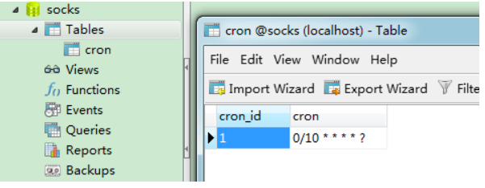

# Spring  好好看

## 概括

Spring是一个轻量级的控制反转(IoC)和面向切面(AOP)的容器框架，是为Java应用程序提供基础性服务的一套框架，目的是用于简化企业应用程序的开发，它使得开发者只需要关心业务需求。主要包括以下七个模块。

## Spring模块组成


- Spring Core：Spring的核心容器，提供 Spring 框架的基本功能。核心容器的主要组件是 BeanFactory，它是工厂模式的实现。BeanFactory 使用控制反转（IOC） 模式将应用程序的配置和依赖性规范与实际的应用程序代码分开。
- Spring AOP：Spring AOP 模块为基于Spring 的应用程序中的对象提供了事务管理服务。通过使用 Spring AOP，不用依赖组件，就可以将声明性事务管理集成到应用程序中。
- Spring DAO：对JDBC的抽象封装，简化了数据访问异常的处理，并能统一管理JDBC事务。
- Spring ORM：对现有的ORM框架的支持。
- Spring Context：Spring 上下文，向 Spring 框架提供上下文信息。Spring 上下文包括企业服务，例如 JNDI、EJB、电子邮件、国际化、校验和调度功能。
- Spring Web 模块：提供了基本的面向Web的综合特性，提供对常见框架如Struts2的支持，Spring能够管理这些框架，将Spring的资源注入给框架，也能在这些框架的前后插入拦截器。
- Spring MVC 框架： 提供MVC 实现。


（扩展）**Spring Boot与Spring Cloud**

- Spring Boot 是 Spring 的一套快速配置脚手架，可以基于Spring Boot 快速开发单个微服务;
- Spring Cloud是基于Spring Boot实现的；
- Spring Boot专注于快速、方便集成的单个微服务个体，Spring Cloud关注全局的服务治理框架；
- Spring Boot使用了约束优于配置的理念，很多集成方案已经帮你选择好了，能不配置就不配置 ,
- Spring Cloud很大的一部分是基于Spring Boot来实现，Spring Boot可以离开Spring Cloud独立使用开发项目，但是Spring Cloud离不开Spring Boot，属于依赖的关系。
- SpringBoot在SpringClound中起到了承上启下的作用，如果你要学习SpringCloud必须要学习SpringBoot。


> spring容器启动过程

## IOC控制反转

&emsp;&emsp;IOC控制反转是一种通过描述（XML或注解）并通过第三方去生产或获取特定对象的方式。在Spring中实现控制反转的是IoC容器，其实现方法是依赖注入。所谓控制反转就是：获得依赖对象的方式反转了。没有控制反转的程序中 , 我们使用面向对象编程 , 对象的创建与对象间的依赖关系完全硬编码在程序中，控制反转后将对象的创建转移给了调用者，我们程序员不再去管理对象的创建了 , 更多的去关注业务的实现，耦合性大大降低。

&emsp;&emsp; 控制反转后对象由Spring 来创建 , 管理 , 装配。Spring容器在初始化时先读取配置文件，根据配置文件或元数据创建并组织对象存入容器中，程序使用时再从容器中取出需要的对象。

&emsp;&emsp; 比如在实际项目中一个 实体 类可能依赖了很多其他的类，假如我们需要实例化这个 实体类，之前是要搞清这个 实体类 所有底层类的构造函数，这是个很麻烦的事情。但是利用 控制反转 的话，只需要配置好对象的信息，然后在需要的地方自动装配就行了，这大大增加了项目的可维护性而且降低了开发难度。

## Aop面向切面编程

&emsp;&emsp;AOP面向切面编程能够将那些与业务无关，却被业务模块共同调用的逻辑例如事务处理、日志管理、权限控制等封装起来，便于减少系统的重复代码，降低模块间的耦合度，并有利于未来的可拓展性和可维护性。

&emsp;&emsp;Spring AOP 就是基于动态代理的，如果要代理的对象，实现了某个接口，那么 Spring AOP 会使用 **JDK Proxy** （[ˈprɒksi] ）去创建代理对象，而对于没有实现接口的对象，就无法使用 JDK Proxy 去进行代理了，这时候 Spring AOP 会使用 **Cglib** 生成一个被代理对象的子类来作为代理，


### 动态代理？？

> [有空研究原理](https://mp.weixin.qq.com/s/h-hNC45BvTR499kDNg-Vuw)
>

#### JDK动态代理

> [源码解析](https://juejin.cn/post/6974018412158664734)
>
> Spring哪里用到了动态代理：Spring的AOP，加事务，加权限，加日志，Mybatis
>
> 为什么需要接口：因为生成的代理类需要实现这个接口
>
> 为什么JDK动态代理只能代理接口：因为生成的代理类已经继承了Proxy类，Java是单继承的，所以没法再继承另外一个类了。

核心：

- InvocationHandler接口: 由代理实例的调用处理程序实现的接口，每个代理实例都有一个关联的调用处理程序。当在代理实例上调用方法时，方法调用将被编码并分派到其调用处理程序的invoke方法。

  ```
  Object invoke(Object proxy, 方法 method, Object[] args)；
  //参数
  //proxy - 调用该方法的代理实例
  //method -所述方法对应于调用代理实例上的接口方法的实例。方法对象的声明类将是该方法声明的接口，
  它可以是代理类继承该方法的代理接口的超级接口。
  //args -包含的方法调用传递代理实例的参数值的对象的阵列，或null如果接口方法没有参数。原始类型的
  参数包含在适当的原始包装器类的实例中，例如java.lang.Integer或java.lang.Boolean 。
  ```

- 举例：

  实现方式是定义一个接口，用我们要代理的目标类JdkClass实现这个定义的接口

  ```
  /**
   * Created by qcl on 2018/11/29
   * desc: jdk动态aop代理需要实现的接口
   */
  public interface JdkInterface {
      public void add();
  }
  ```
  ```
  /**
   * Created by qcl on 2018/11/29
   * desc: 被代理的类，即目标类target
   */
  public class JdkClass implements JdkInterface {
      @Override
      public void add() {
          System.out.println("目标类的add方法");
      }
  }
  ```

  然后写一个InvocationHandler类实现InvocationHandler接口，并且实现接口中的invoke方法。invoke方法是在该方法中加入切面逻辑的。目标类方法的执行是由mehod.invoke(target,args)这条语句完成。

  InvocationHandler接口是由代理实例的调用处理程序实现的接口，每个代理实例都有一个关联的调用处理程序。当在代理实例上调用方法时，方法调用将被编码并分派到其调用处理程序的invoke方法。

  ```
  import java.lang.reflect.InvocationHandler;
  import java.lang.reflect.Method;

  /**
   * Created by qcl on 2018/11/29
   * desc:这里加入切面逻辑
   */
  public class MyInvocationHandler implements InvocationHandler {
      private Object target;

      public MyInvocationHandler(Object target) {
          this.target = target;
      }

      @Override
      public Object invoke(Object proxy, Method method, Object[] args) throws Throwable {
          System.out.println("before-------切面加入逻辑");
          Object invoke = method.invoke(target, args);//通过反射执行目标类的方法
          System.out.println("after-------切面加入逻辑");
          return invoke;
      }
  }
  ```

  用Proxy.newProxyInstance(）生成目标类的增强代理类，有三个参数：

  - 类加载器：1.负责加载新生成的代理类，产生字节码文件。2.JDK内部需要通过类加载器作为缓存的key。
  - 接口数组：新生成的代理类实现的接口
  - 逻辑代码：将要执行的具体逻辑也就是InvocationHandler接口实现类的实例对象传给新生成的代理类。

  

  ```
  /**
   * Created by qcl on 2018/11/29
   * desc:测试
   */
  public class JdkTest {
      public static void main(String[] args) {
          JdkClass jdkClass = new JdkClass();
          //创建一个与代理对象相关联的InvocationHanlder
          MyInvocationHandler handler = new MyInvocationHandler(jdkClass);
          // Proxy为InvocationHandler实现类动态创建一个符合某一接口的代理实例
          //这里的proxyInstance就是我们目标类的增强代理类
          JdkInterface proxyInstance = (JdkInterface) Proxy.newProxyInstance(jdkClass.getClass().getClassLoader(),
                  jdkClass.getClass()
                          .getInterfaces(), handler);
          proxyInstance.add();
          //打印增强过的类类型
          System.out.println("=============" + proxyInstance.getClass());

      }
  }
  ```

  Proxy类：代理，Proxy提供了创建动态代理类和实例的静态方法。

  ```
   public static Object newProxyInstance(ClassLoader loader,
                                            Class<?>[] interfaces,
                                            InvocationHandler h)
          throws IllegalArgumentException
      {
          Objects.requireNonNull(h);

          final Class<?>[] intfs = interfaces.clone();
          //安全验证
          final SecurityManager sm = System.getSecurityManager();
          if (sm != null) {
              checkProxyAccess(Reflection.getCallerClass(), loader, intfs);
          }

          /*
           * 得到代理类
           */
          Class<?> cl = getProxyClass0(loader, intfs);

          try {
              if (sm != null) {
                  checkNewProxyPermission(Reflection.getCallerClass(), cl);
              }

              final Constructor<?> cons = cl.getConstructor(constructorParams);//获得构造方法
              final InvocationHandler ih = h;
              //如果构造器器不是公共的，需要修改访问权限，使其可以访问
              if (!Modifier.isPublic(cl.getModifiers())) {
                  AccessController.doPrivileged(new PrivilegedAction<Void>() {
                      public Void run() {
                          cons.setAccessible(true);
                          return null;
                      }
                  });
              }
              return cons.newInstance(new Object[]{h});//通过构造方法，创建对象，传入InvocationHandler 对象
          } catch (IllegalAccessException|InstantiationException e) {
              throw new InternalError(e.toString(), e);
          } catch (InvocationTargetException e) {
              Throwable t = e.getCause();
              if (t instanceof RuntimeException) {
                  throw (RuntimeException) t;
              } else {
                  throw new InternalError(t.toString(), t);
              }
          } catch (NoSuchMethodException e) {
              throw new InternalError(e.toString(), e);
          }
      }

  ```

  getProxyClass0（）：

  ```
    private static Class<?> getProxyClass0(ClassLoader loader,
                                             Class<?>... interfaces) {
          //当接口大于65535报错
          if (interfaces.length > 65535) {
              throw new IllegalArgumentException("interface limit exceeded");
          }

          return proxyClassCache.get(loader, interfaces);
      }
      
      public V get(K key, P parameter) {
          Objects.requireNonNull(parameter);

          expungeStaleEntries();
          //通过上游方法，可以知道key是类加载器，这里是通过类加载器可以获得第一层key
         Object cacheKey = CacheKey.valueOf(key, refQueue);
          
         //我们查看map的定义，可以看到map变量是一个两层的ConcurrentMap
         ConcurrentMap<Object, Supplier<V>> valuesMap = map.get(cacheKey);//通过第一层key尝试获取数据
         //如果valuesMap 为空，就新建一个ConcurrentHashMap，
         //key就是生成出来的cacheKey，并把这个新建的ConcurrentHashMap推到map
         if (valuesMap == null) {
              ConcurrentMap<Object, Supplier<V>> oldValuesMap
                  = map.putIfAbsent(cacheKey,
                                    valuesMap = new ConcurrentHashMap<>());
              if (oldValuesMap != null) {
                  valuesMap = oldValuesMap;
              }
          }

          //通过上游方法可以知道key是类加载器，parameter是类本身，这里是通过类加载器和类本身获得第二层key
          Object subKey = Objects.requireNonNull(subKeyFactory.apply(key, parameter));
          Supplier<V> supplier = valuesMap.get(subKey);
          Factory factory = null;

          while (true) {
              if (supplier != null) {
                  //如果有缓存，直接调用get方法后返回，当没有缓存，会继续执行后面的代码，
                  //由于while (true)，会第二次跑到这里，再get返回出去，
                  //其中get方法调用的是WeakCahce中的静态内部类Factory的get方法
                  V value = supplier.get();
                  if (value != null) {
                      return value;
                  }
              }
              //当factory为空，会创建Factory对象
              if (factory == null) {
                  factory = new Factory(key, parameter, subKey, valuesMap);
              }

              if (supplier == null) {
                  supplier = valuesMap.putIfAbsent(subKey, factory);
                  if (supplier == null) {
                      //当没有代理类缓存的时候，会运行到这里，把Factory的对象赋值给supplier ，
                      //进行下一次循环，supplier就不为空了，可以调用get方法返回出去了，
                      //这个Factory位于WeakCahce类中，是一个静态内部类
                      supplier = factory;
                  }
              } else {
                  if (valuesMap.replace(subKey, supplier, factory)) {
                      supplier = factory;
                  } else {
                      supplier = valuesMap.get(subKey);
                  }
              }
          }
      }

  ```

  **流程：**

  - newProxyInstance方法会通过getProxyClass0获得代理对象，然后通过反射生成对应的代理对象。

  - getProxyClass0生成代理类用了两层的map去缓存，第一个层是类加载器，第二层是 类加载器+本身

  - 当有缓存，supplier.get()，它调用的是WeakCahce中的静态内部类Factory的get()，里面就是获取代理类的方法了。底层是通过ProxyGenerator.generateProxyClass(）根据传进去的class信息去实现 这个接口的实现类的字节码，然后通过defineClass0这个方法返回一个代理类的byte数组，defineClass0是native本地方法。

    ​

  ```
  @Component
  public class MyBeanPostProcess implements BeanPostProcessor {
      @Override
      public Object postProcessBeforeInitialization(Object bean, String beanName) throws BeansException {
          Object o = Proxy.newProxyInstance(MyBeanPostProcess.class.getClassLoader(),
                  bean.getClass().getInterfaces(), new MyInvationHandler(bean));
          return o;
      }

      @Override
      public Object postProcessAfterInitialization(Object bean, String beanName) throws BeansException {
          return bean;
      }
  }
  ```

  Spring内部也是通过实现BeanPostProcessor接口来完成动态代理的。

  **BeanFactoryPostProcessor**

  BeanFactoryPostProcessor也是Spring的扩展点，程序员可以通过实现它，读取bean的定义，然后对其进行修改：

  ```
  @Component
  public class MyBeanFactoryPostProcessor implements BeanFactoryPostProcessor {
      @Override
      public void postProcessBeanFactory(ConfigurableListableBeanFactory factory) throws BeansException {
          factory.getBeanDefinition("repo").setScope("prototype");
      }
  }

  ```

  ​


#### CGlib动态代理

CGLIB是一个强大的高性能的代码生成包。它广泛的被许多AOP的框架使用，例如Spring AOP为他们提供方法的interception（拦截）。CGLIB包的底层是通过使用一个小而快的字节码处理框架**ASM**，来转换字节码并生成新的类。

除了CGLIB包，脚本语言例如Groovy和BeanShell，也是使用ASM来生成java的字节码。当然不鼓励直接使用ASM，因为它要求你必须对JVM内部结构包括class文件的格式和指令集都很熟悉。

> [bilibli](https://www.bilibili.com/video/BV1fF411q7QQ?p=4&spm_id_from=pageDriver&vd_source=8093e0db3f35a1c14b1da1d330c57a21)
>
> [csdn](https://blog.csdn.net/yhl_jxy/article/details/80633194?ops_request_misc=%257B%2522request%255Fid%2522%253A%2522166287624516800182795625%2522%252C%2522scm%2522%253A%252220140713.130102334..%2522%257D&request_id=166287624516800182795625&biz_id=0&utm_medium=distribute.pc_search_result.none-task-blog-2~all~top_positive~default-1-80633194-null-null.142^v47^body_digest,201^v3^control_2&utm_term=cglib%E5%8A%A8%E6%80%81%E4%BB%A3%E7%90%86&spm=1018.2226.3001.4187)

**源码分析：**

编写一个**方法拦截器类**实现MethodInterceptor（ [ˌɪntəˈseptə(r)] ）接口，MethodInterceptor接口继承了Callback。这个类实例化后可以作为Enhancer对象的setCallback方法的参数用于设置回调方法。同时Enhancer对象还要设置要代理的类。

```
package net.sf.cglib.proxy;
public interface MethodInterceptor
extends Callback
{
//1）obj表示增强的对象，即实现这个接口类的一个对象；

//2）method表示要被拦截的方法；

//3）args表示要被拦截方法的参数；

//4）proxy表示要触发父类的方法对象；

    public Object intercept(Object obj, java.lang.reflect.Method method, Object[] args,
                               MethodProxy proxy) throws Throwable;
 
}
```

然后通过Enhancer.create()方法创建代理对象，方法内会先生成了一个EnhancerKey，EnhancerKey里面保存了用户所设置的代理信息，比如要代理的类，代理的拦截器等等。EnhancerKey还会被放入一个map中作缓存，value为代理类，相同参数可以直接从map中取出代理类，防止重复创建代理类。

```
 public Object create() {
        classOnly = false;
        argumentTypes = null;
        return createHelper();
    }
    
 private Object createHelper() {
 		//校验callbackTypes、filter是否为空，以及为空时的处理。
        preValidate();
        Object key = KEY_FACTORY.newInstance((superclass != null) ? superclass.getName() : null,
                ReflectUtils.getNames(interfaces),
                filter == ALL_ZERO ? null : new WeakCacheKey<CallbackFilter>(filter),
                callbackTypes,
                useFactory,
                interceptDuringConstruction,
                serialVersionUID);
        this.currentKey = key;
        Object result = super.create(key);
        return result;
    }
```

然后方法内接下来会以EnhancerKey作为Enhancer父类AbstractClassGenerator的create()方法的参数去创建代理对象。首先会用ASM技术生成代理类的字节码，然后将callbacks存到代理类的ThreadLocal的一个属性里面，这样代理对象执行方法的时候就可以直接拿到callbacks然后调用。代理对象是通过newInstance方法生成的，参数有构造器类型，代理对象构造方法参数，对应回调对象，然后根据这些参数通过反射生成对象。

父类create方法：

```
protected Object create(Object key) {
        try {
            ClassLoader loader = getClassLoader();
            Map<ClassLoader, ClassLoaderData> cache = CACHE;
            ClassLoaderData data = cache.get(loader);
            if (data == null) {
                synchronized (AbstractClassGenerator.class) {
                    cache = CACHE;
                    data = cache.get(loader);
                    if (data == null) {
                        Map<ClassLoader, ClassLoaderData> newCache = new WeakHashMap<ClassLoader, ClassLoaderData>(cache);
                        data = new ClassLoaderData(loader);
                        newCache.put(loader, data);
                        CACHE = newCache;
                    }
                }
            }
            this.key = key;
            Object obj = data.get(this, getUseCache());
            if (obj instanceof Class) {
                return firstInstance((Class) obj);
            }
            return nextInstance(obj);
        } catch (RuntimeException e) {
            throw e;
        } catch (Error e) {
            throw e;
        } catch (Exception e) {
            throw new CodeGenerationException(e);
        }
    }
  
  protected Object nextInstance(Object instance) {
        EnhancerFactoryData data = (EnhancerFactoryData) instance;
 
        if (classOnly) {
            return data.generatedClass;
        }
 
        Class[] argumentTypes = this.argumentTypes;
        Object[] arguments = this.arguments;
        if (argumentTypes == null) {
            argumentTypes = Constants.EMPTY_CLASS_ARRAY;
            arguments = null;
        }
        return data.newInstance(argumentTypes, arguments, callbacks);
    }
```

**举例：**

实现一个业务类，这个业务类并没有实现任何接口：

```
package com.jpeony.spring.proxy.cglib;
 
public class HelloService {
 
    public HelloService() {
        System.out.println("HelloService构造");
    }
 
    /**
     * 该方法不能被子类覆盖,Cglib是无法代理final修饰的方法的
     */
    final public String sayOthers(String name) {
        System.out.println("HelloService:sayOthers>>"+name);
        return null;
    }
 
    public void sayHello() {
        System.out.println("HelloService:sayHello");
    }
}
```

自定义MethodInterceptor：

```
package com.jpeony.spring.proxy.cglib;
 
import net.sf.cglib.proxy.MethodInterceptor;
import net.sf.cglib.proxy.MethodProxy;
 
import java.lang.reflect.Method;
 
/**
 * 自定义MethodInterceptor
 */
public class MyMethodInterceptor implements MethodInterceptor{
 
    /**
     * sub：cglib生成的代理对象
     * method：被代理对象方法
     * objects：方法入参
     * methodProxy: 代理方法
     */
    @Override
    public Object intercept(Object sub, Method method, Object[] objects, MethodProxy methodProxy) throws Throwable {
        System.out.println("======插入前置通知======");
        Object object = methodProxy.invokeSuper(sub, objects);
        System.out.println("======插入后者通知======");
        return object;
    }
}
```

生成CGLIB代理对象调用目标方法：

```
package com.jpeony.spring.proxy.cglib;
 
import net.sf.cglib.core.DebuggingClassWriter;
import net.sf.cglib.proxy.Enhancer;
 
public class Client {
    public static void main(String[] args) {
        // 代理类class文件存入本地磁盘方便我们反编译查看源码
        System.setProperty(DebuggingClassWriter.DEBUG_LOCATION_PROPERTY, "D:\\code");
        // 通过CGLIB动态代理获取代理对象的过程
        Enhancer enhancer = new Enhancer();
        // 设置enhancer对象的父类
        enhancer.setSuperclass(HelloService.class);
        // 设置enhancer的回调对象
        enhancer.setCallback(new MyMethodInterceptor());
        // 创建代理对象
        HelloService proxy= (HelloService)enhancer.create();
        // 通过代理对象调用目标方法
        proxy.sayHello();
    }
}
```


### Spring AOP 实现通知


可以通过在类上使用@Aspect注解来定义一个**切面**，Aspect切面可以看成 Pointcut切点 和 Advice通知 的结合，一个切面可以由多个切点和通知组成。

**切点**用于定义 要对哪些连接点（Join point）进行拦截。@Pointcut注解修饰方法可以用来实现切点，注解有execution([ˌeksɪˈkjuːʃn])方式和annotation([ˌænəˈteɪʃn])这两种方式。execution方式可以用路径表达式指定对哪些方法拦截，比如指定拦截add*、search*。annotation方式可以指定被哪些注解修饰的代码进行拦截。

**通知**（Advice）：指要在连接点（Join Point）上执行的动作，即增强的逻辑，比如权限校验和、日志记录等。通知有各种类型，包括Around、Before、After、After returning、After throwing。

实现切面后织入器就会起作用了，**织入**（Weaving）就是通过**动态代理**，在目标对象的方法也就是连接点（Join point）中执行增强逻辑（Advice）的过程。具体过程就是在切面上参照 切点 的定义取的相应的连接点，然后将相应的 通知 织入到连接点上。

这其中的**目标对象**（Target）是包含连接点的对象，也称作被通知（Advice）的对象。 由于Spring AOP是通过动态代理实现的，所以这个对象永远是一个代理对象。

```
@Component
@Aspect
public class AlphaAspect {

    //execution(方法修饰符(可选)  返回类型  类路径 方法名  参数  异常模式(可选))
    //1）execution(public * *(..))——表示匹配所有public方法
    //2）execution(* set*(..))——表示所有以“set”开头的方法
    //3）execution(* com.xyz.service.AccountService.*(..))——表示匹配所有AccountService接口的方法
    //4）execution(* com.xyz.service.*.*(..))——表示匹配service包下所有的方法
    //5）execution(* com.xyz.service..*.*(..))——表示匹配service包和它的子包下的方法
    @Pointcut("execution(* com.nowcoder.community.service..*.*(..))")
    public void pointCut(){

    }

    @Before("pointCut()")
    public void before(){
        System.out.println("before");
    }

    @After("pointCut()")
    public void after(){
        System.out.println("after");
   }

    @AfterReturning("pointCut()")
    public void afterReturning(){
        System.out.println("afterReturning");
    }

    @AfterThrowing("pointCut()")
    public void afterThrowing(){
        System.out.println("pointCut()");
    }

    @Around("pointCut()")
    public Object around(ProceedingJoinPoint joinPoint) throws Throwable{
        //调用目标组件方法
        System.out.println("aroundBefore");
        Object obj = joinPoint.proceed();
        System.out.println("aroundAfter");
        return obj;
    }
}
```

**通知类型**

（1）前置通知（Before Advice）：在连接点（Join point）之前执行的通知。

（2）后置通知（After Advice）：当连接点退出的时候执行的通知（不论是正常返回还是异常退出）。 

（3）环绕通知（Around Advice）：集成了四大通知。他和其他四大通知注解最大的不同是需要手动进行接口内方法的反射后才能执行接口中的方法。它也可以选择是否继续执行连接点或直接返回它们自己的返回值或抛出异常来结束执行。

（4）返回后通知（AfterReturning Advice）：在连接点正常完成后执行的通知（如果连接点抛出异常，则不执行）

（5）抛出异常后通知（AfterThrowing advice）：在方法抛出异常退出时执行的通知

6.2、Advice的执行顺序：


**eg：使用 AOP 统计方法的执行时间（日志）**

```
@Aspect
@Slf4j
@Component
public class PerformanceAspect {
 
    // 用于统计一个方法的执行时间和结果（成功执行、执行出错）
    @Around("repositoryOps()")
    public Object logPerformance(ProceedingJoinPoint pjp) throws Throwable {
        long start = System.currentTimeMillis();
        String methodName = "-";
        String result = "Y";
        try {
            methodName = pjp.getSignature().toShortString();
            return pjp.proceed();
        } catch (Throwable t) {
            result = "N";
            throw t;
        } finally {
            long end = System.currentTimeMillis();
            log.info("{};{};{}ms", methodName, result, (end - start));
        }
    }
 
    // cn.wu.service 包下的任意类的任意方法
    @Pointcut("execution(* cn.wu.service.*.*(..))")
    private void repositoryOps() {
 
    }
}
```


> https://blog.csdn.net/a745233700/article/details/113840727

## **Bean的获取阶段**


> Processor([ˈprəʊsesə(r)] )     beanDefinition([ˌdefɪˈnɪʃn])  aware([əˈweə(r)] )

1.spring容器启动后，首先会实例化beanFactory、实例化类扫描器等等，然后会去调用ConfigurationClassPostProcessor这个bean工厂的后置处理器扫描并解析类，每扫描到一个符合规则的类，spring都会实例化一个BeanDefinition对象，调用这个对象的各种set方法存储bean的信息。然后根据类的类名生成一个bean的名字。生成的beanName和beanDefinition对象放到beanDefintionMap当中，key=beanName，value=beanDefinition对象

> 为什么spring不能用Class来建立bean呢?很简单，因为Class无法完成bean的抽象，比如bean的作用域，bean的注入模型，bean是否是懒加载等等信息，Class是无法抽象出来的，故而需要一个BeanDefinition类来抽象这些信息，以便于spring能够完美的实例化一个bean
>
> 以上步骤在invokeBeanFactoryPostProcessors完成，

2.接下来调用实现了BeanFactoryPostProcessor接口的用户自定义后置处理器，用户可以在这一步修改它的内部bean工厂，对spring做二次开发。例如配置Jdbc的DataSource连接的时候可以先使用$占位符，后面再替换占位符为配置文件中真实的数据。（mybatis的最新代码里面便是扩展这个类来实现的）

3.验证bean是不是单例，是不是懒加载，还有名字是否含有特殊字符串等等，然后得到class，**推断构造方法**后通过反射实例化这个对象。

4.提前暴露一个bean工厂对象解决循环依赖的问题

5.通过populateBean方法为bean填充注入属性

6.调用aware接口，Spring会检测该对象是否实现了xxxAware( [əˈweə(r)])接口，通过Aware类型的接口，可以给bean对象注入Spring容器的一些资源：

> ①如果这个Bean实现了BeanNameAware接口，会调用它实现的setBeanName(String beanId)方法，传入Bean的名字；
>
> ②如果这个Bean实现了BeanClassLoaderAware接口，调用setBeanClassLoader()方法，传入ClassLoader对象的实例。
>
> ②如果这个Bean实现了BeanFactoryAware接口，会调用它实现的setBeanFactory()方法，传递的是Spring工厂自身。
>
> ③如果这个Bean实现了ApplicationContextAware接口，会调用setApplicationContext(ApplicationContext)方法，传入Spring上下文；

  7.执行spring生命周期回调方法，被@PostConstruct @PreDestroy注释的方法。

>  注解的 applyBeanPostProcessorsBeforeInitialization
>
>  invokeInitMethods   //接口和xml方法的


8.调用BeanPostProcessor的postProcessAfterInitialization方法。这期间会创建动态代理的代理对象。

    applyBeanPostProcessorsAfterInitialization
14.将bean对象put进单例池
15，容器关闭后，如果Bean实现了 DisposableBean 接⼝，则会回调该接⼝的 destroy ⽅法，如果配置了 destroy-method ⽅法，则会执⾏ destroy-method 配置的⽅法。

 [ˌdefɪˈnɪʃn] 


## Bean作用域*

Bean的作用域有以下四种：


几种作用域中，request、session作用域仅在基于web的应用中使用（不必关心你所采用的是什么web应用框架），只能用在基于web的Spring ApplicationContext环境。

- Singleton单例类型

当一个bean的作用域为Singleton，那么Spring IoC容器中只会存在一个共享的bean实例，并且所有对bean的请求，只要id与该bean定义相匹配，则只会返回bean的**同一实例**。单例类型的bean对象在容器初始化时自动创建。Singleton作用域是bean对象的默认作用域。

要在XML中将bean定义成singleton，可以这样配置：

```
<bean id="ServiceImpl" class="cn.csdn.service.ServiceImpl" scope="singleton">
```

- Prototype原型类型

当一个bean的作用域为Prototype，表示一个bean定义对应多个对象实例。Prototype作用域的bean对象在每次对该bean请求时都会创建一个新的bean实例。原型类型的bean对象在容器初始化时没有被创建，而是当我们获取bean的时候才会去创建一个对象。

对有状态的bean应该使用prototype作用域，而对无状态的bean则应该使用singleton作用域。在XML中将bean定义成prototype，可以这样配置：

```
<bean id="account" class="com.foo.DefaultAccount" scope="prototype"/>

<bean id="account" class="com.foo.DefaultAccount" singleton="false"/>
```

- Request

当一个bean的作用域为Request，表示在**一次HTTP请求中**，一个bean定义对应一个实例；即每个HTTP请求都会有各自的bean实例，它们依据某个bean定义创建而成。该作用域仅在基于web的SpringApplicationContext情形下有效。考虑下面bean定义：

```
<bean id="loginAction" class=cn.csdn.LoginAction" scope="request"/>
```

针对每次HTTP请求，Spring容器会根据loginAction bean的定义创建一个全新的LoginAction bean实例，且该loginAction bean实例仅在当前HTTP request内有效，因此可以根据需要放心的更改所建实例的内部状态，而其他请求中根据loginAction bean定义创建的实例，将不会看到这些特定于某个请求的状态变化。当处理请求结束，request作用域的bean实例将被销毁。

- Session

当一个bean的作用域为Session，表示在一个HTTP Session中，一个bean定义对应一个实例。该作用域仅在基于web的Spring ApplicationContext情形下有效。考虑下面bean定义：

```
<bean id="userPreferences" class="com.foo.UserPreferences" scope="session"/>
```

针对某个HTTP Session，Spring容器会根据userPreferences bean定义创建一个全新的userPreferences bean实例，且该userPreferences bean仅在当前HTTP Session内有效。与request作用域一样，可以根据需要放心的更改所创建实例的内部状态，而别的HTTP Session中根据userPreferences创建的实例，将不会看到这些特定于某个HTTP Session的状态变化。当HTTP Session最终被废弃的时候，在该HTTP Session作用域内的bean也会被废弃掉。


**单例bean的线程安全问题**

对于prototype作用域的Bean不存在线程问题，而单例 bean会存在线程问题，主要是因为当多个线程操作同一个对象的时候是存在资源竞争的。

常见的有两种解决办法：

1. 在 bean 中尽量避免定义可变的成员变量。
2. 在类中定义一个 `ThreadLocal` 成员变量，将需要的可变成员变量保存在 `ThreadLocal` 中（推荐的一种方式）。

不过，大部分 bean 实际都是无状态（没有实例变量）的（比如 Dao、Service），这种情况下， bean 是线程安全的。


**@Component 和 @Bean 的区别**

- @Component用于自动检测和使用类路径扫描自动配置bean。**注释类**和bean之间存在隐式的一对一映射，即**每个类一个bean**。这种方法对需要进行逻辑处理的控制非常有限，因为它纯粹是声明性的。

  ```
  @Component
  public class Student {
   
      private String name = "lkm";
   
      public String getName() {
          return name;
      }
   
      public void setName(String name) {
          this.name = name;
      }
  }
  ```

  **@Component的衍射注解**

  - **@Component**：通用的注解，可标注任意类为 Spring组件。如果一个 Bean 不知道属于哪个层，可以使用@Component 注解标注。

  - **@Repository** : 对应持久层即 Dao 层，主要用于数据库相关操作。

  - **@Service**: 对应服务层，主要涉及一些复杂的逻辑，需要用到 Dao 层。

  - **@Controller** : 对应 Spring MVC 控制层，主要用户接受用户请求并调用 Service 层返回数据给前端页面。

    ​

  **@Repository 和 @Mapper的区别：**

  - @Repository 是 Component的注解，用于声明一个 Bean。@Repository单独使用没用。可以这样理解，注解放在接口上本来就没有意义，spring中在mapper接口上写一个@Repository注解，只是为了标识，要想真正使用是这个接口被扫描，必须使用@MapperScannerConfigurer

  - @Mapper是mybatis自身带的注解。在spring程序中，mybatis需要找到对应的mapper，在编译时生成动态代理类，与数据库进行交互，这时需要用到@Mapper注解，但是有时候当我们有很多mapper接口时，就需要写很多@Mappe注解，这样很麻烦，有一种简便的配置化方法便是在启动类上@MapperScan注解。

    ​

- @Bean用于显式声明单个bean，而不是让Spring像上面那样自动执行它。它将bean的声明与类定义分离，并允许您精确地创建和配置bean，@Bean则常和@Configuration注解搭配使用。(Mybatis生成的代理对象就是通过@Bean交给spring管理的，因为xml和注解都是把类交给spring管理，spring来生成类)

  

  factoryBean

  ```
  @Configuration
  public class WebSocketConfig {
      @Bean
      public Student student(){
          return new Student();
      }
   
  }

  @Configuration
  public class AppConfig {
      @Bean
      public TransferService transferService() {
          return new TransferServiceImpl();
      }

  }
  ```

  **为什么需要@Bean？**

  @Bean注解比 @Component注解的自定义性更强，而且很多地方我们只能通过 @Bean注解来注册 bean。比如当我们引用第三方库中的类需要装配到 Spring容器时，没有没有源代码，也就没办法使用@Component进行自动配置，则只能通过 @Bean来实现。


## Spring循环依赖

> [csdn](https://blog.csdn.net/a745233700/article/details/110914620)

getSingleton方法中使用了三级缓存：

| 缓存层级  | 名称                    | 描述                                       |
| ----- | --------------------- | ---------------------------------------- |
| 第一层缓存 | singletonObjects      | 单例对象缓存池，存放的 Bean 已经实例化、属性赋值、完全初始化好（成品）   |
| 第二层缓存 | earlySingletonObjects | 用于存储单例模式下创建的Bean实例（该Bean被提前暴露的引用，该Bean还在创建中） |
| 第三层缓存 | singletonFactories    | 单例工厂的缓存                                  |

getSingleton方法中三级缓存的使用：

```
protected Object getSingleton(String beanName, boolean allowEarlyReference) {
  // Spring首先从singletonObjects（一级缓存）中尝试获取
  Object singletonObject = this.singletonObjects.get(beanName);
  // 若是获取不到而且对象在建立中，则尝试从earlySingletonObjects(二级缓存)中获取
  if (singletonObject == null && isSingletonCurrentlyInCreation(beanName)) {
    synchronized (this.singletonObjects) {
        singletonObject = this.earlySingletonObjects.get(beanName);
        if (singletonObject == null && allowEarlyReference) {
          ObjectFactory<?> singletonFactory = this.singletonFactories.get(beanName);
          if (singletonFactory != null) {
            //若是仍是获取不到而且允许从singletonFactories经过getObject获取，则经过singletonFactory.getObject()(三级缓存)获取
              singletonObject = singletonFactory.getObject();
              //若是获取到了则将singletonObject放入到earlySingletonObjects,也就是将三级缓存提高到二级缓存中
              this.earlySingletonObjects.put(beanName, singletonObject);
              this.singletonFactories.remove(beanName);
          }
        }
    }
  }
  return (singletonObject != NULL_OBJECT ? singletonObject : null);
}
```

分析 `getSingleton()` 的整个过程，可知三级缓存的使用过程如下

1. Spring 会先从一级缓存 `singletonObjects` 中尝试获取 Bean。
2. 若是获取不到，而且对象正在建立中，就会尝试从二级缓存 `earlySingletonObjects` 中获取 Bean。
3. 若还是获取不到，就会尝试从三级缓存 `singletonFactories` 中获取 Bean。
4. 若是在三级缓存中获取到了 Bean，会将该 Bean 存放到二级缓存中。

Spring解决了在单例模式下的Bean属性循环依赖问题，比如现在有A，B这2个bean循环依赖着对方，在A对象通过createBeanInstance方法实例化之后，会调用 addSingletonFactory 方法，将A的工厂对象放入三级缓存中。然后是执行populateBean（）方法依赖注入B，会同样通过Bean的生命周期来创建B这个bean对象，也就是先实例化B对象，然后属性注入A，这时会从一二级缓存里面找发现都没有，然后通过三级缓存中的`ObjectFactory.getObject` 拿到对象 A，这样B这个Bean对象就完成了初始化操作并存放到一级缓存中，然后A也就能完成初始化工作也存放到一级缓存。

**Spring 为什么不能解决构造器的循环依赖**

> **对象的构造函数是在实例化阶段调用的。**

上文中提到，在对象已实例化后，会将对象存入三级缓存中。在调用对象的构造函数时，对象还未完成初始化，所以也就无法将对象存放到三级缓存中。

在构造函数注入中，对象 A 需要在对象 B 的构造函数中完成初始化，对象 B 也需要在对象 A的构造函数中完成初始化。此时两个对象都不在三级缓存中，最终结果就是两个 Bean 都无法完成初始化，无法解决循环依赖问题。

**Spring 为什么不能解决prototype作用域循环依赖**

Spring IoC 容器只会管理单例 Bean 的生命周期，并将单例 Bean 存放到缓存池中（三级缓存）。Spring 并不会管理 `prototype` 作用域的 Bean，也不会缓存该作用域的 Bean，而 Spring 中循环依赖的解决正是通过缓存来实现的。

**Spring 为什么不能解决多例的循环依赖**

多实例 Bean 是每次调用 `getBean` 都会创建一个新的 Bean 对象，该 Bean 对象并不能缓存。而 Spring 中循环依赖的解决正是通过缓存来实现的。

**非单例Bean的循环依赖如何解决**

- 对于构造器注入产生的循环依赖，可以使用 `@Lazy` 注解，延迟加载。
- 对于多例 Bean 和 `prototype` 作用域产生的循环依赖，可以尝试改为单例 Bean。

**为什么一定要三级缓存**

>  尝试使用两级缓存解决依赖冲突

第三级缓存的目的是为了延迟代理对象的创建，因为如果没有依赖循环的话，那么就不需要为其提前创建代理，可以将它延迟到初始化完成之后再创建。

既然目的只是延迟的话，那么我们是不是可以不延迟创建，而是在实例化完成之后，就为其创建代理对象，这样我们就不需要第三级缓存了。因此，我们可以将 `addSingletonFactory()` 方法进行改造。

```
protected void addSingletonFactory(String beanName, ObjectFactory<?> singletonFactory) {
    Assert.notNull(singletonFactory, "Singleton factory must not be null");

    synchronized (this.singletonObjects) {
        // 判断一级缓存中不存在此对象
        if (!this.singletonObjects.containsKey(beanName)) { 
            // 直接从工厂中获取 Bean
            Object o = singletonFactory.getObject();

            // 添加至二级缓存中
            this.earlySingletonObjects.put(beanName, o);
            this.registeredSingletons.add(beanName);
        }
    }
}

```

这样的话，每次实例化完 Bean 之后就直接去创建代理对象，并添加到二级缓存中。

测试结果是完全正常的，Spring 的初始化时间应该也是不会有太大的影响，因为如果 Bean 本身不需要代理的话，是直接返回原始 Bean 的，并不需要走复杂的创建代理 Bean 的流程。

**三级缓存的意义**

测试证明，二级缓存也是可以解决循环依赖的。为什么 Spring 不选择二级缓存，而要额外多添加一层缓存，使用三级缓存呢？

如果 Spring 选择二级缓存来解决循环依赖的话，那么就意味着所有 Bean 都需要在实例化完成之后就立马为其创建代理，而 Spring 的设计原则是在 Bean 初始化完成之后才为其创建代理。

> 使用三级缓存而非二级缓存并不是因为只有三级缓存才能解决循环引用问题，其实二级缓存同样也能很好解决循环引用问题。使用三级而非二级缓存并非出于 IOC 的考虑，而是出于 AOP 的考虑，即若使用二级缓存，在 AOP 情形注入到其他 Bean的，不是最终的代理对象，而是原始对象。


问题1、为什么首先是从三级缓存中取呢？主要是为了性能，因为三级缓存中存的是一个x对象，如果能取到则不去二级找了；哪有人会问二级有什么用呢？为什么一开始要存工厂呢？为什么一开始不直接存三级缓存？这里稍微有点复杂，如果直接存到三级缓存，只能存一个对象，假设以前存这个对象的时候这对象的状态为xa，但是我们这里y要注入的x为xc状态，那么则无法满足；但是如果存一个工厂，工厂根据情况产生任意xa或者xb或者xc等等情况；比如说aop的情况下x注入y，y也注入x；而y中注入的x需要加代理（aop），但是加代理的逻辑在注入属性之后，也就是x的生命周期周到注入属性的时候x还不是一个代理对象，那么这个时候把x存起来，然后注入y，获取、创建y，y注入x，获取x；拿出来的x是一个没有代理的对象；但是如果存的是个工厂就不一样；首先把一个能产生x的工厂存起来，然后注入y，注入y的时候获取、创建y，y注入x，获取x，先从三级缓存获取，为null，然后从二级缓存拿到一个工厂，调用工厂的getObject()；spring在getObject方法中判断这个时候x被aop配置了故而需要返回一个代理的x出来注入给y。当然有的读者会问你不是前面说过getObject会返回一个当前状态的xbean嘛？我说这个的前提是不去计较getObject的具体源码，因为这块东西比较复杂，需要去了解spring的后置处理器功能，这里先不讨论，总之getObject会根据情况返回一个x，但是这个x是什么状态，spring会自己根据情况返回；

问题2、为什么要从二级缓存remove？因为如果存在比较复杂的循环依赖可以提高性能；比如x，y，z相互循环依赖，那么第一次y注入x的时候从二级缓存通过工厂返回了一个x，放到了三级缓存，而第二次z注入x的时候便不需要再通过工厂去获得x对象了。因为if分支里面首先是访问三级缓存；至于remove则是为了gc吧；

```
protected Object getSingleton(String beanName, boolean allowEarlyReference) {
		//从单例池当（一级缓存）中直接拿，也就是文章里面'目前'的解释
		//这也是为什么getBean("xx")能获取一个初始化好bean的根本代码
		Object singletonObject = this.singletonObjects.get(beanName);
		//如果这个时候是x注入y，创建y，y注入x，获取x的时候那么x不在容器
		//第一个singletonObject == null成立
		//第二个条件判断是否存在正在创建bean的集合当中，前面我们分析过，成立
		//进入if分支
		if (singletonObject == null && isSingletonCurrentlyInCreation(beanName)) {
			synchronized (this.singletonObjects) {
				//先从三级缓存那x？为什么先从三级缓存拿？下文解释
				singletonObject = this.earlySingletonObjects.get(beanName);
				//讲道理是拿不到的，因为这三个map现在只有二级缓存中存了一个工厂对象
				//回顾一下文章上面的流程讲工厂对象那里，把他存到了二级缓存
				//所以三级缓存拿到的singletonObject==null  第一个条件成立
				//第二个条件allowEarlyReference=true，这个前文有解释
				//就是spring循环依赖的开关，默认为true 进入if分支
				if (singletonObject == null && allowEarlyReference) {
					//从二级缓存中获取一个 singletonFactory，回顾前文，能获取到
					//由于这里的beanName=x，故而获取出来的工厂对象，能产生一个x半成品bean
					ObjectFactory<?> singletonFactory = this.singletonFactories.get(beanName);
					//由于获取到了，进入if分支
					if (singletonFactory != null) {
						//调用工厂对象的getObject()方法，产生一个x的半成品bean
						//怎么产生的？下文解释，比较复杂
						singletonObject = singletonFactory.getObject();
						//拿到了半成品的xbean之后，把他放到三级缓存；为什么？下文解释
						this.earlySingletonObjects.put(beanName, singletonObject);
						//然后从二级缓存清除掉x的工厂对象；？为什么，下文解释
						this.singletonFactories.remove(beanName);
					}
				}
			}
		}

```


## 依赖注入

> 应用程序在运行时依赖 IoC 容器来动态注入对象所需要的外部依赖。

**根据xml配置来实现实例化类**

```
<!--petstore-v1.xml-->
    <bean id="petStore" class="org.deppwang.litespring.v1.service.PetStoreService"></bean>
    <bean id="accountDao" class="org.deppwang.litespring.v1.dao.AccountDao"></bean>
```

把解析的标签，扫描的注解类封装成BeanDefinition对象。


当获取 Bean 实例时，通过类加载器，根据全限定名，得到其类对象，通过类对象利用**反射**创建 Bean 实例。

依赖注入指Bean对象所依赖的资源 , 由容器来设置和装配，Spring通过依赖注入实现IOC（控制反转），常用的注入方式主要有三种：构造方法注入（Construct注入），setter注入，基于注解的注入（接口注入）

- 构造器注入

  通过有参构造方法来创建的三种注入方法：

  ```
  <!-- 第一种根据index参数下标设置 -->
  <bean id="userT" class="com.kuang.pojo.UserT">
  <!-- index指构造方法 , 下标从0开始 -->
  <constructor-arg index="0" value="kuangshen2"/>
  </bean>
  <!-- 第二种根据参数名字设置 -->
  <bean id="userT" class="com.kuang.pojo.UserT">
  <!-- name指参数名 -->
  <constructor-arg name="name" value="kuangshen2"/>
  </bean>
  <!-- 第三种根据参数类型设置 -->
  <bean id="userT" class="com.kuang.pojo.UserT">
  <constructor-arg type="java.lang.String" value="kuangshen2"/>
  </bean>
  ```

- Set注入（重点）

  要求被注入的属性 , 必须有set方法 , set方法的方法名由set + 属性首字母大写 , 如果属性是boolean类型, 没有set方法 , 是 is .

  1、**常量注入**

  ```xml
   <bean id="student" class="com.kuang.pojo.Student">
       <property name="name" value="小明"/>
   </bean>
  ```

  2、**Bean注入** 

  注意点：这里的值是一个引用，ref

  ```xml
   <bean id="addr" class="com.kuang.pojo.Address">
       <property name="address" value="重庆"/>
   </bean>
   
   <bean id="student" class="com.kuang.pojo.Student">
       <property name="name" value="小明"/>
       <property name="address" ref="addr"/>
   </bean>
  ```

  3、**数组注入**

  ```xml
   <bean id="student" class="com.kuang.pojo.Student">
       <property name="name" value="小明"/>
       <property name="address" ref="addr"/>
       <property name="books">
           <array>
               <value>西游记</value>
               <value>红楼梦</value>
               <value>水浒传</value>
           </array>
       </property>
   </bean>
  ```

  4、**List注入**

  ```xml
   <property name="hobbys">
       <list>
           <value>听歌</value>
           <value>看电影</value>
           <value>爬山</value>
       </list>
   </property>
  ```

  5、**Map注入**

  ```xml
   <property name="card">
       <map>
           <entry key="中国邮政" value="456456456465456"/>
           <entry key="建设" value="1456682255511"/>
       </map>
   </property>
  ```

  6、**set注入**

  ```xml
   <property name="games">
       <set>
           <value>LOL</value>
           <value>BOB</value>
           <value>COC</value>
       </set>
   </property>
  ```

  7、**Null注入**

  ```xml
   <property name="wife"><null/></property>
  ```

  8、**Properties注入**

  ```xml
   <property name="info">
       <props>
           <prop key="学号">20190604</prop>
           <prop key="性别">男</prop>
           <prop key="姓名">小明</prop>
       </props>
   </property>
  ```

  ​

- 注解注入

  1.可以不用提供set方法，直接在直接名上添加@value("值")

  ```
  @Component("user")
  // 相当于配置文件中 <bean id="user" class="当前注解的类"/>
  public class User {
     @Value("秦疆")
     // 相当于配置文件中 <property name="name" value="秦疆"/>
     public String name;
  }
  ```

  2、如果提供了set方法，在set方法上添加@value("值");

  ```
  @Component("user")
  public class User {

     public String name;

     @Value("秦疆")
     public void setName(String name) {
         this.name = name;
    }
  }
  ```

  ​


## 自动装配

自动装配说明：

- 自动装配是使用spring满足bean依赖的一种方法
- spring会在应用上下文中为某个bean寻找其依赖的bean。

Spring中bean有三种装配机制，分别是：

1. 在xml中显式配置；
2. 在java中显式配置；
3. 隐式的bean发现机制和自动装配。

这里我们主要讲第三种：自动化的装配bean。

Spring的自动装配需要从两个角度来实现，或者说是两个操作：

1. 组件扫描(component scanning)：spring会自动发现应用上下文中所创建的bean；
2. 自动装配(autowiring)：spring自动满足bean之间的依赖，也就是我们说的IoC/DI；

组件扫描和自动装配组合发挥巨大威力，使得显示的配置降低到最少。

自动装配的三种方法：

- **autowire byName (按名称自动装配)**

由于在手动配置xml过程中，常常发生字母缺漏和大小写等错误，而无法对其进行检查，使得开发效率降低。

采用自动装配将避免这些错误，并且使配置简单化。

**小结：**

当一个bean节点带有 autowire byName的属性时。

1. 将查找其类中所有的set方法名，例如setCat，获得将set去掉并且首字母小写的字符串，即cat。

2. 去spring容器中寻找是否有此字符串名称id的对象。

3. 如果有，就取出注入；如果没有，就报空指针异常。

   ​

- **autowire byType (按类型自动装配)**

使用autowire byType首先需要保证：同一类型的对象，在spring容器中唯一。如果不唯一，会报不唯一的异常。

```xml
NoUniqueBeanDefinitionException
```


- **使用注解自动装配（推荐使用）**

jdk1.5开始支持注解，spring2.5开始全面支持注解。

准备工作：利用注解的方式注入属性。

1、在spring配置文件中引入context文件头

```xml
xmlns:context="http://www.springframework.org/schema/context"
http://www.springframework.org/schema/context
http://www.springframework.org/schema/context/spring-context.xsd
```

2、开启属性注解支持！

```xml
<context:annotation-config/>
```

**@Autowired**

- @Autowired是按类型自动装配的，不支持id匹配。
- 需要导入 spring-aop的包！

**@Qualifier**

- @Autowired是根据类型自动装配的，加上@Qualifier则可以根据byName的方式自动装配
- @Qualifier不能单独使用。

**@Resource**  **

- @Resource如有指定的name属性，先按该属性进行byName方式查找装配；
- 其次再进行默认的byName方式进行装配；
- 如果以上都不成功，则按byType的方式自动装配。
- 都不成功，则报异常。


**原理：** ？？？？

普通对象的注入如果注入的属性是单例，那么spring首先从单例池获取，如果获取不到直接实例化这个bean，放到单例池在返回，完成注入；如果是原型的每次注入就直接实例化这个原型bean返回完成注入；

完成@Autowried这个注解功能的类是AutowiredAnnotationBeanPostProcessor这个后置处理器

```
 public PropertyValues postProcessProperties(PropertyValues pvs, Object bean, String beanName) {
        InjectionMetadata metadata = this.findAutowiringMetadata(beanName, bean.getClass(), pvs);

        try {
            metadata.inject(bean, beanName, pvs);
            return pvs;
        } catch (BeanCreationException var6) {
            throw var6;
        } catch (Throwable var7) {
            throw new BeanCreationException(beanName, "Injection of autowired dependencies failed", var7);
        }
    }
```

`metadata.inject(bean, beanName, pvs);`首先会遍历当前bean——当中所有需要注入的属性

```
    public void inject(Object target, @Nullable String beanName, @Nullable PropertyValues pvs) throws Throwable {
        Collection<InjectionMetadata.InjectedElement> checkedElements = this.checkedElements;
        Collection<InjectionMetadata.InjectedElement> elementsToIterate = checkedElements != null ? checkedElements : this.injectedElements;
        InjectionMetadata.InjectedElement element;
        if (!((Collection)elementsToIterate).isEmpty()) {
            for(Iterator var6 = ((Collection)elementsToIterate).iterator(); var6.hasNext(); element.inject(target, beanName, pvs)) {
                element = (InjectionMetadata.InjectedElement)var6.next();
                if (logger.isTraceEnabled()) {
                    logger.trace("Processing injected element of bean '" + beanName + "': " + element);
                }
            }
        }

    }
```


## Spring 框架设计模式

​    [源码](https://juejin.cn/post/6905741110607462413)

​    [设计模式链接 ](https://mp.weixin.qq.com/s?__biz=Mzg2OTA0Njk0OA==&mid=2247485303&idx=1&sn=9e4626a1e3f001f9b0d84a6fa0cff04a&chksm=cea248bcf9d5c1aaf48b67cc52bac74eb29d6037848d6cf213b0e5466f2d1fda970db700ba41&token=255050878&lang=zh_CN#rd) 。

- **工厂设计模式** : Spring 使用工厂模式通过 `BeanFactory`、`ApplicationContext` 创建 bean 对象。

- **代理设计模式** :Spring的AOP功能用到了JDK的动态代理和CGLIB字节码生成技术。

- **单例设计模式** : Spring 中的 Bean 默认都是单例的。

- **模板方法设计模式** : Spring 中 `jdbcTemplate`、`hibernateTemplate` 等以 Template 结尾的对数据库操作的类，它们就使用到了模板方法设计模式。一般来说模板方法设计模式都是需要继承的，但jdbcTemplate这个类方法太多，而是将变化的东西抽出来封装成一个回调对象作为参数传入JdbcTemplate的方法中。

  

  AbstractApplicationContext 中的 refresh 方法，它就是一个模板方法，里面调用了一系列方法，有以实现的具体方法，有未实现的抽象方法。

- **包装器设计模式** : 我们的项目需要连接多个数据库，而且不同的客户在每次访问中根据需要会去访问不同的数据库。这种模式让我们可以根据客户的需求能够动态切换不同的数据源。

- **观察者模式:** Spring 事件驱动模型就是观察者模式很经典的一个应用。在Spring事件驱动模型中，首先有事件角色ApplicationEvent，这是一个抽象类，抽象类下有四个实现类代表四种事件。

  - ContextStartedEvent：ApplicationContext启动后触发的事件。
  - ContextStoppedEvent：ApplicationContext停止后触发的事件。
  - ContextRefreshedEvent：ApplicationContext初始化或刷新完成后触发的事件。
  - ContextClosedEvent：ApplicationContext关闭后触发的事件。

  

  发布者对应的类是ApplicationEventPublisher：

  ```
  @FunctionalInterface
  public interface ApplicationEventPublisher {
      default void publishEvent(ApplicationEvent event) {
          publishEvent((Object) event);
      }
      
      void publishEvent(Object event);

  }
  /*@FunctionalInterface表示这是一个函数式接口，函数式接口只有一个抽象方法。ApplicationContext类又继承了
  ApplicationEventPublisher类，所以我们可以使用ApplicationContext发布事件。*/
  ```

  事件监听者通过实现接口ApplicationListener来定义，这是一个函数式接口，并且带有泛型，要求E参数是ApplicationEvent的子类。

  ```
  @FunctionalInterface
  public interface ApplicationListener<E extends ApplicationEvent> extends EventListener {

  	void onApplicationEvent(E event);
  }
  ```

  使用例子：

  ```
  /*首先继承抽象类ApplicationEvent定义一个事件角色PayApplicationEvent。*/
  public class PayApplicationEvent extends ApplicationEvent {

      private String message;

      public PayApplicationEvent(Object source, String message) {
          super(source);
          this.message = message;
      }

      public String getMessage() {
          return message;
      }
  }
  /*接着定义一个PayApplicationEvent事件的监听者PayListener。*/
  @Component
  public class PayListener implements ApplicationListener<PayApplicationEvent> {
      
      @Override
      public void onApplicationEvent(PayApplicationEvent event) {
          String message = event.getMessage();
          System.out.println("监听到PayApplicationEvent事件，消息为：" + message);
      }
  }
  /*最后我们使用ApplicationContext发布事件。*/
  @SpringBootApplication
  public class SpringmvcApplication {

      public static void main(String[] args) throws Exception {
          ApplicationContext applicationContext = SpringApplication.run(SpringmvcApplication.class, args);
          applicationContext.publishEvent(new PayApplicationEvent(applicationContext,"成功支付100元！"));
      }

  }
  ```

- **适配器模式** : Spring AOP 的增强或通知(Advice)使用到了适配器模式，将每个 Advice 都封装成对应的拦截器类型返回给容器，所以**需要使用适配器模式对 Advice 进行转换**。

  

  spring MVC 中也是用到了适配器模式适配`Controller`。


## Spring 事务*

 **管理事务的方式：**

- **编程式事务** ： 在代码中硬编码(不推荐使用) : 通过 TransactionTemplate或者 TransactionManager手动管理事务，实际应用中很少使用，但是对于你理解 Spring 事务管理原理有帮助。

  ```
  @Autowired
  private TransactionTemplate transactionTemplate;
  public void testTransaction() {

          transactionTemplate.execute(new TransactionCallbackWithoutResult() {
              @Override
              protected void doInTransactionWithoutResult(TransactionStatus transactionStatus) {

                  try {

                      // ....  业务代码
                  } catch (Exception e){
                      //回滚
                      transactionStatus.setRollbackOnly();
                  }

              }
          });
  }
  ```

- **声明式事务** ： 在 XML 配置文件中配置或者直接基于注解（推荐使用） : 实际是通过 AOP 实现（基于@Transactional 的全注解方式使用最多）

  ```
  @Transactional(propagation=propagation.PROPAGATION_REQUIRED)
  public void aMethod {
    //do something
    B b = new B();
    C c = new C();
    b.bMethod();
    c.cMethod();
  }
  ```

  ```
  @Transactional
  main{
    method();
  }
  //相当于以下代码：
  Main{
      Connection con=null;
      try{
          con = getConnection();
          con.setAutoCommit(false);
          //方法调用
          methodB();
          //提交事务
          con.commit();
      } catch(RuntimeException ex) {
          //回滚事务
          con.rollback();
      } finally {
          //释放资源
          closeCon();
      }
  }
  ```

  ​

&emsp; 

### 事务传播行为

**事务传播行为是为了解决业务层方法之间互相调用的事务问题**。

当事务方法被另一个事务方法调用时，必须指定事务应该如何传播。例如：方法可能继续在现有事务中运行，也可能开启一个新事务，并在自己的事务中运行。

正确的事务传播行为可能的值如下:

> propagation_required

**1.TransactionDefinition.PROPAGATION_REQUIRED**

使用的最多的一个事务传播行为，我们平时经常使用的`@Transactional`注解默认使用就是这个事务传播行为。**如果当前存在事务，则加入该事务；如果当前没有事务，则创建一个新的事务。**


> propagation_requires_new

**2.TransactionDefinition.PROPAGATION_REQUIRES_NEW**

创建一个新的事务，如果当前存在事务，则把当前事务挂起。也就是说不管外部方法是否开启事务，`Propagation.REQUIRES_NEW`修饰的内部方法会新开启自己的事务，且开启的事务相互独立，互不干扰。


> required_nested

**3.TransactionDefinition.PROPAGATION_NESTED**

如果当前存在事务，则创建一个事务作为当前事务的嵌套事务来运行；如果当前没有事务，则该取值等价于`TransactionDefinition.PROPAGATION_REQUIRED`。

嵌套事务：内层事务依赖于外层事务。外层事务失败时，会回滚内层事务所做的动作。而内层事务操作失败并不会引起外层事务的回滚。


> propatation_mandatory

**4.TransactionDefinition.PROPAGATION_MANDATORY**

如果当前存在事务，则加入该事务；如果当前没有事务，则抛出异常。（mandatory：强制性）

这个使用的很少。

若是错误的配置以下 3 种事务传播行为，事务将不会发生回滚：

- **TransactionDefinition.PROPAGATION_SUPPORTS**: 如果当前存在事务，则加入该事务；如果当前没有事务，则以非事务的方式继续运行。

- **TransactionDefinition.PROPAGATION_NOT_SUPPORTED**: 以非事务方式运行，如果当前存在事务，则把当前事务挂起。

- **TransactionDefinition.PROPAGATION_NEVER**: 以非事务方式运行，如果当前存在事务，则抛出异常。

  ​

**Spring 事务中的隔离级别有哪几种?**

和事务传播行为这块一样，为了方便使用，Spring 也相应地定义了一个枚举类：Isolation

```
public enum Isolation {

    DEFAULT(TransactionDefinition.ISOLATION_DEFAULT),

    READ_UNCOMMITTED(TransactionDefinition.ISOLATION_READ_UNCOMMITTED),

    READ_COMMITTED(TransactionDefinition.ISOLATION_READ_COMMITTED),

    REPEATABLE_READ(TransactionDefinition.ISOLATION_REPEATABLE_READ),

    SERIALIZABLE(TransactionDefinition.ISOLATION_SERIALIZABLE);

    private final int value;

    Isolation(int value) {
        this.value = value;
    }

    public int value() {
        return this.value;
    }

}

```


下面我依次对每一种事务隔离级别进行介绍：

- **TransactionDefinition.ISOLATION_DEFAULT** :使用后端数据库默认的隔离级别，MySQL 默认采用的 `REPEATABLE_READ` 隔离级别 Oracle 默认采用的 `READ_COMMITTED` 隔离级别.

- **TransactionDefinition.ISOLATION_READ_UNCOMMITTED** :最低的隔离级别，使用这个隔离级别很少，因为它允许读取尚未提交的数据变更，**可能会导致脏读、幻读或不可重复读**

- **TransactionDefinition.ISOLATION_READ_COMMITTED** : 允许读取并发事务已经提交的数据，**可以阻止脏读，但是幻读或不可重复读仍有可能发生**

- **TransactionDefinition.ISOLATION_REPEATABLE_READ** : 对同一字段的多次读取结果都是一致的，除非数据是被本身事务自己所修改，**可以阻止脏读和不可重复读，但幻读仍有可能发生。**

- **TransactionDefinition.ISOLATION_SERIALIZABLE** : 最高的隔离级别，完全服从 ACID 的隔离级别。所有的事务依次逐个执行，这样事务之间就完全不可能产生干扰，也就是说，**该级别可以防止脏读、不可重复读以及幻读**。但是这将严重影响程序的性能。通常情况下也不会用到该级别。

  ​

**@Transactional(rollbackFor = Exception.class)注解了解吗？**

`Exception` 分为运行时异常 `RuntimeException` 和非运行时异常。事务管理对于企业应用来说是至关重要的，即使出现异常情况，它也可以保证数据的一致性。

当 `@Transactional` 注解作用于类上时，该类的所有 public 方法将都具有该类型的事务属性，同时，我们也可以在方法级别使用该标注来覆盖类级别的定义。如果类或者方法加了这个注解，那么这个类里面的方法抛出异常，就会回滚，数据库里面的数据也会回滚。

在 `@Transactional` 注解中如果不配置`rollbackFor`属性,那么事务只会在遇到`RuntimeException`的时候才会回滚，加上 `rollbackFor=Exception.class`,可以让事务在遇到非运行时异常时也回滚。

**spring事务失效的原因**

- MyISAM不支持事务，使用了mysq的MyISAM。

- 事务注解默认是对 `RuntimeException()` 异常进行回滚，但是如果我们在方法中使用了`try {} catch` 则默认的回滚就失效了（被生吞了）。

  解决1：在catch中抛出 `RuntimeException()`异常

  解决2：`TransactionAspectSupport.currentTransactionStatus().setRollbackOnly();`

- 如果使用了spring+mvc，则context:component-scan重复扫描问题可能会引起事务失败。

- @Transactional 注解只能应用到 public 可见度的方法上。 如果你在 protected、private 或者 package-visible 的方法上使用 @Transactional 注解，它也不会报错，事务也会失效。


## 区别

**Spring中BeanFactory、FactoryBean和ApplicationContext的区别？**

**BeanFactory**：是一个 Bean 工厂，使用简单工厂模式，是 Spring IoC 容器顶级接口，是用于管理 Bean 的工厂，最核心的功能是通过 getBean() 方法加载 Bean 对象，在使用到某个Bean时才会加载。通常我们不会直接使用该接口，而是使用其子接口 ApplicationContext。

**FactoryBean**：是一个工厂 Bean，使用了工厂方法模式，自身是个Bean也可以生产Bean。FactoryBean是个接口，实现该接口的类可以自己定义要创建的 Bean 实例，只需要实现它的 getObject() 方法即可，返回的实例可以自动被注册。

Mybatis也利用了这个FactoryBean接口，因为Mapper的代理对象是通过动态代理第三方生成的，可以隐藏构建Bean的细节

```
@Component
public class MyFactoryBean implements FactoryBean {

    public Object getObject() throws Exception {
        return new DataSource();
    }
    @Override
    public Class<?> getObjectType() {
        return null;
    }
}
```


**ApplicationConext：**是 BeanFactory 的子接口，扩展了 BeanFactory 的功能（高级 IOC 容器）。ApplicationContext采用预加载的方式，在启动的时候就把所有的Bean全部实例化了，缺点是占用内存，当应用程序配置较多bean的时候，程序启动较慢


## 自定义注解（发音）

> 注解的意义是什么？
>
> 注解：JDK1.5推出的一个重大特性，可以标记在类、方法、属性上面。
>
> 内置注解：
>
> @Override：检查该方法是否是重写方法。如果发现其父类，或者是引用的接口中并没有该方法时，会报编译错误。
>
> @Deprecated：标记过时方法。如果使用该方法，会报编译警告

元注解：

**@Retention：**用于指定该Annotation的生命周期。RetentionPolicy取值为`SOURCE,CLASS,RUNTIME`。

- RetentionPolicy.SOURCE: 只能保存在源代码（.java文件）中，当编译时，会被丢弃；
- RetentionPolicy.CLASS: 此注解可以在class文件中保留；当JVM解释.class字节码时，不会保留该注解。默认策略。
- RetentionPolicy.RUNTIME: 在运行时有效，即运行时保留。当运行Java程序时，JVM会保留注解，Java程序可以通过反射获取该注解。

**@Documented：**标记这些注解是否包含在用户文档中

**@Target：**指明该类型的注解可以注解的程序元素的范围。参数值可为如：`TYPE,METHOD,CONSTRUCTOR,FIELD等`

**@Inherited：** 指明该注解类型被自动继承：如果某个类使用了被@Inherited修饰的Annotation，则其子类将自动具有该注解。

例子：

1.定义注解

```
@Target(ElementType.METHOD)
@Retention(RetentionPolicy.RUNTIME)
@Documented
public @interface MyAnnotation {
    String value() default "myAnnotation";
}
```

2.实现注解（AOP面向切面）

```
@Aspect
@Component
@Slf4j
public class MyAnnotationAop {
 
    @Pointcut("@annotation(com.xxx.yyy.annotation.MyAnnotation)")
    private void pointcut(){
 
    }
 
    @Around(value="pointcut()")
    public Object aroud(ProceedingJoinPoint joinPoint) throws Throwable {
        Object[] args = joinPoint.getArgs();
        Object result = joinPoint.proceed(args);
        log.info("请求参数：{}",JSON.toJSON(args));
        log.info("返回结果：{}",JSON.toJSON(result));
        return result;
    }
}
```

3.使用注解

```
@RestController
@RequestMapping("/path")
public class UserController {
 
	@Autowired
	private UserService userService;
 
	@MyAnnotation()
	@GetMapping("/getUserById")
	public Object getUserById(@RequestParam("userId") String userId ) {
	return userService.getUserById(userId);
	}
}
```

完成以上配置运行起来然后调用UserController控制器的getUserById接口，查看日志记录如下，表示成功！


注解如何失效：AOP+反射


## 设计一个IOC容器

https://juejin.cn/post/6876228192818954254


## 源码

> https://www.cnblogs.com/CodeBear/p/10374261.html

5.0以上的版本主推JavaConfig风格+注解的方式来使用Spring，用下面这种启动方法：

```
AnnotationConfigApplicationContext context=new AnnotationConfigApplicationContext(AppConfig.class);
```

创建AnnotationConfigApplicationContext对象的构造函数：

```
//根据参数类型可以知道，其实可以传入多个annotatedClasses，但是这种情况出现的比较少
	public AnnotationConfigApplicationContext(Class<?>... annotatedClasses) {
		//调用无参构造函数，会先调用父类GenericApplicationContext的构造函数
		//父类的构造函数里面就是初始化DefaultListableBeanFactory，并且赋值给beanFactory
		//本类的构造函数里面，初始化了一个读取器：AnnotatedBeanDefinitionReader read，一个扫描器ClassPathBeanDefinitionScanner scanner
		//scanner的用处不是很大，它仅仅是在我们外部手动调用 .scan 等方法才有用，常规方式是不会用到scanner对象的
		this();
		//把传入的类进行注册，这里有两个情况，
		//传入传统的配置类
		//传入bean（虽然一般没有人会这么做
		//看到后面会知道spring把传统的带上@Configuration的配置类称之为FULL配置类，不带@Configuration的称之为Lite配置类
		//但是我们这里先把带上@Configuration的配置类称之为传统配置类，不带的称之为普通bean
		register(annotatedClasses);
		//刷新
		refresh();
	}
```

#### this()方法

首先会调用父类的无参构造：初始化了DefaultListableBeanFactory，DefaultListableBeanFactory是Bean的工厂，是用来生产和获得Bean的。

```
    public GenericApplicationContext() {
        this.customClassLoader = false;
        this.refreshed = new AtomicBoolean();
        this.beanFactory = new DefaultListableBeanFactory();
    }
```

然后是自身类的无参构造，就是对reader和scanner进行了实例化，reader的类型是AnnotatedBeanDefinitionReader，在初始化spring容器的过程中他完成了对Appconfig.java这个配置类的注册和解析功能，spring得到Appconfig.class之后把他解析成BeanDefintion对象，继而去获取@ComponentScan的值然后才开始扫描其他bean。scanner的类型是ClassPathBeanDefinitionScanner，是spring后期用来扫描的类的，有注解解析的功能。

```
public AnnotationConfigApplicationContext() {
		//会隐式调用父类的构造方法，初始化DefaultListableBeanFactory

		//初始化一个Bean读取器
		this.reader = new AnnotatedBeanDefinitionReader(this);

		//初始化一个扫描器，它仅仅是在我们外面手动调用.scan方法，或者调用参数为String的构造方法，传入需要扫描的包名，才会用到，像我们这样传入配置类是不会用到这个scanner对象的。
		this.scanner = new ClassPathBeanDefinitionScanner(this);
	}
```

初始化AnnotatedBeanDefinitionReader的时候，中间很很多过程，最核心的是注册Spring内置的多个Bean，其中就有ConfigurationClassPostProcessor Bean，当spring容器启动的时候会去调用ConfigurationClassPostProcessor这个bean工厂的后置处理器完成扫描。

```
	public AnnotatedBeanDefinitionReader(BeanDefinitionRegistry registry) {
		//调用下方有参构造
		this(registry, getOrCreateEnvironment(registry));
	}

	public AnnotatedBeanDefinitionReader(BeanDefinitionRegistry registry, Environment environment) {
		Assert.notNull(registry, "BeanDefinitionRegistry must not be null");
		Assert.notNull(environment, "Environment must not be null");
		this.registry = registry;
		this.conditionEvaluator = new ConditionEvaluator(registry, environment, null);
		AnnotationConfigUtils.registerAnnotationConfigProcessors(this.registry);
	}

//最后一句到这里
	public static void registerAnnotationConfigProcessors(BeanDefinitionRegistry registry) {
		registerAnnotationConfigProcessors(registry, null);
	}

//核心代码：用以下的方式注册了多个Bean
//判断容器中是否已经存在了ConfigurationClassPostProcessor Bean
if (!registry.containsBeanDefinition(CONFIGURATION_ANNOTATION_PROCESSOR_BEAN_NAME)) {

   //如果不存在（当然这里肯定是不存在的），就通过RootBeanDefinition的构造方法获得ConfigurationClassPostProcessor的BeanDefinition，RootBeanDefinition是BeanDefinition的子类
   
   //执行registerPostProcessor方法，registerPostProcessor方法内部就是注册Bean，当然这里注册其他Bean也是一样的流程。
			RootBeanDefinition def = new RootBeanDefinition(ConfigurationClassPostProcessor.class);
			def.setSource(source);
			beanDefs.add(registerPostProcessor(registry, def, CONFIGURATION_ANNOTATION_PROCESSOR_BEAN_NAME));
}

```

> **ConfigurationClassPostProcessor实现BeanDefinitionRegistryPostProcessor接口，BeanDefinitionRegistryPostProcessor接口又扩展了BeanFactoryPostProcessor接口，BeanFactoryPostProcessor是Spring的扩展点之一，ConfigurationClassPostProcessor是Spring极为重要的一个类，必须牢牢的记住上面所说的这个类和它的继承关系。**
>
> 


注册Spring内置的多个Bean是通过registerPostProcessor方法，这方法为BeanDefinition设置了一个Role，ROLE_INFRASTRUCTURE代表这是spring内部的，并非用户定义的。

然后又调用了DefaultListableBeanFactory的registerBeanDefinition方法，DefaultListableBeanFactory就是我们所说的容器了，里面放着beanDefinitionMap，beanDefinitionNames。beanDefinitionMap是一个hashMap，beanName作为Key,beanDefinition作为Value，beanDefinitionNames是一个集合，里面存放了beanName。往map和集合添加beanDefinition就完成了注册Spring内置的多个Bean

```
	//registerPostProcessor方法：
	private static BeanDefinitionHolder registerPostProcessor(
			BeanDefinitionRegistry registry, RootBeanDefinition definition, String beanName) {

		definition.setRole(BeanDefinition.ROLE_INFRASTRUCTURE);
		registry.registerBeanDefinition(beanName, definition);
		return new BeanDefinitionHolder(definition, beanName);
	}
	
	public void registerBeanDefinition(String beanName, BeanDefinition beanDefinition)
			throws BeanDefinitionStoreException {
		this.beanFactory.registerBeanDefinition(beanName, beanDefinition);
	}

//再点进去有这2句核心代码
//beanDefinitionMap是Map<String, BeanDefinition>，
//这里就是把beanName作为key，ScopedProxyMode作为value，推到map里面
this.beanDefinitionMap.put(beanName, beanDefinition);

//beanDefinitionNames就是一个List<String>,这里就是把beanName放到List中去
this.beanDefinitionNames.add(beanName);


```


#### register(annotatedClasses);

这里传进去的是一个数组，最终会循环调用如下方法：

```
	<T> void doRegisterBean(Class<T> annotatedClass, @Nullable Supplier<T> instanceSupplier, @Nullable String name,
			@Nullable Class<? extends Annotation>[] qualifiers, BeanDefinitionCustomizer... definitionCustomizers) {
		//AnnotatedGenericBeanDefinition可以理解为一种数据结构，是用来描述Bean的，这里的作用就是把传入的标记了注解的类
		//转为AnnotatedGenericBeanDefinition数据结构，里面有一个getMetadata方法，可以拿到类上的注解
		AnnotatedGenericBeanDefinition abd = new AnnotatedGenericBeanDefinition(annotatedClass);

		//判断是否需要跳过注解，spring中有一个@Condition注解，当不满足条件，这个bean就不会被解析
		if (this.conditionEvaluator.shouldSkip(abd.getMetadata())) {
			return;
		}

		abd.setInstanceSupplier(instanceSupplier);

		//解析bean的作用域，如果没有设置的话，默认为单例
		ScopeMetadata scopeMetadata = this.scopeMetadataResolver.resolveScopeMetadata(abd);
		abd.setScope(scopeMetadata.getScopeName());

		//获得beanName
		String beanName = (name != null ? name : this.beanNameGenerator.generateBeanName(abd, this.registry));

		//解析通用注解，填充到AnnotatedGenericBeanDefinition，解析的注解为Lazy，Primary，DependsOn，Role，Description
		AnnotationConfigUtils.processCommonDefinitionAnnotations(abd);

		//限定符处理，不是特指@Qualifier注解，也有可能是Primary,或者是Lazy，或者是其他（理论上是任何注解，这里没有判断注解的有效性），如果我们在外面，以类似这种
		//AnnotationConfigApplicationContext annotationConfigApplicationContext = new AnnotationConfigApplicationContext(Appconfig.class);常规方式去初始化spring，
		//qualifiers永远都是空的，包括上面的name和instanceSupplier都是同样的道理
		//但是spring提供了其他方式去注册bean，就可能会传入了
		if (qualifiers != null) {
			//可以传入qualifier数组，所以需要循环处理
			for (Class<? extends Annotation> qualifier : qualifiers) {
				//Primary注解优先
				if (Primary.class == qualifier) {
					abd.setPrimary(true);
				}
				//Lazy注解
				else if (Lazy.class == qualifier) {
					abd.setLazyInit(true);
				}
				//其他，AnnotatedGenericBeanDefinition有个Map<String,AutowireCandidateQualifier>属性，直接push进去
				else {
					abd.addQualifier(new AutowireCandidateQualifier(qualifier));
				}
			}
		}

		for (BeanDefinitionCustomizer customizer : definitionCustomizers) {
			customizer.customize(abd);
		}

		//这个方法用处不大，就是把AnnotatedGenericBeanDefinition数据结构和beanName封装到一个对象中
		BeanDefinitionHolder definitionHolder = new BeanDefinitionHolder(abd, beanName);

		definitionHolder = AnnotationConfigUtils.applyScopedProxyMode(scopeMetadata, definitionHolder, this.registry);

		//注册，最终会调用DefaultListableBeanFactory中的registerBeanDefinition方法去注册，
		//DefaultListableBeanFactory维护着一系列信息，比如beanDefinitionNames，beanDefinitionMap
		//beanDefinitionNames是一个List<String>,用来保存beanName
		//beanDefinitionMap是一个Map,用来保存beanName和beanDefinition
		BeanDefinitionReaderUtils.registerBeanDefinition(definitionHolder, this.registry);
	}
	
	//最后一句
		public static void registerBeanDefinition(
			BeanDefinitionHolder definitionHolder, BeanDefinitionRegistry registry)
			throws BeanDefinitionStoreException {

		//获取beanName
		// Register bean definition under primary name.
		String beanName = definitionHolder.getBeanName();

		//注册bean
		registry.registerBeanDefinition(beanName, definitionHolder.getBeanDefinition());
                
                //Spring支持别名
		// Register aliases for bean name, if any.
		String[] aliases = definitionHolder.getAliases();
		if (aliases != null) {
			for (String alias : aliases) {
				registry.registerAlias(beanName, alias);
			}
		}
	}
```

到此为止，Spring还没有进行扫描，只是实例化了一个工厂，注册了一些内置的Bean和我们传进去的配置类。


#### refresh();

这个方法做了很多事情，让我们点开这个方法：

```
	public void refresh() throws BeansException, IllegalStateException {
		synchronized (this.startupShutdownMonitor) {
			// Prepare this context for refreshing.
			//刷新预处理，和主流程关系不大，就是保存了容器的启动时间，启动标志等
			prepareRefresh();

			//DefaultListableBeanFactory
			// Tell the subclass to refresh the internal bean factory.
			//和主流程关系也不大，最终获得了DefaultListableBeanFactory，
			// DefaultListableBeanFactory实现了ConfigurableListableBeanFactory
			ConfigurableListableBeanFactory beanFactory = obtainFreshBeanFactory();

			// Prepare the bean factory for use in this context.
			//还是一些准备工作，添加了两个后置处理器：ApplicationContextAwareProcessor，ApplicationListenerDetector
			//还设置了 忽略自动装配 和 允许自动装配 的接口,如果不存在某个bean的时候，spring就自动注册singleton bean
			//还设置了bean表达式解析器 等
			prepareBeanFactory(beanFactory);

			try {
				// Allows post-processing of the bean factory in context subclasses.
				//这是一个空方法,可能以后Spring会进行扩展
				postProcessBeanFactory(beanFactory);

				// Invoke factory processors registered as beans in the context.
				//执行自定义的BeanFactoryProcessor和内置的BeanFactoryProcessor
				invokeBeanFactoryPostProcessors(beanFactory);

				// Register bean processors that intercept bean creation.
				// 注册BeanPostProcessor
				registerBeanPostProcessors(beanFactory);

				// Initialize message source for this context.
				initMessageSource();

				// Initialize event multicaster for this context.
				initApplicationEventMulticaster();

				// Initialize other special beans in specific context subclasses.
				// 空方法
				onRefresh();

				// Check for listener beans and register them.
				registerListeners();

				// 初始化所有没有设置为懒加载的单例bean
				finishBeanFactoryInitialization(beanFactory);

				// Last step: publish corresponding event.
				finishRefresh();
			}

			catch (BeansException ex) {
				if (logger.isWarnEnabled()) {
					logger.warn("Exception encountered during context initialization - " +
							"cancelling refresh attempt: " + ex);
				}

				// Destroy already created singletons to avoid dangling resources.
				destroyBeans();

				// Reset 'active' flag.
				cancelRefresh(ex);

				// Propagate exception to caller.
				throw ex;
			}

			finally {
				// Reset common introspection caches in Spring's core, since we
				// might not ever need metadata for singleton beans anymore...
				resetCommonCaches();
			}
		}
	}
```

invokeBeanFactoryPostProcessors(beanFactory);

用于执行自定义的BeanFactoryProcessor和内置的BeanFactoryProcessor

```
	protected void invokeBeanFactoryPostProcessors(ConfigurableListableBeanFactory beanFactory) {

		//getBeanFactoryPostProcessors真是坑，第一次看到这里的时候，愣住了，总觉得获得的永远都是空的集合，掉入坑里，久久无法自拔
		//后来才知道spring允许我们手动添加BeanFactoryPostProcessor
		//即：annotationConfigApplicationContext.addBeanFactoryPostProcessor(XXX);
		PostProcessorRegistrationDelegate.invokeBeanFactoryPostProcessors(beanFactory, getBeanFactoryPostProcessors());

		// Detect a LoadTimeWeaver and prepare for weaving, if found in the meantime
		// (e.g. through an @Bean method registered by ConfigurationClassPostProcessor)
		if (beanFactory.getTempClassLoader() == null && beanFactory.containsBean(LOAD_TIME_WEAVER_BEAN_NAME)) {
			beanFactory.addBeanPostProcessor(new LoadTimeWeaverAwareProcessor(beanFactory));
			beanFactory.setTempClassLoader(new ContextTypeMatchClassLoader(beanFactory.getBeanClassLoader()));
		}
	}

```

点开invokeBeanFactoryPostProcessors方法：

```
	public static void invokeBeanFactoryPostProcessors(
			ConfigurableListableBeanFactory beanFactory, List<BeanFactoryPostProcessor> beanFactoryPostProcessors) {

		// Invoke BeanDefinitionRegistryPostProcessors first, if any.
		Set<String> processedBeans = new HashSet<>();

		//beanFactory是DefaultListableBeanFactory，是BeanDefinitionRegistry的实现类，所以肯定满足if
		if (beanFactory instanceof BeanDefinitionRegistry) {
			BeanDefinitionRegistry registry = (BeanDefinitionRegistry) beanFactory;

			//regularPostProcessors 用来存放BeanFactoryPostProcessor，
			List<BeanFactoryPostProcessor> regularPostProcessors = new ArrayList<>();

			//registryProcessors 用来存放BeanDefinitionRegistryPostProcessor
			//BeanDefinitionRegistryPostProcessor扩展了BeanFactoryPostProcessor
			List<BeanDefinitionRegistryPostProcessor> registryProcessors = new ArrayList<>();

			// 循环传进来的beanFactoryPostProcessors，正常情况下，beanFactoryPostProcessors肯定没有数据
			// 因为beanFactoryPostProcessors是获得手动添加的，而不是spring扫描的
			// 只有手动调用annotationConfigApplicationContext.addBeanFactoryPostProcessor(XXX)才会有数据
			for (BeanFactoryPostProcessor postProcessor : beanFactoryPostProcessors) {
				// 判断postProcessor是不是BeanDefinitionRegistryPostProcessor，因为BeanDefinitionRegistryPostProcessor
				// 扩展了BeanFactoryPostProcessor，所以这里先要判断是不是BeanDefinitionRegistryPostProcessor
				// 是的话，直接执行postProcessBeanDefinitionRegistry方法，然后把对象装到registryProcessors里面去
				if (postProcessor instanceof BeanDefinitionRegistryPostProcessor) {
					BeanDefinitionRegistryPostProcessor registryProcessor =
							(BeanDefinitionRegistryPostProcessor) postProcessor;
					registryProcessor.postProcessBeanDefinitionRegistry(registry);
					registryProcessors.add(registryProcessor);
				}

				else {//不是的话，就装到regularPostProcessors
					regularPostProcessors.add(postProcessor);
				}
			}

			// Do not initialize FactoryBeans here: We need to leave all regular beans
			// uninitialized to let the bean factory post-processors apply to them!
			// Separate between BeanDefinitionRegistryPostProcessors that implement
			// PriorityOrdered, Ordered, and the rest.
			//一个临时变量，用来装载BeanDefinitionRegistryPostProcessor
			//BeanDefinitionRegistry继承了PostProcessorBeanFactoryPostProcessor
			List<BeanDefinitionRegistryPostProcessor> currentRegistryProcessors = new ArrayList<>();

			// First, invoke the BeanDefinitionRegistryPostProcessors that implement PriorityOrdered.
			// 获得实现BeanDefinitionRegistryPostProcessor接口的类的BeanName:org.springframework.context.annotation.internalConfigurationAnnotationProcessor
			// 并且装入数组postProcessorNames，我理解一般情况下，只会找到一个
			// 这里又有一个坑，为什么我自己创建了一个实现BeanDefinitionRegistryPostProcessor接口的类，也打上了@Component注解
			// 配置类也加上了@Component注解，但是这里却没有拿到
			// 因为直到这一步，Spring还没有去扫描，扫描是在ConfigurationClassPostProcessor类中完成的，也就是下面的第一个
			// invokeBeanDefinitionRegistryPostProcessors方法
			String[] postProcessorNames =
					beanFactory.getBeanNamesForType(BeanDefinitionRegistryPostProcessor.class, true, false);

			for (String ppName : postProcessorNames) {
				if (beanFactory.isTypeMatch(ppName, PriorityOrdered.class)) {
					//获得ConfigurationClassPostProcessor类，并且放到currentRegistryProcessors
					//ConfigurationClassPostProcessor是很重要的一个类，它实现了BeanDefinitionRegistryPostProcessor接口
					//BeanDefinitionRegistryPostProcessor接口又实现了BeanFactoryPostProcessor接口
					//ConfigurationClassPostProcessor是极其重要的类
					//里面执行了扫描Bean，Import，ImportResouce等各种操作
					//用来处理配置类（有两种情况 一种是传统意义上的配置类，一种是普通的bean）的各种逻辑
					currentRegistryProcessors.add(beanFactory.getBean(ppName, BeanDefinitionRegistryPostProcessor.class));
					//把name放到processedBeans，后续会根据这个集合来判断处理器是否已经被执行过了
					processedBeans.add(ppName);
				}
			}

			//处理排序
			sortPostProcessors(currentRegistryProcessors, beanFactory);

			//合并Processors，为什么要合并，因为registryProcessors是装载BeanDefinitionRegistryPostProcessor的
			//一开始的时候，spring只会执行BeanDefinitionRegistryPostProcessor独有的方法
			//而不会执行BeanDefinitionRegistryPostProcessor父类的方法，即BeanFactoryProcessor的方法
			//所以这里需要把处理器放入一个集合中，后续统一执行父类的方法
			registryProcessors.addAll(currentRegistryProcessors);

			//可以理解为执行ConfigurationClassPostProcessor的postProcessBeanDefinitionRegistry方法
			//Spring热插播的体现，像ConfigurationClassPostProcessor就相当于一个组件，Spring很多事情就是交给组件去管理
			//如果不想用这个组件，直接把注册组件的那一步去掉就可以
			invokeBeanDefinitionRegistryPostProcessors(currentRegistryProcessors, registry);

			//因为currentRegistryProcessors是一个临时变量，所以需要清除
			currentRegistryProcessors.clear();

			// Next, invoke the BeanDefinitionRegistryPostProcessors that implement Ordered.
			// 再次根据BeanDefinitionRegistryPostProcessor获得BeanName，看这个BeanName是否已经被执行过了，有没有实现Ordered接口
			// 如果没有被执行过，也实现了Ordered接口的话，把对象推送到currentRegistryProcessors，名称推送到processedBeans
			// 如果没有实现Ordered接口的话，这里不把数据加到currentRegistryProcessors，processedBeans中，后续再做处理
			// 这里才可以获得我们定义的实现了BeanDefinitionRegistryPostProcessor的Bean
			postProcessorNames = beanFactory.getBeanNamesForType(BeanDefinitionRegistryPostProcessor.class, true, false);
			for (String ppName : postProcessorNames) {
				if (!processedBeans.contains(ppName) && beanFactory.isTypeMatch(ppName, Ordered.class)) {
					currentRegistryProcessors.add(beanFactory.getBean(ppName, BeanDefinitionRegistryPostProcessor.class));
					processedBeans.add(ppName);
				}
			}

			//处理排序
			sortPostProcessors(currentRegistryProcessors, beanFactory);

			//合并Processors
			registryProcessors.addAll(currentRegistryProcessors);

			//执行我们自定义的BeanDefinitionRegistryPostProcessor
			invokeBeanDefinitionRegistryPostProcessors(currentRegistryProcessors, registry);

			//清空临时变量
			currentRegistryProcessors.clear();

			// Finally, invoke all other BeanDefinitionRegistryPostProcessors until no further ones appear.
			// 上面的代码是执行了实现了Ordered接口的BeanDefinitionRegistryPostProcessor，
			// 下面的代码就是执行没有实现Ordered接口的BeanDefinitionRegistryPostProcessor
			boolean reiterate = true;
			while (reiterate) {
				reiterate = false;
				postProcessorNames = beanFactory.getBeanNamesForType(BeanDefinitionRegistryPostProcessor.class, true, false);
				for (String ppName : postProcessorNames) {
					if (!processedBeans.contains(ppName)) {
						currentRegistryProcessors.add(beanFactory.getBean(ppName, BeanDefinitionRegistryPostProcessor.class));
						processedBeans.add(ppName);
						reiterate = true;
					}
				}
				sortPostProcessors(currentRegistryProcessors, beanFactory);
				registryProcessors.addAll(currentRegistryProcessors);
				invokeBeanDefinitionRegistryPostProcessors(currentRegistryProcessors, registry);
				currentRegistryProcessors.clear();
			}

			// Now, invoke the postProcessBeanFactory callback of all processors handled so far.
			//registryProcessors集合装载BeanDefinitionRegistryPostProcessor
			//上面的代码是执行子类独有的方法，这里需要再把父类的方法也执行一次
			invokeBeanFactoryPostProcessors(registryProcessors, beanFactory);

			//regularPostProcessors装载BeanFactoryPostProcessor，执行BeanFactoryPostProcessor的方法
			//但是regularPostProcessors一般情况下，是不会有数据的，只有在外面手动添加BeanFactoryPostProcessor，才会有数据
			invokeBeanFactoryPostProcessors(regularPostProcessors, beanFactory);
		}

		else {
			// Invoke factory processors registered with the context instance.
			invokeBeanFactoryPostProcessors(beanFactoryPostProcessors, beanFactory);
		}

		// Do not initialize FactoryBeans here: We need to leave all regular beans
		// uninitialized to let the bean factory post-processors apply to them!
		//找到BeanFactoryPostProcessor实现类的BeanName数组
		String[] postProcessorNames =
				beanFactory.getBeanNamesForType(BeanFactoryPostProcessor.class, true, false);

		// Separate between BeanFactoryPostProcessors that implement PriorityOrdered,
		// Ordered, and the rest.
		List<BeanFactoryPostProcessor> priorityOrderedPostProcessors = new ArrayList<>();
		List<String> orderedPostProcessorNames = new ArrayList<>();
		List<String> nonOrderedPostProcessorNames = new ArrayList<>();
		//循环BeanName数组
		for (String ppName : postProcessorNames) {
			//如果这个Bean被执行过了，跳过
			if (processedBeans.contains(ppName)) {
				// skip - already processed in first phase above
			}
			//如果实现了PriorityOrdered接口，加入到priorityOrderedPostProcessors
			else if (beanFactory.isTypeMatch(ppName, PriorityOrdered.class)) {
				priorityOrderedPostProcessors.add(beanFactory.getBean(ppName, BeanFactoryPostProcessor.class));
			}
			//如果实现了Ordered接口，加入到orderedPostProcessorNames
			else if (beanFactory.isTypeMatch(ppName, Ordered.class)) {
				orderedPostProcessorNames.add(ppName);
			}
			//如果既没有实现PriorityOrdered，也没有实现Ordered。加入到nonOrderedPostProcessorNames
			else {
				nonOrderedPostProcessorNames.add(ppName);
			}
		}

		//排序处理priorityOrderedPostProcessors，即实现了PriorityOrdered接口的BeanFactoryPostProcessor
		// First, invoke the BeanFactoryPostProcessors that implement PriorityOrdered.
		sortPostProcessors(priorityOrderedPostProcessors, beanFactory);
		//执行priorityOrderedPostProcessors
		invokeBeanFactoryPostProcessors(priorityOrderedPostProcessors, beanFactory);

		//执行实现了Ordered接口的BeanFactoryPostProcessor
		// Next, invoke the BeanFactoryPostProcessors that implement Ordered.
		List<BeanFactoryPostProcessor> orderedPostProcessors = new ArrayList<>();
		for (String postProcessorName : orderedPostProcessorNames) {
			orderedPostProcessors.add(beanFactory.getBean(postProcessorName, BeanFactoryPostProcessor.class));
		}
		sortPostProcessors(orderedPostProcessors, beanFactory);
		invokeBeanFactoryPostProcessors(orderedPostProcessors, beanFactory);

		// 执行既没有实现PriorityOrdered接口，也没有实现Ordered接口的BeanFactoryPostProcessor
		// Finally, invoke all other BeanFactoryPostProcessors.
		List<BeanFactoryPostProcessor> nonOrderedPostProcessors = new ArrayList<>();
		for (String postProcessorName : nonOrderedPostProcessorNames) {
			nonOrderedPostProcessors.add(beanFactory.getBean(postProcessorName, BeanFactoryPostProcessor.class));
		}
		invokeBeanFactoryPostProcessors(nonOrderedPostProcessors, beanFactory);

		// Clear cached merged bean definitions since the post-processors might have
		// modified the original metadata, e.g. replacing placeholders in values...
		beanFactory.clearMetadataCache();
	}

```

**invokeBeanFactoryPostProcessors(beanFactory);** 

首先判断beanFactory是不是BeanDefinitionRegistry的实例，当然肯定是的，然后执行如下操作：

1. 定义了一个Set，装载BeanName，后面会根据这个Set，来判断后置处理器是否被执行过了。
2. 定义了两个List，一个是regularPostProcessors，用来装载BeanFactoryPostProcessor，一个是registryProcessors用来装载BeanDefinitionRegistryPostProcessor，其中BeanDefinitionRegistryPostProcessor扩展了BeanFactoryPostProcessor。BeanDefinitionRegistryPostProcessor有两个方法，一个是独有的postProcessBeanDefinitionRegistry方法，一个是父类的postProcessBeanFactory方法。
3. 循环传进来的beanFactoryPostProcessors，上面已经解释过了，一般情况下，这里永远都是空的，只有手动add beanFactoryPostProcessor，这里才会有数据。我们假设beanFactoryPostProcessors有数据，进入循环，判断postProcessor是不是BeanDefinitionRegistryPostProcessor，因为BeanDefinitionRegistryPostProcessor扩展了BeanFactoryPostProcessor，所以这里先要判断是不是BeanDefinitionRegistryPostProcessor，是的话，执行postProcessBeanDefinitionRegistry方法，然后把对象装到registryProcessors里面去，不是的话，就装到regularPostProcessors。
4. 定义了一个临时变量：currentRegistryProcessors，用来装载BeanDefinitionRegistryPostProcessor。
5. getBeanNamesForType，顾名思义，是根据类型查到BeanNames，这里有一点需要注意，就是去哪里找，点开这个方法的话，就知道是循环beanDefinitionNames去找，这个方法以后也会经常看到。这里传了BeanDefinitionRegistryPostProcessor.class，就是找到类型为BeanDefinitionRegistryPostProcessor的后置处理器，并且赋值给postProcessorNames。一般情况下，只会找到一个，就是org.springframework.context.annotation.internalConfigurationAnnotationProcessor，也就是ConfigurationAnnotationProcessor。这个后置处理器在上一节中已经说明过了，十分重要。这里有一个问题，为什么我自己写了个类，实现了BeanDefinitionRegistryPostProcessor接口，也打上了@Component注解，但是这里没有获得，因为直到这一步，Spring还没有完成扫描，扫描是在ConfigurationClassPostProcessor类中完成的，也就是下面第一个invokeBeanDefinitionRegistryPostProcessors方法。
6. 循环postProcessorNames，其实也就是org.springframework.context.annotation.internalConfigurationAnnotationProcessor，判断此后置处理器是否实现了PriorityOrdered接口（ConfigurationAnnotationProcessor也实现了PriorityOrdered接口），
   如果实现了，把它添加到currentRegistryProcessors这个临时变量中，再放入processedBeans，代表这个后置处理已经被处理过了。当然现在还没有处理，但是马上就要处理了。。。
7. 进行排序，PriorityOrdered是一个排序接口，如果实现了它，就说明此后置处理器是有顺序的，所以需要排序。当然目前这里只有一个后置处理器，就是ConfigurationClassPostProcessor。
8. 把currentRegistryProcessors合并到registryProcessors，为什么需要合并？因为一开始spring只会执行BeanDefinitionRegistryPostProcessor独有的方法，而不会执行BeanDefinitionRegistryPostProcessor父类的方法，即BeanFactoryProcessor接口中的方法，所以需要把这些后置处理器放入一个集合中，后续统一执行BeanFactoryProcessor接口中的方法。当然目前这里只有一个后置处理器，就是ConfigurationClassPostProcessor。
9. 可以理解为执行currentRegistryProcessors中的ConfigurationClassPostProcessor中的postProcessBeanDefinitionRegistry方法，这就是Spring设计思想的体现了，在这里体现的就是其中的热插拔，插件化开发的思想。Spring中很多东西都是交给插件去处理的，这个后置处理器就相当于一个插件，如果不想用了，直接不添加就是了。这个方法特别重要，我们后面会详细说来。
10. 清空currentRegistryProcessors，因为currentRegistryProcessors是一个临时变量，已经完成了目前的使命，所以需要清空，当然后面还会用到。
11. 再次根据BeanDefinitionRegistryPostProcessor获得BeanName，然后进行循环，看这个后置处理器是否被执行过了，如果没有被执行过，也实现了Ordered接口的话，把此后置处理器推送到currentRegistryProcessors和processedBeans中。
    这里就可以获得我们定义的，并且打上@Component注解的后置处理器了，因为Spring已经完成了扫描，但是这里需要注意的是，由于ConfigurationClassPostProcessor在上面已经被执行过了，所以虽然可以通过getBeanNamesForType获得，但是并不会加入到currentRegistryProcessors和processedBeans。
12. 处理排序。
13. 合并Processors，合并的理由和上面是一样的。
14. 执行我们自定义的BeanDefinitionRegistryPostProcessor。
15. 清空临时变量。
16. 在上面的方法中，仅仅是执行了实现了Ordered接口的BeanDefinitionRegistryPostProcessor，这里是执行没有实现Ordered接口的BeanDefinitionRegistryPostProcessor。
17. 上面的代码是执行子类独有的方法，这里需要再把父类的方法也执行一次。
18. 执行regularPostProcessors中的后置处理器的方法，需要注意的是，在一般情况下，regularPostProcessors是不会有数据的，只有在外面手动添加BeanFactoryPostProcessor，才会有数据。
19. 查找实现了BeanFactoryPostProcessor的后置处理器，并且执行后置处理器中的方法。和上面的逻辑差不多，不再详细说明。

这就是这个方法中做的主要的事情了，可以说是比较复杂的。但是逻辑还是比较清晰的，在第9步的时候，我说有一个方法会详细说来，现在就让我们好好看看这个方法究竟做了什么吧。

```
	public void processConfigBeanDefinitions(BeanDefinitionRegistry registry) {
		List<BeanDefinitionHolder> configCandidates = new ArrayList<>();
		String[] candidateNames = registry.getBeanDefinitionNames();//获得所有的BeanDefinition的Name，放入candidateNames数组

		//循环candidateNames数组
		for (String beanName : candidateNames) {
			BeanDefinition beanDef = registry.getBeanDefinition(beanName);//根据beanName获得BeanDefinition

			// 内部有两个标记位来标记是否已经处理过了
			// 这里会引发一连串知识盲点
			// 当我们注册配置类的时候，可以不加Configuration注解，直接使用Component ComponentScan Import ImportResource注解，称之为Lite配置类
			// 如果加了Configuration注解，就称之为Full配置类
			// 如果我们注册了Lite配置类，我们getBean这个配置类，会发现它就是原本的那个配置类
			// 如果我们注册了Full配置类，我们getBean这个配置类，会发现它已经不是原本那个配置类了，而是已经被cgilb代理的类了
			// 写一个A类，其中有一个构造方法，打印出“你好”
			// 再写一个配置类，里面有两个bean注解的方法
			// 其中一个方法new了A 类，并且返回A的对象，把此方法称之为getA
			// 第二个方法又调用了getA方法
			// 如果配置类是Lite配置类，会发现打印了两次“你好”，也就是说A类被new了两次
			// 如果配置类是Full配置类，会发现只打印了一次“你好”，也就是说A类只被new了一次，因为这个类被cgilb代理了，方法已经被改写
			if (ConfigurationClassUtils.isFullConfigurationClass(beanDef) ||
					ConfigurationClassUtils.isLiteConfigurationClass(beanDef)) {
				if (logger.isDebugEnabled()) {
					logger.debug("Bean definition has already been processed as a configuration class: " + beanDef);
				}
			}

			//判断是否为配置类（有两种情况 一种是传统意义上的配置类，一种是普通的bean），
			//在这个方法内部，会做判断，这个配置类是Full配置类，还是Lite配置类，并且做上标记
			//满足条件，加入到configCandidates
			else if (ConfigurationClassUtils.checkConfigurationClassCandidate(beanDef, this.metadataReaderFactory)) {
				configCandidates.add(new BeanDefinitionHolder(beanDef, beanName));
			}
		}

		// 如果没有配置类，直接返回
		// Return immediately if no @Configuration classes were found
		if (configCandidates.isEmpty()) {
			return;
		}

		// Sort by previously determined @Order value, if applicable
		//处理排序
		configCandidates.sort((bd1, bd2) -> {
			int i1 = ConfigurationClassUtils.getOrder(bd1.getBeanDefinition());
			int i2 = ConfigurationClassUtils.getOrder(bd2.getBeanDefinition());
			return Integer.compare(i1, i2);
		});

		// Detect any custom bean name generation strategy supplied through the enclosing application context
		SingletonBeanRegistry sbr = null;
		// DefaultListableBeanFactory最终会实现SingletonBeanRegistry接口，所以可以进入到这个if
		if (registry instanceof SingletonBeanRegistry) {
			sbr = (SingletonBeanRegistry) registry;
			if (!this.localBeanNameGeneratorSet) {
				//spring中可以修改默认的bean命名方式，这里就是看用户有没有自定义bean命名方式，虽然一般没有人会这么做
				BeanNameGenerator generator = (BeanNameGenerator) sbr.getSingleton(CONFIGURATION_BEAN_NAME_GENERATOR);
				if (generator != null) {
					this.componentScanBeanNameGenerator = generator;
					this.importBeanNameGenerator = generator;
				}
			}
		}

		if (this.environment == null) {
			this.environment = new StandardEnvironment();
		}

		// Parse each @Configuration class
		ConfigurationClassParser parser = new ConfigurationClassParser(
				this.metadataReaderFactory, this.problemReporter, this.environment,
				this.resourceLoader, this.componentScanBeanNameGenerator, registry);

		Set<BeanDefinitionHolder> candidates = new LinkedHashSet<>(configCandidates);
		Set<ConfigurationClass> alreadyParsed = new HashSet<>(configCandidates.size());
		do {
			//解析配置类（传统意义上的配置类或者是普通bean，核心来了）
			parser.parse(candidates);
			parser.validate();

			Set<ConfigurationClass> configClasses = new LinkedHashSet<>(parser.getConfigurationClasses());
			configClasses.removeAll(alreadyParsed);

			// Read the model and create bean definitions based on its content
			if (this.reader == null) {
				this.reader = new ConfigurationClassBeanDefinitionReader(
						registry, this.sourceExtractor, this.resourceLoader, this.environment,
						this.importBeanNameGenerator, parser.getImportRegistry());
			}
			this.reader.loadBeanDefinitions(configClasses);//直到这一步才把Import的类，@Bean @ImportRosource 转换成BeanDefinition
			alreadyParsed.addAll(configClasses);//把configClasses加入到alreadyParsed，代表

			candidates.clear();
			//获得注册器里面BeanDefinition的数量 和 candidateNames进行比较
			//如果大于的话，说明有新的BeanDefinition注册进来了
			if (registry.getBeanDefinitionCount() > candidateNames.length) {
				String[] newCandidateNames = registry.getBeanDefinitionNames();//从注册器里面获得BeanDefinitionNames
				Set<String> oldCandidateNames = new HashSet<>(Arrays.asList(candidateNames));//candidateNames转换set
				Set<String> alreadyParsedClasses = new HashSet<>();
				//循环alreadyParsed。把类名加入到alreadyParsedClasses
				for (ConfigurationClass configurationClass : alreadyParsed) {
					alreadyParsedClasses.add(configurationClass.getMetadata().getClassName());
				}
				for (String candidateName : newCandidateNames) {
					if (!oldCandidateNames.contains(candidateName)) {
						BeanDefinition bd = registry.getBeanDefinition(candidateName);
						if (ConfigurationClassUtils.checkConfigurationClassCandidate(bd, this.metadataReaderFactory) &&
								!alreadyParsedClasses.contains(bd.getBeanClassName())) {
							candidates.add(new BeanDefinitionHolder(bd, candidateName));
						}
					}
				}
				candidateNames = newCandidateNames;
			}
		}
		while (!candidates.isEmpty());

		// Register the ImportRegistry as a bean in order to support ImportAware @Configuration classes
		if (sbr != null && !sbr.containsSingleton(IMPORT_REGISTRY_BEAN_NAME)) {
			sbr.registerSingleton(IMPORT_REGISTRY_BEAN_NAME, parser.getImportRegistry());
		}

		if (this.metadataReaderFactory instanceof CachingMetadataReaderFactory) {
			// Clear cache in externally provided MetadataReaderFactory; this is a no-op
			// for a shared cache since it'll be cleared by the ApplicationContext.
			((CachingMetadataReaderFactory) this.metadataReaderFactory).clearCache();
		}
	}

```

1. 获得所有的BeanName，放入candidateNames数组。
2. 循环candidateNames数组，根据beanName获得BeanDefinition，判断此BeanDefinition是否已经被处理过了。
3. 判断是否是配置类，如果是的话。加入到configCandidates数组，在判断的时候，还会标记配置类属于Full配置类，还是Lite配置类，这里会引发一连串的知识盲点：
   3.1 当我们注册配置类的时候，可以不加@Configuration注解，直接使用@Component @ComponentScan @Import @ImportResource等注解，Spring把这种配置类称之为Lite配置类， 如果加了@Configuration注解，就称之为Full配置类。
   3.2 如果我们注册了Lite配置类，我们getBean这个配置类，会发现它就是原本的那个配置类，如果我们注册了Full配置类，我们getBean这个配置类，会发现它已经不是原本那个配置类了，而是已经被cgilb代理的类了。
   3.3 写一个A类，其中有一个构造方法，打印出“你好”，再写一个配置类，里面有两个被@bean注解的方法，其中一个方法new了A类，并且返回A的对象，把此方法称之为getA，第二个方法又调用了getA方法，如果配置类是Lite配置类，会发现打印了两次“你好”，也就是说A类被new了两次，如果配置类是Full配置类，会发现只打印了一次“你好”，也就是说A类只被new了一次，因为这个类被cgilb代理了，方法已经被改写。
   3.4 具体的可以看我的这篇博客：[https://www.cnblogs.com/CodeBear/p/10304605.html，里面有详细的说明。](https://www.cnblogs.com/CodeBear/p/10304605.html%EF%BC%8C%E9%87%8C%E9%9D%A2%E6%9C%89%E8%AF%A6%E7%BB%86%E7%9A%84%E8%AF%B4%E6%98%8E%E3%80%82)
4. 如果没有配置类直接返回。
5. 处理排序。
6. 解析配置类，可能是Full配置类，也有可能是Lite配置类，这个小方法是此方法的核心，稍后具体说明。
7. 在第6步的时候，只是注册了部分Bean，像 @Import @Bean等，是没有被注册的，这里统一对这些进行注册。

```
	public void parse(Set<BeanDefinitionHolder> configCandidates) {
		this.deferredImportSelectors = new LinkedList<>();
		//循环传进来的配置类
		for (BeanDefinitionHolder holder : configCandidates) {
			BeanDefinition bd = holder.getBeanDefinition();//获得BeanDefinition
			try {
				//如果获得BeanDefinition是AnnotatedBeanDefinition的实例
				if (bd instanceof AnnotatedBeanDefinition) {
					parse(((AnnotatedBeanDefinition) bd).getMetadata(), holder.getBeanName());
				} else if (bd instanceof AbstractBeanDefinition && ((AbstractBeanDefinition) bd).hasBeanClass()) {
					parse(((AbstractBeanDefinition) bd).getBeanClass(), holder.getBeanName());
				} else {
					parse(bd.getBeanClassName(), holder.getBeanName());
				}
			} catch (BeanDefinitionStoreException ex) {
				throw ex;
			} catch (Throwable ex) {
				throw new BeanDefinitionStoreException(
						"Failed to parse configuration class [" + bd.getBeanClassName() + "]", ex);
			}
		}

		//执行DeferredImportSelector
		processDeferredImportSelectors();
	}

```

因为可以有多个配置类，所以需要循环处理。我们的配置类的BeanDefinition是AnnotatedBeanDefinition的实例，所以会进入第一个if：

```
protected final void parse(AnnotationMetadata metadata, String beanName) throws IOException {
		processConfigurationClass(new ConfigurationClass(metadata, beanName));
	}

	protected void processConfigurationClass(ConfigurationClass configClass) throws IOException {

		//判断是否需要跳过
		if (this.conditionEvaluator.shouldSkip(configClass.getMetadata(), ConfigurationPhase.PARSE_CONFIGURATION)) {
			return;
		}

		ConfigurationClass existingClass = this.configurationClasses.get(configClass);
		if (existingClass != null) {
			if (configClass.isImported()) {
				if (existingClass.isImported()) {
					existingClass.mergeImportedBy(configClass);
				}
				// Otherwise ignore new imported config class; existing non-imported class overrides it.
				return;
			} else {
				// Explicit bean definition found, probably replacing an import.
				// Let's remove the old one and go with the new one.
				this.configurationClasses.remove(configClass);
				this.knownSuperclasses.values().removeIf(configClass::equals);
			}
		}

		// Recursively process the configuration class and its superclass hierarchy.
		SourceClass sourceClass = asSourceClass(configClass);
		do {
			sourceClass = doProcessConfigurationClass(configClass, sourceClass);
		}
		while (sourceClass != null);

		this.configurationClasses.put(configClass, configClass);
	}

```

重点在于doProcessConfigurationClass方法，需要特别注意，最后一行代码，会把configClass放入一个Map，会在上面第7步中用到。

```
	protected final SourceClass doProcessConfigurationClass(ConfigurationClass configClass, SourceClass sourceClass)
			throws IOException {

		//递归处理内部类，一般不会写内部类
		// Recursively process any member (nested) classes first
		processMemberClasses(configClass, sourceClass);

		// Process any @PropertySource annotations
		//处理@PropertySource注解，@PropertySource注解用来加载properties文件
		for (AnnotationAttributes propertySource : AnnotationConfigUtils.attributesForRepeatable(
				sourceClass.getMetadata(), PropertySources.class,
				org.springframework.context.annotation.PropertySource.class)) {
			if (this.environment instanceof ConfigurableEnvironment) {
				processPropertySource(propertySource);
			} else {
				logger.warn("Ignoring @PropertySource annotation on [" + sourceClass.getMetadata().getClassName() +
						"]. Reason: Environment must implement ConfigurableEnvironment");
			}
		}

		// Process any @ComponentScan annotations
		//获得ComponentScan注解具体的内容，ComponentScan注解除了最常用的basePackage之外，还有includeFilters，excludeFilters等
		Set<AnnotationAttributes> componentScans = AnnotationConfigUtils.attributesForRepeatable(
				sourceClass.getMetadata(), ComponentScans.class, ComponentScan.class);

		//如果没有打上ComponentScan，或者被@Condition条件跳过，就不再进入这个if
		if (!componentScans.isEmpty() &&
				!this.conditionEvaluator.shouldSkip(sourceClass.getMetadata(), ConfigurationPhase.REGISTER_BEAN)) {
			//循环处理componentScans
			for (AnnotationAttributes componentScan : componentScans) {
				// The config class is annotated with @ComponentScan -> perform the scan immediately
				//componentScan就是@ComponentScan上的具体内容，sourceClass.getMetadata().getClassName()就是配置类的名称
				Set<BeanDefinitionHolder> scannedBeanDefinitions =
						this.componentScanParser.parse(componentScan, sourceClass.getMetadata().getClassName());
				// Check the set of scanned definitions for any further config classes and parse recursively if needed
				for (BeanDefinitionHolder holder : scannedBeanDefinitions) {
					BeanDefinition bdCand = holder.getBeanDefinition().getOriginatingBeanDefinition();
					if (bdCand == null) {
						bdCand = holder.getBeanDefinition();
					}
					if (ConfigurationClassUtils.checkConfigurationClassCandidate(bdCand, this.metadataReaderFactory)) {
						//递归调用，因为可能组件类有被@Bean标记的方法，或者组件类本身也有ComponentScan等注解
						parse(bdCand.getBeanClassName(), holder.getBeanName());
					}
				}
			}
		}

		// Process any @Import annotations
		//处理@Import注解
		//@Import注解是spring中很重要的一个注解，Springboot大量应用这个注解
		//@Import三种类，一种是Import普通类，一种是Import ImportSelector，还有一种是Import ImportBeanDefinitionRegistrar
		//getImports(sourceClass)是获得import的内容，返回的是一个set
		processImports(configClass, sourceClass, getImports(sourceClass), true);

		// Process any @ImportResource annotations
		//处理@ImportResource注解
		AnnotationAttributes importResource =
				AnnotationConfigUtils.attributesFor(sourceClass.getMetadata(), ImportResource.class);
		if (importResource != null) {
			String[] resources = importResource.getStringArray("locations");
			Class<? extends BeanDefinitionReader> readerClass = importResource.getClass("reader");
			for (String resource : resources) {
				String resolvedResource = this.environment.resolveRequiredPlaceholders(resource);
				configClass.addImportedResource(resolvedResource, readerClass);
			}
		}

		//处理@Bean的方法，可以看到获得了带有@Bean的方法后，不是马上转换成BeanDefinition，而是先用一个set接收
		// Process individual @Bean methods
		Set<MethodMetadata> beanMethods = retrieveBeanMethodMetadata(sourceClass);
		for (MethodMetadata methodMetadata : beanMethods) {
			configClass.addBeanMethod(new BeanMethod(methodMetadata, configClass));
		}

		// Process default methods on interfaces
		processInterfaces(configClass, sourceClass);

		// Process superclass, if any
		if (sourceClass.getMetadata().hasSuperClass()) {
			String superclass = sourceClass.getMetadata().getSuperClassName();
			if (superclass != null && !superclass.startsWith("java") &&
					!this.knownSuperclasses.containsKey(superclass)) {
				this.knownSuperclasses.put(superclass, configClass);
				// Superclass found, return its annotation metadata and recurse
				return sourceClass.getSuperClass();
			}
		}

		// No superclass -> processing is complete
		return null;
	}

```

1. 递归处理内部类，一般不会使用内部类。
2. 处理@PropertySource注解，@PropertySource注解用来加载properties文件。
3. 获得ComponentScan注解具体的内容，ComponentScan注解除了最常用的basePackage之外，还有includeFilters，excludeFilters等。
4. 判断有没有被@ComponentScans标记，或者被@Condition条件带过，如果满足条件的话，进入if，进行如下操作：
   4.1 执行扫描操作，把扫描出来的放入set，这个方法稍后再详细说明。
   4.2 循环set，判断是否是配置类，是的话，递归调用parse方法，因为被扫描出来的类，还是一个配置类，有@ComponentScans注解，或者其中有被@Bean标记的方法 等等，所以需要再次被解析。
5. 处理@Import注解，@Import是Spring中很重要的一个注解，正是由于它的存在，让Spring非常灵活，不管是Spring内部，还是与Spring整合的第三方技术，都大量的运用了@Import注解，@Import有三种情况，一种是Import普通类，一种是Import ImportSelector，还有一种是Import ImportBeanDefinitionRegistrar，getImports(sourceClass)是获得import的内容，返回的是一个set，这个方法稍后再详细说明。
6. 处理@ImportResource注解。
7. 处理@Bean的方法，可以看到获得了带有@Bean的方法后，不是马上转换成BeanDefinition，而是先用一个set接收。

我们先来看4.1中的那个方法：

```
	public Set<BeanDefinitionHolder> parse(AnnotationAttributes componentScan, final String declaringClass) {
		//扫描器，还记不记在new AnnotationConfigApplicationContext的时候
		//会调用AnnotationConfigApplicationContext的构造方法
		//构造方法里面有一句 this.scanner = new ClassPathBeanDefinitionScanner(this);
		//当时说这个对象不重要，这里就是证明了。常规用法中，实际上执行扫描的只会是这里的scanner对象
		ClassPathBeanDefinitionScanner scanner = new ClassPathBeanDefinitionScanner(this.registry,
				componentScan.getBoolean("useDefaultFilters"), this.environment, this.resourceLoader);

		//判断是否重写了默认的命名规则
		Class<? extends BeanNameGenerator> generatorClass = componentScan.getClass("nameGenerator");
		boolean useInheritedGenerator = (BeanNameGenerator.class == generatorClass);
		scanner.setBeanNameGenerator(useInheritedGenerator ? this.beanNameGenerator :
				BeanUtils.instantiateClass(generatorClass));

		ScopedProxyMode scopedProxyMode = componentScan.getEnum("scopedProxy");
		if (scopedProxyMode != ScopedProxyMode.DEFAULT) {
			scanner.setScopedProxyMode(scopedProxyMode);
		}
		else {
			Class<? extends ScopeMetadataResolver> resolverClass = componentScan.getClass("scopeResolver");
			scanner.setScopeMetadataResolver(BeanUtils.instantiateClass(resolverClass));
		}

		scanner.setResourcePattern(componentScan.getString("resourcePattern"));

		//addIncludeFilter addExcludeFilter,最终是往List<TypeFilter>里面填充数据
		//TypeFilter是一个函数式接口，函数式接口在java8的时候大放异彩，只定义了一个虚方法的接口被称为函数式接口
		//当调用scanner.addIncludeFilter  scanner.addExcludeFilter 仅仅把 定义的规则塞进去，并么有真正去执行匹配过程

		//处理includeFilters
		for (AnnotationAttributes filter : componentScan.getAnnotationArray("includeFilters")) {
			for (TypeFilter typeFilter : typeFiltersFor(filter)) {
				scanner.addIncludeFilter(typeFilter);
			}
		}

		//处理excludeFilters
		for (AnnotationAttributes filter : componentScan.getAnnotationArray("excludeFilters")) {
			for (TypeFilter typeFilter : typeFiltersFor(filter)) {
				scanner.addExcludeFilter(typeFilter);
			}
		}

		boolean lazyInit = componentScan.getBoolean("lazyInit");
		if (lazyInit) {
			scanner.getBeanDefinitionDefaults().setLazyInit(true);
		}

		Set<String> basePackages = new LinkedHashSet<>();
		String[] basePackagesArray = componentScan.getStringArray("basePackages");
		for (String pkg : basePackagesArray) {
			String[] tokenized = StringUtils.tokenizeToStringArray(this.environment.resolvePlaceholders(pkg),
					ConfigurableApplicationContext.CONFIG_LOCATION_DELIMITERS);
			Collections.addAll(basePackages, tokenized);
		}
		// 从下面的代码可以看出ComponentScans指定扫描目标，除了最常用的basePackages，还有两种方式
		// 1.指定basePackageClasses，就是指定多个类，只要是与这几个类同级的，或者在这几个类下级的都可以被扫描到，这种方式其实是spring比较推荐的
		// 因为指定basePackages没有IDE的检查，容易出错，但是指定一个类，就有IDE的检查了，不容易出错，经常会用一个空的类来作为basePackageClasses
		// 2.直接不指定，默认会把与配置类同级，或者在配置类下级的作为扫描目标
		for (Class<?> clazz : componentScan.getClassArray("basePackageClasses")) {
			basePackages.add(ClassUtils.getPackageName(clazz));
		}
		if (basePackages.isEmpty()) {
			basePackages.add(ClassUtils.getPackageName(declaringClass));
		}

		//把规则填充到排除规则：List<TypeFilter>，这里就把 注册类自身当作排除规则，真正执行匹配的时候，会把自身给排除
		scanner.addExcludeFilter(new AbstractTypeHierarchyTraversingFilter(false, false) {
			@Override
			protected boolean matchClassName(String className) {
				return declaringClass.equals(className);
			}
		});
		//basePackages是一个LinkedHashSet<String>，这里就是把basePackages转为字符串数组的形式
		return scanner.doScan(StringUtils.toStringArray(basePackages));
	}

```

1. 定义了一个扫描器scanner，还记不记在new AnnotationConfigApplicationContext的时候，会调用AnnotationConfigApplicationContext的构造方法，构造方法里面有一句 this.scanner = new ClassPathBeanDefinitionScanner(this);当时说这个对象不重要，这里就是证明了。常规用法中，实际上执行扫描的只会是这里的scanner对象。
2. 处理includeFilters，就是把规则添加到scanner。
3. 处理excludeFilters，就是把规则添加到scanner。
4. 解析basePackages，获得需要扫描哪些包。
5. 添加一个默认的排除规则：排除自身。
6. 执行扫描，稍后详细说明。

这里需要做一个补充说明，添加规则的时候，只是把具体的规则放入规则类的集合中去，规则类是一个函数式接口，只定义了一个虚方法的接口被称为函数式接口，函数式接口在java8的时候大放异彩，这里只是把规则方塞进去，并没有真正执行匹配规则。

我们来看看到底是怎么执行扫描的：

```
	protected Set<BeanDefinitionHolder> doScan(String... basePackages) {
		Assert.notEmpty(basePackages, "At least one base package must be specified");
		Set<BeanDefinitionHolder> beanDefinitions = new LinkedHashSet<>();
		//循环处理basePackages
		for (String basePackage : basePackages) {
			//根据包名找到符合条件的BeanDefinition集合
			Set<BeanDefinition> candidates = findCandidateComponents(basePackage);
			for (BeanDefinition candidate : candidates) {
				ScopeMetadata scopeMetadata = this.scopeMetadataResolver.resolveScopeMetadata(candidate);
				candidate.setScope(scopeMetadata.getScopeName());
				String beanName = this.beanNameGenerator.generateBeanName(candidate, this.registry);
				//由findCandidateComponents内部可知，这里的candidate是ScannedGenericBeanDefinition
				//而ScannedGenericBeanDefinition是AbstractBeanDefinition和AnnotatedBeanDefinition的之类
				//所以下面的两个if都会进入
				if (candidate instanceof AbstractBeanDefinition) {
					//内部会设置默认值
					postProcessBeanDefinition((AbstractBeanDefinition) candidate, beanName);
				}
				if (candidate instanceof AnnotatedBeanDefinition) {
					//如果是AnnotatedBeanDefinition，还会再设置一次值
					AnnotationConfigUtils.processCommonDefinitionAnnotations((AnnotatedBeanDefinition) candidate);
				}
				if (checkCandidate(beanName, candidate)) {
					BeanDefinitionHolder definitionHolder = new BeanDefinitionHolder(candidate, beanName);
					definitionHolder =
							AnnotationConfigUtils.applyScopedProxyMode(scopeMetadata, definitionHolder, this.registry);
					beanDefinitions.add(definitionHolder);
					registerBeanDefinition(definitionHolder, this.registry);
				}
			}
		}
		return beanDefinitions;
	}

```

因为basePackages可能有多个，所以需要循环处理，最终会进行Bean的注册。下面再来看看findCandidateComponents方法：

```
	public Set<BeanDefinition> findCandidateComponents(String basePackage) {
		//spring支持component索引技术，需要引入一个组件，因为大部分情况不会引入这个组件
		//所以不会进入到这个if
		if (this.componentsIndex != null && indexSupportsIncludeFilters()) {
			return addCandidateComponentsFromIndex(this.componentsIndex, basePackage);
		}
		else {
			return scanCandidateComponents(basePackage);
		}
	}

```

Spring支持component索引技术，需要引入一个组件，大部分项目没有引入这个组件，所以会进入scanCandidateComponents方法：

```
private Set<BeanDefinition> scanCandidateComponents(String basePackage) {
		Set<BeanDefinition> candidates = new LinkedHashSet<>();
		try {
			//把 传进来的类似 命名空间形式的字符串转换成类似类文件地址的形式，然后在前面加上classpath*:
			//即：com.xx=>classpath*:com/xx/**/*.class
			String packageSearchPath = ResourcePatternResolver.CLASSPATH_ALL_URL_PREFIX +
					resolveBasePackage(basePackage) + '/' + this.resourcePattern;
			//根据packageSearchPath，获得符合要求的文件
			Resource[] resources = getResourcePatternResolver().getResources(packageSearchPath);
			boolean traceEnabled = logger.isTraceEnabled();
			boolean debugEnabled = logger.isDebugEnabled();
			//循环资源
			for (Resource resource : resources) {
				if (traceEnabled) {
					logger.trace("Scanning " + resource);
				}

				if (resource.isReadable()) {//判断资源是否可读，并且不是一个目录
					try {
						//metadataReader 元数据读取器，解析resource，也可以理解为描述资源的数据结构
						MetadataReader metadataReader = getMetadataReaderFactory().getMetadataReader(resource);
						//在isCandidateComponent方法内部会真正执行匹配规则
						//注册配置类自身会被排除，不会进入到这个if
						if (isCandidateComponent(metadataReader)) {
							ScannedGenericBeanDefinition sbd = new ScannedGenericBeanDefinition(metadataReader);
							sbd.setResource(resource);
							sbd.setSource(resource);
							if (isCandidateComponent(sbd)) {
								if (debugEnabled) {
									logger.debug("Identified candidate component class: " + resource);
								}
								candidates.add(sbd);
							}
							else {
								if (debugEnabled) {
									logger.debug("Ignored because not a concrete top-level class: " + resource);
								}
							}
						}
						else {
							if (traceEnabled) {
								logger.trace("Ignored because not matching any filter: " + resource);
							}
						}
					}
					catch (Throwable ex) {
						throw new BeanDefinitionStoreException(
								"Failed to read candidate component class: " + resource, ex);
					}
				}
				else {
					if (traceEnabled) {
						logger.trace("Ignored because not readable: " + resource);
					}
				}
			}
		}
		catch (IOException ex) {
			throw new BeanDefinitionStoreException("I/O failure during classpath scanning", ex);
		}
		return candidates;
	}

```

1. 把传进来的类似命名空间形式的字符串转换成类似类文件地址的形式，然后在前面加上classpath*，即：com.xx=>classpath*:com/xx/**/*.class。
2. 根据packageSearchPath，获得符合要求的文件。
3. 循环符合要求的文件，进一步进行判断。
   最终会把符合要求的文件，转换为BeanDefinition，并且返回。

直到这里，上面说的4.1中提到的方法终于分析完毕了，让我们再看看上面提到的第5步中的处理@Import注解方法：

```
	//这个方法内部相当相当复杂，importCandidates是Import的内容，调用这个方法的时候，已经说过可能有三种情况
	//这里再说下，1.Import普通类，2.Import ImportSelector，3.Import ImportBeanDefinitionRegistrar
	//循环importCandidates，判断属于哪种情况
	//如果是普通类，会进到else，调用processConfigurationClass方法
	//这个方法是不是很熟悉，没错，processImports这个方法就是在processConfigurationClass方法中被调用的
	//processImports又主动调用processConfigurationClass方法，是一个递归调用，因为Import的普通类，也有可能被加了Import注解，@ComponentScan注解 或者其他注解，所以普通类需要再次被解析
	//如果Import ImportSelector就跑到了第一个if中去，首先执行Aware接口方法，所以我们在实现ImportSelector的同时，还可以实现Aware接口
	//然后判断是不是DeferredImportSelector，DeferredImportSelector扩展了ImportSelector
	//如果不是的话，调用selectImports方法，获得全限定类名数组，在转换成类的数组，然后再调用processImports，又特么的是一个递归调用...
	//可能又有三种情况，一种情况是selectImports的类是一个普通类，第二种情况是selectImports的类是一个ImportBeanDefinitionRegistrar类，第三种情况是还是一个ImportSelector类...
	//所以又需要递归调用
	//如果Import ImportBeanDefinitionRegistrar就跑到了第二个if，还是会执行Aware接口方法，这里终于没有递归了，会把数据放到ConfigurationClass中的Map<ImportBeanDefinitionRegistrar, AnnotationMetadata> importBeanDefinitionRegistrars中去
	private void processImports(ConfigurationClass configClass, SourceClass currentSourceClass,
								Collection<SourceClass> importCandidates, boolean checkForCircularImports) {

		if (importCandidates.isEmpty()) {
			return;
		}

		if (checkForCircularImports && isChainedImportOnStack(configClass)) {
			this.problemReporter.error(new CircularImportProblem(configClass, this.importStack));
		} else {
			this.importStack.push(configClass);
			try {
				for (SourceClass candidate : importCandidates) {
					if (candidate.isAssignable(ImportSelector.class)) {
						// Candidate class is an ImportSelector -> delegate to it to determine imports
						Class<?> candidateClass = candidate.loadClass();
						ImportSelector selector = BeanUtils.instantiateClass(candidateClass, ImportSelector.class);
						ParserStrategyUtils.invokeAwareMethods(
								selector, this.environment, this.resourceLoader, this.registry);
						if (this.deferredImportSelectors != null && selector instanceof DeferredImportSelector) {
							this.deferredImportSelectors.add(
									new DeferredImportSelectorHolder(configClass, (DeferredImportSelector) selector));
						} else {
							String[] importClassNames = selector.selectImports(currentSourceClass.getMetadata());
							Collection<SourceClass> importSourceClasses = asSourceClasses(importClassNames);
							processImports(configClass, currentSourceClass, importSourceClasses, false);
						}
					} else if (candidate.isAssignable(ImportBeanDefinitionRegistrar.class)) {
						// Candidate class is an ImportBeanDefinitionRegistrar ->
						// delegate to it to register additional bean definitions
						Class<?> candidateClass = candidate.loadClass();
						ImportBeanDefinitionRegistrar registrar =
								BeanUtils.instantiateClass(candidateClass, ImportBeanDefinitionRegistrar.class);
						ParserStrategyUtils.invokeAwareMethods(
								registrar, this.environment, this.resourceLoader, this.registry);
						configClass.addImportBeanDefinitionRegistrar(registrar, currentSourceClass.getMetadata());
					} else {
						// Candidate class not an ImportSelector or ImportBeanDefinitionRegistrar ->
						// process it as an @Configuration class
						this.importStack.registerImport(
								currentSourceClass.getMetadata(), candidate.getMetadata().getClassName());
						processConfigurationClass(candidate.asConfigClass(configClass));
					}
				}
			} catch (BeanDefinitionStoreException ex) {
				throw ex;
			} catch (Throwable ex) {
				throw new BeanDefinitionStoreException(
						"Failed to process import candidates for configuration class [" +
								configClass.getMetadata().getClassName() + "]", ex);
			} finally {
				this.importStack.pop();
			}
		}
	}

```

这个方法大概的作用已经在注释中已经写明了，就不再重复了。

直到这里，才把ConfigurationClassPostProcessor中的processConfigBeanDefinitions方法简单的过了一下。

但是这还没有结束，processConfigBeanDefinitions是BeanDefinitionRegistryPostProcessor接口中的方法，BeanDefinitionRegistryPostProcessor扩展了BeanFactoryPostProcessor，还有postProcessBeanFactory方法没有分析，这个方法是干嘛的，简单的来说，就是判断配置类是Lite配置类，还是Full配置类，如果是配置类，就会被Cglib代理，目的就是保证Bean的作用域。关于这个方法实在是比较复杂，限于篇幅原因，这里就不再继续了，有兴趣的朋友可以到我的GitHub看下，里面有简单的分析（当然其实还有很多东西无法在博客中体现，如果都贴出来的话，实在是太长了，但是在GitHub上面都有注释）。

我们来做一个总结，ConfigurationClassPostProcessor中的processConfigBeanDefinitions方法十分重要，主要是完成扫描，最终注册我们定义的Bean。


## 其他

#### ApplicationContext

```
//注解注入
@Autowired
ApplicationContext applicationContext;

//实现ApplicationContextAware接口来获取AppliationContext对象
@Comonpent
public class Util implements ApplicationContextAware{
	private static ApplicationContext applicationContext = null;
	public  void setApplicationContext(ApplicationContext applicationContext){
		Util.applicationContext =applicationContext;
	}
	
	//可以对getBean封装
	public static Object getBean(String name){
		sout("可能你需要干一点其他事吧");
    	return getApplicationContext().getBean(name);
  }
	//也可以提供一个静态方法返回applicationContext
	代码省略了
}

	
```

为什么要注入这个ApplicationContext对象：

官网上说的经典场景：假设类A(单例的)需要注入一个类B（原型的）；如果我们直接写会有问题。比如你在A类当中的m()方法中返回b，那么无论你调用多少次a.m()；返回的都是同一个b对象；就违背b的原型规则，应该在m方法中每次都返回一个新的b；所以某些场景下b不能直接注入；

错误的代码：

```
@Component
public class A{
	
	//注意B是原型的  scope=prototype
	@Autowried;
	B b;
	public B m(){

		//直接返回注入进来的b；肯定有问题
		//返回的永远是A实例化的时候注入的那个bean
		//违背的B设计成原型的初衷
		return b；
	}
}

```

正确的写法：

```
@Component
public class A{
	@Autowired
	ApplicationContext applicationContext;
	public B m(){
		//每次调用m都是通过spring容器去获取b
		//如果b是原型，每次拿到的都是原型b
		B b= applicationContext.getBean("b");
		return b;
	}
}

```


#### **@Profile 注解**

在项目运行中，包括多种环境，例如线上环境prod(product)、开发环境dev(development)、测试环境test、提测环境qa、单元测试unitest等等。不同的环境需要进行不同的配置，从而在不同的场景中跑我们的程序。例如prod环境和dev环境通常需要连接不同的数据库、需要配置不同的日志输出配置。还有一些类和方法，在不同的环境下有不同的实现方式。

Spring Boot 对此提供了支持，一方面是注解@Profile，另一方面还有多资源配置文件。

**@Profile注解使用说明**

1、`@Profile`的使用位置

（1） `@Prifile`修饰类

```
@Configuration
@Profile("prod")
public class JndiDataConfig {

    @Bean(destroyMethod="")
    public DataSource dataSource() throws Exception {
        Context ctx = new InitialContext();
        return (DataSource) ctx.lookup("java:comp/env/jdbc/datasource");
    }
}

```

（2） `@Profile`修饰方法

```
@Configuration
public class AppConfig {

    @Bean("dataSource")
    @Profile("dev")
    public DataSource standaloneDataSource() {
        return new EmbeddedDatabaseBuilder()
            .setType(EmbeddedDatabaseType.HSQL)
            .addScript("classpath:com/bank/config/sql/schema.sql")
            .addScript("classpath:com/bank/config/sql/test-data.sql")
            .build();
    }

    @Bean("dataSource")
    @Profile("prod")
    public DataSource jndiDataSource() throws Exception {
        Context ctx = new InitialContext();
        return (DataSource) ctx.lookup("java:comp/env/jdbc/datasource");
    }
}

```

（3）`@Profile`修饰注解，创建自定义场景注解

```
@Target(ElementType.TYPE)
@Retention(RetentionPolicy.RUNTIME)
@Profile("prod")
public @interface Production {
}

```

2、profile激活

（1）配置文件方式激活profile

在resources/application.properties中添加下面的配置。需要注意的是，spring.profiles.active的取值应该与`@Profile`注解中的标示保持一致。

```
spring.profiles.active=dev 
```

（2）命令行方式激活profile

在打包后运行的时候，添加参数：

```
java -jar spring-boot-02-config-0.0.1-SNAPSHOT.jar   --spring.profiles.active=dev；
```

二、多Profile的资源文件

Springboot的资源配置文件除了application.properties之外，还可以有对应的资源文件application-{profile}.properties。
假设，一个应用的工作环境有：dev、test、prod

那么，我们可以添加 4 个配置文件：

- applcation.properties - 公共配置
- application-dev.properties - 开发环境配置
- application-test.properties - 测试环境配置
- application-prod.properties - 生产环境配置

不同的properties配置文件也可以是在 applcation.properties 文件中来激活 profile：spring.profiles.active = test


#### @Primary注解

指示当多个bean有资格自动装配依赖项时，应优先考虑bean。

- 与@Bean 一起使用

```
@Configuration
public class AppConfigWithPrimary {
 
    @Bean
    public MyBean myBeanOne(){
        return new MyBean();
    }
 
    @Bean
    @Primary
    public MyBean myBeanTwo(){
        return new MyBean();
    }
}
```

- 同一个接口可能会有几种不同的实现类时，使用@Primary注解来进行声明优先选择哪一个。

```
public interface IPayNoticeService {
    void notice(Pay pay) throws Exception;
}
 
@Service
public class Play1Service implements IPayNoticeService {
 
    @Override
    public void notice(Pay pay) throws Exception {
    }
}
 
@Service
@Primary
public class Play2Service implements IPayNoticeService {
 
    public void notice(Pay pay) throws Exception {
 
        System.out.println("会执行此处");
    }
}
```


# Spring MVC

## MVC概述

MVC是模型(Model)、视图(View)、控制器(Controller)的简写，是一种软件设计规范。MVC将业务逻辑、数据、显示分离的方法来组织代码，主要作用是降低了视图与业务逻辑间的双向偶合，提高了代码的复用率与项目的扩展性，且大大降低了项目的维护成本。

- **Model（模型）**：数据模型，提供要展示的数据，因此包含数据和行为，可以认为是领域模型或JavaBean组件（包含数据和行为），不过现在一般都分离开来：Value Object（数据Dao） 和 服务层（行为Service）。也就是模型提供了模型数据查询和模型数据的状态更新等功能，包括数据和业务。
- **View（视图）**：负责进行模型的展示，一般就是我们见到的用户界面，客户想看到的东西。
- **Controller（控制器）**：接收用户请求，委托给模型进行处理（状态改变），处理完毕后把返回的模型数据返回给视图，由视图负责展示。也就是说控制器做了个调度员的工作。

最典型的MVC就是JSP + servlet + javabean的模式


### Java三层架构

**1.Dao层**

Dao全称Data Access Object（数据访问对象）主要负责访问数据库，对数据的CRUD，获取结果集返回给Service，不会涉及事务。

**2.Service层**

Service层主要负责业务逻辑的实现，实际就是对Dao层的增删改查操作的进一步封装，涉及到事务的操作。

如：获取数据库连接，关闭数据库连接，事务回滚或者一些复杂的逻辑业务处理

**3.Controller层**

Controller层主要用于对 **业务逻辑** 进行控制，控制用户输入，接收来自前端的请求，将需要执行的操作交给Service层进行处理，再将处理后的结果返回给前端。

**三者之间的关系**

几乎所有的业务逻辑，实际上最后就是对数据库表的操作，Dao层面向数据库中的表，Service进行事务、业务逻辑的具体实现，Controller层对接收到的请求进行控制，然后负责调用Service层进行业务逻辑实现，Service层将逻辑处理中需要对数据库表的操作交给Dao层进行数据操作，最后将处理结果逐层返回给前端，用户就可以看到最后的处理结果。


## Servlet概述

### 介绍

Servlet是运行于支持Java的应用服务器中，用于交互式的浏览和修改数据，生成动态Web内容。

**工作模式**

- 客户端发送请求至服务器
- 服务器启动并接受客户端发送的请求，调用对应的Servlet处理请求，并生成响应内容将其传给服务器
- 服务器将响应内容返回给客户端

**Servlet的生命周期**

```

public interface Servlet {
    void init(ServletConfig var1) throws ServletException;
 
    void service(ServletRequest var1, ServletResponse var2) throws ServletException, IOException;
 
    void destroy();
```

- 当Servlet第一次被请求时，服务器就会调用init()方法并传入一个ServletConfig对象来初始化一个Servlet对象，但是这个方法在后续的请求中不会再次被调用，**仅仅只会调用一次**，每一个Servlet在容器中只会存在一个Servlet对象，是**单例**的。
- 每次客户端请求这个Servlet时，Servlet容器就会调用service()方法处理请求；在后续的请求中，Servlet容器就只会调用这个方法了。
- 当服务器关闭或者停止时，Servlet容器就会调用destroy()销毁这个Servlet。

### ServletContext

web容器在启动的时候，会为每一个web应用创建一个唯一的ServletContext对象，它代表了当前的web应用

**作用**

- 共享数据

  ```
  @Override
      protected void doGet(HttpServletRequest req, HttpServletResponse resp) throws ServletException, IOException {
          // 使用ServletContext共享数据
          ServletContext servletContext = this.getServletContext();
          servletContext.setAttribute("username","Vecal");
      }

  ```

  ```
  @Override
      protected void doGet(HttpServletRequest req, HttpServletResponse resp) throws ServletException, IOException {
          //获取共享数据
          ServletContext context = this.getServletContext();
          String username = (String) context.getAttribute("username");

          resp.setContentType("text/html;charset=utf-8");
          resp.setCharacterEncoding("utf-8");

          resp.getWriter().print("姓名 ：" + username);
      }
  ```

  ```
  <!-- 配置Servlet映射 -->
  <servlet>
          <servlet-name>hello</servlet-name>
          <servlet-class>com.vecal.servlet.HelloServlet</servlet-class>
      </servlet>
      <servlet-mapping>
          <servlet-name>hello</servlet-name>
          <url-pattern>/hello</url-pattern>
      </servlet-mapping>

      <servlet>
          <servlet-name>get</servlet-name>
          <servlet-class>com.vecal.servlet.GetServlet</servlet-class>
      </servlet>
      <servlet-mapping>
          <servlet-name>get</servlet-name>
          <url-pattern>/get</url-pattern>
      </servlet-mapping>
  ```

- 获取初始化参数

  ```
  <!-- 自定义初始化参数 -->
  <context-param>
      <param-name>url</param-name>
      <param-value>jdbc:mysql://localhost:3306/mybatis</param-value>
  </context-param>
  ```

  ```
  @Override
      protected void doGet(HttpServletRequest req, HttpServletResponse resp) throws ServletException, IOException {
          ServletContext context = this.getServletContext();
          String url = context.getInitParameter("url");
          resp.getWriter().print(url);
      }
  ```

- 请求转发

  ```
  // 请求转发
  ServletContext context = this.getServletContext();
  context.getRequestDispatcher("/initParam").forward(req,resp);
  ```

- 读取资源文件

### HttpServletRequest

HttpServletRequest代表客户端的请求，用户通过http协议访问服务器，HTTP服务器会将所有的请求信息封装到这个对象中。

```
// 获取指定名称的一个参数
String getParameter(String var1);
// 获取指定名称的多个参数
String[] getParameterValues(String var1);
```


### HttpServletResponse

HttpServletResponse代表服务器的响应。

**1. 向浏览器发送数据**

```
ServletOutputStream getOutputStream() throws IOException;

PrintWriter getWriter() throws IOException;

```

**2. 设置响应头**

```
void setCharacterEncoding(String var1);

void setContentLength(int var1);

void setContentLengthLong(long var1);

void setContentType(String var1);

```

**3. 响应状态码**

```
int SC_OK = 200;
int SC_FOUND = 302;
int SC_BAD_REQUEST = 400;
int SC_INTERNAL_SERVER_ERROR = 500;

```

**4. 下载文件**

```
@Override
protected void doGet(HttpServletRequest request, HttpServletResponse response) throws ServletException, IOException {
        // 1.获取图片路径
        String realPath = "D:\\How2JTest\\project\\javaweb-02-servlet\\response\\target\\response\\WEB-INF\\classes\\黄濑凉太.jpg";
        // 2.获取文件名
        String fileName = realPath.substring(realPath.lastIndexOf("/") + 1);
        System.out.println("文件下载的路径： " + realPath);
        // 3.设置响应头,URLEncoder.encode()处理文件名中文乱码问题
        response.setHeader("Content-Disposition","attachment;filename=" + URLEncoder.encode(fileName,"UTF-8"));
        // 4.获取文件流
        FileInputStream in = new FileInputStream(realPath);
        // 5.设置缓冲区
        int len = 0;
        byte[] buffer = new byte[1024];

        // 6.写出文件
        ServletOutputStream os = response.getOutputStream();
        while ((len = in.read(buffer)) != -1){
            os.write(buffer, 0, len);
        }

        os.close();
        in.close();
    }
复制代码
```

**5. 实现重定向**

URL地址栏会发生改变

```
@Override
protected void doGet(HttpServletRequest req, HttpServletResponse response) throws ServletException, IOException {
    // 请求重定向，url地址栏会发生改变
    response.sendRedirect("/r/down");
}
```


## SpringMVC特点：

- 轻量级，简单易学 
- 可以与Spring无缝集成(使用SpringIoC和Aop) 
- 约定优于配置
- 功能强大：能够进行简单的junit测试，支持Restful风格，异常处理 , 本地化 , 国际化 , 数据验证 , 类型转换 , 拦截器 等等


## SpringMVC执行流程

​      https://www.bilibili.com/video/BV1aE41167Tu?p=5


1、  用户发起请求的时候被前端控制器DispatcherServlet拦截

2、  拦截到请求后DispatcherServlet调用处理器映射器HandlerMapping。

3、  然后处理器映射器根据[xml](https://so.csdn.net/so/search?q=xml&spm=1001.2101.3001.7020)配置或者注解找到具体的处理器，生成处理器对象并返回给DispatcherServlet。

4、  之后DispatcherServlet调用处理器适配器HandlerAdapter适配调用具体的处理器(Controller，也叫后端控制器)。

5、  Controller执行完成返回ModelAndView给处理器适配器。

6、  然后处理器适配器再将ModelAndView返回给DispatcherServlet。

7、  最后DispatcherServlet将ModelAndView传给视图解析器ViewReslover来解析并拼接视图名字来找到对应的视图，将这个视图返回给DispatcherServlet。

8、DispatcherServlet将模型数据填充至视图中，将最终视图呈现给用户。


## 实现步骤

1. 新建一个web项目
2. 导入相关jar包
3. 编写web.xml , 注册DispatcherServlet
4. 编写springmvc配置文件
5. 接下来就是去创建对应的控制类 , controller
6. 最后完善前端视图和controller之间的对应
7. 测试运行调试.

使用springMVC必须配置的三大件：
**处理器映射器**、**处理器适配器**、**视图解析器**
通常，我们只需要手动配置视图解析器，而处理器映射器和处理器适配器只需要开启注解驱动即可，而
省去了大段的xml配置：

```
<!-- 支持mvc注解驱动
在spring中一般采用@RequestMapping注解来完成映射关系
要想使@RequestMapping注解生效
必须向上下文中注册DefaultAnnotationHandlerMapping
和一个AnnotationMethodHandlerAdapter实例
这两个实例分别在类级别和方法级别处理。
而annotation-driven配置帮助我们自动完成上述两个实例的注入。-->
<mvc:annotation-driven />
```


**/ 和 /* 的区别**：

- < url-pattern > /  不会匹配到.jsp， 只针对我们编写的请求；即：.jsp不会进入spring的 DispatcherServlet类 。
- < url-pattern > /*  会匹配 *.jsp，会出现返回jsp视图 时再次进入spring的DispatcherServlet 类，导致找不到对应的controller所以报404错。


## RestFul 风格

**概念**

Restful就是一个资源定位及资源操作的风格。不是标准也不是协议，只是一种风格。基于这个风格设计的软件可以更简洁，更有层次，更易于实现缓存等机制。

**功能**

资源：互联网所有的事物都可以被抽象为资源

资源操作：使用POST、DELETE、PUT、GET，使用不同方法对资源进行操作。分别对应增加、删除、修改、查询。

**传统方式操作资源**  ：通过不同的**参数**来实现不同的效果！方法单一，post 和 get

​	http://127.0.0.1/item/queryItem.action?id=1 查询,GET

​	http://127.0.0.1/item/saveItem.action 新增,POST

​	http://127.0.0.1/item/updateItem.action 更新,POST

​	http://127.0.0.1/item/deleteItem.action?id=1 删除,GET或POST

**使用RESTful操作资源** ：可以通过不同的请求方式来实现不同的效果！如下：**请求地址一样，但是功能可以不同**！

​	http://127.0.0.1/item/1 查询,GET

​	http://127.0.0.1/item 新增,POST

​	http://127.0.0.1/item 更新,PUT

​	http://127.0.0.1/item/1 删除,DELETE


（注）@RequestParam和@PathVariable使用区别

- @PathVariable：让方法参数的值对应绑定到一个URI模板变量上。参数值需要在url进行占位。

- @RequestParam：用于获取参数，可获取?username="sss"这种？后面的参数值，控制器的参数一定要用对象类型或简单类型的包装类，因为有可能请求中的对象为空，而int不能接受空对象，int类型的参数必须要有个默认值

  ​

**小结：**

Spring MVC 的 @RequestMapping 注解能够处理 HTTP 请求的方法, 比如 GET, PUT, POST, DELETE 以及 PATCH。

**所有的地址栏请求默认都会是 HTTP GET 类型的。**

方法级别的注解变体有如下几个：组合注解

```
@GetMapping
@PostMapping
@PutMapping
@DeleteMapping
@PatchMapping
```

@GetMapping 是一个组合注解，平时使用的会比较多！

它所扮演的是 @RequestMapping(method =RequestMethod.GET) 的一个快捷方式。


**Springmvc中的拦截器**

```
public class MyInterceptor implements HandlerInterceptor {

    @Override
    public boolean preHandle(HttpServletRequest request, HttpServletResponse response, Object handler) throws Exception {
        System.out.println("------------------拦截器被访问了--------------------");
        HttpSession session = request.getSession();
        String userName = (String) session.getAttribute("userName");
        String password = (String) session.getAttribute("password");
        System.out.println(userName);
        System.out.println(password);
        if ("dc".equals(userName) && "123456".equals(password)){
            return true;
        }
        return false;
    }

    @Override
    public void postHandle(HttpServletRequest request, HttpServletResponse response, Object handler, ModelAndView modelAndView) throws Exception {

    }

    @Override
    public void afterCompletion(HttpServletRequest request, HttpServletResponse response, Object handler, Exception ex) throws Exception {

    }
}
```

配置类：

```
@Configuration  //表明该类为一个配置类
public class MyConfig implements WebMvcConfigurer {


    @Override
    public void addInterceptors(InterceptorRegistry registry) {
        registry.addInterceptor(new MyInterceptor()).addPathPatterns("/**").excludePathPatterns("/login");
    }
}

```


# Mybatis

### mapper对象注入到Spring容器

1.在SpringBoot与Mybatis整合的过程中，往往都会在启动类上标注@MapperScan注解，并指定basePackage。

```
@MapperScan(basePackages = "com.springmybatis.mapper")
```

@MapperScan注解：

```
@Retention(RetentionPolicy.RUNTIME)
@Target({ElementType.TYPE})
@Documented
@Import({MapperScannerRegistrar.class})
@Repeatable(MapperScans.class)
public @interface MapperScan {}
```

这个注解导入了MapperScannerRegistrar，而这个类实现了ImportBeanDefinitionRegistrar接口，这个接口有registerBeanDefinitions方法，来进行自定义的bean扫描。通过AnnotationMetadata metadata,还可以拿到@MapperScan注解所有的属性信息。实现了这个接口可以通过registry.registerBeanDefinition(beanName, builder.getBeanDefinition());注入bean。

```
public interface ImportBeanDefinitionRegistrar {
    default void registerBeanDefinitions(AnnotationMetadata importingClassMetadata, BeanDefinitionRegistry registry, BeanNameGenerator importBeanNameGenerator) {
        this.registerBeanDefinitions(importingClassMetadata, registry);
    }

    default void registerBeanDefinitions(AnnotationMetadata importingClassMetadata, BeanDefinitionRegistry registry) {
    }
}
```

2.ClassPathMapperScanner继承自ClassPathBeanDefinitionScanner，对生成beanDefinition进行进一步加工。

这里需要重写doScan方法和isCandidateComponent方法，因为默认情况下spring会将接口过滤掉，只会扫描类，而mybatis恰恰是需要扫描接口。所以要重写isCandidateComponent，而重写doScan是因为spring扫描到的beanDefinttion中的beanclass都是接口类型，而此时需要借助FactoryBean来创建出mapper对象，此时先要通过 beanDefinition.getConstructorArgumentValues()
.addIndexedArgumentValue(0,mapperClass);设置创建该bean的时候使用的构造方法传递的参数。
然后再重新设置beanClass，指定为自定义的FactoryBean类型
beanDefinition.setBeanClassName(MapperFactory.class.getName());

```
public class MybatisScanner extends ClassPathBeanDefinitionScanner {

    public MybatisScanner(BeanDefinitionRegistry registry) {
        super(registry);
    }

    @Override
    protected Set<BeanDefinitionHolder> doScan(String... basePackages) {
        Set<BeanDefinitionHolder> beanDefinitionHolders = super.doScan(basePackages);
        for (BeanDefinitionHolder beanDefinitionHolder : beanDefinitionHolders) {
            BeanDefinition beanDefinition = beanDefinitionHolder.getBeanDefinition();
            //由于我们扫描的是接口，所以这里的beanDefinition中的beanClass是接口的class，修成此处的beanDefinition
            String beanClassName = beanDefinition.getBeanClassName();
            Class<?> mapperClass = null;
            try {
                mapperClass = Class.forName(beanClassName);
                beanDefinition.getConstructorArgumentValues()
                        .addIndexedArgumentValue(0,mapperClass);
                beanDefinition.setBeanClassName(MapperFactory.class.getName());
                super.getRegistry().registerBeanDefinition(mapperClass.getSimpleName(),beanDefinition);
            } catch (Exception e) {
                e.printStackTrace();
            }
        }
        return beanDefinitionHolders;
    }

    //这里我们的这个扫描器，恰恰要扫描接口
    @Override
    protected boolean isCandidateComponent(AnnotatedBeanDefinition beanDefinition) {
        return beanDefinition.getMetadata().isInterface();
    }
}

```

3.除此之外，还有通过实现BeanDefinitionRegistryPostProcessor接口，也可以给容器中手动注入一个bean。

```
@Component
public class MyBeanDefinitionRegistryPostProcessor implements BeanDefinitionRegistryPostProcessor {
    @Override
    public void postProcessBeanDefinitionRegistry(BeanDefinitionRegistry registry) throws BeansException {
        BeanDefinitionBuilder beanDefinitionBuilder = BeanDefinitionBuilder.genericBeanDefinition();
        AbstractBeanDefinition beanDefinition = beanDefinitionBuilder.getBeanDefinition();
        beanDefinition.setBeanClass(OrderService.class);
        registry.registerBeanDefinition("oo",beanDefinition);
    }

    @Override
    public void postProcessBeanFactory(ConfigurableListableBeanFactory beanFactory) throws BeansException {
    }
}

```

4.FactoryBean创建Mapper代理对象

```
public class MapperFactory implements FactoryBean {

    @Autowired
    private SqlSessionFactory sqlSessionFactory;

    private Class mapper;
    
    public MapperFactory(Class mapper){
        this.mapper = mapper;
    }

    @Override
    public Object getObject() throws Exception {
        sqlSessionFactory.getConfiguration().addMapper(mapper);
        Object m = sqlSessionFactory.openSession().getMapper(mapper);
        return m;
    }

    @Override
    public Class<?> getObjectType() {
        return mapper;
    }
}

```


### MyBatis缓存

#### 一级缓存

一级缓存作用域是sqlsession级别的，同一个sqlsession中执行相同的sql查询（相同的sql和参数），第一次会去查询数据库并写到缓存中，第二次从一级缓存中取。

一级缓存是基于 PerpetualCache 的 HashMap 本地缓存，默认打开一级缓存。

> 如果SqlSession调用了close()方法，会释放掉一级缓存PerpetualCache对象，一级缓存将不可用。
>
> 如果SqlSession调用了clearCache()，会清空PerpetualCache对象中的数据，但是该对象仍可使用。
>
> SqlSession中执行了任何一个update操作(update()、delete()、insert()) ，都会清空PerpetualCache对象的数据，但是该对象可以继续使用。

**何时清空一级缓存**
如果中间sqlSession去执行commit操作（执行插入、更新、删除），则会清空SqlSession中的一级缓存，这样做的目的为了让缓存中存储的是最新的信息，避免脏读。

一级缓存时执行commit，close，增删改等操作，就会清空当前的一级缓存；当对SqlSession执行更新操作（update、delete、insert）后并执行commit时，不仅清空其自身的一级缓存（执行更新操作的效果），也清空二级缓存（执行commit()的效果）。

**一级缓存无过期时间，只有生命周期**
MyBatis在开启一个数据库会话时，会创建一个新的SqlSession对象，SqlSession对象中会有一个Executor对象，Executor对象中持有一个PerpetualCache对象。当会话结束时，SqlSession对象及其内部的Executor对象还有PerpetualCache对象也一并释放掉。

#### 二级缓存

> 是 mapper 级别的缓存，多个sqlSession去操作同一个Mapper的sql，不管Sqlsession 是否相同，只要 mapper 的 namespace相同就能共享数据。也可以称之为 namespace 级别的缓存 。sqlSession 关闭后(close) ，一级缓存的数据会保存到二级缓存中，新的相同的查询语句就会去二级缓存中去查询。二级缓存是Mapper级别的缓存，多个SqlSession去操作同一个Mapper中的SQL语句，则这些SqlSession可以共享二级缓存，即二级缓存是跨SqlSession的。
>
> 所有的update操作(insert,delete,uptede)都会触发缓存的刷新，从而导致二级缓存失效，所以二级缓存适合在读多写少的场景中开启。
>
> 二级缓存针对的是同一个namespace，所以建议是在单表操作的Mapper中使用，或者是在相关表的Mapper文件中共享同一个缓存。

Mybatis默认对二级缓存是关闭的，一级缓存默认开启，如果需要开启只需在mapper上加入配置就好了。Executor是执行查询的最终接口，它有两个实现类一个是BaseExecutor另外一个是CachingExecutor。CachingExecutor(二级缓存查询)，一级缓存因为只能在同一个SqlSession中共享，所以会存在一个问题，在分布式或者多线程的环境下，不同会话之间对于相同的数据可能会产生不同的结果，因为跨会话修改了数据是不能互相感知的，所以就有可能存在脏数据的问题，正因为一级缓存存在这种不足，需要一种作用域更大的缓存，这就是二级缓存。
CachingExecutor实现类里面的query查询方法：

```
@Override
ublic List query(MappedStatement ms, Object parameterObject, RowBounds rowBounds, ResultHandler resultHandler, CacheKey key, BoundSql boundSql)
            throws SQLException {
        Cache cache = ms.getCache();//二级缓存对象
        if (cache != null) {
            flushCacheIfRequired(ms);
            if (ms.isUseCache() && resultHandler == null) {
                ensureNoOutParams(ms, parameterObject, boundSql);
                @SuppressWarnings("unchecked")
                List list = (List) tcm.getObject(cache, key);//从缓存中读取
                if (list == null) {
                    //这段走到一级缓存或者DB
                    list = delegate.query(ms, parameterObject, rowBounds, resultHandler, key, boundSql);
                    tcm.putObject(cache, key, list); // issue #578 and #116  //数据放入缓存
                }
                return list;
            }
        }
        return delegate.query(ms, parameterObject, rowBounds, resultHandler, key, boundSql);
}
```

一个事务方法运行时，数据查询出来，缓存在一级缓存了，但是没有到二级缓存，当事务提交后(sqlSession.commit())，数据才放到二级缓存。查询的顺序是，先查二级缓存再查一级缓存然后才去数据库查询。

一级缓存作用域是SqlSession级别，所以它存储的SqlSession中的BaseExecutor之中，但是二级缓存目的要实现作用范围更广，所以要实现跨会话共享，MyBatis二级缓存的作用域是namespace，专门用了一个装饰器来维护，这就是：CachingExecutor。


2、二级缓存何时存入
在关闭sqlsession后(close)，才会把该sqlsession一级缓存中的数据添加到namespace的二级缓存中。

开启了二级缓存后，还需要将要缓存的pojo实现Serializable接口，为了将缓存数据取出执行反序列化操作，因为二级缓存数据存储介质多种多样，不一定只存在内存中，有可能存在硬盘中。

3、二级缓存有过期时间，但没有后台线程进行检测
需要注意的是，并不是key-value的过期时间，而是这个cache的过期时间，是flushInterval，意味着整个清空缓存cache，所以不需要后台线程去定时检测。

每当存取数据的时候，都有检测一下cache的生命时间，默认是1小时，如果这个cache存活了一个小时，那么将整个清空一下。

**二级缓存配置**

有三个地方：

```
1、mybatis-config中有一个全局配置属性，这个不配置也行，因为默认就是true。
      <setting name="cacheEnabled" value="true"/>
      想详细了解mybatis-config的可以点击这里。
      2、在Mapper映射文件内需要配置缓存标签：
      <cache/>
      或
      <cache-ref namespace="com.lonelyWolf.mybatis.mapper.UserAddressMapper"/>
      想详细了解Mapper映射的所有标签属性配置可以点击这里。
      3、在select查询语句标签上配置useCache属性，如下：
      <select id="selectUserAndJob" resultMap="JobResultMap2" useCache="true">
          select * from lw_user
      </select>
```


**1、#{}和${}的区别是什么？**

- `${}`是 Properties 文件中的变量占位符，它可以用于标签属性值和 sql 内部，属于静态文本替换，比如${driver}会被静态替换为`com.mysql.jdbc. Driver`。
- `#{}`是 sql 的参数占位符，MyBatis 会将 sql 中的`#{}`替换为? 号，在 sql 执行前会使用 PreparedStatement 的参数设置方法，按序给 sql 的? 号占位符设置参数值，比如 ps.setInt(0, parameterValue)，`#{item.name}` 的取值方式为使用反射从参数对象中获取 item 对象的 name 属性值，相当于 `param.getItem().getName()`。


**2、Xml 映射文件中，除了常见的 select|insert|update|delete 标签之外，还有哪些标签？**

还有很多其他的标签， `<resultMap>` 、 `<parameterMap>` 、 `<sql>` 、 `<include>` 、 `<selectKey>` ，加上动态 sql 的 9 个标签， `trim|where|set|foreach|if|choose|when|otherwise|bind` 等，其中 `<sql>` 为 sql 片段标签，通过 `<include>` 标签引入 sql 片段， `<selectKey>` 为不支持自增的主键生成策略标签。


**3、最佳实践中，通常一个 Xml 映射文件，都会写一个 Dao 接口与之对应，请问，这个 Dao 接口的工作原理是什么？Dao 接口里的方法，参数不同时，方法能重载吗？**

Dao 接口，就是人们常说的 `Mapper` 接口，接口的全限名，就是映射文件中的 namespace 的值，接口的方法名，就是映射文件中 `MappedStatement` 的 id 值，接口方法内的参数，就是传递给 sql 的参数。 `Mapper` 接口是没有实现类的，当调用接口方法时，接口全限名+方法名拼接字符串作为 key 值，可唯一定位一个 `MappedStatement` ，举例： `com.mybatis3.mappers. StudentDao.findStudentById` ，可以唯一找到 namespace 为 `com.mybatis3.mappers. StudentDao` 下面 `id = findStudentById` 的 `MappedStatement` 。在 MyBatis 中，每一个 `<select>` 、 `<insert>` 、 `<update>` 、 `<delete>` 标签，都会被解析为一个 `MappedStatement` 对象。

Dao 接口里的方法可以重载，但是 Mybatis 的 XML 里面的 ID 不允许重复。

Mybatis 版本 3.3.0，亲测如下：

```
/**
 * Mapper接口里面方法重载
 */
public interface StuMapper {

	List<Student> getAllStu();

	List<Student> getAllStu(@Param("id") Integer id);
}

```

然后在 `StuMapper.xml` 中利用 Mybatis 的动态 sql 就可以实现。

```
	<select id="getAllStu" resultType="com.pojo.Student">
 		select * from student
		<where>
			<if test="id != null">
				id = #{id}
			</if>
		</where>
 	</select>

```

能正常运行，并能得到相应的结果，这样就实现了在 Dao 接口中写重载方法。

**Mybatis 的 Dao 接口可以有多个重载方法，但是多个接口对应的映射必须只有一个，否则启动会报错。**

Dao 接口的工作原理是 JDK 动态代理，MyBatis 运行时会使用 JDK 动态代理为 Dao 接口生成代理 proxy 对象，代理对象 proxy 会拦截接口方法，转而执行 `MappedStatement` 所代表的 sql，然后将 sql 执行结果返回。

**补充：**

Dao 接口方法可以重载，但是需要满足以下条件：

1. 仅有一个无参方法和一个有参方法
2. 多个有参方法时，参数数量必须一致。且使用相同的 `@Param` ，或者使用 `param1` 这种

测试如下：

PersonDao.java：

```
Person queryById();

Person queryById(@Param("id") Long id);

Person queryById(@Param("id") Long id, @Param("name") String name);

```

PersonMapper.xml：

```
<select id="queryById" resultMap="PersonMap">
    select
      id, name, age, address
    from person
    <where>
        <if test="id != null">
            id = #{id}
        </if>
        <if test="name != null and name != ''">
            name = #{name}
        </if>
    </where>
    limit 1
</select>

```

`org.apache.ibatis.scripting.xmltags. DynamicContext. ContextAccessor#getProperty` 方法用于获取 `<if>` 标签中的条件值

```
public Object getProperty(Map context, Object target, Object name) {
  Map map = (Map) target;

  Object result = map.get(name);
  if (map.containsKey(name) || result != null) {
    return result;
  }

  Object parameterObject = map.get(PARAMETER_OBJECT_KEY);
  if (parameterObject instanceof Map) {
    return ((Map)parameterObject).get(name);
  }

  return null;
}

```

`parameterObject` 为 map，存放的是 Dao 接口中参数相关信息。

`((Map)parameterObject).get(name)` 方法如下

```
public V get(Object key) {
  if (!super.containsKey(key)) {
    throw new BindingException("Parameter '" + key + "' not found. Available parameters are " + keySet());
  }
  return super.get(key);
}

```


1. `queryById()`方法执行时，`parameterObject`为 null，`getProperty`方法返回 null 值，`<if>`标签获取的所有条件值都为 null，所有条件不成立，动态 sql 可以正常执行。
2. `queryById(1L)`方法执行时，`parameterObject`为 map，包含了`id`和`param1`两个 key 值。当获取`<if>`标签中`name`的属性值时，进入`((Map)parameterObject).get(name)`方法中，map 中 key 不包含`name`，所以抛出异常。
3. `queryById(1L,"1")`方法执行时，`parameterObject`中包含`id`,`param1`,`name`,`param2`四个 key 值，`id`和`name`属性都可以获取到，动态 sql 正常执行。


**4、MyBatis 是如何进行分页的？分页插件的原理是什么？**

答：**(1)** MyBatis 使用 RowBounds 对象进行分页，它是针对 ResultSet 结果集执行的内存分页，而非物理分页；**(2)** 可以在 sql 内直接书写带有物理分页的参数来完成物理分页功能，**(3)** 也可以使用分页插件来完成物理分页。

分页插件的基本原理是使用 MyBatis 提供的插件接口，实现自定义插件，在插件的拦截方法内拦截待执行的 sql，然后重写 sql，根据 dialect 方言，添加对应的物理分页语句和物理分页参数。

举例： `select _ from student` ，拦截 sql 后重写为： `select t._ from （select \* from student）t limit 0，10`


**5、简述 MyBatis 的插件运行原理，以及如何编写一个插件。**

答：MyBatis 仅可以编写针对 `ParameterHandler` 、 `ResultSetHandler` 、 `StatementHandler` 、 `Executor` 这 4 种接口的插件，MyBatis 使用 JDK 的动态代理，为需要拦截的接口生成代理对象以实现接口方法拦截功能，每当执行这 4 种接口对象的方法时，就会进入拦截方法，具体就是 `InvocationHandler` 的 `invoke()` 方法，当然，只会拦截那些你指定需要拦截的方法。

实现 MyBatis 的 Interceptor 接口并复写 `intercept()` 方法，然后在给插件编写注解，指定要拦截哪一个接口的哪些方法即可，记住，别忘了在配置文件中配置你编写的插件。


**6、MyBatis 执行批量插入，能返回数据库主键列表吗？**

答：能，JDBC 都能，MyBatis 当然也能。


**7、MyBatis 动态 sql 是做什么的？都有哪些动态 sql？能简述一下动态 sql 的执行原理不？ ******

答：MyBatis 动态 sql 可以让我们在 Xml 映射文件内，以标签的形式编写动态 sql，完成逻辑判断和动态拼接 sql 的功能，MyBatis 提供了 9 种动态 sql 标签 `trim|where|set|foreach|if|choose|when|otherwise|bind` 。

其执行原理为，使用 OGNL 从 sql 参数对象中计算表达式的值，根据表达式的值动态拼接 sql，以此来完成动态 sql 的功能。


**8、MyBatis 是如何将 sql 执行结果封装为目标对象并返回的？都有哪些映射形式？**

答：第一种是使用 `<resultMap>` 标签，逐一定义列名和对象属性名之间的映射关系。第二种是使用 sql 列的别名功能，将列别名书写为对象属性名，比如 T_NAME AS NAME，对象属性名一般是 name，小写，但是列名不区分大小写，MyBatis 会忽略列名大小写，智能找到与之对应对象属性名，你甚至可以写成 T_NAME AS NaMe，MyBatis 一样可以正常工作。

有了列名与属性名的映射关系后，MyBatis 通过反射创建对象，同时使用反射给对象的属性逐一赋值并返回，那些找不到映射关系的属性，是无法完成赋值的。


**9、MyBatis 能执行一对一、一对多的关联查询吗？都有哪些实现方式，以及它们之间的区别。**

关联对象查询，有两种实现方式，一种是单独发送一个 sql 去查询关联对象，赋给主对象，然后返回主对象。另一种是使用嵌套查询，嵌套查询的含义为使用 join 查询，一部分列是 A 对象的属性值，另外一部分列是关联对象 B 的属性值，好处是只发一个 sql 查询，就可以把主对象和其关联对象查出来。

那么问题来了，join 查询出来 100 条记录，如何确定主对象是 5 个，而不是 100 个？其去重复的原理是 `<resultMap>` 标签内的 `<id>` 子标签，指定了唯一确定一条记录的 id 列，MyBatis 根据 `<id>` 列值来完成 100 条记录的去重复功能， `<id>` 可以有多个，代表了联合主键的语意。

同样主对象的关联对象，也是根据这个原理去重复的，尽管一般情况下，只有主对象会有重复记录，关联对象一般不会重复。

举例：下面 join 查询出来 6 条记录，一、二列是 Teacher 对象列，第三列为 Student 对象列，MyBatis 去重复处理后，结果为 1 个老师 6 个学生，而不是 6 个老师 6 个学生。

| t_id | t_name  | s_id |
| ---- | ------- | ---- |
| 1    | teacher | 38   |
| 1    | teacher | 39   |
| 1    | teacher | 40   |
| 1    | teacher | 41   |
| 1    | teacher | 42   |
| 1    | teacher | 43   |


**10、MyBatis 是否支持延迟加载？如果支持，它的实现原理是什么？**

答：MyBatis 仅支持 association 关联对象和 collection 关联集合对象的延迟加载，association 指的就是一对一，collection 指的就是一对多查询。在 MyBatis 配置文件中，可以配置是否启用延迟加载 `lazyLoadingEnabled=true|false。`

它的原理是，使用 `CGLIB` 创建目标对象的代理对象，当调用目标方法时，进入拦截器方法，比如调用 `a.getB().getName()` ，拦截器 `invoke()` 方法发现 `a.getB()` 是 null 值，那么就会单独发送事先保存好的查询关联 B 对象的 sql，把 B 查询上来，然后调用 a.setB(b)，于是 a 的对象 b 属性就有值了，接着完成 `a.getB().getName()` 方法的调用。这就是延迟加载的基本原理。

当然了，不光是 MyBatis，几乎所有的包括 Hibernate，支持延迟加载的原理都是一样的。


**11、MyBatis 的 Xml 映射文件中，不同的 Xml 映射文件，id 是否可以重复？**

注：我出的。

答：不同的 Xml 映射文件，如果配置了 namespace，那么 id 可以重复；如果没有配置 namespace，那么 id 不能重复；毕竟 namespace 不是必须的，只是最佳实践而已。

原因就是 namespace+id 是作为 `Map<String, MappedStatement>` 的 key 使用的，如果没有 namespace，就剩下 id，那么，id 重复会导致数据互相覆盖。有了 namespace，自然 id 就可以重复，namespace 不同，namespace+id 自然也就不同。


**12、MyBatis 中如何执行批处理？**

注：我出的。

答：使用 BatchExecutor 完成批处理。


**13、MyBatis 都有哪些 Executor 执行器？它们之间的区别是什么？**

答：MyBatis 有三种基本的 Executor 执行器，** `SimpleExecutor` 、 `ReuseExecutor` 、 `BatchExecutor` 。**

* `SimpleExecutor` ：**每执行一次 update 或 select，就开启一个 Statement 对象，用完立刻关闭 Statement 对象。

** `ReuseExecutor` ：**执行 update 或 select，以 sql 作为 key 查找 Statement 对象，存在就使用，不存在就创建，用完后，不关闭 Statement 对象，而是放置于 Map<String, Statement>内，供下一次使用。简言之，就是重复使用 Statement 对象。

** `BatchExecutor` ：**执行 update（没有 select，JDBC 批处理不支持 select），将所有 sql 都添加到批处理中（addBatch()），等待统一执行（executeBatch()），它缓存了多个 Statement 对象，每个 Statement 对象都是 addBatch()完毕后，等待逐一执行 executeBatch()批处理。与 JDBC 批处理相同。

作用范围：Executor 的这些特点，都严格限制在 SqlSession 生命周期范围内。


**14、MyBatis 中如何指定使用哪一种 Executor 执行器？**

答：在 MyBatis 配置文件中，可以指定默认的 ExecutorType 执行器类型，也可以手动给 `DefaultSqlSessionFactory` 的创建 SqlSession 的方法传递 ExecutorType 类型参数。


**15、MyBatis 是否可以映射 Enum 枚举类？**

答：MyBatis 可以映射枚举类，不单可以映射枚举类，MyBatis 可以映射任何对象到表的一列上。映射方式为自定义一个 `TypeHandler` ，实现 `TypeHandler` 的 `setParameter()` 和 `getResult()` 接口方法。 `TypeHandler` 有两个作用，一是完成从 javaType 至 jdbcType 的转换，二是完成 jdbcType 至 javaType 的转换，体现为 `setParameter()` 和 `getResult()` 两个方法，分别代表设置 sql 问号占位符参数和获取列查询结果。


**16、MyBatis 映射文件中，如果 A 标签通过 include 引用了 B 标签的内容，请问，B 标签能否定义在 A 标签的后面，还是说必须定义在 A 标签的前面**？

答：虽然 MyBatis 解析 Xml 映射文件是按照顺序解析的，但是，被引用的 B 标签依然可以定义在任何地方，MyBatis 都可以正确识别。

原理是，MyBatis 解析 A 标签，发现 A 标签引用了 B 标签，但是 B 标签尚未解析到，尚不存在，此时，MyBatis 会将 A 标签标记为未解析状态，然后继续解析余下的标签，包含 B 标签，待所有标签解析完毕，MyBatis 会重新解析那些被标记为未解析的标签，此时再解析 A 标签时，B 标签已经存在，A 标签也就可以正常解析完成了。


**17、简述 MyBatis 的 Xml 映射文件和 MyBatis 内部数据结构之间的映射关系？**

答：MyBatis 将所有 Xml 配置信息都封装到 All-In-One 重量级对象 Configuration 内部。在 Xml 映射文件中， `<parameterMap>` 标签会被解析为 `ParameterMap` 对象，其每个子元素会被解析为 ParameterMapping 对象。 `<resultMap>` 标签会被解析为 `ResultMap` 对象，其每个子元素会被解析为 `ResultMapping` 对象。每一个 `<select>、<insert>、<update>、<delete>` 标签均会被解析为 `MappedStatement` 对象，标签内的 sql 会被解析为 BoundSql 对象。


**18、为什么说 MyBatis 是半自动 ORM 映射工具？它与全自动的区别在哪里？**

答：Hibernate 属于全自动 ORM 映射工具，使用 Hibernate 查询关联对象或者关联集合对象时，可以根据对象关系模型直接获取，所以它是全自动的。而 MyBatis 在查询关联对象或关联集合对象时，需要手动编写 sql 来完成，所以，称之为半自动 ORM 映射工具。


# SpringBoot

## 介绍

springboot整合了所有的spring框架，SpringBoot是一个开发基于Spring框架的应用的快速开发框架，它也是SpringCloud微服务分布式系统的基础设施。

优点：

1.开箱即用，提供各种默认配置来简化项目配置。提供了starter.parent依赖提供了常用依赖的组合。

2.内嵌了tomcat容器，让开发web项目更加简单，一键运行

3.没有冗余代码生成和XML配置的要求。


## 启动流程


> https://juejin.cn/post/7035910505810100255

> SpringBoot一开始最让我印象深刻的就是通过一个启动类就能启动应用。在SpringBoot以前，启动应用虽然也不麻烦，但是还是有点繁琐，要打包成war包，又要配置tomcat，tomcat又有一个server.xml文件去配置。
>
> 然而SpringBoot则内置了tomcat，通过启动类启动，配置也集中在一个application.yml中，简直不要太舒服。好奇心驱动，于是我很想搞清楚启动类的启动过程，那么开始吧。

```
@SpringBootApplication
public class SpringmvcApplication {
    public static void main(String[] args) {
        SpringApplication.run(SpringmvcApplication.class, args);
    }
}
```

把启动类分解一下，实际上就是两部分：

- @SpringBootApplication注解
- 一个main()方法，里面调用SpringApplication.run()方法。

### @SpringBootApplication

@SpringBootApplication注解由三个注解组合而成，分别是：

- @ComponentScan
- @EnableAutoConfiguration
- @SpringBootConfiguration

#### @ComponentScan

@ComponentScan这个注解在Spring中很重要，它对应XML配置中的元素，@ComponentScan的功能其实就是自动扫描并加载符合条件的组件（比如@Component和@Repository等）或者bean定义，最终将这些bean定义加载到IoC容器中。

我们可以通过basePackages等属性来细粒度的定制@ComponentScan自动扫描的范围，如果不指定，则默认Spring框架实现会从声明@ComponentScan所在类的package进行扫描。

注：所以SpringBoot的启动类最好是放在root package下，因为默认不指定basePackages。

## SpringBoot自动配置

**例子：springboot配置redis**

先在pom添加依赖：

```
<dependencies>
        <dependency>
            <groupId>org.springframework.boot</groupId>
            <artifactId>spring-boot-starter-data-redis</artifactId>
            <version>2.1.7.RELEASE</version>
        </dependency>
</dependencies>

```

在application.properties中配置redis属性:

```
spring.redis.port=6379
spring.redis.host=localhost
spring.redis.database=0
```

然后，在启动类中注入redisTemplate类，redisTemplate为spring官方提供的对redis底层开发包(例如jedis)进行了深度封装的组件，使用redisTemplate可以优雅的操作redis。我在启动类中写了一个测试方法，向redis写入一条数据。

```
@RequestMapping("/redistest")
    public String test(){
        redisTemplate.opsForSet().add("aaaaa","123456");
        return "OK";
    }
```

### 原理解析

@SpringBootApplication是一系列注解组合而成。


**@ComponentScan：**组件扫描注解，这个注解会自动注入所有在主程序所在包下的组件。

**@EnableAutoConfiguration：**开启自动配置，直接把bean装配到ioc容器中。

- @AutoConfigurationPackage注解主要是获取我们注解所在包下的组件去进行注册

  ```
  @Target({ElementType.TYPE})
  @Retention(RetentionPolicy.RUNTIME)
  @Documented
  @Inherited
  @Import({Registrar.class})
  public @interface AutoConfigurationPackage {
  }

  ```

  @Import注解用来导入@Configuration注解的配置类、声明@Bean注解的bean方法、导入ImportSelector的实现类或导入ImportBeanDefinitionRegistrar的实现类。这里这个Registrar.class就是ImportBeanDefinitionRegistrar的实现类。源代码：

  ```
  static class Registrar implements ImportBeanDefinitionRegistrar {
          private static final String BEAN_NAME = "dataSourceInitializerPostProcessor";

          Registrar() {
          }
  		//metadata是注解的元信息 registry是bean定义的注册器
          public void registerBeanDefinitions(AnnotationMetadata importingClassMetadata, BeanDefinitionRegistry registry) {
              if (!registry.containsBeanDefinition("dataSourceInitializerPostProcessor")) {
                  GenericBeanDefinition beanDefinition = new GenericBeanDefinition();
                  beanDefinition.setBeanClass(DataSourceInitializerPostProcessor.class);
                  beanDefinition.setRole(2);
                  beanDefinition.setSynthetic(true);
                  registry.registerBeanDefinition("dataSourceInitializerPostProcessor", beanDefinition);
              }

          }
      }	
  ```

- **@Import(AutoConfigurationImportSelector.class)**

  AutoConfigurationImportSelector这个类是我们自动配置的导入选择器

  核心方法：

  ```
  @Override
  	public String[] selectImports(AnnotationMetadata annotationMetadata) {
  		if (!isEnabled(annotationMetadata)) {
  			return NO_IMPORTS;
  		}
  		//加载元数据
  		AutoConfigurationMetadata autoConfigurationMetadata = AutoConfigurationMetadataLoader
  				.loadMetadata(this.beanClassLoader);
  		//获得自动装配的实体
  		AutoConfigurationEntry autoConfigurationEntry = getAutoConfigurationEntry(autoConfigurationMetadata,
  				annotationMetadata);
  		return StringUtils.toStringArray(autoConfigurationEntry.getConfigurations());
  	}
  ```

  getAutoConfigurationEntry：

  

  ```
  protected AutoConfigurationEntry getAutoConfigurationEntry(AutoConfigurationMetadata autoConfigurationMetadata,
  			AnnotationMetadata annotationMetadata) {
  		if (!isEnabled(annotationMetadata)) {
  			return EMPTY_ENTRY;
  		}
  		//获得属性
  		AnnotationAttributes attributes = getAttributes(annotationMetadata);
  		//获得候选的配置类，核心方法
  		List<String> configurations = getCandidateConfigurations(annotationMetadata, attributes);
  		//去除重复
  		configurations = removeDuplicates(configurations);
  		//获得排除的配置
  		Set<String> exclusions = getExclusions(annotationMetadata, attributes);
  		//检查排除的配置
  		checkExcludedClasses(configurations, exclusions);
  		//排除
  		configurations.removeAll(exclusions);
  		configurations = filter(configurations, autoConfigurationMetadata);
  		fireAutoConfigurationImportEvents(configurations, exclusions);
  		return new AutoConfigurationEntry(configurations, exclusions);
  	}
  ```

  在这部分中，核心方法是getCandidateConfigurations

  ```
  protected List<String> getCandidateConfigurations(AnnotationMetadata metadata, AnnotationAttributes attributes) {
  		//从工厂中获取自动配置类
  		List<String> configurations = SpringFactoriesLoader.loadFactoryNames(getSpringFactoriesLoaderFactoryClass(),
  				getBeanClassLoader());
  		//这句断言很重要，告诉了我们工厂是去哪里找自动配置类的,这里显然META-INF/spring.factories是一个路径
  		Assert.notEmpty(configurations, "No auto configuration classes found in META-INF/spring.factories. If you "
      +  "are using a custom packaging, make sure that file is correct.");
          return configurations;
          	}
  ```

  spring.factories含有100多个自动配置类：

总结：


## 定时任务

- Timer这个Api实现定时任务

```
public class javaJob {
    public static void main(String[] args) {
        //利用java的api Timer来完成一个定时任务
        Timer timer = new Timer();
        //其实这个技术也是基于java的线程去做的
        TimerTask task=new TimerTask() {
            @Override
            public void run() {
       System.out.println("这是一个定时任务");
            }
        };
        //delay=0,period=2000
        timer.schedule(task,0,2000);
    }
}

```

- 基于注解（@Scheduled)

```
@Configuration      //1.主要用于标记配置类，兼备Component的效果。
@EnableScheduling   // 2.开启定时任务
public class SaticScheduleTask {
    //3.添加定时任务
    @Scheduled(cron = "0/5 * * * * ?")
    //或直接指定时间间隔，例如：5秒
    //@Scheduled(fixedRate=5000)
    private void configureTasks() {
        System.err.println("执行静态定时任务时间: " + LocalDateTime.now());
    }
}
```

- 基于接口（SchedulingConfigurer)

  首先在数据库中添加定时的信息，准备数据

  

  然后创建定时任务TriggerTask，循环读取我们在数据库设置好的执行周期，以及执行相关定时任务的内容。并通过taskRegistrar.addTriggerTask方法添加TriggerTask。

  ```
  @Configuration      //1.主要用于标记配置类，兼备Component的效果。
  @EnableScheduling   // 2.开启定时任务
  public class DynamicScheduleTask implements SchedulingConfigurer {
   
      @Mapper
      public interface CronMapper {
          @Select("select cron from cron limit 1")
          public String getCron();
      }
   
      @Autowired      //注入mapper
      @SuppressWarnings("all")
      CronMapper cronMapper;
   
      /**
       * 执行定时任务.
       */
      @Override
      public void configureTasks(ScheduledTaskRegistrar taskRegistrar) {
   
          taskRegistrar.addTriggerTask(
                  //1.添加任务内容(Runnable)
                  () -> System.out.println("执行动态定时任务: " + LocalDateTime.now().toLocalTime()),
                  //2.设置执行周期(Trigger)
                  triggerContext -> {
                      //2.1 从数据库获取执行周期
                      String cron = cronMapper.getCron();
                      //2.2 合法性校验.
                      if (StringUtils.isEmpty(cron)) {
                          // Omitted Code ..
                      }
                      //2.3 返回执行周期(Date)
                      return new CronTrigger(cron).nextExecutionTime(triggerContext);
                  }
          );
      }
   
  }
  ```


- 基于注解设定多线程定时任务

  ```
  //@Component注解用于对那些比较中立的类进行注释；
  //相对与在持久层、业务层和控制层分别采用 @Repository、@Service 和 @Controller 对分层中的类进行注释
  @Component
  @EnableScheduling   // 1.开启定时任务
  @EnableAsync        // 2.开启多线程
  public class MultithreadScheduleTask {
   
          @Async
          @Scheduled(fixedDelay = 1000)  //间隔1秒
          public void first() throws InterruptedException {
              System.out.println("第一个定时任务开始 : " + LocalDateTime.now().toLocalTime() + "\r\n线程 : " + Thread.currentThread().getName());
              System.out.println();
              Thread.sleep(1000 * 10);
          }
   
          @Async
          @Scheduled(fixedDelay = 2000)
          public void second() {
              System.out.println("第二个定时任务开始 : " + LocalDateTime.now().toLocalTime() + "\r\n线程 : " + Thread.currentThread().getName());
              System.out.println();
          }
      }
  ```

- Quarze技术

**工作(job)：**用于执行具体的任务

```
public class PostScoreRefreshJob implements Job, CommunityConstant {

    @Override
    public void execute(JobExecutionContext jobExecutionContext) throws JobExecutionException {
       //具体工作内容
    }
 }
```

**工作明细（jobDetail）：**用于定义定时工作的信息，绑定job

**触发器（Trigger）：**用于描述触发工作的规则，和定义调度通常用Cron来进行定义调度的规则

**调度（scheduler）**：用于描述工作明细和触发器之间的关系

```
//这个类主要是做配置类去配置JobDetail，Trigger即配置工作明细，和触发器，
@Configuration
public class QuartzConfig {
@Bean
    public JobDetail jobDetail(){
        //在这里工作明细要绑定一个job
        //现在这个工作就完成了这里必须要加上storeDurably,这个作用是当这个任务没有被执行也会一直存在保持持久化

    return JobBuilder.newJob(Myquartz.class).storeDurably().build();

    }
    @Bean
    public Trigger trigger(){

    //这里触发器要绑定一个工作明细JobDetail 同时要完成调度
       //这里要说明一下withSchedule是完成调度的下面这行代码是实现时间调度的要
//要说明一下0 0 0 0 0 0，分别代表 秒 分 时 日 月 星期 其中日 和星期会有冲突通常我们都只配一个 另一个用？代替
        //ScheduleBuilder<? extends Trigger> schdule=CronScheduleBuilder.cronSchedule("0 0 0 0 0 0") ;
        //如CronScheduleBuilder.cronSchedule("0 0 0 1 2 ？")这就代表了2月的第一天0秒0分0时 我们还可以配*代表任意 ;
        //还可以如CronScheduleBuilder.cronSchedule("0/15 * * * * ？")代表没个15秒执行一次
        ScheduleBuilder schdule=CronScheduleBuilder.cronSchedule("0/5 * * * * ?") ;
        //forJob就时绑定工作明细
        return TriggerBuilder.newTrigger().forJob(jobDetail()).withSchedule(schdule).build();
    }
}
```


# 其他

## json和xml


## 常见注解

**@Component**

表示一个带注释的类是一个“组件”，成为Spring管理的Bean。当使用基于注解的配置和类路径扫描时，这些类被视为自动检测的候选对象。同时@Component还是一个元注解。

**@Service**

组合注解（组合了@Component注解），应用在service层（业务逻辑层）。

**@Repository**

组合注解（组合了@Component注解），应用在dao层（数据访问层）。

**@Controller**

组合注解（组合了@Component注解），应用在MVC层（控制层）,DispatcherServlet会自动扫描注解了此注解的类，然后将web请求映射到注解了@RequestMapping的方法上。

**@RequestMapping**

用于映射Web请求，包括访问路径和参数。（类或方法上）

**@ResponseBody**

支持将返回值放在response内，而不是一个页面，通常用户返回json数据。（返回值旁或方法上）

**@RequestBody**

允许request的参数在request体中，而不是在直接连接在地址后面。（放在参数前）

**@PathVariable**

用于接收路径参数，比如@RequestMapping(“/hello/{name}”)申明的路径，将注解放在参数中前，即可获取该值，通常作为Restful的接口实现方法。

**@RestController**

该注解为一个组合注解，相当于@Controller和@ResponseBody的组合，注解在类上，意味着，该Controller的所有方法都默认加上了@ResponseBody。

**@ExceptionHandler**

用于全局处理控制器里的异常。

**@ModelAttribute**

本来的作用是绑定键值对到 Model 里，在 @ControllerAdvice 中是让全局的@RequestMapping都能获得在此处设置的键值对。

**@Autowired**

Spring提供的工具（由Spring的依赖注入工具（BeanPostProcessor、BeanFactoryPostProcessor）自动注入）。

**@Configuration**

声明当前类是一个配置类（相当于一个Spring配置的xml文件）（类上）。

**@Bean**

注解在方法上，声明当前方法的返回值为一个Bean。返回的Bean对应的类中可以定义init()方法和destroy()方法，然后在@Bean(initMethod=”init”,destroyMethod=”destroy”)定义，在构造之后执行init，在销毁之前执行destroy。（方法上）

**@ComponentScan**

自动扫描指定包下所有使用`@Service、@Component、@Controller、@Repository`的类并注册（类上）。

**@Aspect**

声明一个切面（类上） 使用@After、@Before、@Around定义建言（advice），可直接将拦截规则（切点）作为参数。

`@After` ：在方法执行之后执行（方法上）。

`@Before`： 在方法执行之前执行（方法上）。

`@Around`： 在方法执行之前与之后执行（方法上）。

`@PointCut`： 声明切点 在java配置类中使用@EnableAspectJAutoProxy注解开启Spring对AspectJ代理的支持（类上）。

**@Scope**

定义我们采用什么模式去创建Bean（方法上，得有@Bean） 其设置类型包括：

> `Singleton` （单例,一个Spring容器中只有一个bean实例，默认模式）, `Prototype`（每次调用新建一个bean）, `Request `（web项目中，给每个http request新建一个bean）, `Session`（web项目中，给每个http session新建一个bean）, `GlobalSession`（给每一个 global http session新建一个Bean实例）。

**@PostConstruct**

标注在方法上，该方法在构造函数执行完成之后执行。

**@PreDestory**

标注在方法上，该方法在对象销毁之前执行。

**@Value**

经常与Sping EL表达式语言一起使用，注入普通字符，系统属性，表达式运算结果，其他Bean的属性，文件内容，网址请求内容，配置文件属性值等。

**@EnableAsync**

配置类中，通过此注解开启对异步任务的支持，叙事性AsyncConfigurer接口。（类上）

**@Async**

在实际执行的bean方法使用该注解来申明其是一个异步任务（方法上或类上所有的方法都将异步，需要@EnableAsync开启异步任务）

**@EnableScheduling**

在配置类上使用，开启计划任务的支持。（类上）

**@Scheduled**

来申明这是一个任务，包括`cron,fixDelay,fixRate`等类型。（方法上，需先开启计划任务的支持）

**@Enable**

注解说明

> 这些注解主要用来开启对xxx的支持。 @EnableAspectJAutoProxy 开启对AspectJ自动代理的支持。

`@EnableAsync`： 开启异步方法的支持。

`@EnableScheduling`： 开启计划任务的支持。

`@EnableWebMvc` ：开启Web MVC的配置支持。

`@EnableConfigurationProperties` ：开启对@ConfigurationProperties注解配置Bean的支持。

`@EnableJpaRepositories`：开启对SpringData JPA Repository的支持。

`@EnableTransactionManagement`：开启注解式事务的支持。

`@EnableTransactionManagement`： 开启注解式事务的支持。

`@EnableCaching`： 开启注解式的缓存支持。
  ```

  ```