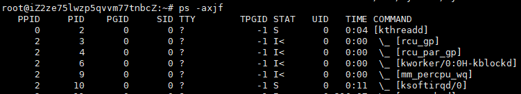
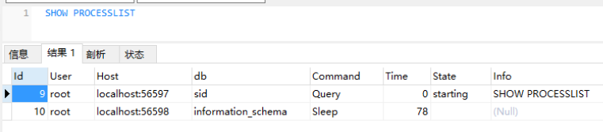
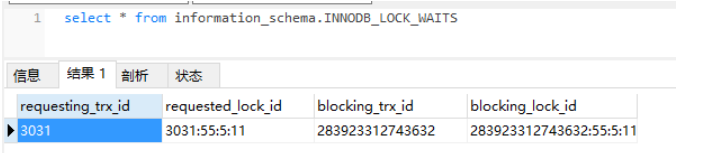
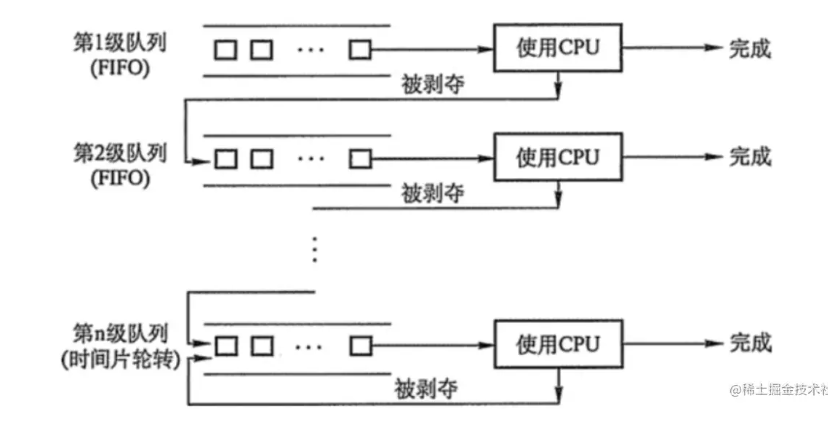

# Linux命令

## 常见的Linux命令（ps,ln,cat,top

- **ps**：用于报告当前系统的进程状态（运行的状态、进程是否结束，有没有僵死，哪些进程占用了过多的资源）

  ```
  -a：显示所有终端机下执行的程序
  -A：显示所有程序。
  -e：和"-A"效果相同
  -f：显示UID,PPIP,C与STIME栏位，也就是展示全部字段
  -u：显示进程的归属用户及内存使用情况
  -x: 显示所有程序，不以终端机来区分。
  -j:	显示进程归属的进程组id、会话id、父进程id
  f：以ascii的形式显示出进程的层次关系
  ```

  ps -aux：关注进程本身

  

  - VSZ：进程使用虚拟内存的大小
  - RSS：进程使用物理内存的大小
  - TTY：进程管理的终端
  - STAT：进程当前状态
    - -S：睡眠状态
    - -T：停止状态
    - -X：死掉的进程
    - -Z：僵尸进程
  - START：进程的运行时间
  - TIME：进程的启动时间
  - COMMAND：当前进程执行的是哪个程序

  ps -axjf：关注进程之间的关系

  

  - PPID：当前进程父进程的id
  - PGID：当前进程所在进程组ID
  - SID：进程所在会话ID
  - COMMAND：记录进程之间的层次关系（和上边不同）

- rm

  ​

### 常用的文件、目录命令

- ls ：⽤户查看⽬录下的⽂件， ls -a 可以⽤来查看隐藏⽂件， ls -l 可以⽤于查看⽂件的详细信息，包括权限、⼤⼩、所有者等信息。-d查看目录
- touch ：⽤于创建⽂件。如果⽂件不存在，则创建⼀个新的⽂件，如果⽂件已存在，则会修改⽂件的时间戳。
- cat ：cat是英⽂ concatenate 的缩写，⽤于查看⽂件内容。使⽤ cat 查看⽂件的话，不管⽂件的内容有多少，都会⼀次性显示，所以他不适合查看太⼤的⽂件。
- more ：more和cat有点区别，more⽤于分屏显示⽂件内容。可以⽤ 空格键 向下翻⻚， b 键向上翻⻚
- less ：和more类似，less⽤于分⾏显示
- tail ：可能是平时⽤的最多的命令了，查看⽇志⽂件基本靠他了。⼀般⽤户 tail -fn 100 xx.log 查看最后的100⾏内容

### 常用的权限命令

- chmod ：修改权限命令。⼀般⽤ + 号添加权限， - 号删除权限，  r 代表读取权限， w代表写⼊权限，x 代表执⾏权限，常⻅写法⽐如 chmod +x ⽂件名 添加执⾏权限。

  还有另外⼀种写法，使⽤数字来授权，因为 r =4， w =2， x =1，平时执⾏命令 chmod 777 ⽂件名 这就是最⾼权限了。第⼀个数字7=4+2+1代表着所有者的权限，第⼆个数字7代表所属组的权限，第三个数字代表其他⼈的权限。

### 常用的压缩命令

- zip ：压缩zip⽂件命令，⽐如 zip test.zip ⽂件 可以把⽂件压缩成zip⽂件，如果压缩⽬录的话则需添加 -r 选项。
- unzip ：与zip对应，解压zip⽂件命令。 unzip xxx.zip 直接解压，还可以通过 -d 选项指定解压⽬录。
- gzip ：⽤于压缩.gz后缀⽂件，gzip命令不能打包⽬录。需要注意的是直接使⽤ gzip ⽂件名 源⽂件会消失，如果要保留源⽂件，可以使⽤ gzip -c ⽂件名 > xx.gz ，解压缩直接使⽤ gzip -d xx.gz
- tar ：tar常⽤⼏个选项， -x 解打包， -c 打包， -f 指定压缩包⽂件名， -v 显示打包⽂件过程，⼀般常⽤ tar -cvf xx.tar ⽂件 来打包，解压则使⽤ tar -xvf xx.tar 。

Linux的打包和压缩是分开的操作，如果要打包并且压缩的话，按照前⾯的做法必须先⽤tar打包，然后再⽤gzip压缩。当然，还有更好的做法就是 -z 命令，打包并且压缩。使⽤命令 tar -zcvf xx.tar.gz ⽂件 来打包压缩，使⽤命令 tar -zxvf xx.tar.gz 来解压缩


## 文件操作

- touch：创建一个空文件，如果文件存在，则会更改文件的访问时间和修改时间

  ```
  touch file
  ```

- cp：用来复制文件和目录，同时借助某些选项还可以实现复制整个目录，以及对比两个文件的新旧予以升级等功能。

  cp [选项参数] fileSource1 fileSource2 目标文件夹

  cp -r 源文件夹 目标文件夹

  ```
  ## 将当前目录test/下所有文件复制到新目录newDir下
  cp -r test/ newDir
  ```

- mv：用来移动文件夹、文件或者修改文件名、目录名

  ```
  ## 修改文件名称
  mv test.txt test1.txt
  ## 将test/目录下的文件移到newDir下
  mv test/ newDir
  ```

- **rm**：用来删除一个文件或者目录

  rm  [options] fileName/filePath

  -i | 删除前逐一询问确认
  -f | 即使原档案属性设置为只读，也可强制删除，无需确认
  -r | 递归删除目录及其内容

  -d |删除空目录

  -v|输出帮助信息

  ```
  rm -rf test.txt
  ```

- 删除文件内容

  ```
  cat /dev/null > xxx.txt 
  ```

- mkdir：创建目录

  ```
  ## 确保目录名称存在，不存在就新建一个
  mkdir -p dirName
  ```

- tar：将各文件归档，具有打包和压缩功能，普通文件和文件夹可以被打包成 xxx.tar，如果要压缩，则是在打包之后再压缩，格式是 xxx.tar.gz

  ```
  tar [-cxtzjvfpPN] 文件与目录
  常用参数：描述
  -c ：建立一个压缩文件 
  -x ：解开一个压缩文件
  -t ：查看tarfile 里面的文件！特别注意，c/x/t 仅能存在一个，不可同时存在
  -z ：用 gzip 解压缩
  -j ：用 bzip2 解压缩
  -v ：压缩的过程中显示文件，这个常用，但不建议用
  -f ：使用档名，在 f 之后要立即接档名！例如使用『 tar -zcfv tfile sfile』就是错误的写法，要写成 『tar -zcvf tfile sfile』才对喔
  -p ：使用原文件的原来属性（属性不会依据使用者而变）
  -P ：（大写P）使用绝对路径来压缩
  ```

  ```
  ## 打包不压缩/home/temp目录
  tar -cf target.tar /home/temp
  ## 打包并压缩/home/temp目录
  tar -zcf target.tar.gz /home/temp
  ## 解压target.tar.gz
  tar -zxf target.tar.gz 
  ```

- jar：jar能够将多个源码、资源等文件打包并压缩到一个归档文件中。也支持更新、查看、提取。更重要的是，jar包可以按照各种java程序运行的约定去打包。

  ```
  ## 利用hello目录创建hello.jar包
  jar -cf hello.jar hello
  ## 将HelloWorld.java添加到hello.jar包中
  jar -uf hello.jar HelloWorld.java
  ## 解压hello.jar至当前目录
  jar -xf hello.jar
  ```

- **ln**：当我们需要在不同的目录，用到相同的文件时，又不想浪费空间复制相同的文件，可以用ln链接它，相当于创建一个快捷图标

  ```
  options 参数 | 描述
  -b | 删除，覆盖以前建立的链接
  -d | 允许超级用户制作目录的硬链接
  -f | 强制执行
  -i | 交互模式，文件存在则提示用户是否覆盖
  -n | 把符号链接视为一般目录
  -s | 软链接(符号链接)
  ```

  inode：inode是类Unix文件系统中用来描述文件系统对象（比如文件或文件夹）的一种数据结构。它存储着文件的各种属性（最近一次inode变动的时间、最近一次访问的时间、最近一次修改的时间等元信息，以及权限信息等）。文件夹是一组inode，包括自身的入口、父节点的入口以及所有子节点。

  **硬链接**：通过创建硬链接的命令让**多个文件名指向同一个inode**，但只能对已存在的文件进行创建，不能对目录进行创建硬链接，不能在不同的文件系统之间做硬链接。

  1.可以防止重要的文件被误删。创建硬链接后链接数为2，每次使用rm命令会使链接数减1，也就是链接数变成1，当链接数变成0时，系统才会释放掉这个inode。

  2.可以对文件实现文件共享，每个人都可以修改这个共享文件

  ```
  ln test.txt test_hard.txt
  ```

  

  **软链接**：相当于windows系统中桌面快捷方式，会创建新的inode结点并指向源文件。可以对目录进行链接，也可以跨文件系统创建软链接。

  

  **对比：**

  

  ​


## 文件查找

- whereis：显示命令路径以及命令相关的帮助文件路径

  -b:查找可执行文件，-m:查找帮助文件，-s:查找源代码文件

  ```
  whereis pwd #查找pwd命令的相关文件
  whereis -m pwd #查找pwd命令的帮助文件
  ```

- locate：从linux内置的索引数据库/var/lib/mlocate/mlocate.db查找文件，查询速度超快

  - -i：忽略大小写
  - -l：仅输出几行的意思，例如输出5行则是-l 5；
  - -r :后面可接正则表达式的显示方式
  - -c：不输出文件名，仅计算找到的文件数量；

  ```
  locate pwd # 查找pwd命令相关的所有文件
  locate /etc/sh # 查找etc目录下以sh开头的文件
  locate -c /etc/sh #查找etc目录下以sh开头的文件数
  locate -l 4 passwd # 是输出前4行
  ```

- **find**:从文件系统中进行搜索，默认从根目录搜索，速度很慢，一般是搜索指定目录下符合条件的文件。

  - -name：按照名称查找
  - -type：安装文件类型查找（“f”标识文件，"d"表示文件夹）
  - -size：根据大小查找
  - -perm：根据权限查找
  - -mtime：根据修改时间查找
  - -atime：根据访问时间查找
  - ctime：根据创建时间查找

  ```
  find ./ -name test.sh # 查看当前目录下名为test.sh的文件
  find ./ -name '*.sh' # 查找当前目录下后缀为sh的文件。
  find ./ -name '*aa*' #查找文件名有aa的文件
  find /etc -type f # 查找etc目录下的所有文件
  find /etc -type d # 查找etc目录下的所有文件夹
  find /home -size 10M #  查找home目录下等于10M的文件
  find /home -size +10M # 查找home目录下大于10M的文件
  find /home -size +5M -size -10M # 查找home目录下大于5M小于10M的文件
  find /home -perm 777 # 查找home目录下权限为777的文件或目录
  find / -mtime -3 #查找3天内修改过的文件
  find / -atime -3 #查找3天内访问过的文件
  ```

总结，这三个命令都是查找文件的，`whereis`及`locate`都是基于系统内建的数据库进行搜索，因此效率很高，而find则是遍历硬盘查找真实的文件，所以资源消耗比较大，速度慢。查找一般文件优先使用`whereis`和`locate`，两个都搜索不到或者需要使用更多条件搜索再使用find。

## 查看时间

- 查看时间和日期

  ```
  date
  ```

- 设置时间和日期

  ```
  例如：将系统日期设定成2009年11月3日的命令
  命令 ： "date -s 11/03/2009"
  将系统时间设定成下午5点55分55秒的命令
  命令 ： "date -s 17:55:55"
  ```

- 将当前时间和日期写入BIOS，避免重启后失效

  ```
  hwclock -w
  ```

  注：cal不加参数可以直接看到本月月历

## 日志查找

- 查找关键日志的行号

  ```
  cat -n test.log | grep "debug"
  ```

- 查询92行之后的日志

  ```
  cat -n test.log | tail -n +92  //-92为显示末尾92行
  ```

- 查询前20行的日志

  ```
  cat -n test.log | head -n +20
  ```

- **实时监控后100行日志**

  ```
  tail -100f test.log
  ```

- 查找日志中指定内容

  ```
  1.vim test.log
  2.进入命令模式，输入"/"+查找的内容,按enter键查找
  3.然后按"n"查找下一个
  4.用esc退出查找模式，用：wq！或者：q！保存退出或者不保存退出
  ```

- 用nohup后台启动生成日志时，nohup.txt会越来越大，需要进行分割。


## 查看端口

- 查看3306端口的使用情况

  ```
  netstat -anp | grep 3306 查看3306端口的使用情况
  ```

- 查看一个服务有几个端口，比如Mysqld

  ```
  ps -ef | grep mysqld
  ```

- 查看3306端口的连接数量

  ```
  netstat -pnt | grep 3306 | wc
  ```

- 用于查看端口对应的应用程序(ps和netstat的结合),lsof(list open files)是一个列出当前系统打开文件的工具。在linux环境下，任何事物都以文件的形式存在，通过文件不仅仅可以访问常规数据，还可以访问网络连接和硬件。

  COMMAND：进程的名称

  PID：进程标识符

  USER：进程所有者

  FD：文件描述符，应用程序通过文件描述符识别该文件。如cwd、txt等 TYPE：文件类型，如DIR、REG等

  DEVICE：指定磁盘的名称

  SIZE：文件的大小

  NODE：索引节点(文件在磁盘上的标识)

  NAME：打开文件的确切名称

  ```
  lsof -i : 8000
  ```

- 仅显示TCP连接

  ```
  lsof -i tcp
  ```


## 进程操作

- 查看进程（a代表all，x会显示没有控制终端的进程）

  ```
  ps -ax | less
  ```

- 按照cpu或内存用量来筛选

  ```
  ps -aux | less
  ```

- 按照cpu使用率来升序排序

  ```
  ps -aux --sort -pcpu | less      -pmem
  ```

- 根据用户来筛选

  ```
  ps -u 'xiebaoming'
  ```

- 查找名称getty的进程

  ```
  ps -C getty
  ```

- 进程树

  ```
  pstree
  ```

- 前台进程：ctrl+c（kill -2）

  后台进程：kill

  执行一个kill命令，实际是发送一个信号给系统，让它去结束掉一些不正常的应用进程，可以使用kill -l查看所有信号列表。

  ```
  //默认选项，可以用一段时间来正常关闭，一般会先保存进度再释放资源，然后再停止。
  kill -15 pid
  //强制进程立即停止运行
  kill -9 pid
  ```


## 查看内存

- 展示内存

  ```
  free -h
  ```

- 查看/proc/meminfo文件

  ```
  cat /proc/meminfo
  ```

- 对内存情况进行统计

  ```
  vmstat -s
  ```

- **top**：一般用来查看系统负载、CPU利用分布情况、内存使用、每个进程的内容使用情况，使用用来监控物理内存的使用情况

  -P：以CPU的使用资源排序显示

  

  **第一部分是**前5行，是系统整体的统计信息：

  第一行：

  - top：当前时间
  - up：机器运行了多长时间
  - users：当前登录用户数
  - load average：系统负载，即任务队列的平均长度。三个数值分别为 1分钟、5分钟、15分钟前到现在的平均值。

  第二行：

  - Tasks：当前有多少进程
  - running：正在运行的进程数
  - sleeping：正在休眠的进程数
  - stopped：停止的进程数
  - zombie：僵尸进程数

  第三行：关于cpu的百分比信息

  第四第五行分别是内存信息和swap信息

  **第二部分**是进程信息：

  ```
  PID  	进程id
  USER	进程所有者的用户名
  PR	   	优先级
  NI		nice值，负值表示高优先级，正值表示低优先级
  VIRT	进程使用的虚拟内存总量，单位kb。VIRT=SWAP+RES
  RES		进程使用的、未被换出的物理内存大小，单位kb。RES=CODE+DATA
  SHR		共享内存大小，单位kb
  S		进程状态。D=不可中断的睡眠状态 R=运行 S=睡眠 T=跟踪/停止 Z=僵尸进程
  %CPU	上次更新到现在的CPU时间占用百分比
  %MEM	进程使用的物理内存百分比
  TIME+	进程使用的CPU时间总计，单位1/100秒
  COMMAND	命令名/命令行
  ```

  注：运行时输入“1”可以监控cpu的状况，u+用户名查看相应的用户进程，默认以k显示内存大小，可以通过“E"切换显示单位为MB


## 查看磁盘

> [掘金](https://juejin.cn/post/6924637872716775432)

- 查看磁盘已占用空间，还剩余空间

  > disk-free，文件系统磁盘块分配情况，包括总块数、剩余块数等。
  >
  > 注：df是读取每个分区的superblock来获取空闲数据块、已使用数据块，从而计算出空闲空间和已使用空间，因此df统计的速度极快。而且当某个文件系统下挂载了其他分区，df不会把这个分区也统计进去。

  ```
  df -h（否则默认显示单位是字节，不直观）
  ```

  

  显示内容参数说明：

  1）Filesystem：文件系统

  2）Size： 分区大小

  3）Used： 已使用容量

  4）Avail： 还可以使用的容量

  5）Use%： 已用百分比

  6）Mounted on： 挂载点　

  相关命令：

  1）df -hl：查看磁盘剩余空间

  2）df -h：查看每个根路径的分区大小

  ​

- 查看**当前目录**的总大小，显示磁盘空间的使用情况

  > disk-useage，将指定文件系统中所有的目录、符号链接和文件使用的块数累加，即该文件系统使用的总块数；
  >
  > 注：du是通过stat命令来统计每个文件(包括子目录)的空间占用总和。因为会对每个涉及到的文件使用stat命令，所以速度较慢。如果统计目录下挂载了其他文件系统，那么也会对这个文件系统进行统计。
  >
  > du的结果比df统计的结果大，因为将某个分区挂载到了/mnt目录下。

  ```
  du -sh #查看当前目录的大小
  du 文件名 #查看指定文件所占空间
  du -h  目录名 #查看指定文件夹下的所有文件大小（包含子文件夹）
  ```

- 显示文件/目录或文件系统的大小和其他统计信息

  ```
  stat file
  ```

- 查看机器所挂硬盘个数及分区情况

  ```
  fdisk -l
  ```

  

##  网络相关

- 查看网络路由跳转

  ```
  traceroute www.baidu.com  (ping)
  ```

- 查看路由表

  ```
  route -n  (netstat -rn)
  ```

- 删除网络网关

  ```
  route del default gw 192.168.0.1
  ```

- 添加网络网关

  ```
  route add default gw 192.168.0.1
  ```

- 查看ip

  ```
  ipconfig
  ```

  ​


## 故障排查相关

> [csdn](https://blog.csdn.net/jy02268879/article/details/108753273?ops_request_misc=&request_id=&biz_id=102&utm_term=mysql%E6%8E%92%E6%9F%A5%E9%97%AE%E9%A2%98%E6%80%9D%E8%B7%AF&utm_medium=distribute.pc_search_result.none-task-blog-2~all~sobaiduweb~default-1-108753273.142^v7^article_score_rank,157^v4^control&spm=1018.2226.3001.4187)

- 查看数据库配置的最大连接数

  ```
  show VARIABLES like 'max_connections'
  ```

  

- 查看当前数据库运行的所有线程、命令、状态、耗时、SQL

  ```
  SHOW PROCESSLIST
  ```

  

- 查看当前运行的所有事务

  ```
  select * from information_schema.INNODB_TRX
  ```

  

- 查看当前出现的锁

  ```
  select * from information_schema.INNODB_LOCKS
  ```

  

- 查看锁等待的对应关系

  ```
  select * from information_schema.INNODB_LOCK_WAITS
  ```

  

- 查看Innodb状态

  ```
  SHOW ENGINE INNODB STATUS
  ```

  

  通过上述手段，我们可以拿到死锁日志，该日志会列出死锁发生的时间，死锁相关的事务，并显示出两个事务(可惜，多事务发生死锁时，也只显示两个事务)在**发生死锁时执行的 SQL 语句、持有或等待的锁信息和最终回滚的事务**。


## 抓包

tcp dump host 100.100.100.100

## linux连接外部

- linux连接redis

  ```
  1、进入redis文件下的bin目录下：cd /usr/local/redis/bin/
  2、执行 ./redis-cli
  ```

- linux连接mysql

  ```
  1、进入数据库：mysql -u root -p
  2、启动mysql服务： service mysql start   
  ```

  ​

## 排查cpu

**cpu负载：**特点时间间隔内运行队列中的平均线程数，平均单核负载小于0.7。假设现在服务器是2个CPU，每个CPU2个核，那么总负载不超过4都没什么问题。

**cpu利用率：**和负载不同，CPU利⽤率指的是当前正在运⾏的进程实时占⽤CPU的百分比，他是对⼀段时间内CPU使用状况的统计。

**情景**

- cpu负载很高，利用率却很低

  说明处于等待状态的任务很多，负载越⾼，代表可能很多僵死的进程。通常这种情况是IO密集型的任务，⼤量请求在请求相同的IO，导致任务队列堆积。

- 负载很低，利用率却很高

  这表示CPU的任务并不多，但是任务执⾏的时间很⻓，⼤概率就是你写的代码本身有问题，通常是计算密集型任务，⽣成了⼤量耗时短的计算任务

**cpu使用率达到100%，怎么排查？**

1.通过 top 找到占⽤率⾼的进程。


2.通过 top -Hp pid 找到占⽤CPU⾼的线程ID。这⾥找到958的线程ID


3.再把线程ID转化为16进制， printf "0x%x\n" 958 ，得到线程ID 0x3be


4.通过命令 jstack 163 | grep '0x3be' -C5 **--color** 或者 jstack 163|vim +/0x3be - 找到有问题的代码


## grep正则表达式

grep -[acinv]   '搜索内容串'   filename   (搜索内容串可以是正则)

-a 以文本文件方式搜索
-c 计算找到的符合行的次数
-i 忽略大小写
-n 顺便输出行号
-v 反向选择，即显示不包含匹配文本的所有行

-o 只输出匹配到的

-r 文件递归的方式

-l 只列出包含字符串的文件名称


实例：

- grep -rl xie ./  只列出文件中包含xie字符串的文件名字


- grep -c "48" test.txt 统计所有含有“48”字符的行数（不是次数）
- grep -i "May" test.txt 不区分大小写查找“May”所有的行
- grep -n "48" test.txt 显示行号；显示匹配字符“48”的行及行号，相同于 nl test.txt |grep 48）
- grep -v "48" test.txt 显示输出没有字符“48”所有的行
- grep -n "471" test.txt 显示输出字符“471”所在的行）
- grep -v "^ [ ^48]" test.txt 显示输出行首不是字符“48”的行）
- grep "a \ {2 \ }" test.txt 含有2个连续a字符的行
- grep -n "^$" test.txt 显示输出空行的行号
- [^ x]i 表示i前没有x， '^[ ^ a-zA-Z]' 表示不是英文开头的行

```
 ' ' （单引号）：所见即所得，回将里面的内容原封不动的展示出来；
 " "（双引号）：和单引号类似，但里面的特殊符号会被解析， 比如$ ``(反引号) $ 都是特殊符号；
 ` `（反引号）：反引号内的内容将优先执行，优先执行里面的命令，并将结果保留下来；
 （无引号） ：和双引号类似，但此时支持通配符（| ｛｝*）。
```

## vim查找和替换

- vim查找

  /后跟查找的字符串。显示文本中第一个出现的字符串。

  ?后跟查找的字符串。显示文本中最后一个出现的字符串。

  按回车后，vim会高亮所有的匹配内容

  按n键转到下一个匹配，按N键转到上一个匹配。

  命令模式下输入“/字符串”，例如“/cpu”

- vim替换

  [range] s / 目标字符串 / 替换字符串 / [option]

  range表示搜索范围，默认表示当前行：

  - 1,10表示从第一行到第10行
  - %表示整个文件（相当于1，$）
  - 而. , $代表从当前行到本文件末尾


  option表示操作类型，默认只对第一个匹配的字符进行替换

  - g表示全局替换
  - c表示操作时需要确认
  - i表示不区分大小写

  替换当前行第一个源字符串为目的字符串:

  ```
s/源字符串/目的字符串/  
  ```

  替换当前行所有源字符串为目的字符串：

  ```
s/源字符串/目的字符串/g 
  ```

  第 1 行到最后一行中，每一行所有源字符串为目的字符串：

  ```
1,$s/源字符串/目的字符串/g 
  ```

  

vim 共分为三种模式，分别是命令模式（Command mode），输入模式（Insert mode）和底线命令模式

## 面试考察

- 查找所有含有xxx的进程，并把所有的进程杀死

  

  awk的作用是输出某一列，{print $2}就是输出第二列，如上即是pid这一列，单引号是为了防止被解析。反引号会优先执行，并将结果保存下来。‘

-  一个文件中有三列

  1 2 3

  4 5 6

  7 8 9

  输出第三列数据

  ```
  cat test.txt | awk '{print $2}'   #逐行打印第2列
  ```

  扩展：

  free | awk '{print NR}'			#输出行号

  free | awk '{print NF}'			#输出每行数据的列数

  awk '{print $NF}' /tmp/hosts	#打印每行数据的最后一列

  awk '{print $(NF-1)}' /tmp/hosts	#打印每行倒数第二列

  进阶：

  ```
  awk '{for(i=1;i<=NF;i++)print $i }' xxx.txt | grep aa | wc -l  #查找这个文件中aa字符出现个次数
  ```

- 替换文件中所有的aaa替换为bbb

  vim中：第一行起，$表示最后，g表示每行的全部字符

  ```
  :1,$s/aaa/bbb/g 
  ```

  如果要将当前目录全部进行替换：

  ```
  sed -i "s/aaa/bbb/g" `grep aaa -rl ./`
  ```

  后半部分递归查找出所有含有aaa的文件名称，用sed替换， **-i 直接在源文件上处理**

  ​

# 操作系统

## 一、操作系统基础

### 什么是操作系统？

操作系统本质上是一个运行在计算机上的软件程序 ，用于管理计算机硬件和软件资源，屏蔽了硬件层的复杂性，使应用软件和硬件进行分离，让我们无需关注硬件的实现，把关注点更多放在软件应用上。

操作系统的内核（Kernel）是操作系统的核心部分，它负责系统的存储管理，CPU管理，进程管理，文件管理、设备管理等。 内核是连接应用程序和硬件的桥梁，决定着系统的性能和稳定性。


### 用户态和内核态

根据进程访问资源的特点，我们可以把进程在系统上的运行分为两个级别：

1. **用户态**: 只能执行那些受限级别的代码。
2. **内核态**:可以执行一切特权代码，内核态级别的资源有关的操作有存储管理，进程管理，文件管理等。

### **用户态切换到内核态的3种方式：**

- **系统调用**

用户态进程通过系统调用申请使用操作系统提供的服务程序完成工作，比如fork()方法，实际上就是执行了一个创建新进程的系统调用（read、write也是）。而系统调用的核心是使用了操作系统为用户态提供的中断来实现，例如Linux的int 80h中断。

> 这些系统调用按功能大致可分为如下几类：
>
> - 设备管理。完成设备的请求或释放，以及设备启动等功能。
> - 文件管理。完成文件的读、写、创建及删除等功能。
> - 进程控制。完成进程的创建、撤销、阻塞及唤醒等功能。
> - 进程通信。完成进程之间的消息传递或信号传递等功能。
> - 内存管理。完成内存的分配、回收以及获取作业占用内存区大小及地址等功能。

- **异常** 

当CPU在执行运行在用户态下的程序时，发生了某些不可预估的异常，这时会触发由当前运行进程切换到处理此异常的内核相关程序中，也就转到了内核态，比如缺页异常。

- **外围设备的中断** 

当外围设备完成用户请求的操作后，会向CPU发出相应的中断信号，这时CPU会暂停执行下一条即将要执行的指令转而去执行与中断信号对应的中断处理程序，如果先前执行的指令是用户态下的程序，那么这个转换的过程自然也就发生了由用户态到内核态的切换。比如硬盘读写操作完成，系统会切换到硬盘读写的中断处理程序中执行后续操作等。

> 软中断由当前正在运行的进程产生，并不会直接中断CPU，只会中断调用代码的流程，通常是请求内核帮忙完成I/O请求。比如系统调用中，cpu被软中断打断后，执行中断向量对应的中断处理函数，这时便进入了内核态
>
> 硬中断是由硬件产生的，硬中断的处理流程如下：
>
> - 1、**外设** 将中断请求发送给中断控制器；
> - 2、**中断控制器** 根据中断优先级，有序地将中断传递给 CPU；
> - 3、**CPU** 终止执行当前程序流，将 CPU 所有寄存器的数值保存到栈中；
> - 4、**CPU** 根据中断向量，从中断向量表中查找中断处理程序的入口地址，执行中断处理程序；
> - 5、**CPU** 恢复寄存器中的数值，返回原程序流停止位置继续执行。

CPU是怎么知道目前所处于的状态呢？这就要靠PSW (Program Status Word)寄存器里的值来辨别。这三种状态切换本质都是走了中断处理流程。至于从内核态切换到用户态则是通过设置PSW字段来进行转换。


#### 系统调用的实现

> [系统调用的实现](https://juejin.cn/post/6963638993913118750)

- 调用用户接口函数，用户接口函数封装的是系统调用的库函数

  ```
  int getpid(){
      return _syscall0(SYS_getpid);
  }
  ```

- 因为内核实现了多种不同的系统调用，为了区别他们，进程必须传递一个系统调用号的参数来识别所需的系统调用。EAX寄存器是负责传递系统调用号的。处理中断前要先保存cpu上下文，然后库函数中传入参数，以及int 80h，然后执行int指令触发软中断，中断向量号为Ox80

  （int n 就相当于发生了一个n号中断，属于软中断）

  > cpu寄存器里原来用户态的指令位置，需要先保存起来。接着，为了执行内核态代码，CPU寄存器需要更新为内核态指令的新位置。最后才是跳转到内核态运行内核任务。

- cpu被软中断打断后，执行中断向量对应的中断处理函数，这时便进入了内核态

- 进入内核态后，系统调用处理函数根据传递的系统调用号来调用对应的系统调用服务例程，这期间会保存所有的寄存器

- 最后就是将执行结果返回，从eax寄存器获得系统调用的返回值，并把这个返回值保存到用户态的的eax寄存器处即可


#### CPU上下文切换

cpu上下文切换会先把前一个任务的cpu上下文，也就是cpu寄存器和程序计数器保存起来，然后加载新任务的上下文到到这些cpu寄存器和程序计数器，最后再跳转到程序计数器所指的新位置，运行新任务。

### 进程切换和线程切换

- 每个进程都有自己私有的连续虚拟地址空间，进程内的所有线程共享进程的虚拟地址空间。所以进程切换涉及虚拟地址空间的切换而线程不会。
- 每个进程都有自己的页表，那么当进程切换后页表也要进行切换，页表切换后TLB就失效了，cache失效导致命中率降低，那么虚拟地址转换为物理地址就会变慢，表现出来的就是进程切换后程序运行会变慢，而线程切换则不会导致TLB失效，因为线程无需切换地址空间，因此我们通常说线程切换要比较进程切换快，原因就在这里。

### 传统IO执行流程

传统的IO流程，包括read和write的过程。

- read：把数据从磁盘读取到内核缓冲区，再拷贝到用户缓冲区
- write：先把数据写入到socket缓冲区，最后写入网卡设备。


- 用户应用进程调用read函数，向操作系统发起IO调用，**进程从用户态转为内核态（切换1）**
- DMA控制器把数据从磁盘中，读取到内核缓冲区。
- CPU把内核缓冲区数据，拷贝到用户应用缓冲区，**进程从内核态转为用户态（切换2）**，read函数返回
- 用户应用进程通过write函数，发起IO调用，**上下文从用户态转为内核态（切换3）**
- CPU将应用缓冲区中的数据，拷贝到socket缓冲区
- DMA控制器把数据从socket缓冲区，拷贝到网卡设备，**上下文从内核态切换回用户态（切换4）**，write函数返回

### **DMA技术**

> Direct Memory Access，即直接内存访问

**DMA**本质上是一块主板上独立的芯片，允许磁盘和内存存储器之间直接进行IO数据传输，其过程**不需要CPU的参与**。主要是**帮忙CPU转发一下IO请求，以及拷贝数据**。提高了CPU的利用效率。

### 零拷贝？？？？mmap

零拷贝并不是没有拷贝数据，而是减少用户态与内核态之间的切换次数以及CPU拷贝的次数。零拷贝实现有多种方式，分别是

- mmap+write
- sendfile
- 带有DMA收集拷贝功能的sendfile

**mmap+write**

`mmap`主要实现方式是将内核空间中的读缓冲区的地址和用户空间的用户缓冲区的地址进行映射，让内核的读缓冲区和用户空间的应用缓冲区共享，从而减少了从读缓冲区到用户缓冲区的一次CPU拷贝。


**sendfile**

sendfile()是一个专门用来发送文件的系统函数

```
#include <sys/socket.h>
ssize_t sendfile(int out_fd, int in_fd, off_t *offset, size_t count);
复制代码
```

它有4个参数

- **int out_fd** ：目的端的文件描述符
- **int in_fd** ：源端的文件描述符
- **off_t offset* ：源端的偏移量
- **size_t count** : 复制数据的长度

返回值为实际复制数据的长度，有了 `sendfile()` 之后，发送数据不在需要 I、O 这两步操作了，直接一个系统调用就搞定，节省了一次系统调用，两次**上下文切换**

原理是因为sendfile（）是发送数据，使用不需要拷贝到内存缓存区，但缺陷是无法对发送的数据做一些操作，比如修改、压缩等。只适用于发送数据且不需要修改的场景。

**带有DMA收集拷贝功能的sendfile**

将sendfile中的1次CPU拷贝也交给了DMA处理，一项新技术。


### 文件描述符

一个 Linux 进程启动后，会在内核空间中创建一个 PCB 进程控制块，PCB 内部有一个文件描述符表（File descriptor table），记录着当前进程所有可用的文件描述符，也就是当前进程所有打开的文件，文件描述符是正整数，可以理解为该表的下标。

除此之外，系统还维护着所有线程共享的打开文件表和i-node节点表。通过文件描述符上的文件指针可以访问到打开文件表，该表存储着：

- 文件内部指针偏移量。调用 read() 或者 write() 函数时，文件偏移量会自动更新。
- 状态标志，比如只读模式、读写模式、追加模式、覆盖模式等。
- i-node 表指针。可以通过这个表指针访问到i-node节点表，该表有具体的文件信息比如文件类型、文件大小、时间戳、文件锁等。


> 进程A中，文件描述符1和20都指向了同一个打开的文件句柄可能是该进程多次对执行打开操作。
>
> 进程A中的文件描述符2和进程B的文件描述符2都指向了同一个打开的文件句柄，大概率是父子进程。

### Unix网络编程模型

> [Unix网络模型](https://juejin.cn/post/7076364933184618526)


#### 阻塞式IO（Blocking IO）

在阻塞式IO下，应用进程调用网络编程接受函数recvfrom进行系统调用，这期间应用进程会一直阻塞，直到系统调用返回数据包且被复制到应用进程的缓存区中或者发生错误。阻塞式I/O分为如下两个阶段：

- 阶段 1：等待数据就绪。网络 I/O 的情况就是等待远端数据陆续抵达；磁盘 I/O 的情况就是等待磁盘数据从磁盘上读取到内核缓存区中。
- 阶段 2：数据拷贝。内核负责把内核缓存区中的数据拷贝到用户缓存区中。


#### 非阻塞I/O（NIO）

在非阻塞I/O下，应用进程将不断进行系统调用，当内核无数据包准备好时，不会将线程阻塞，而是返回一个错误，应用进程收到后，可以干点别的事情，然后再继续发起请求，这样应用进程就不会阻塞。这种循环直到应用进程等到了数据，从内核缓存区拷贝到用户缓存区为止。

但是这种方法需要不断地轮询、重复请求，消耗了大量的 CPU 的资源。


#### IO多路复用

IO多路复用是一种同步IO模型，实现一个线程可以监视多个文件句柄；一旦某个文件句柄就绪，就能够通知应用程序进行相应的读写操作；没有文件句柄就绪时会阻塞应用程序，占用cpu。多路是指网络连接，复用指的是同一个线程。

实现方式是应用进程采用单线程通过select/poll/epoll等系统调用获取文件描述符集合，然后遍历有事件的文件描述符来进行相应的读写操作，使其能支持更多的并发连接请求。


##### IO多路复用的三种方式	

- select

  

  ```
  // 返回值：做好准备的文件描述符的个数，超时为 0，错误为-1.
  #include <sys/select.h>
  #include <sys/time.h>

  #define FD_SETSIZE 1024
  #define NFDBITS (8 * sizeof(unsigned long))
  #define __FDSET_LONGS (FD_SETSIZE/NFDBITS)

  // 数据结构 (bitmap)
  typedef struct {
      unsigned long fds_bits[__FDSET_LONGS];
  } fd_set;

   // API
  int select(
    int max_fd, 
    fd_set *readset, 
    fd_set *writeset, 
    fd_set *exceptset, 
    struct timeval *timeout
    )   // 返回值就绪描述符的数目
    
    FD_ZERO(int fd, fd_set* fds)   // 清空集合
    FD_SET(int fd, fd_set* fds)    // 将给定的描述符加入集合
    FD_ISSET(int fd, fd_set* fds)  // 判断指定描述符是否在集合中 
    FD_CLR(int fd, fd_set* fds)    // 将给定的描述符从文件中删除
  ```

  通过select（）方法传递参数，参数有所关心的文件描述符和可以等待的最长时间。并传入文件描述符集合拷贝到内核空间。调用 select 方法后用户进程会阻塞，内核会遍历所有的文件描述符，没有发现就绪设备就挂起当前进程，直到有文件描述符就绪或者主动超时。被唤醒后内核通过遍历得到已经就绪的文件描述符个数，通过返回值告诉用户空间。**但是不会告诉用户空间具体是哪些事件就绪，需要用户空间自己去遍历文件描述符集合进行判断。**有了这些返回信息，用户空间可以调用合适的 I/O 函数（比如read 或 write)，并且这些函数不会再阻塞，这样就实现**用户可以在一个线程内同时处理多个 socket 的 IO 请求**。

  **select 具有 O(n) 的无差别轮询复杂度**，高并发时效率较低。 每次调用select，都需要把文件描述符集合从用户态拷贝到内核态，这个开销在文件描述符很多时会很大，而且单个进程所打开的文件描述符是有限制的，通过FD_SETSIZE设置，默认1024。


- POll

  poll本质和select没有区别，只是poll是基于链表来存储的，所有它没有最大连接数的限制。poll还有一个特点是采用了水平触发的通知策略，文件描述符就绪了会一直进行通知。

  - **水平触发**

    当关系描述符关联的读内核缓存区非空，有数据读取，就一直发出可读信号进行通知。当关系描述符关联的写内核缓存区不满，有空间写入，就一直发出可写信号进行通知。也就是fd变为就绪态会一直通知。

  - **边缘触发**

    和水平触发不同的是，边缘触发只有当读内核缓存区由空变为非空时才通知一次，或者是写内核缓存区由满变不满时通知一次，也就是**只在fd变为就绪态的时候通知一次**。

- epoll

  

  

  第一步，创建一个 epoll 句柄int epoll_create(int size);第二步，向内核添加、修改或删除要监控的文件描述符。int epoll_ctl(  int epfd, int op, int fd, struct epoll_event *event);第三步，类似发起了 select() 调用int epoll_wait(  int epfd, struct epoll_event *events, int max events, int timeout);

  epoll是select和poll的增强版，使用了**事件**的触发机制。在epoll中，内核保存一份完整的文件描述符集合，无需用户每次都重新传入，只需告诉内核修改的部分即可。而且也不再通过轮询的方式找到就绪的文件描述符，而是通过异步 IO 事件唤醒。每当有文件描述符就绪，就将就绪文件描述符放进就绪链表里面返回，时间复杂度为O（1），也就是说仅会将有 IO 事件的文件描述符返回给用户，用户也无需遍历整个文件描述符集合，大大提高了效率。

  > 应用场景
  >
  > - 连接数较少并且都很活跃,用select和poll效率更高
  > - 连接数较多并且都不很活跃,使用epoll效率更高


#### 异步I/O（AIO)

linux下的asynchronous IO其实用得很少。


用户进程发起读操作之后，立刻就可以开始去做其它的事。而另一方面，从内核的角度，当它受到一个异步的读操作之后，首先它会立刻返回，所以不会阻塞用户进程。然后，kernel会等待数据准备完成，然后将数据拷贝到用户内存，当这一切都完成之后，kernel会给用户进程发送一个信号，告诉它read操作完成了。

> 扩展：同步IO VS 异步IO

同步与异步同步和异步关注的是**消息通信机制**。

所谓同步，就是在发出一个调用时，在没有得到结果之前，该调用就不返回。但是一旦调用返回，就得到返回值了。换句话说，就是由调用者主动等待这个调用的结果。

而异步则是相反，调用在发出之后，这个调用就直接返回了，所以没有返回结果。换句话说，当一个异步过程调用发出后，调用者不会立刻得到结果。而是在调用发出后，被调用者通过状态、通知来通知调用者，或通过回调函数处理这个调用。


## 二 进程和线程

**父子进程的关系：**

1. 子进程可以继承父进程的所有资源，包括**打开的文件**、申请的缓存；
2. 当子进程被撤销时，需要将这些资源还给父进程；
3. 当父进程被撤销时，其所有子进程都需要撤销；父进程不能拒绝子进程的继承权；

**fork（）流程：**

- 父进程为子进程申请一个空白PCB进程控制块
- 向PCB中填写用于控制和管理进程的信息，包括分配给子进程唯一标识pid
- 为进程分配运行时所需要的资源，从父进程处共享资源，如打开的文件和当前工作目录等
- 最后将进程的状态切换为就绪状态并将其插入就绪队列中。
- 对子进程返回标识符0。因为子进程的父进程是可以唯一确定的，通过getppid方法可以获取到父进程id。
- 向父进程返回子进程的pid。因为父进程可以有多个子进程，也没有这样的函数可以获取该线程的子线程的所有id。

**僵尸进程：**

一个进程使用fork创建子进程，如果子进程退出，而父进程并没有调用wait()或者waitpid()获取子进程的状态信息，没有去回收释放子进程的资源。那么子进程的进程描述符仍然保存在系统中。这种进程称之为僵死进程。僵尸进程实际上是一个已经死掉的进程。（用ps可以看到子进程后有一个defunct，表示僵尸进程）

僵尸进程没有任何可执行代码，也不能被调度，仅仅在进程列表中保留一个位置，记载该进程的退出状态等信息供其他进程收集，除此之外，僵尸进程不再占有任何内存空间。

处理：

- 干掉父进程，让剩下的子进程成为孤儿进程由init进程来领养
- 父进程调用wait或waitpid让父进程挂起，子进程在终止后会立即把它在进程表中的数据返回给父进程。

**孤儿进程：**

一个父进程退出，而它的一个或多个子进程还在运行，那么那些子进程将成为孤儿进程。孤儿进程将被init进程(进程号为1)所收养，并由init进程对它们完成**状态收集**工作。

### 进程和线程的区别


**进程是程序的一次执行过程，是系统进行资源分配的最小单位**。程序段、数据、**PCB进程控制块**构成了进程实体。

比如当我们启动main函数时其实就是启动了一个 JVM 的进程，而 main 函数所在的线程就是JVM进程其中的一个线程，也称主线程。线程是一个比进程更小的执行单位，是cpu调度的最小单位，一个进程在其执行的过程中可以产生**多个线程**。

从操作系统角度讲，进程可以有父子进程，而线程没有。进程间的通信需要在内核中进行，而线程因为共享一份资源可以直接进行通信。每个进程都有自己私有的连续虚拟地址空间，进程内的所有线程共享进程的虚拟地址空间。所以进程切换涉及虚拟地址空间的切换而线程不会。

从java虚拟机的角度讲，同类的多个线程共享进程的**堆**和**方法区**资源，但每个线程有自己的**程序计数器**、**虚拟机栈**和**本地方法栈**，线程也被称为轻量级进程。

**协程是一种比线程更加轻量级的一种函数**。正如一个进程可以拥有多个线程一样，一个线程可以拥有多个协程，**多个协程的运行是串行的**。协程不是被操作系统内核所管理的，而是完全由程序所控制的，即在用户态执行，切换内存被保存在用自己的变量(用户栈或堆)中。 这样带来的好处是：性能有大幅度的提升，因为不会像线程切换那样消耗资源。

### 进程有哪几种状态

- **创建状态(new)** ：进程正在被创建，尚未到就绪状态。这时候干的事情有：由操作系统或者父进程申请一个空白的PCB进程控制块，并向PCB中填写用于控制和管理进程的信息，包括分配给子进程唯一标识pid。然后为进程分配运行时所需要的资源，最后将进程的状态切换为就绪状态并将其插入就绪队列中。
- **就绪状态(ready)** ：进程获得了除了处理器之外的一切所需资源，一旦得到处理器资源也就是时间片即可运行。
- **运行状态(running)** ：进程正在处理器上运行。
- **阻塞状态(waiting)** ：进程正在等待某一事件而暂停运行如等待某资源为可用或者等待 IO 操作完成。即使处理器空闲，该进程也不能运行。通常操作系统会将阻塞状态的进程排成一个队列。
- **结束状态(terminated)** ：进程正在从系统中消失。可能是进程正常结束或其他原因中断退出运行。要将PCB清零并将PCB空间返还给操作系统。

> 订正：下图中 running 状态被 interrupt 向 ready 状态转换的箭头方向反了。


### 进程间的通信方式加？？？？？？好好再背一遍

👨‍💻**面试官** ：**进程间的通信常见的的有哪几种方式呢?**

🙋 **我** ：大概有 7 种常见的进程间的通信方式。

> [进程间通信](https://www.jianshu.com/p/c1015f5ffa74)

1. **匿名管道(Pipes)** ：匿名管道是特殊类型的文件，用于具有亲缘关系的父子进程间或者兄弟进程之间的通信，管道是半双工的，数据只能向一个方向流动；需要双方通信时，需要建立起两个管道。写入的内容每次都添加在管道缓冲区的末尾，并且每次都是从缓冲区的头部读出数据。

   管道是一种最基本的进程间通信机制，由`pipe`函数创建：

   ```
   #include <unistd.h>
   int pipe(int filedes[2]);
   ```

   调用`pipe`函数时在内核中开辟一块缓冲区（称为管道）用于通信，它有一个读端一个写端，然后通过`filedes`参数传出给用户程序两个文件描述符，`filedes[0]`指向管道的读端，`filedes[1]`指向管道的写端。使用read()和write()系统调用读写数据其实是在读写内核缓冲区。`pipe`函数调用成功返回0，调用失败返回-1。

   ​

   

   > 流程：父进程先调用pipe函数创建管道，然后fork出子进程，子进程通过拷贝父进程的地址空间拿到管道描述符，从而可以读写。读写前父进程关闭fd[0]，子进程关闭fd[1]。
   >
   > 

2. **有名管道(Names Pipes)** : 有名管道严格遵循先进先出，以磁盘文件的方式存在，可以实现本机任意两个进程通信。

   > 管道特点：速度慢，容量有限

3. **信号(Signal)** ：信号是一种比较复杂的通信方式，用于通知接收进程某个事件已经发生。如果该进程当前并未处于执行状态，则该信号就由内核保存起来，直到该进程恢复执行并传递给它为止。

4. **消息队列(Message Queuing)** ：！！！

   > 我猜测电脑中复制黏贴的功能就是使用消息队列实现的。

   为了解决管道效率低下的问题，又提出了消息队列，消息队列是消息的链表,具有特定的格式,存放在内核中并由消息队列标识符标识。一个进程在将数据放进消息队列中就可以立即返回而无需等待另一个进程。消息队列可以实现消息的随机查询,消息不一定要以先进先出的次序读取,也可以按消息的类型读取。**消息队列克服了信号承载信息量少，管道只能承载无格式字节流以及缓冲区大小受限等缺点。**不过当进程发送的数据太大，并且两个进程之间的通信特别频繁时，拷贝时间会过长。

   > 特点：容量受到系统限制，且要注意第一次读的时候，要考虑上一次没有读完数据的问题。

5. **信号量(Semaphores)** ：信号量是一个计数器，用于多进程对共享数据的访问，信号量的意图在于进程间同步。这种通信方式主要用于解决与同步相关的问题并避免竞争条件。

   > 不能传递复杂消息，只能用来同步

6. **共享内存(Shared memory)** ！！！ ：共享内存使得多个进程可以访问同一块内存空间，不同进程可以及时看到其他进程中对共享内存中数据的改动。这种方式需要依靠某种同步操作，如互斥锁和信号量等。因为只需进行2次数据的拷贝，而且会一直保持共享区域，所以说这是效率最高的进程间通信方式。

   > 因为进程是直接对内存进行存取，所以是速度最快的通信方式。但要保持同步，比如一个进程在写的时候，另一个进程要注意读写的问题，相当于线程中的线程安全，当然，共享内存区同样可以用作线程间通讯，不过没这个必要，线程间本来就已经共享了一块内存的。

7. **套接字(Sockets)** : 此方法主要用于在客户端和服务器之间通过网络进行通信。套接字是支持 TCP/IP 的网络通信的基本操作单元，可以看做是不同主机之间的进程进行双向通信的端点，简单的说就是通信的两方的一种约定，用套接字中的相关函数来完成通信过程。

   ​

   ​

#### 共享内存的实现*

> [实现原理](https://juejin.cn/post/6844903855235268615)


共享内存是通过将不同进程的**虚拟内存地址**映射到相同的物理内存地址来实现。现代的cpu寻址使用的是虚拟寻址，使用虚拟寻址，cpu需要将虚拟地址翻译成物理地址，就可以访问到真实的物理内存。而虚拟内存为每个进程提供了一个连续完整的私有内存空间，不同进程的私有空间对应的虚拟地址映射到同一个物理内存地址就能实现内存的共享。

而实现进程虚拟内存地址与内存物理地址的映射采用的是**mmap方法**，mmap会将一个文件或者其它对象映射到进程的地址空间，实现文件磁盘地址和进程虚拟地址空间中的一一对映关系。

```
 void *mmap(void *addr, size_t length, int prot, int flags, int fd, off_t offset);
```

实现这样的映射关系后，进程就可以采用指针的方式读写操作这一段内存，而系统会自动回写脏页面(到对应的文件磁盘上),这样就完成了对文件的操作而不必再调用read,write等系统调用函数。

mmap适合对用一块内存频繁读写的情况，因为可以减少内存的拷贝次数，比如在read调用时，一个完整的流程是操作系统读磁盘文件到页缓存，再从页缓存将数据拷贝到read传递的buffer里，而如果使用mmap之后，操作系统只需要将磁盘读到页缓存，然后用户就可以直接通过指针的方式操作mmap映射的内存，减少了从内核态到用户态的数据拷贝次数，减少了系统调用的次数。


### 线程间的同步(通信)的方式

> 线程间的通信目的主要是用于线程同步，所以线程没有像进程通信中的用于数据交换的通信机制。

线程同步是两个或多个共享关键资源的线程的并发执行。应该同步线程以**避免**关键的资源使用冲突，让线程有次序的执行。操作系统一般有下面三种线程同步的方式：

1. **互斥信号量(Mutex)**：互斥信号量用于形成互斥关系，以同步他们的运行。为资源设置一个互斥信号量mutex，并设置初值为1，表示互斥对象只有一个，所以可以保证公共资源不会被多个线程同时访问。在进入临界区之间需要对mutex执行wait操作，若资源此刻为被访问则成功访问资源，否则会阻塞。等访问该资源的进程释放资源后，会对mutex执行signal操作，这样就实现了两个进程互斥。

2. **同步信号量(Semphares)** ：同步信号量用于相互制约和传递消息，以同步他们的运行。比如要让一段代码c1先与另一段代码c2执行，只需定义同步信号量，其初始值为0，在c1后面对信号量进行signal操作，在c2代码段前面对信号量进行wait操作。如果c1没执行的话信号量就一直是0，c2wait操作的时候就会阻塞。

3. **事件(Event)** :Wait/Notify：通过通知操作的方式来保持同步。

   ​

### 进程的调度算法

> 用于作业调度和进程调度

- **先到先服务(FCFS)调度算法** : 最简单的调度算法，系统按作业到达的前后顺序来进行调度，从就绪队列中选择一个最先进入该队列的进程为之分配cpu资源。

- **短作业优先(SJF)调度算法** : 系统按作业运行时间长短来进行调度，时间越短，其优先级越高越先执行，它会从就绪队列中选择预估运行时间最短的进程，并为之分配CPU运行。

- **时间片轮转调度算法（RR)** : 时间片轮转调度是一种最公平且使用最广的算法。每个进程被分配一个时间段，称作它的时间片，即该进程允许运行的时间。一个时间片内没有运行完成的进程将返回到就绪队列的队尾等待下一次调度。

- **优先级调度算法** ： 为每个流程分配优先级，首先执行具有最高优先级的进程，依此类推。具有相同优先级的进程以先来先服务FCFS方式执行。可以根据内存要求，时间要求或任何其他资源要求来确定优先级。

- **多级反馈队列调度算法** ：前面介绍的几种进程调度的算法都有一定的局限性。如**短进程优先的调度算法，仅照顾了短进程而忽略了长进程** 。多级反馈队列调度算法既能使高优先级的作业得到响应又能使短作业（进程）迅速完成。，因而它是目前**被公认的一种较好的进程调度算法**，UNIX 操作系统采取的便是这种调度算法。它设置了多个就绪队列，为每个队列赋予不同的优先级，第一个队列的优先级最高，第一个队列次之，以此类推。优先级越高的队列其时间片越小，每个队列都采用先来先服务调度算法。第一个队列空闲时，才调度第二个队列的任务。

  


## 三 操作系统内存管理基础

### 3.1 内存管理介绍

👨‍💻 **面试官**: **操作系统的内存管理主要是做什么？**

操作系统的内存管理主要负责内存的分配与回收（malloc 函数：申请内存，free 函数：释放内存），另外地址转换也就是将逻辑地址转换成相应的物理地址等功能也是操作系统内存管理做的事情。

### 3.2 常见的几种内存管理机制

👨‍💻 **面试官**: **操作系统的内存管理机制了解吗？内存管理有哪几种方式?**

内存管理分为**连续分配管理方式**和**非连续分配管理方式**这两种。连续分配管理方式是指为一个用户程序分配一个连续的内存空间，常见的如 **块式管理** 。同样地，非连续分配管理方式允许一个程序使用的内存分布在离散或者说不相邻的内存中，常见的如**页式管理** 和 **段式管理**和**段页式管理**。

1. **块式管理**是古老的的内存管理方式。将内存分为几个固定大小的块，每个块中只包含一个进程。如果程序运行需要内存的话，操作系统就分配给它一块，如果程序运行只需要很小的空间的话，分配的这块内存很大一部分被浪费了。这些在每个块中未被利用的空间，我们称之为碎片。

2. **页式管理**是把内存分为几个固定大小的页，页较小，相比于块式管理的划分力度更大，提高了内存利用率，减少了碎片。页式管理通过页表对应逻辑地址和物理地址。

3. **段式管理** ： 因为页式管理虽然提高了内存利用率，但是页式管理其中的页实际并无任何实际意义。 使用段式管理把内存分为几个固定大小的段，段是有实际意义的，每个段定义了一组逻辑信息，例如,有主程序段 MAIN、子程序段 X、数据段 D 及栈段 S 等。 段式管理通过段表对应逻辑地址和物理地址。

   简单来说：页是物理单位，段是逻辑单位。分页可以有效提高内存利用率，分段可以更好满足用户需求。

4. **段页式管理机制** 。段页式管理机制结合了段式管理和页式管理的优点。简单来说段页式管理机制就是把主存先分成若干段，每个段又分成若干页，也就是说 **段页式管理机制** 中段与段之间以及段的内部的都是离散的。

### 3.3 快表和多级页表

在分页内存管理中，很重要的两点是：

1. 虚拟地址到物理地址的转换要快。
2. 解决虚拟地址空间大，页表也会很大的问题。

#### 快表

为了解决虚拟地址到物理地址的转换速度，操作系统在 **页表方案** 基础之上引入了 **快表** 来加速虚拟地址到物理地址的转换。我们可以把快表理解为一种特殊的**高速缓冲存储器**（Cache），其中的内容是页表的一部分或者全部内容。作为页表的 Cache，它的作用与页表相似，但是提高了访问速率。由于采用页表做地址转换，读写内存数据时 CPU 要访问两次主存。有了快表，有时只要访问一次高速缓冲存储器，一次主存，这样可加速查找并提高指令执行速度。

使用快表之后的地址转换流程是这样的：

1. 根据虚拟地址中的页号查快表；
2. 如果该页在快表中，直接从快表中读取相应的物理地址；
3. 如果该页不在快表中，就访问内存中的页表，再从页表中得到物理地址，同时将页表中的该映射表项添加到快表中；
4. 当快表填满后，又要登记新页时，就按照一定的淘汰策略淘汰掉快表中的一个页。

#### 多级页表

引入多级页表的主要目的是为了避免把全部页表一直放在内存中占用过多空间，特别是那些根本就不需要的页表就不需要保留在内存中。多级页表属于时间换空间的典型场景，当某个一级页表的页表项没有被用到，也就不需要创建这个页表项的二级页表了，节省了空间。

>  不论是快表还是多级页表实际上都利用到了程序的局部性原理。

### 3.4 分页机制和分段机制的共同点和区别

1. 共同点：


   - 分页机制和分段机制都是为了提高内存利用率，减少内存碎片。
   - 页和段都是离散存储的，允许一个程序使用的内存分布在离散或者说不相邻的内存中。但是，每个页和段中的内存是连续的。

2. 区别：


   - 页的大小是固定的，由操作系统决定，在每个系统中只有一种大小的页面；而段的大小不固定，取决于我们当前运行的程序。
   - 分页仅仅是为了满足操作系统内存管理的需求，而段是逻辑信息的单位，在程序中可以体现为代码段，数据段，能够更好满足用户的需要。


## 四 虚拟内存

### 虚拟内存！！！

**什么是虚拟内存(Virtual Memory)?**

在我们平时使用电脑时，很多时候我们点开了很多占内存的软件，这些软件占用的内存可能已经远远超出了我们电脑本身具有的物理内存。 这正是因为 **虚拟内存** 的存在，通过 **虚拟内存** 可以把内存扩展到硬盘空间,让程序可以拥有远远大于系统物理内存大小的可用内存空间。

基于**局部性原理**，在程序装入时，可以将程序的一部分装入内存，而将其他部分留在外存，就可以启动程序执行。在程序执行过程中，当所访问的信息不在内存时，由操作系统将所需要的部分调入内存，然后继续执行程序。另一方面，操作系统将内存中暂时不使用的内容换到外存上，从而腾出空间存放将要调入内存的信息。这样，计算机好像为用户提供了一个比实际内存大的多的存储器——**虚拟存储器**。

实际上，我觉得虚拟内存同样是一种时间换空间的策略，你用 CPU 的计算时间，页的调入调出花费的时间，换来了一个虚拟的更大的空间来支持程序的运行。

> 使用了虚拟内存，就可以主存看作为cpu和在硬盘上的虚拟地址空间之间的高速缓存，并且只在主存中缓存活动区域（按需缓存）。

### 局部性原理

局部性原理是虚拟内存技术的基础，正是因为程序运行具有局部性原理，才可以只装入部分程序到内存就开始运行。

局部性原理表现在以下两个方面：

1. **时间局部性原理** ：一个被访问过的内存地址在之后会有很大几率被再次访问（由于在程序中存在着大量的循环操作）。
2. **空间局部性原理** ：一个被访问过的内存地址以及其周边的内存地址都会有很大几率被再次访问（因为指令通常是顺序存放、顺序执行的，数据也一般是以向量、数组、表等形式簇聚存储的）。

如果一个程序没有良好的局部性，将会使工作集的大小不断膨胀，直至超过物理内存的大小，这时程序会产生一种叫做抖动（thrashing）的状态，页面会不断地换入换出，如此多次的读写硬盘开销，性能自然会十分“恐怖”。**所以，想要编写出性能高效的程序，首先要保证程序的时间局部性与空间局部性。**


### 虚拟内存的技术实现

🙋 **我** ：**虚拟内存的实现需要建立在离散分配的内存管理方式的基础上。** 虚拟内存有以下三种实现方式：

1. **请求分页存储管理** ：建立在分页管理之上，为了支持虚拟存储器功能而增加了**请求调页功能**和**页面置换功能**。请求分页是目前最常用的一种实现虚拟存储器的方法。请求分页存储管理系统中，在作业开始运行之前，仅装入当前要执行的部分段即可运行。假如在作业运行的过程中发现要访问的页面不在内存，则由处理器通知操作系统按照对应的页面置换算法将相应的页面调入到主存，同时操作系统也可以将暂时不用的页面置换到外存中。

   在请求分页系统中，每当所要访问的页面不在内存时，便产生一个缺页中断，请求操作系统将所缺的页调入内存。此时应将缺页的进程阻塞（调页完成唤醒)，如果内存中有空闲块，则分配一个块，将要调入的页装入该块，并修改页表中相应页表项，若此时内存中没有空闲块，则要淘汰某页（若被淘汰页在内存期间被修改过，则要将其写回外存)。

   为了实现请求分页，系统必须提供一定的硬件支持。除了需要一台具有一定容量的内存及外存的计算机系统，还需要有页表机制、缺页中断机构和地址变换机构。

2. **请求分段存储管理** ：建立在分段存储管理之上，增加了请求调段功能、分段置换功能。请求分段储存管理方式就如同请求分页储存管理方式一样，在作业开始运行之前，仅装入当前要执行的部分段即可运行；在执行过程中，可使用请求调入中断动态装入要访问但又不在内存的程序段；当内存空间已满，而又需要装入新的段时，根据置换功能适当调出某个段，以便腾出空间而装入新的段。

3. **请求段页式存储管理**

   建立在段页式存储管理基础上的一种段页式虚拟存储管理。
   根据段页式存储管理的思想，请求段页式存储管理首先按照程序自身的逻辑结构，将其划分为若干个不同的分段，在每个段内则按页的大小划分为不同的页，内存空间则按照页的大小划分为若干个物理块。
   内存以物理块为单位进行离散分配，不必将进程所有的页装入内存就可启动运行。
   当进程运行过程中，访问到不在内存的页时，若该页所在的段在内存，则只产生缺页中断，将所缺的页调入内存；若该页所在的段不在内存，则先产生缺段中断再产生缺页中断，将所缺的页调入内存。若进程需要访问的页已在内存，则对页的管理与段页式存储管理相同。
   ​

**这里多说一下？很多人容易搞混请求分页与分页存储管理，两者有何不同呢？**

请求分页存储管理建立在分页管理之上。它们之间的根本区别在于是否将一作业的全部地址空间同时装入主存。请求分页存储管理不要求将作业全部地址空间同时装入主存。基于这一点，请求分页存储管理可以提供虚存，而分页存储管理却不能提供虚存。

不管是上面那种实现方式，我们一般都需要：

1. 一定容量的内存和外存：在载入程序的时候，只需要将程序的一部分装入内存，而将其他部分留在外存，然后程序就可以执行了；
2. **缺页中断**：如果**需执行的指令或访问的数据尚未在内存**（称为缺页或缺段），则由处理器通知操作系统将相应的页面或段**调入到内存**，然后继续执行程序；
3. **虚拟地址空间** ：逻辑地址到物理地址的变换。

### CPU虚拟寻址！！！

现代处理器使用的是一种称为 **虚拟寻址(Virtual Addressing)** 的寻址方式。**使用虚拟寻址，CPU 需要将虚拟地址翻译成物理地址，这样才能访问到真实的物理内存。** 完成虚拟地址转换为物理地址转换的硬件是 CPU 的 **内存管理单元MMU（Memory Management Unit）** 的硬件。**MMU需要借助存放在内存中的页表来动态翻译虚拟地址，该页表由操作系统管理。**页表查找是一个很慢的过程，因此通常使用Cache来缓存常用的地址映射，这样可以加速页表查找，这个Cache就是TLB。


**为什么要有虚拟地址空间呢？**

- 用户程序可以访问任意内存，寻址内存的每个字节，这样就很容易（有意或者无意）破坏操作系统，造成操作系统崩溃。
- 多个程序对同一个内存操作，可能会造成前一个程序对内存的赋值被后一个进程的赋值覆盖，导致进程崩溃。

**通过虚拟地址访问内存有以下优势：**

- 程序可以使用一系列相邻的虚拟地址来访问物理内存中不相邻的大内存缓冲区。
- 程序可以使用一系列虚拟地址来访问大于可用物理内存的内存缓冲区。当物理内存的供应量变小时，内存管理器会将物理内存页（通常大小为 4 KB）保存到磁盘文件。数据或代码页会根据需要在物理内存与磁盘之间移动。
- 不同进程使用的虚拟地址彼此隔离。一个进程中的代码无法更改正在由另一进程或操作系统使用的物理内存。

### **页表**

> 仅讨论单页表，实际生产环境中是采用层次结构的页表

页表存放在内存中，它记录了虚拟页与物理页的映射关系。在进行动态内存分配时，例如`malloc()`函数或者其他高级语言中的`new`关键字，操作系统会在硬盘中创建或申请一段虚拟内存空间，并更新到页表。


虚拟页`VP 0`、`VP 4`、`VP 6`、`VP 7`被缓存在物理内存中，虚拟页`VP 2`和`VP 5`被分配在页表中，但并没有缓存在物理内存，虚拟页`VP 1`和`VP 3`还没有被分配。

**缺页时：**

当CPU遇见缺页时会触发一个缺页异常，缺页异常将控制权转向操作系统内核，然后调用内核中的缺页异常处理程序，该程序会选择一个牺牲页，如果牺牲页已被修改过，内核会先将它复制回硬盘（采用写回机制而不是直写也是为了尽量减少对硬盘的访问次数），然后再把该虚拟页覆盖到牺牲页的位置，并且更新PTE。

当缺页异常处理程序返回时，它会重新启动导致缺页的指令，该指令会把导致缺页的虚拟地址重新发送给MMU*。由于现在已经成功处理了缺页异常，所以最终结果是页命中，并得到物理地址。


### 页面置换算法

> 这个题目经常作为笔试题出现

地址映射过程中，若在页面中发现所要访问的页面不在内存中，则发生缺页中断 。

> **缺页中断** 就是要访问的**页**不在内存，需要操作系统将其调入主存后再进行访问。 在这个时候，被内存映射的文件实际上成了一个分页交换文件。

当发生缺页中断时，如果当前内存中并没有空闲的页面，操作系统就必须在内存选择一个页面将其移出内存，以便为即将调入的页面让出空间。用来选择淘汰哪一页的规则叫做页面置换算法，我们可以把页面置换算法看成是淘汰页面的规则。

- **OPT 页面置换算法（最佳页面置换算法）** ：最佳(Optimal, OPT)置换算法所选择的被淘汰页面将是以后永不使用的，或者是在最长时间内不再被访问的页面,这样可以保证获得最低的缺页率。但由于人们目前无法预知进程在内存下的若千页面中哪个是未来最长时间内不再被访问的，因而该算法无法实现。一般作为衡量其他置换算法的方法。
- **FIFO（First In First Out） 页面置换算法（先进先出页面置换算法）** : 当要淘汰一个页面时，选择在内存中驻留时间最久的页面进行淘汰。
- **LRU （Least Recently Used）页面置换算法（最近最久未使用页面置换算法）** ：当要淘汰一个页面时，选择现有页面中最近最久未使用的页面进行淘汰。
- **LFU （Least Frequently Used）页面置换算法（最少使用页面置换算法）** : 当要淘汰一个页面时，选择在之前时期使用最少的页面作为淘汰页。

### 存储器分区分配算法

动态分区算法主要包括四种：

- 首次适应算法（first fit，FF）：

  空闲分区链以地址递增的顺序链接。每次从链首开始，直到找到第一个能满足要求的空闲分区为止。
  简单来说，就是，每次都从第一个开始顺序查找，找到一块区域可以满足要求的。

  - 优点：优先利用内存中低址部分的空闲分区，从而保留了高址部分的大空闲区，这为以后到达的大作业分配大的内存空间创造了条件。
  - 缺点：低址部分不断被划分，会留下许多难以利用的，很小的空闲分区，称为碎片。而每次查找又都是从低址部分开始的，这无疑又会增加查找可用空闲分区时的开销。

- 循环首次适应算法（next fit，NF）

  与FF算法区别就是，不是每次都从首次开始，而是从上次找到的空闲分区的下一个空闲分区开始。（第一次查找的话也是从首页开始）。

  特点：能使内存中的空闲区分布得较均匀。

- 最佳适应算法（best，BF）

  将所有空闲分区按照空闲分区容量大小从小到大的顺序连接起来，形成一个空闲分区链。即每次都是找空间容量不但可以满足要求的空闲区，而且该空闲分区的容量还要最接近要求的容量大小。

  - 优点：每次分配给文件的都是最合适该文件大小的分区。
  - 缺点：内存中留下许多难以利用的小的空闲区（外碎片）。

- 最坏适应算法（worst，WF）

  与BF算法相反，WF算法是按照空闲分区容量从大到小的顺序连接起来的，而且每次找空闲分区的时候也是按照空闲分区容量最大的。

  - 特点：尽可能的分配大的分区。
  - 缺点：使得内存缺乏大分区，可能使得后续到来的大作业无法装入内存。


> lru和lfu的实现

### 操作系统缓存一致性

> [csdn](https://blog.csdn.net/zhanglehes/article/details/120770355?spm=1001.2101.3001.6650.3&utm_medium=distribute.pc_relevant.none-task-blog-2%7Edefault%7EBlogCommendFromBaidu%7ERate-3.pc_relevant_paycolumn_v3&depth_1-utm_source=distribute.pc_relevant.none-task-blog-2%7Edefault%7EBlogCommendFromBaidu%7ERate-3.pc_relevant_paycolumn_v3&utm_relevant_index=6)

缓存一致性协议Mesi：在cpu读写数据时，需要确保同一数据在多个cache中是一致的。在写之前必须先让其他 CPU cache 中的该数据失效，之后才可以安全的写数据。

cache line的四种状态

M :  modified（独占且已更改的数据）

E : exclusive（独占且未更改的数据）

S :  shared（共享数据，只读）

I : invalid（无效数据）


### 其他

**内存溢出**：指程序在申请[内存](https://so.csdn.net/so/search?q=%E5%86%85%E5%AD%98&spm=1001.2101.3001.7020)时，没有足够的内存空间供其使用，出现out of memory；比如申请了一个integer,但给它存了long才能存下的数，那就是内存溢出。

**内存泄露 memory leak**，是指程序在申请内存后，无法释放已申请的内存空间，一次内存泄露危害可以忽略，但内存泄露堆积后果很严重，无论多少内存,迟早会被占光。

内存泄漏是指你向系统申请分配内存进行使用(new)，可是使用完了以后却不归还(delete)**，结果你申请到的那块内存你自己也不能再访问（也许你把它的地址给弄丢了），而系统也不能再次将它分配给需要的程序。一个盘子用尽各种方法只能装4个果子，你装了5个，结果掉倒地上不能吃了。这就是溢出！比方说栈，**栈满时再做进栈必定产生空间溢出，叫上溢，栈空时再做退栈也产生空间溢出，称为下溢。就是分配的内存不足以放下数据项序列,称为内存溢出**. 

   以发生的方式来分类，内存泄漏可以分为4类： 

1. **常发性内存泄漏**。发生内存泄漏的代码会被多次执行到，每次被执行的时候都会导致一块内存泄漏。 
2. **偶发性内存泄漏**。发生内存泄漏的代码只有在某些特定环境或操作过程下才会发生。常发性和偶发性是相对的。对于特定的环境，偶发性的也许就变成了常发性的。所以测试环境和测试方法对检测内存泄漏至关重要。 
3. **一次性内存泄漏**。发生内存泄漏的代码只会被执行一次，或者由于算法上的缺陷，导致总会有一块仅且一块内存发生泄漏。比如，在类的构造函数中分配内存，在析构函数中却没有释放该内存，所以内存泄漏只会发生一次。 
4. **隐式内存泄漏**。程序在运行过程中不停的分配内存，但是直到结束的时候才释放内存。严格的说这里并没有发生内存泄漏，因为最终程序释放了所有申请的内存。但是对于一个服务器程序，需要运行几天，几周甚至几个月，不及时释放内存也可能导致最终耗尽系统的所有内存。所以，我们称这类内存泄漏为隐式内存泄漏。 

从用户使用程序的角度来看，内存泄漏本身不会产生什么危害，作为一般的用户，根本感觉不到内存泄漏的存在。真正有危害的是内存泄漏的堆积，这会最终消耗尽系统所有的内存。从这个角度来说，一次性内存泄漏并没有什么危害，因为它不会堆积，而隐式内存泄漏危害性则非常大，因为较之于常发性和偶发性内存泄漏它更难被检测到 

 

重点排查以下几点： 
1.检查对数据库查询中，是否有**一次获得全部数据的查询**。一般来说，如果一次取十万条记录到内存，就可能引起内存溢出。这个问题比较隐蔽，在上线前，数据库中数据较少，不容易出问题，上线后，数据库中数据多了，一次查询就有可能引起内存溢出。因此对于数据库查询尽量采用分页的方式查询。

2.**检查代码中是否有死循环或递归调用**。

3.**检查是否有大循环重复产生新对象实体**。

4.检查List、MAP等集合**对象是否有使用完后，未清除**的问题。List、MAP等集合对象会始终存有对对象的引用，使得这些对象不能被GC回收。

第四步，使用内存查看工具动态查看内存使用情况

> 操作系统是如何判定内存访问越界的，访问越界后操作系统会如何进行处理

**访问越界**

内存越界是指存储的内容大小超过你向系统申请的空间大小，从而使得写入破坏空间其他部分的内容。如果破坏指针、引用相关的类型，会造成程序奔溃。

内存越界访问有两种：一种是读越界，即读了不属于自己的数据，如果所读的内存地址是无效的，程度立刻就崩溃了。如果所读内存地址是有效的，在读的时候不会出问题，但由于读到的数据是随机的，它会产生不可预料的后果。另外一种是写越界，又叫缓冲区溢出，所写入的数据对别人来说是随机的，它也会产生不可预料的后果。

内存越界，为什么会崩溃
越界操作引起的崩溃根源一般是下面两种情况
1.权限问题 – 访问了没有相应访问权限的地址.一般读越界引起崩溃都是这种. 多数写越界也会直接或间接引起这种问题.
2.代码执行出错 – 执行了非法的代码或是由数据错误引起的代码执行异常. 这种错误多由写越界引起.比如写坏了栈导致执行的非法代码,读取错误数据. 写坏了堆引起堆管理代码执行异常等等.
