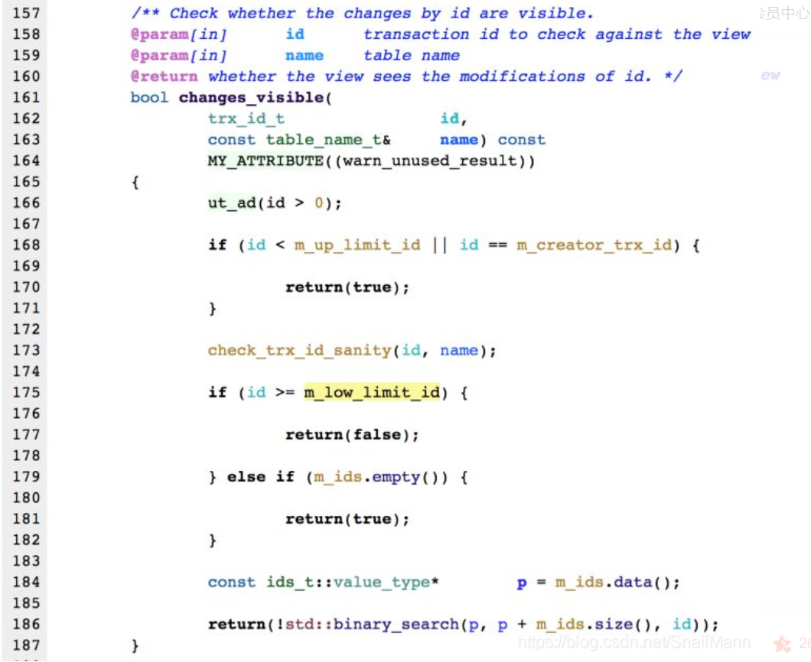

# MySQL 基础


## 为什么使用MySqL


- MySql性能卓越，服务稳定，很少出现宕机

- 开放源代码，使用成本低

- 软件体积小，安装使用简单，并且易于维护

  ​


## 关系型数据库和非关系型数据库

### 关系型数据库

关系型数据库模型是将复杂的数据结构使用较为简单的**二元关系（二维表）**来表示；在关系数据库中，对数据的基本操作是建立在一个或者多个表上，可以采用结构化查询语言SQL对数据库进行操作。

**关系型数据库的缺点是**存储的是**行**记录：不能存储对象、数组等数据

而且**扩展表结构**不方便：操作不存在的**列**会报错，而增加列又需要执行SQL语句，执行更新表的SQL语句会长时间锁表，高并发场景下延时会比较高。

还有**占用内存高**：关系型数据库在对大量数据的表进行统计之类的运算时，占用内存会很高，因为它即使只针对某一列所在的字段进行操作，也会将整行数据从存储设备读入内存（**预读**）。


### 非关系型数据库NOSQL

NOSQL (Not Only SQL) 泛指非关系型数据库；关系型数据库在超大规模和高并发的web2.0纯动态网站已经显得力不从心，暴露了很多难以克服的问题；NOSQL数据库的产生就是为了解决**大规模数据集合**，**多重数据种**类带来的挑战，尤其是大数据应用难题；常见的非关系型数据库系统有 Redis，MongoDB等


NoSQL数据库的分类：

K-V 存储型：比如 Redis，它可以用 K-V 键值对的方式来存储数据，而存储的值可以有好几种格式，如 string、hash、list、set、bitmap 等。

文档存储型：比如 MongoDB，存储的 JSON 格式的文档，解决了关系型数据库的表约束的问题，比如查询不存在的字段会报错。另外也解决了部分存储格式的问题，因 JSON 可以表示数组，还可以嵌套字段存储


## 数据库三大范式

**第一范式**：**列不可再分**。要求数据表的每一列都是**不可分割的原子数据项**。比如地址字段“XX省XX市”可以在细分成2个字段：哪个省哪个市。

**第二范式**：第二范式是建立在第一范式的基础上，确保数据表中的每一列都和主键相关，而不能只与主键的某一部分相关，也就是保证每张表只描述一件事情。比如学校考试有很多科目的话，各科的成绩要细分

**第三范式**：任何**非主键属性**不能依赖其他**非主键属性**。确保数据表中的每一列都和主键直接相关，而不是间接相关，即数据不能存在传递关系，像（a->b->c） a与b相关，b又与c相关这样的关系是不符合第三范式的。

比如我项目中，如果有人进行回复，会把回复的内容存到数据库的discuss表中，这个discuss表就不用把帖子作者存入数据库中，因为discuss表中已经有了评论人这个字段，可以通过评论人找到帖子的作者（有一个表记录了每个人回复了哪些人），这样就可以有效的避免数据库冗余。

实际设计中不一定要满足三大范式，因为需要考虑性能的问题；通常关联查询的表不能超过三张。而且故意给一些表增加一些冗余字段，这样可以降低关联表的数量，由多表查询变成单表查询


**有很多张表连接的非常复杂的查询时如何优化**

1.经常在连接的列上,也是外键上创建索引,可以加快连接的速度；

2.用小表去驱动大表。驱动表需要全部加入缓存区中。然后一条一条取出和后表匹配，后表如果可以用索引效率就高了。

>  小表驱动大表：20+ log10000
>
> 大表驱动小表：10000+ log20

3.Mysql 是先执行内联表然后再进行条件查询的最后再分组,内联后数据就变得臃肿了，这时候再进行条件查询和分组就会变得很慢，**所以我们可以提前进行分组和条件查询，实现方法就是先进行子查询，联合内联查询**。 


## 一、索引

### 索引的操作

```
--查看已创建的索引
show index from 表名;

-- 创建索引
-- alter table 表名 add index 索引名[可选](列名, ..)

-- 给name字段添加索引
alter table classes add index my_name (name);

-- 列名不唯一就创建了联合索引
alter table teacher add index (name,age);

--删除索引
-- alter table 表名 drop index 索引名

```


### 索引的优点

- 索引是对数据库表中的一列或者多列的值进行排序的数据结构，使用索引可以大大加快数据的检索速度，大大减少检索的数据量，也就是减少磁盘I/O的次数，加快查询速率。

- 通过创建唯一性索引，可以保证数据表中每一行数据的唯一性

- 而且索引将随机 I/O 变为顺序 I/O。在ORDER BY 和 GROUP BY 操作的时候，还可以通过索引列对数据进行排序，通过B+树的顺序访问指针降低数据排序的成本，降低了cpu的消耗。

  ​

### 索引的缺点

- 创建索引和维护索引都需要消耗一定时间，对数据表中的数据进行增删改的时候，如果数据有索引，那么索引也需要动态的修改，会降低SQL的执行效率。
- 而且索引需要使用物理文件存储，也会消耗一定的空间。

### 索引的使用条件

> 索引建立原则

- 对于非常小的表、大部分情况下简单的全表扫描比建立索引更高效，索引就起不到优化的作用。
- 对于中到大型的表，索引就非常有效，不过对**经常更新的表**应该避免对其进行过多索引的创建，而应该对经常查询的字段创建索引。
- 在相同值比较多的字段不要建立索引，比如性别字段，只有男、女这两个不同值就不适合创建索引。
- 为经常需要排序、分组的字段建立索引，因为排序操作会浪费很多时间，如果为其建立索引，可以有效的避免排序操作。
- 尽量使用前缀来索引，进行全文检索会很浪费时间。如果只检索字段的前面的若干个字符，这样可以提高检索速度。
- 不过要限制索引的数目，索引不是越多越好的，创建索引和维护索引都需要消耗时间，对数据表中的数据进行增删改的时候，如果数据有索引，那么索引也需要动态的修改，会降低SQL的执行效率。而且，索引需要使用物理文件存储，也会消耗一定的空间。

### 索引什么时候会失效

> 慢sql往这里引

> 最左前缀匹配原则，非常重要的原则，mysql会一直向右匹配直到遇到范围查询(>、<、between、like)就停止匹配，比如a = 1 and b > 2 and c = 3。 如果建立(a,b,c)顺序的索引，c是用不到索引的，因为因为联合索引首先是按a排序的，在a相等的情况下再按b顺序排列，b相等的话再按c排序。但b字段是范围查询的时候，找到的子节点有很多，这时候c其实是无序的。如果建立(a,c,b)的索引则都可以用到，因为Mysql的服务器层中的优化器会帮我们优化where条件的顺序。


- 对于创建的联合[索引](https://so.csdn.net/so/search?q=%E7%B4%A2%E5%BC%95&spm=1001.2101.3001.7020)（多列索引），我们要遵循一个最左前缀匹配原则，比如(name,age)的联合索引支持name或者name，age组合用索引查，而不支持age用索引查询，这是因为联合索引首先是按name排序的，在name相等的情况下再按age顺序排列，如果只用age其实是无序的。

  ```
  alter table student add index my_index(name, age)   // name左边的列， age 右边的列                  
  select * from student where name = 'aaa'     // 会用到索引

  select * from student where age = 18          //  不会使用索引
  ```

- 对于使用 like 查询， 查询如果是 ‘%aaa’ 不会使用索引，而 ‘aaa%’ 会使用到索引。

  ```
  select * from student where name like 'aaa%'                 //会用到索引
  ```

  ```
  select * from student where name like '%aaa' 或者  '_aaa'   //  不会使用索引，可以使用覆盖索引来查询
  ```

- 如果条件中有 or，要想使用索引，要求使用的所有字段中，都必须在单独使用时都能使用索引。因为如果有一个字段单独使用时没用索引，还是得全表扫描，然后再合并，所以Mysql在server层的优化器就不会让语句走索引。

- 如果列类型是字符串，那么一定要在条件中使用引号引用起来，否则不使用索引。因为不加单引号时，是字符串跟数字的比较，它们类型不匹配，MySQL会做**隐式的类型转换**，把它们转换为浮点数再做比较。

- 如果mysql认为全表扫描要比使用索引快，则不使用索引。

  如：表里只有一条数据。


### B+ Tree 原理

#### 1. 数据结构

B Tree （Balance Tree）是一种多路平衡搜索树。

- 它跟普通的平衡二叉树的不同是，B树的每个节点可以存储多个数据，而且每个节点不止有两个子节点，最多可以有上千个子节点。
- B树中每个节点都保存着索引和数据，数据遍布整个树结构，搜索可能在非叶子节点结束，最好的情况是O(1)。
- 一般一棵 B 树的高度在 **3** 层左右，**3** 层就可满足 **百万**级别的数据量


B+ Tree 是基于 B Tree 和**叶子节点顺序访问指针**实现的，它具有 B Tree 的平衡性，并且通过叶子节点顺序访问指针来提高**区间查询的性能**。B+ Tree叶子节点保存了完整的索引和数据， 非叶子节点只保存索引值，因此它的查询时间固定为 log(n)。

数据库索引采用B+树而不是B树的主要原因是：B+树只要遍历叶子节点就可以实现整棵树的遍历，而且在数据库中基于范围的查询是非常频繁的，而B树只能中序遍历所有的节点，效率太低


#### 2. 操作

进行查找操作时，首先在根节点进行二分查找，找到一个 key 所在的指针，然后递归地在指针所指向的节点进行查找。直到查找到叶子节点，然后在叶子节点上进行二分查找，找出 key 所对应的 data。

插入删除操作会破坏平衡树的平衡性，因此在进行插入删除操作之后，需要对树进行**分裂、合并、旋转**等操作来维护平衡性。

#### 3. 与平衡树的比较

红黑树，AVL树等平衡树也可以用来实现索引，但是数据库系统普遍采用 B+ Tree 作为索引结构，这是因为使用 B+ 树访问磁盘数据有更高的性能。

（一）首先是B+树的**叶子节点顺序访问指针**提高了区间查询的性能。

（二）其次是**B+ 树有更低的树高**

B+树的每个节点都可以存储多个数据，而且每个节点都不止有两个子节点，最多可以有上千个子节点。所以相同节点数目的B+ Tree相对于其他平衡树有更低的树高。为什么树高低有更高的性能得从磁盘访问原理上来说：

操作系统一般将内存和磁盘分割成固定大小的块，每一块称为一页，内存与磁盘以页为单位交换数据。数据库系统将索引的一个节点的大小设置为页的大小，使得一次 I/O 就能完全载入一个节点，检索数据时会把整页读入内存，再从内存中找。

一般数据不在同一个磁盘块上，因为这样维护成本很高。所以通常需要移动制动手臂来进行寻道，而制动手臂因为其物理结构导致了移动效率低下，从而增加了磁盘数据的读取时间。B+ 树相对于其他平衡树有更低的树高，进行寻道的次数与树高成正比，所以 B+ 树更适合磁盘数据的读取。

（三）**磁盘预读特性**

为了减少磁盘 I/O 操作，磁盘往往不是严格按需读取，而是每次都会预读。预读过程中，磁盘进行顺序读取，顺序读取不需要进行磁盘寻道，只需要很短的磁盘旋转时间，速度会非常快。B+树可以利用磁盘预读特性，相邻的节点也能够被预先载入到内存。

#### 4. 与哈希索引的比较

哈希索引能以 O(1) 时间进行查找，但是失去了有序性：

- 导致无法用于排序与分组；
- 只支持精确查找，无法进行范围查找。
- 也会产生Hash冲突问题

InnoDB 存储引擎有一个特殊的功能叫“自适应哈希索引”，当某个索引值被使用的非常频繁时，会在 B+Tree 索引之上再创建一个哈希索引，这样就让 B+Tree 索引具有哈希索引的一些优点，比如快速的哈希查找。

### MySQL 索引

索引是在存储引擎层实现的，而不是在server层实现的，所以不同存储引擎具有不同的索引类型和实现。

#### 1. B+Tree 索引

**InnoDB** 的 B+Tree 索引分为聚集索引和非聚集索引。聚集索引的叶子节点 data 域记录着完整的数据记录，因为无法把数据行存放在两个不同的地方，所以一个表**只能有一个**聚集索引。

非聚集索引的叶子节点的 data 域记录着主键的值，因此在使用非聚集索引进行查找时，需要先查找到主键值，然后再到聚集索引中进行查找。        

​                                   

​                                                                                                                                                                              

​                               

MyISAM的索引和数据是分开的。聚集索引和非聚集索引在结构上没有任何区别，叶子节点的data域存放的都是数据记录的地址。只是聚集索引要求key是唯一的，而非聚集索引的key可以重复。


如果我们在Col2上建立一个辅助索引，则此索引的结构如下图所示：


### 索引类型

  **1.按索引是否包含数据分类：**

- 聚集索引：聚集索引即索引结构和数据一起存放的索引，主键索引属于聚集索引

  **优点**：查询的速度非常快，因为B+树本身就是一个多叉平衡树，叶子节点也是有序的，定位到索引的节点就相当于定位到了数据。

  **缺点**：依赖于有序的数据，如果索引的数据不是有序的，那么就需要在插入时排序，类似于UUID这种难比较的数插入和查找的速度就比较慢，如果索引列的数据被修改时，那么对应的索引也将被修改，而且叶子结点还存放着数据，修改代价十分的大。

- 非聚集性索引：索引结构和数据分开存放的索引，叶子节点存放的是该索引字段的值以及对应的主键索引（Myisam中一个 .MYI 存索引，一个 .MYD 存数据）

  **优点**：更新代价比聚集索引要小

  **缺点**：跟聚集索引一样，非聚集索引也依赖于有序的数据，而且还能可能会进行二次回表查询，当查询到索引对应的指针或主键后，可能还需要根据指针或主键再到数据文件或表中查询。

  ​

  ​

  **附：为什么要有主键？**

  **答：**因为 InnoDB 表里面的数据必须要有一个 B+tree 的索引结构来组织、维护我们的整张表的所有数据，从而形成 .idb 文件；如果 InnoDB 创建了一张没有主键的表，那这张表就有可能没有任何索引，则 MySQL会选择所有具有唯一性并且不为 null 中的第一个字段创建聚集索引

  如果没有唯一性索引的字段就会有一个隐式字段成为表的聚集索引：而这个隐式字段，就是 InnoDB 帮我们创建的一个长度为 6字节 的整数列 ROW_ID，它随着新行的插入单调增加，InnoDB 就以该列对数据进行聚集

  使用这个 ROW_ID 列的表都共享一个相同的全局序列计数器（这是数据字典的一部分）；为了避免这个 ROW_ID 用完，所以建议表中一定要单独建立一个主键字段

  ​

  **附：为什么主键推荐使用整形自增？**

  **整形：**1.首先整型的占用空间会比字符串小，而且在查找上比大小也会比字符串更快；字符串比大小的时候还要先转换成 ASCII 码再去比较；如果使用自增的话，在插入方面的效率也会提高

  **自增：**2.不使用自增，可能时不时会往 B+tree 的中间某一位置插入元素，当这个节点位置放满了的时候，节点就要进行分裂操作（效率低）再去维护，有可能树还要进行平衡，又是一个耗性能的操作；都用自增就会永远都往后面插入元素，这样索引节点分裂的概率就会小很多。

  ​

 **2.按索引的常规功能分类**

- 主键索引：数据表中主键列使用的就是主键索引

- 唯一索引：唯一索引的属性列不能出现重复的数据，但是允许数据为null，一张表允许创建多个唯一索引。

- 普通索引：普通索引的唯一目的就是为了快速查询数据，一张表允许创建多个普通索引，并允许数据重复和null。

- 联合索引：对多个字段同时建立的索引

- 全文索引：全文索引主要是为了检索大文本数据中的关键字信息，而不是直接比较是否相等，是目前搜索引擎数据库中使用的一种技术。全文索引使用**倒排索引**实现，它记录着**关键词到其所在文档的映射**。InnoDB 存储引擎在 MySQL 5.6.4 版本中也开始支持全文索引。

  **使用：**

  ```
  -- 给表中的title字段创建全文索引 
  CREATE TABLE test(
  title VARCHAR(40),
  FULLTEXT(title)
  );
  -- 查找条件使用 MATCH AGAINST(match against)，而不是普通的 WHERE
  -- 查询相关性
  SELECT title, MATCH(title) AGAINST('like') AS relevance
  FROM test
  ```

  

  返回多组数据，发现只有前面2条记录的相关性>0，出现次数越多相关性越大（0-1），没出现则为0

  **检索模式**：

  - Natural Language

  上面的例子我们是用的默认的检索模式，Natural Language模式！表示查询带有指定word的文档。下面2种方式是等价的

  ```
  SELECT * FROM test  MATCH(title) AGAINST('what' in NATURAL LANGUAGE MODE);

  SELECT * FROM test  MATCH(title) AGAINST('what');
  ```

  - Boolean

  当使用这种模式时，表示字符串前后的字符有特殊含义。比如要查找有Pease单词的记录

  ```
  SELECT * FROM test MATCH(title) AGAINST('+Pease' in BOOLEAN MODE);
  ```

  

  假设，我们需要查找有Pease，但是没有hot的记录呢？用+,-符号，分别表示一定存在，或者一定不存在

  ```
  SELECT * FROM test MATCH(title) AGAINST('+Pease -hot' in BOOLEAN MODE);
  ```

  ​


### 索引条件下推

#### MySQL内部结构以及SQL语句执行流程

**答：**MySQL大体上可分为 Server层 和 存储引擎层 两部分


**Server层：**

连接器：TCP握手后服务器来验证登陆用户身份

分析器：根据语法规则，判断你输入的这个SQL语句是否满足MySQL语法

优化器：多种执行策略可实现目标，系统自动选择最优进行执行

执行器：操作存储引擎执行语句

**存储引擎层：**负责数据的存储和提取。其架构模式是插件式的，支持InnoDB、MyISAM等多个存储引擎。现在最常用的存储引擎是InnoDB，它从MySQL 5.5版本开始成为了默认存储引擎 (经常用的也是这个)

**索引条件下推** （Index Condition Pushdown）

索引条件下推是**MySQL5.6**新添加的特性，用于优化数据的查询。

在MySQL5.6之前，通过使用非主键索引进行查询的时候，存储引擎通过索引查询数据，然后将结果返回给MySQL 的server层，**在server层判断是否符合条件**。

在MySQL5.6及以上版本，可以使用索引条件下推的特性。当**存在索引的列做为判断条件**时，MySQL的server层将这一部分判断条件传递给存储引擎，然后存储引擎会筛选出**符合传递条件的索引项**，即在存储引擎层根据索引条件**过滤**掉不符合条件的索引项，然后回表查询得到结果，将结果返回给MySQL的server层。

**有了索引条件下推的优化，在满足一定的条件下，存储引擎层会在回表查询之前对数据进行过滤，可以减少存储引擎回表查询的次数**。

**示例：**

```
SELECT * FROM user_info WHERE name LIKE "大%" AND level = 1;
```

5.6前的版本：


查询条件`name LIKE `不是等值匹配，根据**最左前缀匹配原则**，在`(name, level)`索引树上只用到`name`去匹配，查找到两条记录（id为1和4），拿到这两条记录的id分别回表查询，然后将结果返回给MySQL server，在MySQL server层进行`level`字段的判断。**整个过程需要回表2次**。

5.6后的版本：


相比5.6以前的版本，多了索引下推的优化，在索引遍历过程中，对**索引中的字段**先做判断，过滤掉不符合条件的索引项，**也就是判断level是否等于1**，level不为1则直接跳过。因此在`(name, level)`索引树只匹配一个记录，之后拿着此记录对应的id（id=1）回表查询全部数据，**整个过程回表1次**。

可以使用explain查看是否使用索引下推，当`Extra`列的值为`Using index condition`，则表示使用了索引下推。


### 索引优化

#### 1. 独立的列

在进行查询时，索引列不能是表达式的一部分，也不能是函数的参数，否则无法使用索引。

例如下面的查询不能使用 actor_id 列的索引：

```
SELECT actor_id FROM sakila.actor WHERE actor_id + 1 = 5;
```

#### 2. 多列索引

在需要使用多个列作为条件进行查询时，使用多列索引比使用多个单列索引性能更好。例如下面的语句中，最好把 actor_id 和 film_id 设置为多列索引。

```
SELECT film_id, actor_ id FROM sakila.film_actor
WHERE actor_id = 1 AND film_id = 1;
```

#### 3. 索引列的顺序

让选择性最强的索引列放在前面。

索引的选择性是指：不重复的索引值和记录总数的比值。最大值为 1，此时每个记录都有唯一的索引与其对应。选择性越高，每个记录的区分度越高，查询效率也越高。

例如下面显示的结果中 customer_id 的选择性比 staff_id 更高，因此最好把 customer_id 列放在多列索引的前面。

```
SELECT COUNT(DISTINCT staff_id)/COUNT(*) AS staff_id_selectivity,
COUNT(DISTINCT customer_id)/COUNT(*) AS customer_id_selectivity,
COUNT(*)
FROM payment;

```

```
   staff_id_selectivity: 0.0001
customer_id_selectivity: 0.0373
               COUNT(*): 16049

```

#### 4. 前缀索引

前缀索引只适用于字符串类型的数据。对于 TEXT 和 VARCHAR 类型的列，必须使用前缀索引，前缀索引是对文本的前几个字符创建索引，相比于普通索引建立的数据更小，因为只提取前几个字符。前缀长度的选取需要根据索引选择性来确定。


#### 5.联合索引

对多个字段同时建立的索引 ( 有顺序，ABC，ACB是完全不同的两种联合索引 )

**为什么要用联合索引**

**答：**以联合索引 (a,b,c) 为例

1、减少开销：建立这样的索引相当于建立了索引a、ab、abc三个索引；相当于一个联合索引顶三个普通索引，这当然是好事，毕竟每多一个索引，都会增加写操作的开销和磁盘空间的开销。

2、覆盖索引：同样的有联合索引（a,b,c），如果有如下的 SQL语句

```sql
select a,b,c fromt table where a = xxx and b = xxx;
```

那么 MySQL 可以直接通过遍历索引取得数据，而无需读表 (避免了访问表的数据行)，这减少了很多的随机 IO 操作。减少 IO 操作，特别的随机 IO 其实是InnoDB 主要的优化策略。所以，在真正的实际应用中，覆盖索引是主要的提升性能的优化手段之一

3、索引列越多，通过索引筛选出的数据越少

有1000W条数据的表，有如下 SQL

```sql
select * from table where a = 1 and b = 2 and c = 3;
```

假设每个条件可以筛选出10%的数据，如果只有单值索引，那么通过该索引能筛选出1000W*10%=100w 条数据，然后再回表从100w条数据中找到符合 b=2 and c= 3 的数据，然后再排序，再分页；如果是复合索引，通过索引筛选出1000w *10% *10% *10%=1w，然后再排序、分页，哪个更高效，一眼便知

**扩展**：联合索引的最左原则：在使用联合索引的时候。我们要遵循一个最左原则，即index(name,sex)支持name或者name，age组合查，而不支持age查询，因为没有用到创建的联合索引。而且SQL的条件如果用到了相似查询，必须%在前面，比如可以为where name = "谢%"，不能为where name = "%谢"，不然联合索引也会失效。


>什么是回表查询？
>
>从非聚集索引中查询到了主键id，然后根据主键id到聚集索引中查询。因为进行了2次查询，所以性能不佳。
>
>解决办法是采用覆盖索引。

#### 6. 覆盖索引

如果一个索引包含(或覆盖)所有需要查询的字段的值，称为覆盖索引。即只需扫描索引而无须回表，避免了访问表的数据行。

优点：

- 索引通常远小于数据行的大小，只读取索引能大大减少数据访问量。
- 一些存储引擎（例如 MyISAM）在内存中只缓存索引，而数据依赖于操作系统来缓存。因此，只访问索引可以不使用系统调用（通常比较费时）。
- 对于 InnoDB 引擎，若非主键索引能够覆盖查询，则无需访问主索引，避免对主键索引的二次查询


实现索引覆盖常见的方法是：将被查询的字段，建立到联合索引里去。


## 二、MySQL调优（慢查询优化）！！！

### 1.优化SQL语句

**首先是减少请求的数据量**

- 只返回必要的列：最好不要使用 SELECT * 语句。
- 只返回必要的行：使用 LIMIT 语句来限制返回的数据。
- 缓存重复查询的数据：使用缓存可以避免在数据库中进行查询，特别在要查询的数据经常被重复查询时，缓存带来的查询性能提升将会是非常明显的。

**其次是减少磁盘的IO次数**

最有效的方式是使用索引来覆盖查询。而且应该使在索引上查询的次数尽可能少，减少磁盘IO的次数来提高性能。比如在写SQL语句中，应尽量避免在 where 子句中使用 != 或 <，> 操作符，也不要进行 null 或者 is null 判断，也不要使用 or 来连接条件，尽量减少数据库排序操作以及全表查询，减少CPU使用。

**说明：使用 Explain 进行分析**

Explain 用来分析 SELECT 查询语句，开发人员可以通过分析 Explain 结果来优化查询语句。

比较重要的字段有：

- select_type : 查询类型，有简单查询、联合查询、子查询等
- key : 使用的索引
- rows : 扫描的行数


### 2.避免索引失效


### 3.优化表结构

(1).尽量使用数字型字段

若只含数值信息的字段尽量不要设计为字符型，这会降低查询和连接的性能，并会增加存储开销。这是因为引擎在处理查询和连接时会逐个比较字符串中每一个字符，而对于数字型而言只需要比较一次就够了

(2).尽可能的使用 varchar 代替 char；变长字段存储空间小，可以节省存储空间

(3).单表不要有太多字段（垂直分表）

(4).避免使用NULL字段，很难查询且占用额外索引空间

### 4.优化系统配置和硬件

读写分离：只在主服务器上写，只在从服务器上读。对应到数据库集群一般都是一主一从、一主多从；业务服务器把需要写的操作都写到主数据库中，读的操作都去从库查询；主库会同步数据到从库保证数据的一致性

一般 读写分离 的实现方式有两种：代码封装跟数据库中间件


### 分库分表

> 表的查询效率明显变慢时，就需要规划分库分表了。
>
> 分布式系统一般都要进行分库分表，这其中要考虑单一业务ID生成这一问题。

分库分表分为垂直拆分和水平拆分两种方式，一般是先垂直后水平

**垂直拆分**的核心思想就是，将一堆的统一数据放到其他节点数据库中或者表中进行存储，垂直拆分后，是每个节点存储一部分数据。垂直拆分分为垂直分库和垂直分表。

1、垂直分库是将应用分为若干模块，比如订单模块、商品模块、支付模块等等。其实就是微服务的理念 ，因为在高并发的场景下，大量请求访问数据库，MySQL单机是扛不住的。


2、垂直分表是如果表**字段**较多，一般将不常用字段和数据较大的字段做拆分。数据量太大的话，如果**命中了索引**，B+树的高度会变高，SQL的查询就会变慢。如果**没命中索引**，千百万数据量级别的表可能会拖垮整个数据库。

垂直拆分好处是

1)有效解决了单个数据库或表的数据存储瓶颈

2).有效提高数据查询性能

3).有效提高并发写入性能，因为是可以写到多个库里面了


当垂直切分后数据量行数巨大，存在单库读写、存储性能瓶颈，这时候就需要进行水平切分了。

**水平拆分**的核心思想是：将单一数据表数据按照我们约定的某种规则进行拆分到多个数据库和数据表中，我们的关注点是在表数据本身上，水平切分后同一张表会出现在多个数据库/表中，每个库/表的内容不同。

比如要查询某个月的数据，就可以将某月份数据放进对应月份表中，这样我们就可以根据时间来定位到我们数据存储在哪张表里，然后再根据我们的查询条件进行相应的查询。

- 水平切分的优点：
  - 不存在单库数据量过大、高并发的性能瓶颈，提升系统稳定性和负载能力
  - 应用端改造较小，不需要拆分业务模块
- 水平切分的缺点：
  - 跨分片的事务一致性难以保证
  - 跨库的join关联查询性能较差
  - 数据多次扩展难度和维护量极大


> 策略（了解）：
>
> - range范围：根据表主键划分范围划分表
> - hash取模：指定的路由key（一般是user_id、订单id作为key）对分表总数进行取模，把数据分散到各个表中。


#### 设置全局唯一ID

1.单独创建一个用于生成id的表，那个表中的id字段是自增的。直接往这个表里插入一条记录，获取一个全局唯一id即可。这种方法比较方便简单，但是在高并发会有瓶颈，不推荐使用。

2.用当前时间作为全局唯一ID，但并发高容易造成重复。

3.使用uuid生成全局唯一的id，但是uuid太长了，作为主键性能太差了。

4.使用雪花（snowflake）算法

> 开源的分布式id生成算法


- 首位无效符：第一个位作为符号位，因为我们生成的都是正数，所以第一个 bit 统一都是 0。
- 时间戳：占用 41位 ，精确到毫秒。41位最多可以表示`2^41-1`毫秒，转化成单位年为 69 年。
- 机器码：占用10位，其中高位 5 bit 是数据中心 ID，低位 5 bit 是工作节点 ID，最多可以容纳 1024 个节点。
- 序列号：占用12位，记录用一个毫秒内产生的不同id，每个节点每毫秒0开始不断累加，最多可以累加到4095，一共可以产生 **4096** 个ID。

> 原生的`Snowflake`算法是完全依赖于时间的，如果有时钟回拨的情况发生，单机时间出错，会生成重复的ID。可以找2bit位作为时钟回拨位，发现有时钟回拨就将回拨位加1，达到最大位后再从0开始进行循环。


附：MySQL分页查询优化*

MySql 的分页查询十分简单，但是当数据量大的时候一般的分页就吃不消了

传统的分页查询如下：

```sql
select c1,c2,cn ... from table limit n, m;

-- 如果只给定一个参数，它表示返回最大的记录行数目
select * from table limit 5; --等价于-- select * from table limit 0,5;
```

MySQL 的 limit 工作原理就是先读取前面的n条记录，然后抛弃前n条，再读后面的m条，所以n越大，偏移量也就越大，性能也就越差

分页查询优化：

1.尽量给出查询的大致范围（明确知道id的情况）如：

```sql
select c1, c2, cn from table where id >= 2000 limit 10;
```

2.子查询优化

```sql
select c1,c2,cn from table where id >= (select id from table limit 2000, 1) limit 10;
```

3.使用覆盖索引，对经常需要查询的字段建立索引


##  三、存储引擎

### 存储引擎相关的命令

**查看 MySQL 提供的所有存储引擎**

```
mysql> show engines;
```


从上图我们可以查看出 MySQL 当前默认的存储引擎是 InnoDB，并且在 5.7 版本所有的存储引擎中只有 InnoDB 是事务性存储引擎，也就是说只有 InnoDB 支持事务。

**查看 MySQL 当前默认的存储引擎**

我们也可以通过下面的命令查看默认的存储引擎。

```
mysql> show variables like '%storage_engine%';
```

**查看表的存储引擎**

```
show table status like "table_name" ;
```


### InnoDB

是 MySQL 默认的事务型存储引擎，只有在需要它不支持的特性时，才考虑使用其它存储引擎。

实现了四个标准的隔离级别，默认级别是可重复读（REPEATABLE READ）。在可重复读隔离级别下，通过多版本并发控制（MVCC）+ Next-Key Locking 防止幻影读。

主索引是聚簇索引，在索引中保存了数据，从而避免直接读取磁盘，因此对查询性能有很大的提升。

内部做了很多优化，包括从磁盘读取数据时采用的可预测性读、能够加快读操作并且自动创建的自适应哈希索引、能够加速插入操作的插入缓冲区等。

支持真正的在线热备份。其它存储引擎不支持在线热备份，要获取一致性视图需要停止对所有表的写入，而在读写混合场景中，停止写入可能也意味着停止读取。

### MyISAM

设计简单，数据以紧密格式存储。对于只读数据，或者表比较小、可以容忍修复操作，则依然可以使用它。

提供了大量的特性，包括压缩表、空间数据索引等。

不支持事务。

不支持行级锁，只能对整张表加锁，读取时会对需要读到的所有表加共享锁，写入时则对表加排它锁。但在表有读取操作的同时，也可以往表中插入新的记录，这被称为并发插入（CONCURRENT INSERT）。

可以手工或者自动执行检查和修复操作，但是和事务恢复以及崩溃恢复不同，可能导致一些数据丢失，而且修复操作是非常慢的。

如果指定了 DELAY_KEY_WRITE 选项，在每次修改执行完成时，不会立即将修改的索引数据写入磁盘，而是会写到内存中的键缓冲区，只有在清理键缓冲区或者关闭表的时候才会将对应的索引块写入磁盘。这种方式可以极大的提升写入性能，但是在数据库或者主机崩溃时会造成索引损坏，需要执行修复操作。


### 存储引擎中Innodb和Myisam的区别

- 从事务上来说：Innodb是事务型的，可以使用commit和rollback语句

- 从并发上来说：Myisam只支持表级锁，Innodb还支持行级锁

- 从外键上来说，Innodb支持外键，而MyIsam不支持

  **（注）** 不过虽然外键保证了数据的一致性，但做一些涉及外键字段的增，删，改操作的时候，需要触发相关操作去检查，在并发高的时候会影响数据库性能。一般也不会在数据库层面使用外键，应用层面可以解决。

- 从备份上来说，Innodb支持在线热备份，而Myisam不支持

- 从崩溃恢复上来说：Myisam崩溃后发生损坏的概率比Innodb高很多，而且恢复的速度也更慢，Innodb恢复数据的过程依赖于 `redo log` 重做日志。


> 外键：
>
> 一、如果一张表中有一个非主键的字段指向了别一张表中的主键，就将该字段叫做外键。
>
> 　　一张表中可以有多个外键。
>
> 　　外键的默认作用有两点：
>
> 　　1.对子表(外键所在的表)的作用：子表在进行写操作的时候，如果外键字段在父表中找不到对应的匹配，操作就会失败。
>
> 　　2.对父表的作用：对父表的主键字段进行删和改时，如果对应的主键在子表中被引用，操作就会失败。
>
> 　　外键的定制作用----三种约束模式：
>
> 　　　　district：严格模式(默认), 父表不能删除或更新一个被子表引用的记录。
>
> 　　　　cascade：级联模式, 父表操作后，子表关联的数据也跟着一起操作。
>
> 　　　　set null：置空模式,前提外键字段允许为NLL,  父表操作后，子表对应的字段被置空。
>
> 　　使用外键的前提：
>
>       　　1. 表储存引擎必须是innodb，否则创建的外键无约束效果。
>
>       　　2. 外键的列类型必须与父表的主键类型完全一致。
>
>       　　3. 外键的名字不能重复。
>
>       　　4. 已经存在数据的字段被设为外键时，必须保证字段中的数据与父表的主键数据对应起来。
>
> 二、新增外键
>
>       　　1. 在创建时增加
>
> 　　　create table my_tab1(
>
> 　　　id int primary key auto_increment,
>
> 　　　name varchar(10) not null,
>
> 　　　class int,
>
> 　　　foreign key(class)　references my_tab2(主键字段名);
>
> 　　　)charset utf8;
>
>       　　2. 在创建好的表中增加
>
> 　　　alter table my_tab1 add [constraint 外键名] foreign key(外键字段名) references mytab2(主键字段名);
>
> 三、删除外键
>
> 　　alter table my_tab drop foreign key 外键名字;


### 关于 MyISAM 和 InnoDB 的选择问题

一般情况下我们选择 InnoDB 都是没有问题的，但是某些情况下你并不在乎**可扩展能力**和**并发能力**，也**不需要事务支持**，也不在乎**崩溃后的安全恢复问题**的话，选择 MyISAM 也是一个不错的选择。但是一般情况下，我们都是需要考虑到这些问题的。因此，对于咱们日常开发的业务系统来说，基本上都是使用 InnoDB 作为自己的 MySQL 数据库的存储引擎。


### MyISAM的读取速度为什么更快

**答：**1.查询的时候，由于InnoDB支持事务，所有会有一个MVCC的比较

2.InnoDB查询的时候如果走索引，如果是非主键索引查询，则查询的时候可能会有回表操作；而MyISAM不存在回表。

3.锁的损耗：InnoDB既支持行锁，也支持表锁，在检查锁的时候这两种锁都需要检查


### 存储文件介绍

**MyISAM存储文件**介绍：

每个 MyISAM 表都以3个文件存储在磁盘上。这些文件的名称以表名开头，以扩展名指示文件类型。

.frm 文件（frame）存储表结构		.MYD 文件（MY Data）存储表数据		.MYI 文件（MY Index）存储表索引

MySQL 里的数据默认是存放在安装目录下的 data 文件夹中（针对windows环境），也可以自己修改

.MYI 文件组织索引的方式就是 B+tree。叶子节点的 value 处存放的就是索引所在行的磁盘文件地址

**底层查找过程：**

1.首先会判断查找条件 where 中的字段是否是索引字段，如果是就会先拿着这字段去 .MYI 文件里通过 B+tree 快速定位，从根节点开始定位查找；

2.找到后再把这个索引关键字（就是我们的条件）存放的磁盘文件地址拿到 .MYD 文件里面找，从而定位到索引所在行的记录

**InnoDB存储文件**介绍：

一张 InnoDB 表底层会对应2个文件在文件夹中进行数据存储

.frm 文件（frame）存储表结构			.ibd 文件（InnoDB Data）存储表索引+数据

很显然，InnoDB 把索引和数据都放在一个文件里存着了；InnoDB 表里面的数据也是用 B+tree 数据结构组织起来的

.ibd 存储数据的特点就是 B+tree 的叶子节点上包括了我们要的索引和该索引所在行的其它列数据

**底层查找过程：**

1.首先会判断查找条件 where 中的字段是否是索引字段，如果是就会先拿着这字段去 .ibd 文件里通过 B+tree 快速定位，从根节点开始定位查找；

2.找到后直接把这个索引关键字及其记录所在行的其它列数据返回


## 四、锁机制与 InnoDB 锁算法

**InnoDB 存储引擎的锁的算法有三种：**

- Record lock：记录锁，单个行记录上的锁
- Gap lock：间隙锁，锁定一个范围，不包括记录本身
- Next-key lock：record+gap 临键锁，锁定一个范围，包含记录本身


### 介绍下MySql的锁

 **1.按照对数据操作的锁粒度来分**：表级锁、行级锁、页面锁

- 表级锁一次会将整个表锁定，使用可以很好的避免死锁问题，表级锁的锁定粒度大、锁冲突概率高、并发度低。使用表级锁定的主要是MyISAM等一些非事务性存储引擎，适用于以查询为主，少量更新的应用。


- 行级锁只针对当前操作的行进行加锁。行级锁的锁定粒度小、锁冲突概率低，并发度高；缺点是开销大、加锁慢，容易发生死锁。Innodb支持行级锁，默认为行级锁


- 页面锁

   1.页级锁锁定粒度介于行级锁和表级锁中间的一种锁，采取了折中的页级锁，**一次锁定相邻的一组记录**。

  **2.按照锁的共享策略来分**：共享锁、排他锁、意向共享锁、意向排他锁

    共享锁（S）：SELECT * FROM table_name WHERE ... LOCK IN SHARE MODE
    排他锁（X)：SELECT * FROM table_name WHERE ... FOR UPDATE

- 共享锁（S锁）：又称读锁，简单讲就是多个事务对同一数据进行共享一把锁，都能访问到数据，但是只能读不能修改。

- 排他锁（X锁）：又称写锁，排他锁就是不能与其他所并存，如一个事务获取了一个数据行的排他锁，其他事务就不能再获取该行的其他锁，只能使用没有任何锁机制的普通查询，不能进行修改。比如一个事务执行select * for update where id = 1，这样id为1的数据行就被锁起来了，其他事务执行select ...for update 类似的语句就会阻塞，但正常查询出数据，不会受第一个事务的影响 

- 意向共享锁IS锁、意向排他锁IX锁是表级锁，当事务准备在某条记录上加X锁或者S锁时，需要先在**表级别**加一个IX锁和IS锁。直接查看表有没有意向锁就可以知道表中有没有行锁，就不需要遍历每一行来查找，提高了效率。比如某个事务想对表加个表锁时，就需要判断表中行有没有行锁，不然会冲突，有了意向锁机制的话，看一下表有没有意向锁就行了，不用遍历每一行数据。

  **（注意）**：如果一个表中有多个行锁，他们都会给表加上意向锁，意向锁和意向锁之间是不会冲突的。


3.其他锁

- 自增锁：自增锁是一种特殊的**表级锁**，主要用于事务中插入自增字段，也就是我们最常用的自增主键id，防止并发插入数据的时候自增id出现异常。当一张表的某个字段是自增列时，innodb会在该索引的末位加一个排它锁。为了访问这个自增的数值，需要加一个表级锁，不过这个表级锁的持续时间只有当前sql，而不是整个事务，即当前sql执行完，该表级锁就释放了。其他session无法在这个表级锁持有时插入任何记录。

注：

（1）排他锁指的是一个事务在一行数据加上排他锁后，其他事务不能再在其上加其他的锁。但可以直接通过select ...from...查询数据，因为普通查询没有任何锁机制。

（2）mysql InnoDb引擎中update,delete,insert语句自动加排他锁；


### 乐观锁和悲观锁

- 悲观锁(Pessimistic Lock), 顾名思义，就是很悲观，每次去拿数据的时候都认为别人会修改，所以每次在拿数据的时候都会上锁，这样别人想拿这个数据就会阻塞直到它拿到锁。悲观锁的实现，往往依靠数据库提供的锁机制。传统的关系型数据库里边就用到了很多这种锁机制，比如行锁，表锁，读锁，写锁等，都是在做操作之前先上锁。
- 乐观锁(Optimistic Lock), 顾名思义，就是很乐观，每次去拿数据的时候都认为别人不会修改，所以不会上锁，但是在更新的时候会判断一下在此期间别人有没有去更新这个数据，可以使用版本号等机制。乐观锁适用于多读的应用类型，这样可以提高吞吐量。但如果经常产生冲突，这样反倒是降低了性能，所以这种情况下用悲观锁就比较合适。


### 乐观锁和悲观锁的使用

- 悲观锁

​       要使用悲观锁，我们必须关闭mysql数据库的自动提交属性，因为MySQL默认使用autocommit模式，也就是说，当你执行一个更新操作后，MySQL会立刻将结果进行提交。我们可以使用命令设置MySQL为非autocommit模式：

     set autocommit=0;

   设置完autocommit后，我们就可以执行我们的正常业务了。具体如下：

```
 //开始事务
 begin;/begin work;/start transaction; (三者选一就可以)
 
 //查询出商品信息
 select status from items where id=10000 for update;
 
 //根据商品信息生成订单
 insert into orders (id,item_id) values (null,10000);
 
 //修改商品status为2
 update items set status=2 where id=10000;

 //提交事务
 commit;/commit work;
```

​       上面的第一步我们执行了一次查询操作：select status from items where id=10000 for update;与普通查询不一样的是，我们使用了select…for update的方式，这样就通过数据库实现了悲观锁。此时在items表中，id为10000的 那条数据就被我们锁定了，其它的事务必须等本次事务提交之后才能执行。这样我们可以保证当前的数据不会被其它事务修改。
​    MySQL InnoDB默认行级锁，所以只有明确地指定主键，MySQL 才会执行行锁 (只锁住被选取的数据) ，否则MySQL 将会执行表锁 (将整个数据表单给锁住)。除了主键外，使用索引也会影响数据库的锁定级别。

- 乐观锁

  相对悲观锁而言，乐观锁假设认为数据一般情况下不会造成冲突，所以在数据进行提交更新的时候，才会正式对数据的冲突与否进行检测，如果发现冲突了，则让返回用户错误的信息，让用户决定如何去做。那么我们如何实现乐观锁呢，一般来说有以下2种方式：

  1. 使用数据版本（Version）记录机制实现，为数据增加一个版本标识，一般是通过为数据库表增加一个数字类型的 “version” 字段来实现。当读取数据时，**将version字段的值一同读出**，数据每更新一次，对此version值+1。当我们提交更新的时候，判断数据库表对应记录的当前版本信息与第一次取出来的version值进行比对，如果数据库表当前版本号与第一次取出来的version值相等，则予以更新，否则认为是过期数据拒绝更新，返回version error，从而避免A的更新被覆盖。

  ```
  //查询出商品信息
  select (status,version) from items where id=#{id}

  //根据商品信息生成订单
  //修改商品status为2
  update items set status=2,version=version+1 where id=#{id} and version=#{version};
  ```

  ​

  

  ​      

  2.乐观锁定的第二种实现方式和第一种差不多，同样是在需要乐观锁控制的table中增加一个字段，名称无所谓，字段类型使用时间戳（timestamp）, 和上面的version类似，也是在更新提交的时候检查当前数据库中数据的时间戳和自己更新前取到的时间戳进行对比，如果一致则OK，否则就是版本冲突。

  ​       


## 五、MVCC

### 当前读与快照读

- 当前读

  读取的是记录的最新版本，读取时还要保证其他并发事务不能修改当前记录，会对读取的记录进行加锁

```
 共享锁:
 select from table where ? lock in share mode ;
 排他锁:
 select from table where ? for update; 
 update; 
 insert; 
 delete (排他锁)
```

- 快照读

  > 快照读的前提是隔离级别不是串行级别，串行级别下的快照读会退化成当前读

像不加锁的 select 操作就是快照读，即不加锁的非阻塞读。之所以出现快照读的情况，是基于提高并发性能的考虑，快照读的实现是基于多版本并发控制 MVCC 。快照读可能读到的并不一定是数据的最新版本，而有可能是之前的历史版本


**InnoDB 存储引擎的锁的算法有三种：**

- Record lock：记录锁，单个行记录上的锁
- Gap lock：间隙锁，锁定一个范围，不包括记录本身
- Next-key lock：record+gap 临键锁，锁定一个范围，包含记录本身


### 什么是MVCC

多版本并发控制（MVCC）是一种用来解决读-写冲突的无锁并发控制，这个读指的就是快照读, 而非当前读，当前读实际上是一种加锁的操作，是悲观锁的实现，而MVCC不用加锁就可以很大程度的提高数据库并发性能，像普通的select查询语句用的都是MVCC。它的实现是为事务分配单向增长的时间戳，为每个修改保存一个版本，版本与事务时间戳关联，读操作只读该事务开始前的数据库快照。

读已提交和可重复读这两种隔离级别的事务在执行普通的SEELCT操作时就通过MVCC让不同事务的读-写操作并发执行，从而提升系统性能。


### MVCC的实现原理

它的实现原理主要是依赖记录中的 **3个隐式字段**，**undo日志** ，**Read View** 来实现的。

**隐式字段**

- DB_ROW_ID：6 byte，**隐含的自增主键的ID**，如果数据表没有主键，InnoDB 会自动以该字段产生一个聚集索引

- DB_TRX_ID：6 byte，**最近修改的事务 ID**

- DB_ROLL_PTR：7 byte，**指向这条记录上一个版本的回滚指针**

  > 实际还有一个删除 flag 隐藏字段, 既记录被更新或删除并不代表真的删除，而是删除 flag 变了


**undo log日志**

Undo log 主要用于记录数据被修改之前的日志，在表信息修改之前先会把数据拷贝到undo log里。

当事务进行回滚时可以通过undo log 里的日志进行数据还原。

**Read View 读视图**

读视图是在该事务执行的快照读的那一刻，会生成数据库系统当前的一个快照，可以把它比作条件用来判断当前事务能够看到哪个版本的数据，既可能是当前最新的数据，也有可能是该行记录的undo log里面的某个版本的数据。在生成快照的过程中，会遵循一个可见性算法来找到当前事务能看见的最新的老版本。


**可见性算法：**

主要是将要被修改的数据的最新记录中的 DB_TRX_ID（即当前事务 ID ）取出来，与系统当前其他活跃事务的 ID 去对比（由 Read View 维护），如果 DB_TRX_ID 跟 Read View 的属性做了某些比较，不符合可见性，那就通过 DB_ROLL_PTR 回滚指针去取出 Undo Log 中的 DB_TRX_ID 再比较，即遍历链表的 DB_TRX_ID（从链首到链尾，即从最近的一次修改查起），直到找到满足特定条件的 DB_TRX_ID , 那么这个 DB_TRX_ID 所在的旧记录就是当前事务能看见的最新老版本

那么这个判断条件是什么呢？



它是一段 MySQL 判断可见性的一段源码，即 changes_visible 方法（不完全哈，但能看出大致逻辑），该方法展示了我们拿 DB_TRX_ID 去跟 Read View 某些属性进行怎么样的比较

在展示之前，我先简化一下 Read View，我们可以把 Read View 简单的理解成有三个全局属性

> - trx_list（名称我随意取的）
>   - 一个数值列表
>   - 用于维护 Read View 生成时刻系统 正活跃的事务 ID 列表
> - up_limit_id
>   - lower water remark
>   - 是 trx_list 列表中事务 ID 最小的 ID
> - low_limit_id
>   - hight water mark
>   - ReadView 生成时刻系统尚未分配的下一个事务 ID ，也就是 目前已出现过的事务 ID 的最大值 + 1
>   - 为什么是 low_limit ? 因为它也是系统此刻可分配的事务 ID 的最小值
> - 首先比较 DB_TRX_ID < up_limit_id , 如果小于，则当前事务能看到 DB_TRX_ID 所在的记录，如果大于等于进入下一个判断

- 首先比较 DB_TRX_ID < up_limit_id , 如果小于，则当前事务能看到 DB_TRX_ID 所在的记录，如果大于等于进入下一个判断
- 接下来判断 DB_TRX_ID >= low_limit_id , 如果大于等于则代表 DB_TRX_ID 所在的记录在 Read View 生成后才出现的，那对当前事务肯定不可见，如果小于则进入下一个判断
- 判断 DB_TRX_ID 是否在活跃事务之中，trx_list.contains (DB_TRX_ID)，如果在，则代表我 Read View 生成时刻，你这个事务还在活跃，还没有 Commit，你修改的数据，我当前事务也是看不见的；如果不在，则说明，你这个事务在 Read View 生成之前就已经 Commit 了，你修改的结果，我当前事务是能看见的


### MVCC和Next-key Locks解决幻读

#### InnoDB有三种行锁的算法：

1，Record Lock记录锁：单个行记录上的锁。锁定一个记录上的索引，而不是记录本身。如果表没有设置索引，InnoDB 会自动在主键上创建隐藏的聚簇索引，因此 Record Locks 依然可以使用。

2，Gap Lock间隙锁：锁定一个范围，但不包括记录本身。GAP锁的目的，是为了防止同一事务的两次当前读，出现幻读的情况。

3，Next-Key Lock：它是前2种锁（Record Locks 和 Gap Locks ）的结合，不仅锁定一个记录上的索引，也锁定索引之间的间隙。对于行的查询，都是采用该方法。当查询的索引含有唯一属性的时候，Next-Key Lock 会进行优化，将其降级为Record Lock，即仅锁住索引本身，不是范围。

#### **它是怎么解决幻读的呢？**

比如某一个辅助索引，如果它有1,3,5这几个值，那么当我们使用next key lock的锁住值为1的那一行记录的时候，实际上锁住了（-无穷，1]，或者锁住值为3的那一行记录的时候，实际上锁住的是（1,3]，也就是一个左开右闭的区间。如果此时别的事务要在这个区间内插入数据，就会被阻塞住。这个锁一直到事务提交才会释放。这样就避免了在几次快照读操作之间插入并提交数据造成幻读的情况。


## 六、事务

### 什么是事务？*

> 默认每条sql操作都会自动提交。

**事务是逻辑上的一组操作，要么都执行，要么都不执行。**

事务最经典的例子就是转账了。假如小明要给小红转账 1000 元，这个转账会涉及到两个关键操作就是：

1. 将小明的余额减少 1000 元
2. 将小红的余额增加 1000 元。

事务会把这两个操作就可以看成逻辑上的一个整体，这个整体包含的操作要么都成功，要么都要失败。

这样就不会出现小明余额减少而小红的余额却并没有增加的情况。

```
# 开启一个事务
START TRANSACTION;
# 多条 SQL 语句
SQL1,SQL2...
## 提交事务
COMMIT;
```


### 说一下事务的ACID 特性？

1. **原子性**（`Atomicity`） ： 事务是最小的执行单位，不允许分割。事务的原子性确保动作要么全部完成，要么完全不起作用；在Innodb中使用 **undo log(回滚日志)** 来保证事务的**原子性**。
2. **一致性**（`Consistency`）： 执行事务前后，数据保持一致，例如转账业务中，无论事务是否成功，转账人和收款人的总额应该是不变的；
3. **隔离性**（`Isolation`）： 并发访问数据库时，一个用户的事务不被其他事务所干扰，各并发事务之间数据库是独立的；在InnoDB 中通过 **锁机制**、**MVCC** 等手段来保证事务的隔离性，默认的隔离级别是 **可重复读** 
4. **持久性**（`Durability`）： 一个事务被提交之后。它对数据库中数据的改变是持久的，即使数据库发生故障也不应该对其有任何影响。在InnoDB 中使用 **redo log(重做日志)** 保证事务的**持久性**

​    **（注）**保证了事务的持久性、原子性、隔离性之后，一致性才能得到保障。


### 并发事务带来哪些问题?

在典型的应用程序中，多个事务并发运行，经常会操作相同的数据来完成各自的任务（多个用户对同一数据进行操作）。并发虽然是必须的，但可能会导致以下的问题。

- **脏读（Dirty read）:** 当一个事务正在访问数据并且对数据进行了修改，而这种修改还没有提交到数据库中，这时另外一个事务也访问了这个数据，然后使用了这个数据，另外一个事务读到的这个数据是“脏数据”。
- **丢失修改（Lost to modify）:** 当两个事务同时读取一个数据，如果第一个事务中修改了这个数据，第二个事务也修改了这个数据。这样第一个事务内的修改结果就被丢失，因此称为丢失修改。
- **不可重复读（Unrepeatable read）:** 指在一个事务内多次读同一数据。如果此时另一个事务也访问该数据并对该数据进行了修改。那么在一个事务内两次读到的数据不一致。
- **幻读（Phantom read）:** 幻读与不可重复读类似。第二个事务插入了某些数据造成第一个事务连续查询得到的结果不一致。

数据库并发场景中：

- 读-读不存在任何线程安全问题

- 读-写：造成脏读、不可重复读、幻读

- 写-写：造成丢失修改

  ​

### 事务隔离级别有哪些?

   SQL 标准定义了四个隔离级别：

- **READ-UNCOMMITTED(读未提交)：** 最低的隔离级别，允许读取尚未提交的数据变更，事务读到的所有数据都是最新的数据，可能是事务提交后的数据，也可能是事务执行中的数据，可能会被回滚。**所以可能会导致脏读、幻读或不可重复读**。

  - 所有的读不加锁
  - 所有的写加行级锁，写完释放。

- **READ-COMMITTED(读已提交)：** 只读取已经提交的数据，所以可以阻止脏读，但还会出现不可重复读的情况。实现只读取已经提交的数据依赖行记录中的 3个隐式字段：隐含的自增主键的ID，最近修改的事务ID，指向这条记录上一个版本的回滚指针。

  在读操作的时候不加锁，读取时如果该行被其他事务锁定，则顺着隐藏列指向这条记录上一个版本的回滚指针，找到该纪录的上一个版本，实现了不读当前未提交的事务数据。

  > 写操作：加行级锁。事务开始后，会在undo log回滚日志中写入修改修改纪录，隐藏列DATA_POLL_PTR指向这条记录的上一个版本。

- **REPEATABLE-READ(可重复读)：** 对同一字段的多次读取结果都是一致的。可重复读也是使用了读已提交的手段阻止脏读，而不同之处在于：

  - 读已提交利用快照读，只能读到相对当前快照可见的版本。由于快照是每一次读的时候都会重新生成，因此每一次相对于快照可见的版本也可能不同，也就可能会出现幻读以及不可重复读。
  - 可重复读只在事务开始后第一次读的时候生成快照，因此在读已提交隔离级别的基础上，解决了不可重复读问题

- **SERIALIZABLE(可串行化)：** 最高的隔离级别，完全服从 ACID 的隔离级别。通过读写都加锁实现所有的事务依次逐个执行，这样事务之间就完全不可能产生干扰，也就是说，**该级别可以防止脏读、不可重复读以及幻读**。

| 隔离级别             | 脏读   | 不可重复读 | 幻读   |
| ---------------- | ---- | ----- | ---- |
| READ-UNCOMMITTED | √    | √     | √    |
| READ-COMMITTED   | ×    | √     | √    |
| REPEATABLE-READ  | ×    | ×     | √    |
| SERIALIZABLE     | ×    | ×     | ×    |

> 默认隔离级别为可重复读
>
> 但很多数据库系统为了保证性能，使事务请求的锁更少，使用读已提交这一级别
>
> 分布式系统一般会用可串行化隔离级别


### MySQL日志 ？？？？漏网之鱼

#### **binlog（归档日志）**

binlog是一种数据库server层 (和什么存储引擎无关)，以二进制形式存储在磁盘中的逻辑日志；

binlog记录了数据库所有的DDL和DML操作，也就是记录所有**数据库表结构变更**（例如create、alter table）以及**表数据修改** (insert、update、delete) 的二进制日志，**主从数据库同步用到的就是binlog文件**；binlog日志文件有三种模式：

**1.STATEMENT 模式**

内容：binlog 只会记录可能引起数据变更的 sql 语句

优势：该模式下，因为没有记录实际的数据，所以日志量和 IO消耗 都很低，性能是最优的

劣势：但有些操作并不是确定的，**比如 uuid() 函数会随机产生唯一标识**，当依赖 binlog 回放时，该操作生成的数据与原数据必然是不同的，此时可能造成无法预料的后果

**2.ROW 模式**

内容：在该模式下，binlog 会记录每次操作的源数据与修改后的目标数据，StreamSets就要求该模式。

优势：可以绝对精准的还原，从而保证了数据的安全与可靠，并且复制和数据恢复过程可以是并发进行的

劣势：缺点在于 binlog **体积会非常大**，同时，对于修改记录多、字段长度大的操作来说，记录时性能消耗会很严重。阅读的时候也需要特殊指令来进行读取数据

**3.MIXED 模式**

内容：是对上述STATEMENT 跟 ROW 两种模式的混合使用

细节：对于绝大部分操作，都使用 STATEMENT 来进行 binlog 的记录，只有以下操作使用 ROW 来实现：表的存储引擎为 InnoDB，使用了uuid( ) 等不确定函数，使用了 insert delay 语句，使用了临时表

三种写入模式总结：


查看MySQL当前的binlog格式:(Innodb索引下)

```
show variables like 'binlog_format'
```


查看当前binlog文件列表：

```
SHOW MASTER LOGS;
```


查看当前正在写入的binlog文件：

```
SHOW MASTER STATUS;
```


查看binlog文件内容：

```
SHOW BINLOG EVENTS IN 'binlog.000025';
```


1.SET@@SESSION.GTID_NEXT='ANONYMOUS'主要用于在主备复制时，将主库的gtid集合同步到备库

2.commit /*xid = 597*/表示事务id为597


#### redolog（重做日志）

redolog就相当于是binglog的中继文件       注：redolog是InnoDB引擎特有的

MySQL的数据是存放在磁盘中的，每次读写数据都需做磁盘IO操作，如果并发场景下性能就会很差

为此MySQL提供了一个优化手段，引入缓存Buffer Pool，以此来缓解数据库的磁盘压力；当从数据库读数据时，首先从缓存中读取，如果缓存中没有，则从磁盘读取后放入缓存；**当向数据库写入数据时，先向缓存写入**，此时缓存中的数据页数据变更，这个数据页称为脏页，Buffer Pool中修改完数据后会按照设定的更新策略，定期刷到磁盘中，这个过程称为刷脏页

MySQL宕机

如果刷脏页还未完成，可MySQL由于某些原因宕机重启，此时Buffer Pool中修改的数据还没有及时的刷到磁盘中，就会导致数据丢失，无法保证事务的持久性。

为了解决这个问题引入了redo log，它记录的是数据库中**每个页**的修改，可以用来恢复提交后的物理数据页，且只能恢复到最后一次提交的位置。

redo log 的关键点就是先写redolog日志，再写磁盘上的binlog日志，可以将它看成一个能持久化的中间文件，起到 "缓冲" 的作用，并且写入速度还不慢

1.记录更新时，InnoDB引擎就会先把记录写到RedoLog里面，并同时更新内存；同时，InnoDB引擎会在空闲时将这个操作记录更新到磁盘里面

2.如果更新太多 redo log处理不了的时候，需先将redo log部分数据写到磁盘，然后擦除redo log部分数据，redo log类似转盘。

这样一来即使刷脏页之前MySQL意外宕机也没关系，只要在重启时解析redo log中的更改记录进行重放，重新刷盘即可


RedoLog有write pos 跟check point，在InnoDB中redo log的大小是固定的，比如当前我有四个文件

write pos ：是当前记录的位置，一边写一边后移，写到第3号文件末尾后就回到0号文件开头

check point：是当前要擦除的位置，也是往后推移并且循环的，擦除记录前要把记录更新到数据文件


附：为什么要 redo log 要设计成这个样子?

**答：**因为 redo log 记录的是对数据页上的修改，如果 buffer pool 中的数据页已经刷到磁盘后，那这些记录就失效了，新日志就会将这些失效的记录进行覆盖擦除，也就是移动 check poin t的位置

可以理解为 redo log 就是防止MySQL突然宕机而导致 buffer pool 里面的数据丢失，所以如果buffer pool里面的数据都刷入到磁盘当中了，那 redo log 中的这部分记录也就不再需要保存了

附：redolog两阶段提交目的是为了让binlog跟redolog两份日志之间的逻辑一致

大概流程为：

1.当执行某个写操作的 SQL 时，引擎将这行数据更新到内存的同时把对应的操作记录到 redo log 里面，然后处于 prepare 状态。并把完成信息告知给执行器

2.执行器生成对应操作的 binlog，并把 binlog 写入磁盘里；然后调用引擎的提交事务接口，变更 redo log 状态为 commit，这样操作就算完成了


#### 主从复制（同步）***

**主从复制（同步）过程（原理）：**

> 现在MySQL主从架构模式有：一主多从、多主一从、级联复制、主主复制  这四种
>
> binlog（二进制日志文件）   **relay** log（中继日志文件）

在主从同步的过程中，主库会将所有的更新操作事件记录在 binlog 中，从库通过开启一个 I/O 线程保持与主库的通信，并在一定时间间隔内探测 binlog 日志文件是否发生改变。如果 binlog 日志发生了变化，主库生成一个 binlog dump 线程向从库 I/O 线程传送 binlog；从库上的 I/O 线程将 binlog 复制到自己的 relay log 中继日志中。最终由从库中的 SQL 线程读取 relay log 中的事件重放到从库上


由于mysql默认的复制方式是异步的，主库把日志发送给从库后不关心从库是否已经处理，这样会产生⼀个问题就是假设主库挂了，从库处理失败了，这时候从库升为主库后，日志就丢失了。由此产⽣两个概念。
**全同步复制**
主库写⼊binlog后强制同步日志到从库，所有的从库都执⾏完成后才返回给客户端，但是很显然这个方式的话性能会受到严重影响。
**半同步复制**
和全同步不同的是，半同步复制的逻辑是这样，从库写⼊⽇志成功后返回ACK确认给主库，主库收到至少⼀个从库的确认就认为写操作完成。

#### 主从延迟

主从延迟原因：

1.随机重放

MySQL 主库中写 binlog 的操作是顺序写的，之前我们提到过，磁盘的顺序读写速度是很快的；同样的，从库中的 I/O 线程操作日志的速度效率也是很高的。但是别忘了，还有一个 SQL 线程来进行数据重放，而重放的过程是随机写盘的。到这里你应该就明白了吧，某一时刻 relay log 里的数据来不及重放进从库，就会产生主从延迟的情况

2.主库并发高

知道了从库中 SQL 线程的重放情况，对于主库并发高导致主从延迟肯定就不难理解了。某一时刻，大量写请求打到主库上，意味着要不断对 binlog 进行写入，此时从库中的 SQL 线程就会应接不暇，自然会产生主从延迟

3.锁等待

对于 SQL 单线程来说，当遇到阻塞时就会一直等待，直到执行成功才会继续进行。如果某一时刻从库因为查询产生了锁等待的情况，此时只有当前的操作执行完成后才会进行下面的操作，同理也就产生了主从延迟的情况


主从延迟处理

1.并行复制既然 SQL 单线程进行重放时速度有限，那么能不能采用多线程的方式来进行重放呢？

MySQL 5.6 版本后，提供了一种并行复制的方式，通过将 SQL 线程转换为多个 work 线程来进行重放，这样就解决了主从延迟的问题


2.降低主库并发

你可能会说了，我现在用的低版本的数据库，也没法升版本啊，那我怎么整。对于主库并发高的情况，这种方式你只能通过控制并发来解决延迟了，多用用 Redis

3.读主库

对于一些实时性要求高的数据，读主库


#### undolog


## 其他

###  int(M)和tinyint(M)数值类型中M值的意义


- 表格中的数值类型都是定长的，也就是说，无论你存的数值是多少，多大或者多小，占用的字节大小都是固定的，int固定4个字节，tinyint固定1个字节。
- M值代表的是数据在显示时显示的最小长度。
- 当存储的字符长度超过M值时，没有任何的影响，只要不超过数值类型限制的范围。
- 当存储的字符长度小于M值时，只有在设置了zerofill用0来填充，才能够看到效果，换句话就是说，没有zerofill，M值就是无用的。


### count(1)和count(*)的区别

- 从执行结果来说：

​        count（1）和count（*）之间没有区别，因为count（*）count（1）都不会去过滤空值，

​         但count（列名）就有区别了，因为count（列名）会去过滤空值。

- 从执行效率来说：

​         他们之间根据不同情况会有些许区别，MySQL会对count（*）做优化。

​         （1）如果列为[主键](https://so.csdn.net/so/search?q=%E4%B8%BB%E9%94%AE&spm=1001.2101.3001.7020)，count(列名)效率优于count(1)  

​         （2）如果列不为主键，count(1)效率优于count(列名)  

​         （3）如果表中存在主键，count(主键列名)效率最优  

​         （4）如果表中只有一列，则count(*)效率最优  

​          （5）如果表有多列，且不存在主键，则count(1)效率优于count(*)

**关于count(1)和count(*)的理解：**

count(1)，其实就是计算一共有多少符合条件的行。

1并不是表示第一个字段，而是表示一个固定值。

其实就可以想成表中有这么一个字段，这个字段就是固定值1，count(1)，就是计算一共有多少个1。

count(*)，执行时会把星号翻译成字段的具体名字，效果也是一样的，不过多了一个翻译的动作，比固定值的方式效率稍微低一些。


### truncate 和 delete 的区别

**答：**数据库语言有四种：DDL（数据库定义语言：create,drop,alter,truncate）、DML（数据库操作语言,insert,delete,dpdate,select）、DQL（数据库查询语言）、DCL（数据库控制语言）

1.truncate 是数据库定义语句，所以不可以回滚，而 delete 是数据库操作语句，支持回滚。

2.truncate 是把整张表 drop 掉，然后重建该表；而 delete 是一行一行的删除，所以 truncate 的速度肯定要比delete 速度快；也就是说 truncate 只能删除整张表，而 delete 可以加 where 条件删除特定的行

3.truncate 会重置自增列，而 delete 不会

>  附：drop是直接把整个表删除掉，而 truncate 也会把整个表删除掉，但是它会重建该表


### SQL注入

**答：**SQL注入即是指 web 应用程序对用户输入数据的合法性没有判断或者过滤不严格，攻击者可以在web应用程序中事先定义好的查询语句的结尾添加额外的SQL语句，在管理员不知情的情况下实现非法操作，以此来实现欺骗数据库服务器执行非授权的任意查询，从而进一步得到相应的数据信息；

因为web应用通常都会用到数据库，当需要对数据库中的表进行增删改查操作时，会使用SQL语句连接数据库进行特定的操作；如果在调用SQL语句的方式上存在疏漏，就有可能执行被恶意注入的非法SQL语句

比如，现在有一张员工表，我想查询某个员工的信息

```sql
select * from staff where name = '' or '1' = '1';		-- 这条SQL语句就会把所有的员工信息查询出来
```

### 慢查询日志

> mysql怎么解决慢查询？

**慢查询日志是什么**

MySQL的慢查询日志是MySQL提供的一种日志记录，它用来记录MySQL中查询时间超过（大于）设置阈值（long_query_time）的语句，记录到慢查询日志中。long_query_time的默认值是10。

**如何开启MySQL慢查询日志**

**默认情况下，MySQL没有开启慢查询日志**。需要手动打开，如果不是调优需要的话，不建议开启，因为开启会带来一定的性能影响，慢查询日志支持将日志记录写入文件。

**查看慢查询日志是否开启**

```
show variables like '%slow_query_log%';
```


**开启慢查询日志，只对当前数据库生效，并且重启数据库后失效**

```
set global slow_query_log = 1;
```

 **查看慢查询日志的阈值，默认10s**

```
show variables like '%long_query_time%';
```

**设置阈值**

```
set long_query_time = 3;
```

**查询当前系统有多少条慢查询记录**

```
show global status like '%Slow_queries%';
```


**查看慢查询日志**

如果量比较大，就需要**mysqldumpslow工具**查询会更方便。

mysqldumpslow是和mysqld相同类型的执行脚本，可以直接在命令行中执行，具体的使用方法如下

```
mysqldumpslow参数：

-s，是order的顺序
-----al 平均锁定时间
-----ar 平均返回记录时间
-----at 平均查询时间（默认）
-----c 计数
-----l 锁定时间
-----r 返回记录
-----t 查询时间

-t，top，即为返回前面多少条的数据
-g，自定义正则表达式
```

举个例子：查询出返回记录集最多的5个慢查询SQL

```
mysqldumpslow -s r -t 5 /data/mysql/mysql_slow.log
```


> [expain](https://juejin.cn/post/6844904163969630221)

#### expain查看SQL执行计划

当`Explain` 与 `SQL`语句一起使用时，`MySQL` 会显示来自优化器关于SQL执行的信息。也就是说，`MySQL`解释了它将如何处理该语句，包括如何连接表以及什么顺序连接表等。

- **表的加载顺序**
- `sql` 的查询类型
- 可能用到哪些索引，哪些索引又被实际使用
- 表与表之间的引用关系
- 一个表中有多少行被优化器查询.....

**Explain有哪些信息**


- id

  表示查询中执行select子句或者操作表的顺序，id值越大越先执行。子查询中最里层的id最大，最先执行。

- select_type

  表示select查询的类型，主要用于区分各种复杂的查询，比如：普通查询、联合查询、子查询等

  - simple：最简单的select查询语句，不包含子查询或者交并差集等操作
  - primary：当查询语句中包含如何查询的子部分，最外层查询被标记为primary

- table：查询的表名，有别名就显示别名

- partitions：显示分区表中的分区情况

- type：查询使用了何种类型（以下性能由好到坏）

  - system：表中仅有一行记录时。
  - const：用于 primary key 或 unique key 的所有列与常数比较时，所以表最多有一个匹配行，读取1次，速度比较快。
  - eq_ref：查询时命中primary key主键或者unique唯一索引。
  - ref：表示使用非唯一索引。
  - range：仅检索给定范围的行。在`where`语句中使用 `bettween...and`、`<`、`>`、`<=`、`in` 等条件查询 `type` 都是 `range`。
  - index：`Index` 与`ALL` 其实都是读全表，区别在于`index`是遍历索引树读取，而`ALL`是从硬盘中读取。
  - all：将遍历全表以找到匹配的行，性能最差。

- key：key是查询中实际使用到的索引，若没有使用索引，显示为`NULL`。

- key_len：查询用到的索引中使用的字节数，通过这个值可以算出具体使用了索引中哪些列。（如果字段允许为 NULL，需要1字节记录是否为 NULL）

- **rows：统计读取的行数**

- **extra：显示额外的信息。**

  - using index：使用了覆盖索引


###  cpu100%怎么排查

> [引用](https://juejin.cn/post/6844904203094065160)

打开阿里云服务器后总结

### 执行流程

#### select语句执行流程

- 客户端先通过连接器连接到 MySQL 服务器。
- 连接器权限验证通过之后，先查询是否有查询缓存，如果有缓存（之前执行过此语句）则直接返回缓存数据，如果没有缓存则进入分析器。
- 分析器会对查询语句进行语法分析和词法分析，判断 SQL 语法是否正确，如果查询语法错误会直接返回给客户端错误信息，如果语法正确则进入优化器。
- 优化器是对查询语句进行优化处理，例如一个表里面有多个索引，优化器会判别哪个索引性能更好。
- 优化器执行完就进入执行器，执行器就开始执行语句进行查询比对了，直到查询到满足条件的所有数据，然后进行返回。


#### Update语句执行流程


- 先根据更新语句的条件，查询出对应的记录，如果有缓存，也会用到缓存
- Server端调用InnoDB引擎API接口，InnoDB引擎将这条数据写到内存，同时写入redo log，并将redo log状态设置为prepare
- 通知Server层，可以正式提交数据了
- Server层收到通知后立刻写入bin log，然后调用InnoD对应接口发出commit请求
- InnoDB收到commit请求后将数据设置为commit状态

**两阶段提交**

两阶段提交是分布式事务的设计思想，就是首先会有请求方发出请求到各个服务器，然后等其他各个服务器都准备好之后再通知请求方可以提交了，请求方收到请求后再发出指令，通知所有服务器一起提交。

而我们这里redo log是属于存储引擎层的日志，bin log是属于Server层日志，属于两个独立的日志文件，采用两阶段提交就是为了使两个日志文件逻辑上保持一致。

如果先写redo log后写binlog，数据可以恢复，但binlog里面没有记录，备份日志的时候会少了一次更新。先写bin log后写redo log，数据无法进行恢复，重新备份的时候才能恢复这次更新。

**宕机后的数据恢复规则**

1、如果 redo log 里面的事务是完整的，也就是已经有了 commit 标识，则直接提交；
2、如果 redo log 里面的事物只有完整的 prepare，则判断对应的事务 binlog 是否存在并完整：如果是，则提交事务；否则，回滚事务。


### TimeStamp和datetime


- 两者的存储方式不一样

  TIMESTAMP，它把客户端插入的时间从 **当前时区 **转化为UTC（世界标准时间）进行存储。查询时，将其又转化为客户端当前时区进行返回。

- 占用空间和时间范围不同

### 时间戳

自1970年1月1日0时0分（UTC）到现在经过的秒数，查询数据时从数据库返回的是一个时间戳，将其又转化为客户端当前时区进行返回。通过java的Date来接受这个时间戳的时候会多8小时。

**decimal**    

字符串形式的浮点数  (金融计算的时候一般用decima)

### 分页

- 封装分页对象，limit语句（和项目一致）

- 使用**RowBounds**对象，将起始位置index，数目size封装成一个RowBounds对象传给xml配置文件。

  **接口UserMapper.java**

  ```
  import java.util.List;
  import java.util.Map;
  public interface UserMapper {
      List<User> getUserListByRowBounds();
  }

  ```

  **UserMapper.xml映射文件**

  ```
  <select id="getUserListByRowBounds" resultType="user">
      select *from user
  </select>

  ```

  **测试方法**

  ```
  @Test
  public void RowBoundsPage(){
      SqlSession session = mybatisUtil.getSqlsession();
      RowBounds bounds = new RowBounds(2,3);
      /* 
      	使用mybatis对crud分别量身定制化的方法。
      	1. 第一个参数是绑定的接口中的方法名
        	2. 第二个是方法所需的参数（这里没有参数传入）
        	3. 第三个参数就是RowBounds对象
      */
      List<User> list = session.selectList("com.ljq.dao.UserMapper.getUserListByRowBounds", null, bounds);
      for(User user : list){
          System.out.println(user.toString());
      }
      session.close();
  }
  ```

- 使用PageHelper插件

  自己写分页存在的问题：

  - 每一种数据库分页语句不同，我们实现分页需要针对每一种数据库定制符合其语法的SQL，如果更换数据库，需要修改分页SQL。
  - 除了这些以外，我们还要定义PageBean，封装分页参数

  使用步骤：

  - pom.xml导入依赖

  - applicationContext.xml中配置插件，也就是配置分页拦截器，在执行相关sql时会拦截进行分页。

    helperDialect：分页插件会自动检测当前的数据库链接，自动选择合适的分页方式，比如如果为mysql设置为helperDialect=mysql。

    reasonable：分页合理化参数，默认值为false。当该参数设置为 true 时，pageNum<=0 时会查询第一页， pageNum>pages（超过总数时），会查询最后一页。默认false 时，直接根据参数进行查询

  - 业务逻辑编写

    ```
    @Service
    public class CompanyServiceImpl implements CompanyService {

        @Autowired
        private CompanyDao companyDao;

        //分页查询企业
        @Override
        public PageInfo<Company> findByPage(Integer pageNum, Integer pageSize) {
            //1.设置当前页与页面大小
            PageHelper.startPage(pageNum,pageSize);

            //2.查询全部企业
            List<Company> list = companyDao.findAll();

            //3. 用list构建pageInfo对象(自带)
            PageInfo<Company> pageInfo = new PageInfo<>(list);

            return pageInfo;
        }
      }
    ```

    ​

  ​


### 大数据问题

**大数据量找频率top k**

> 有一个1G大小的一个文件，里面每一行是一个词，词的大小不超过16字节，内存限制大小是1M。返回频数最高的100个词。

首先是判断去除后的数据量能否一次读入内存，可以的话就可以为数据建立字典，比如通过 map，hashmap，trie，然后直接进行统计即可。

如果数据无法放入内存，就只能将数据像传统的关系型数据库一样把数据放在磁盘上。可以对数据进行hash，然后取模5000将数据映射到5000个文件中，相同数据会映射到同一个文件中。如果有文件大小超过了内存大小就继续hash，保证了小文件可以读入内存。

然后对每个文件依次读入内存，进行统计频次，可以用hash_map结构，key为数据，value为频次，时间复杂度为O(n)。统计完后用频次进行排序，可以用快速排序，归并排序，堆排序。其中堆排序效率最好，建立大小为k的大顶堆，寻找出该小文件最大的k的数时间复杂度为n*logk。然后将这k个数存入文件。

所有小文件执行完后，将找出来的数比较出结果。（或者继续执行上述步骤，类似与归并排序）的过程。


## MySQL语句

### 基础

#### 创建数据库和表

```
create database test;
use test;
```

```
create table mytable(
  # int 类型自增
  id int not null auto_increment,
  # 默认值为1
  col1 int not null default 1,
  # 可变长字符串类型，最长为45个字符
  col2 varchar(45) null,
  col3 date null,
  primary key (`id`)
);
```

> varchar（45）：
>
> mysql4.x，表示字节数；
>
> mysql5.x及以上，表示字符数，也就是，不论中文还是英文还是标点，加起来只能有20个。

#### 修改表

添加列

```
alter table mytable
add col char(20);
```

删除列

```
alter table mytable
drop column col;
```

删除表

```
drop table mytable;
```

#### 插入

普通插入

```
insert into mytable(col1, col2)
values(val1,val2);
# 添加全部字段也可以这样写
insert into mytable
values(val1,val2);
```

插入检索出来的数据

```
insert into mytable1(col1,col2)
select col1, col2
from mytable2;
```

将一个表的内容插入到一个新表**

```
create table newtable as
select * from mytable;
```

#### 更新

```
update mytable
set name = "xiebaoming"
where id = 1;
```

#### 删除

```
delete from mytable
where id = 1;
```

truncate table 可以清空表，也就是删除所有行，然后再重建新表。

#### 查询

**DISTINCT**：相同值只会出现一次。它作用于所有列，也就是说所有列的值都相同才算相同。

```
select distinct col1, col2
from mytable;
```

**LIMIT**：限制返回的行数。可以有两个参数，第一个参数为起始行，从 0 开始；第二个参数为返回的总行数。

```
SELECT * FROM table LIMIT [offset,] rows
SELECT * FROM table LIMIT rows OFFSET offset
// offset为第一个返回记录行的偏移量，表示从第几行开始
// rows表示返回记录行的最大数目
```

返回前5行：

```
select *
from mytable
limit 5;
========
select *
from mytable
limt 0,5;
```

返回3~5行：

```
select *
from mytable
limit 2,3;
```

**子查询优化:**

如果id是连续递增的，优化方法是可以先子查询到id，然后在select * 添加id 的where条件，相当于先用主键索引查询到id进行回表查询。

```
select * from user where age>18 and
     id>=(select id from orders_history where age>18 limit 100,10) 

```

#### 排序

- **ASC** ：升序（默认）
- **DESC** ：降序

可以按多个列进行排序，并且为每个列指定不同的排序方式：

```
select *
from mytable
order by col1 desc, col2 asc;
```

#### 过滤

```
select *
from mytable
where col is null;
```

WHERE 子句可用的操作符：

| 操作符     | 说明       |
| ------- | -------- |
| =       | 等于       |
| <       | 小于       |
| >       | 大于       |
| <> !=   | 不等于      |
| <= !>   | 小于等于     |
| >= !<   | 大于等于     |
| BETWEEN | 在两个值之间   |
| IS NULL | 为 NULL 值 |

**IN** 操作符用于匹配一组值，其后也可以接一个 SELECT 子句，从而匹配子查询得到的一组值。

**NOT** 操作符用于否定一个条件。

#### 通配符

通配符也是用在过滤语句中，但它只能用于文本字段。

- **%** 匹配 >=0 个任意字符；
- **_** 匹配 ==1 个任意字符；
- **[ ]** 可以匹配集合内的字符，例如 [ab] 将匹配字符 a 或者 b。用脱字符 ^ 可以对其进行否定，也就是不匹配集合内的字符。

使用 Like 来进行通配符匹配。

```
SELECT *
FROM mytable
WHERE col LIKE '[^AB]%'; -- 不以 A 和 B 开头的任意文本
```


#### 基本函数

- 字符函数length

  ```SELECT LENGTH('如月重开大宋天');
  SELECT LENGTH('如月重开大宋天');
  ```

- concat 拼接字符串

  ```
  SELECT CONCAT(last_name,'_',first_name) 姓名 FROM employees;
  ```

- **upper,lower 大小写转换**

  ```
  SELECT CONCAT(UPPER('xbm'),LOWER('lrn')) FROM employees; 
  ```

- **round 四舍五入**

  ```
  SELECT ROUND(-1.55);
  SELECT ROUND(1.578,2);
  ```

- cast数值转换

  ```
  //decimal(M,D)是一种数据类型，参数M为数字精度，精度就是总的数字位数(小数位和整数位的和)，D就是要保留的小数位数。
  select CAST(b.score AS DECIMAL(5,2)）
  from student
  ```

- case条件判断

  ```
  /*
  案例：查询员工的工资，要求：

  部门号=30，显示的工资为1.1倍
  部门号=40，显示的工资为1.2倍
  部门号=50，显示的工资为1.3倍
  其他部门，显示的工资为原工资

  */
  SELECT salary,department_id,
  CASE department_id
  WHEN 30 THEN salary*1.1
  WHEN 40 THEN salary*1.2
  WHEN 50 THEN salary*1.3
  ELSE salary
  END AS 新工资
  FROM employees;
  ```

  ​

#### 聚合函数

| 函 数     | 说 明      |
| ------- | -------- |
| AVG()   | 返回某列的平均值 |
| COUNT() | 返回某列的行数  |
| MAX()   | 返回某列的最大值 |
| MIN()   | 返回某列的最小值 |
| SUM()   | 返回某列值之和  |

sum,avg 一般用于处理数值型
max,min,count 可处理任何类型

AVG() ,MAX(),MIN(),SUM()会忽略 NULL 行。

使用 DISTINCT 可以汇总不同的值。

```
SELECT AVG(DISTINCT col1) AS avg_col
FROM mytable;
```

#### 视图

视图是虚拟的表，本身不包含数据，也就不能对其进行索引操作。

对视图的操作和对普通表的操作一样。

视图具有如下好处：

- 简化复杂的 SQL 操作，比如复杂的连接；
- 只使用实际表的一部分数据；
- 通过只给用户访问视图的权限，保证数据的安全性；
- 更改数据格式和表示。

```
CREATE VIEW myview AS
SELECT Concat(col1, col2) AS concat_col, col3*col4 AS compute_col
FROM mytable
WHERE col5 = val;
```

#### 连接顺序

#### 分组查询


limit 分页查询     7

**1.找出每个工作岗位的最高薪资**

```
select max(sal) from emp group by job

```

**2.找出每个工作岗位的平均薪资**

```
select job,avg(sal) from emp group by job

```

**3.找出每个部门的平均薪资，显示薪资大于2000的数据：having**

```
select deptno,avg(sal) from emp group by deptno having avg(sal) > 2000

```

#### 连接查询

comment表：


user表：


##### Inner Join

inner join内连接是根据指定的连接条件，只获取两个表的数据交集，只取完全满足条件的数据。

**内连接查询流程**

1. 首先确定驱动表和被驱动表，mysql会根据内部机制判定结果集小的为驱动表，而不是按照sql的书写顺序，可以使用`explain`命令查看执行计划中的表顺序
2. 内连接联合查询时，取出驱动表的一条数据，然后根据连接条件遍历被驱动表的所有数据
3. 如果被驱动表中有数据满足连接条件，则取出当前数据作为结果表的一条数据；如果遍历完被驱动表没有找到满足连接条件的数据，则抛弃当前驱动表的数据，开始下一条数据。
4. 循环遍历驱动表中的所有数据，得到最终联合查询结果集。

查询：

```
SELECT u.username,c.content FROM `comment` c INNER JOIN `user` u ON c.user_id = u.id  
// 内连接写法

```


##### Left Join

left join，即左连接，是以左表为主进行的联合查询，最终结果是根据关联条件取两表交集，再加上左表独有的数据，若右表无对应数据，则相关字段设置为null值。

**左连接查询流程**

1. 以左表为驱动表，右表为被驱动表
2. 从左表中按照顺序取出数据，针对当前数据遍历右表判断是否满足连接条件
3. **如果找到满足条件的数据，则将该数据放入结果表中；如果没有满足条件的数据，则返回左表的当前数据，并把右表该行对应的字段赋值为null。**
4. 选择下一条左表中的数据，继续进行步骤3，直到左表遍历完成后返回结果表。

不过滤空值：(整个A部分)

```
SELECT u.username,c.content FROM `comment` c LEFT JOIN `user` u ON c.user_id = u.id  

```


过滤空值：（实现了内联查询）

```
SELECT u.username,c.content FROM `comment` c LEFT JOIN `user` u ON c.user_id = u.id  WHERE u.username IS NOT NULL

```

##### Right Join

右表连接，是以右表为主进行的联合查询，右表作为驱动表，左表作为被驱动表。

如果将右表连接中的表顺序交换，并将right join换为left join，则是相同的执行结果。实际上，mysql在执行右表连接查询时，就是将其转换成左表连接查询进行的。


#### 触发器

>  触发器（trigger）：是指事先为某张表绑定一段代码，当表中的某些内容发生改变（增、删、改）的时候，系统会自动触发代码并执行。

```
CREATE TRIGGER trigger_name trigger_time trigger_event ON tb_name FOR EACH ROW trigger_stmt
```

- trigger_name：触发器的名称
- tirgger_time：触发时机，为BEFORE或者AFTER
- trigger_event：触发事件，为INSERT、DELETE或者UPDATE
- tb_name：表示建立触发器的表明，就是在哪张表上建立触发器
- trigger_stmt：触发器的程序体，可以是一条SQL语句或者是用BEGIN和END包含的多条语句

eg：定义insert型触发器trig_insert_users，作用是当向users表中插入一条用户信息时users_log表中同步记录该用户的创建信息：

```
create trigger trig_insert_users after insert on users for each row 
insert into users_log(uid, uname, oper_time, info) values (new.id, new.name, now(), "created");
```


#### 存储过程

> **存储过程**（PROCEDURE）：事先经过编译并存储在数据库中的一段SQL语句的集合。调用存储过程可以简化应用开发人员的很多工作，减少数据在数据库和应用服务器之间的传输，对于提高数据处理的效率是很有好处的。


#### char和varchar

- **定长和变长**

  char 表示定长，长度固定，varchar表示变长，即长度可变。char如果插入的长度小于定义长度时，则用空格填充；varchar小于定义长度时，还是按实际长度存储，插入多长就存多长。取数据的时候，CHAR类型的要用trim()去掉多余的空格，而VARCHAR类型是不需要的。

- **存取速度**

  CHAR的存取速度要比VARCHAR快得多，因为其长度固定，方便程序的存储与查找；但是CHAR为此付出的是空间的代价，因为其长度固定，所以难免会有多余的空格占位符占据空间，可以说是以空间换取时间效率，而VARCHAR则是以空间效率为首位的。

- **存储的容量不同**

  对 char 来说，最多能存放的字符个数 255，和编码无关。
  而 varchar 呢，最多能存放 65532 个字符。varchar的最大有效长度由最大行大小和使用的字符集确定。整体最大长度是 65,532字节。

  - 字符类型为gbk，每个字符最多占2个字节，最大长度不能超过32766个字符。
  - 字符类型为utf8，每个字符最多占3个字节，最大长度不能超过21845个字符。

#### union 和 union all区别

都是用来联合多个select语句的结果作为一个整体显示出来。

- union会自动压缩多个结果集合中的重复结果。
- 而union all则将所有的结果全部显示出来。

注：各个select查询语句中，各个select查询的列数的个数必须相同，列类型必须兼容。结果字段的顺序以 **union all** 前面的表字段顺序为准。

## MySQL练习大全

**简单条件查找**

```
+---------+-----------+--------------+-----------+
|   id    | movie     |  description |  rating   |
+---------+-----------+--------------+-----------+
|   1     | War       |   great 3D   |   8.9     |
|   2     | Science   |   fiction    |   8.5     |
|   3     | irish     |   boring     |   6.2     |
|   4     | Ice song  |   Fantacy    |   8.6     |
|   5     | House card|   Interesting|   9.1     |
+---------+-----------+--------------+-----------+
```

查找 id 为奇数，并且 description 不是 boring 的电影，按 rating 降序。

```
SELECT
    *
FROM
    cinema
WHERE
    id % 2 = 1
    AND description != 'boring'
ORDER BY
    rating DESC;
```

**分组查找**

```
+---------+------------+
| student | class      |
+---------+------------+
| A       | Math       |
| B       | English    |
| C       | Math       |
| D       | Biology    |
| E       | Math       |
| F       | Computer   |
| G       | Math       |
| H       | Math       |
| I       | Math       |
+---------+------------+
```

查找有五名及以上 student 的 class.

对 class 列进行分组之后，再使用 count 汇总函数统计每个分组的记录个数，之后使用 HAVING 进行筛选。HAVING 针对分组进行筛选，而 WHERE 针对每个记录（行）进行筛选。

```
SELECT
    class
FROM
    courses
GROUP BY
    class
HAVING
    count( DISTINCT student ) >= 5;
```


**查找重复邮件地址**

```
+----+---------+
| Id | Email   |
+----+---------+
| 1  | a@b.com |
| 2  | c@d.com |
| 3  | a@b.com |
+----+---------+
```

对 Email 进行分组，如果并使用 COUNT 进行计数统计，结果大于等于 2 的表示 Email 重复。

```
SELECT
    Email
FROM
    Person
GROUP BY
    Email
HAVING
    COUNT( * ) >= 2;
```


**删除重复数据只保留一条**

1、查找表中多余的重复记录，重复记录是根据单个字段（peopleId）来判断

    SELECT  *
    FROM people
    WHERE
    peopleId IN (
        SELECT
            peopleId
        FROM
            people
        GROUP BY
            peopleId
        HAVING
            count(peopleId) > 1
    )

2、删除表中相同的重复记录，重复记录是根据单个字段（peopleName）来判断，只留有peopleId最小的记录

    DELETE
    FROM
        people
    WHERE
        peopleName IN (
            SELECT
                peopleName
            FROM
                people
            GROUP BY
                peopleName
            HAVING
                count(peopleName) > 1
        )
    AND peopleId NOT IN (
        SELECT
            min(peopleId)
        FROM
            people
        GROUP BY
            peopleName
        HAVING
            count(peopleName) > 1
    )

3、查找表中多余的重复记录（多个字段）

    SELECT *
    FROM vitae a
    WHERE
    (a.peopleId, a.seq) IN (
        SELECT
            peopleId,
            seq
        FROM
            vitae
        GROUP BY
            peopleId,
            seq
        HAVING
            count(*) > 1
    )

4、删除表中多余的重复记录（多个字段），只留有rowid最小的记录

    DELETE
    FROM
        vitae a
    WHERE
        (a.peopleId, a.seq) IN (
            SELECT
                peopleId,
                seq
            FROM
                vitae
            GROUP BY
                peopleId,
                seq
            HAVING
                count(*) > 1
        )
    AND rowid NOT IN (
        SELECT
            min(rowid)
        FROM
            vitae
        GROUP BY
            peopleId,
            seq
        HAVING
            count(*) > 1
    )

5、查找表中多余的重复记录（多个字段），不包含rowid最小的记录

    SELECT
        *
    FROM
        vitae a
    WHERE
        (a.peopleId, a.seq) IN (
            SELECT
                peopleId,
                seq
            FROM
                vitae
            GROUP BY
                peopleId,
                seq
            HAVING
                count(*) > 1
        )
    AND rowid NOT IN (
        SELECT
            min(rowid)
        FROM
            vitae
        GROUP BY
            peopleId,
            seq
        HAVING
            count(*) > 1
    )

6.消除一个字段的左边的第一位：

    UPDATE tableName
    SET [ Title ]= RIGHT ([ Title ],(len([ Title ]) - 1))
    WHERE
        Title LIKE '村%'

7.消除一个字段的右边的第一位：

    UPDATE tableName
    SET [ Title ]= LEFT ([ Title ],(len([ Title ]) - 1))
    WHERE
        Title LIKE '%村'


### 

**查询平均成绩大于等于 60 分的同学信息**

题型一：查询平均成绩大于等于 60 分的同学的学生编号和学生姓名和平均成绩

```
# 连接2表并且分组查询
select a.s_id,a.s_name,avg(b.s_score) as avg_score
from student a join score b
on a.s_id=b.s_id
group by 
    a.s_id
    a.s_name
having
 avg_score>=60

```

题型二（简单版）：查询平均成绩大于等于 60 分的同学的学生编号和平均成绩

```
select s_id,avg(s_score)
from score
group by s_id
having avg(s_score)>=60
```

