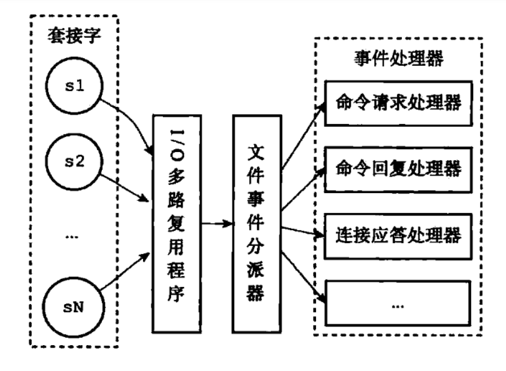
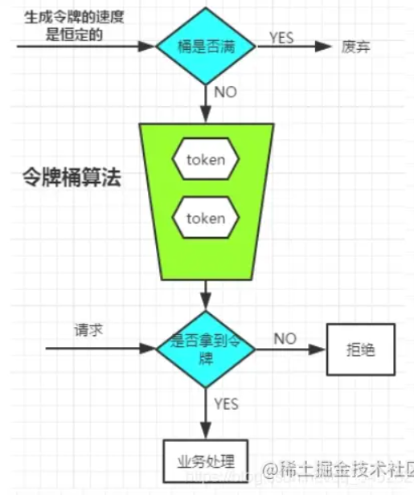

# Redis

## Redis 介绍

简单来说 **Redis 就是一个使用 C 语言开发的数据库**，不过与传统数据库不同的是 **Redis 的数据是存在内存中的** ，所以读写速度非常快，因此 Redis 被广泛应用于缓存方向。

另外，**Redis 除了做缓存之外，也经常用来做分布式锁，限流、甚至是消息队列 **。 Redis 提供了多种数据类型来支持完成复杂的业务场景，比如通过 bitmap 统计活跃用户、通过 zset（sorted set） 维护排行榜。除此之外，Redis 还支持**事务** 、**持久化**、**Lua 脚本**、**多种集群方案**。


## Redis出现背景

传统的关系型数据库如MySQL已经不能适用于所有场景了，比如秒杀的库存扣减，App的首页访问高峰等，都很容易把数据库打崩，所以引用了缓存中间件，目前市面上比较常见的分布式缓存中间件有redis和memcached。不过redis性能更佳。

分布式缓存主要解决的是单机缓存的容量受服务器限制并且无法保存通用信息的问题。因为，本地缓存只在当前服务里有效，比如如果你部署了两个相同的服务，他们两者之间的缓存数据是无法共同的。


##  Redis 和 Memcached 的区别和共同点

**共同点** ：

1. 都是基于内存的数据库，一般都用来当做缓存使用。
2. 都有过期策略。
3. 两者的性能都非常高。

**区别** ：

1. **Redis 支持更丰富的数据类型（支持更复杂的应用场景）**。Redis 不仅仅支持简单的 k/v 类型的数据，同时还提供 list，set，zset，hash 等数据结构的存储。Memcached 只支持最简单的 k/v 数据类型。
2. **Redis 支持数据的持久化，可以将内存中的数据保持在磁盘中，重启的时候可以再次加载进行使用,而 Memcached 把数据全部存在内存之中。**
3. **Redis 有灾难恢复机制。** 因为可以把缓存中的数据持久化到磁盘上。
4. **Redis 在服务器内存使用完之后，可以将不用的数据放到磁盘上。但是，Memcached 在服务器内存使用完之后，就会直接报异常。**
5. **Memcached 没有原生的集群模式，需要依靠客户端来实现往集群中分片写入数据；但是 Redis 目前是原生支持 cluster 模式的。**
6. **Memcached 是多线程，非阻塞 IO 复用的网络模型；Redis 使用单线程的多路 IO 复用模型。** （Redis 6.0 引入了多线程 IO ）
7. **Redis 支持发布订阅模型、Lua 脚本、事务等功能，而 Memcached 不支持。并且，Redis 支持更多的编程语言。**
8. **Memcached 过期数据的删除策略只用了惰性删除，而 Redis 同时使用了惰性删除与定期删除。**


## 为什么要用 Redis/为什么要用缓存？

首先从**高性能**角度来说，假如用户第一次访问数据库中的某些数据的话，这个过程是比较慢，毕竟是从硬盘中读取的。但是，如果说，用户访问的数据属于高频数据并且不会经常改变的话，那么我们就可以很放心地将该用户访问的数据存在缓存中。这样就保证了用户下一次再访问这些数据的时候就可以直接从缓存中获取了。操作缓存就是直接操作内存，所以速度相当快。

从**高并发**角度来说，一般像 MySQL 这类的数据库的 QPS 大概都在 1w 左右（4 核 8g） ，但是使用 Redis 缓存之后很容易达到 10w+，甚至最高能达到 30w+。

由此可见，直接操作缓存能够承受的数据库请求数量是远远大于直接访问数据库的，所以我们可以考虑把数据库中的部分数据转移到缓存中去，这样用户的一部分请求会直接到缓存这里而不用经过数据库。进而就提高了系统整体的并发。


## Redis 除了做缓存，还能做什么？

- **分布式锁** ： 通过 Redis 来做分布式锁是一种比较常见的方式。通常情况下，我们都是基于 Redisson 来实现分布式锁。相关阅读：[《分布式锁中的王者方案 - Redisson》open in new window](https://mp.weixin.qq.com/s/CbnPRfvq4m1sqo2uKI6qQw)。
- **限流** ：一般是通过 Redis + Lua 脚本的方式来实现限流。相关阅读：[《我司用了 6 年的 Redis 分布式限流器，可以说是非常厉害了！》open in new window](https://mp.weixin.qq.com/s/kyFAWH3mVNJvurQDt4vchA)。
- **消息队列** ：Redis 自带的 list 数据结构可以作为一个简单的队列使用。Redis5.0 中增加的 Stream 类型的数据结构更加适合用来做消息队列。它比较类似于 Kafka，有主题和消费组的概念，支持消息持久化以及 ACK 机制。
- **复杂业务场景** ：通过 Redis 以及 Redis 扩展（比如 Redisson）提供的数据结构，我们可以很方便地完成很多复杂的业务场景比如通过 bitmap 统计活跃用户、通过 zset维护排行榜。


## 常见数据结构以及使用场景分析

> [string、list对象底层结构](https://juejin.cn/post/6863256540439117831)

### string

1. **介绍**：

   Redis 的 简单动态字符串(simple dynamic string) 不仅可以保存**文本数据**还可以保存**二进制数据**，并且获取字符串长度复杂度为 O(1)（C 字符串为 O(N)）,除此之外，Redis 的字符串 API 是安全的，不会造成缓冲区溢出。

2. **应用场景：** 一般常用在需要计数的场景，比如用户的访问次数、热点文章的点赞转发数量等等。

3. **常用命令：** `set,get,strlen,exists,decr,incr,setex` 等等。

   

**字符串的基本操作：**

```
127.0.0.1:6379> set key value #设置 key-value 类型的值
127.0.0.1:6379> get key # 根据 key 获得对应的 value
127.0.0.1:6379> exists key  # 判断某个 key 是否存在
127.0.0.1:6379> strlen key # 返回 key 所储存的字符串值的长度。
127.0.0.1:6379> del key # 删除某个 key 对应的值
127.0.0.1:6379> mset key1 value1 key2 value2 #批量设置key-value的值
127.0.0.1:6379> set number 1
127.0.0.1:6379> incr number #将key中储存的数字值增1
127.0.0.1:6379> decr number #将key中储存的数字值减1
127.0.0.1:6379> expire key 60 #数据在60s后过期
127.0.0.1:6379> setex key 60 value #设置值并60s后过期
127.0.0.1:6379> ttl key #查看还有多久过期

(特殊的：)
APPEND key1 "hello" # 追加字符串，如果当前key不存在，就相当于set key
getset # 先get再set
setnx (set if not exist) #不存在再设置
```


### list

1. **介绍** ： C 语言并没有实现链表，所以 Redis 实现了自己的链表数据结构。Redis 的 list 的实现为一个 **双向链表**，可以支持反向查找和遍历，还可以用来实现队列和栈。
2. **应用场景:** 发布与订阅（消息队列）、解决秒杀项目中的超卖问题。
3. **常用命令:** `rpush,lpop,lpush,rpop,lrange,llen` 等。

下面我们简单看看它的使用！

**通过 rpush/lpop 实现队列：**

```
127.0.0.1:6379> rpush myList value1 # 向 list 的头部（右边）添加元素
(integer) 1
127.0.0.1:6379> rpush myList value2 value3 # 向list的头部（最右边）添加多个元素
(integer) 3
127.0.0.1:6379> lpop myList # 将 list的尾部(最左边)元素取出
"value1"
127.0.0.1:6379> lrange myList 0 1 # 查看对应下标的list列表， 0 为 start,1为 end
1) "value2"
2) "value3"
127.0.0.1:6379> lrange myList 0 -1 # 查看列表中的所有元素，-1表示倒数第一
1) "value2"
2) "value3"

```

**通过 rpush/rpop 实现栈：**

```
127.0.0.1:6379> rpush myList2 value1 value2 value3
(integer) 3
127.0.0.1:6379> rpop myList2 # 将 list的头部(最右边)元素取出
"value3"
```


**通过 lrange 查看对应下标范围的列表元素：**

```
127.0.0.1:6379> rpush myList value1 value2 value3
(integer) 3
127.0.0.1:6379> lrange myList 0 1 # 查看对应下标的list列表， 0 为 start,1为 end
1) "value1"
2) "value2"
127.0.0.1:6379> lrange myList 0 -1 # 查看列表中的所有元素，-1表示倒数第一
1) "value1"
2) "value2"
3) "value3"
```

通过 `lrange` 命令，你可以基于 list 实现分页查询，性能非常高！

**通过 llen 查看链表长度：**

```
127.0.0.1:6379> llen myList
(integer) 3

```


### hashtable

1. **介绍** ：hash 字典类似于 JDK1.8 前的 HashMap，内部实现也差不多，都是数组 + 链表。不过，Redis 的 hash 做了更多优化。另外，hash 是一个 string 类型的 field 和 value 的映射表，**特别适合用于存储对象**，后续操作的时候，你可以直接**仅仅修改这个对象中的某个字段的值**。
2. **常用命令：** `hset,hmset,hexists,hget,hgetall,hkeys,hvals` 等。
3. **应用场景:** 系统中对象数据的存储。

下面我们简单看看它的使用！

```
127.0.0.1:6379> hmset userInfoKey name "guide" description "dev" age "24"
OK
127.0.0.1:6379> hexists userInfoKey name # 查看 key 对应的 value中指定的字段是否存在。
(integer) 1
127.0.0.1:6379> hget userInfoKey name # 获取存储在哈希表中指定字段的值。
"guide"
127.0.0.1:6379> hget userInfoKey age
"24"
127.0.0.1:6379> hgetall userInfoKey # 获取在哈希表中指定 key 的所有字段和值
1) "name"
2) "guide"
3) "description"
4) "dev"
5) "age"
6) "24"
127.0.0.1:6379> hkeys userInfoKey # 获取 key 列表
1) "name"
2) "description"
3) "age"
127.0.0.1:6379> hvals userInfoKey # 获取 value 列表
1) "guide"
2) "dev"
3) "24"
127.0.0.1:6379> hset userInfoKey name "GuideGeGe" # 修改某个字段对应的值
127.0.0.1:6379> hget userInfoKey name
"GuideGeGe"

```

**原理：**

> 键和值字符串长度都小于64字节的时候使用的ziplist，大于时使用的是以下的表结构。

```
typedef struct dict {
    dictType *type;
    void *privdata;
    dictht ht[2];
    long rehashidx; 
    unsigned long iterators;
} dict;
```

Redis hash字典新建时默认将会创建一个哈希表数组，保存两个哈希表。其中 `table` 属性是个数组， 其中数组元素保存一种 `dictEntry` 的结构，这个结构完全类似与 HashMap 中的  `Entry` 类型，这个结构存储一个 KV 键值对。

同时，为了解决 hash 碰撞的问题，`dictEntry` 存在一个 next 指针，指向下一个`dictEntry` ，这样就形成  `dictEntry`  的链表。


但我们往新字典中添加元素时默认将会为字典中的第一个哈希表数组ht[0]分配空间，默认大小为4（**DICT_HT_INITIAL_SIZE**）

新添加元素的键值将会经过哈希算法，确定哈希表数组的位置，然后添加到相应的位置：


但继续添加元素产生相同的hash值发生哈希碰撞时，会采用链表的方式解决哈希冲突。和jdk1.7版本的HashMap类似，新元素会放在链表头结点，因为**新增加的元素，很大概率上会被再次访问，放在头结点增加访问速度。**

当我们元素增加越来越多时，哈希碰撞情况将会越来越频繁，这就会导致链表长度过长，极端情况下 O(1) 查询效率退化成 O(N) 的查询效率。

为此，字典必须进行扩容，这样就会使触发字典 rehash 操作。

**扩容**

```
// 负载因子 = 哈希表已保存的节点数量 / 哈希表大小
load_factor = ht[0].used / ht[0].size
```

扩容的条件：

如果服务器目前不在生成RDB文件或者在进行AOF重写时，哈希表的负载因子要大于等于1，如果在的话，哈希表的负载因子要大于等于5。

这是因为在生成RDB文件或者在进行AOF重写时，redis需要创建当前服务器进程的子进程，子进程存在期间，服务器会提高负载因子，避免子进程存在期间进行哈希扩展操作，最大限度节约内存。

当 Redis 进行 Rehash 扩容操作，首先将会为字典没有用到 `ht[1]` 哈希表分配更大空间。

> 画外音：
>
> 扩容：`ht[1]` 哈希表大小为(2的n 次方幂)中第一个大于等于 `ht[0].used*2` 的 数
>
> 收缩：`ht[1]` 哈希表大小为(2的n 次方幂)中第一个大于等于 `ht[0].used` 的 数


收缩的条件：

- 负载因子小于0.1的时候进行收缩


**渐进式rehash**

如果哈希表里保存的键值对很多，如果一次性将这些键值对全部rehash到新哈希表中，庞大的计算量会导致服务器在一段时间内停止服务，为了避免rehash对服务性能造成影响，服务器不是一次性全部rehash，而是分多次、渐进式的将ht[0]里面的键值对慢慢rehash到ht[1]。

渐进式rehash的步骤：

1. 为ht[1]分配空间，让字典同时持有ht[0]和ht[1]两个哈希表
2. 在字典中维持一个索引计数器变量rehashidx，并将它的值设置为0，表示rehash工作正式开始
3. 在rehash进行期间，每次对字典执行添加、删除、查找或更新操作，程序除了执行指定的操作以外，还会顺带将ht[0]哈希表在rehashidx索引上的所有键值对rehash到ht[1]，当rehash工作完成后，rehashidx属性增1
4. 随着字典操作的不断执行，最终ht[0]的所有键值对都会被rehash到ht[1]，这时程序将rehashidx属性值设置为-1，表示rehash操作完成。


在此期间，字典会同时使用ht[0]和ht[1]两个哈希表，查询的时候ht[0]没有就去ht[1]中查询，新数据插入到ht[1]中，保证了ht[0]包含的键值对数量只减不增，并随着rehash操作的执行而最终变成空表。

> [源码阅读](https://juejin.cn/post/6844903892908507149)


### set

1. **介绍 ：** Redis 中的 set 类型是一种**无序集合**，集合中的元素没有先后顺序。当你需要存储一个列表数据，又不希望出现重复数据时，set 是一个很好的选择，并且 set 提供了判断某个成员是否在一个 set 集合内的重要接口，这个也是 list 所不能提供的。可以基于 set 轻易实现**交集、并集、差集**的操作。比如：你可以将一个用户所有的关注人存在一个集合中，将其所有粉丝存在一个集合。Redis 可以非常方便的实现如共同关注、共同粉丝、共同喜好等功能。这个过程也就是求交集的过程。
2. **常用命令：** `sadd,spop,smembers,sismember,scard,sinterstore,sunion` 等。
3. **应用场景:** 需要存放的数据不能重复以及需要获取多个数据源交集和并集等场景

下面我们简单看看它的使用！

```
127.0.0.1:6379> sadd mySet value1 value2 # 添加元素进去
(integer) 2
127.0.0.1:6379> sadd mySet value1 # 不允许有重复元素
(integer) 0
127.0.0.1:6379> smembers mySet # 查看 set 中所有的元素
1) "value1"
2) "value2"
127.0.0.1:6379> scard mySet # 查看 set 的长度
(integer) 2
127.0.0.1:6379> sismember mySet value1 # 检查某个元素是否存在set 中，只能接收单个元素
(integer) 1
127.0.0.1:6379> sadd mySet2 value2 value3
(integer) 2
127.0.0.1:6379> sinterstore mySet3 mySet mySet2 # 获取 mySet 和 mySet2 的交集并存放在 mySet3 中
(integer) 1
127.0.0.1:6379> smembers mySet3
1) "value2"
127.0.0.1:6379> sinter mySet mySet2 #直接返回给定所以集合的交集
127.0.0.1:6379> sunion mySet mySet2 #直接返回给定所以集合的并集
```


### Zset！！！

1. **介绍：** 有序集合， 和 set 相比，sorted set 增加了一个权重参数 score，使得集合中的元素能够按 score 进行有序排列。
2. **常用命令：** `zadd,zcard,zscore,zrange,zrevrange,zrem` 等。
3. **应用场景：** 需要对数据根据某个权重进行排序的场景。比如在直播系统中，实时排行信息包含直播间在线用户列表，各种礼物排行榜，弹幕消息（可以理解为按消息维度的消息排行榜）等信息。（score保存当前时间戳）

```
127.0.0.1:6379> zadd myZset 3.0 value1 # 添加元素到 sorted set 中 3.0 为权重
(integer) 1
127.0.0.1:6379> zadd myZset 2.0 value2 1.0 value3 # 一次添加多个元素
(integer) 2
127.0.0.1:6379> zcard myZset # 查看 sorted set 中的元素数量
(integer) 3
127.0.0.1:6379> zscore myZset value1 # 查看某个 value 的权重
"3"
127.0.0.1:6379> zrange  myZset 0 -1 # 顺序输出某个范围区间的元素，0 -1 表示输出所有元素
1) "value3"
2) "value2"
3) "value1"
127.0.0.1:6379> zrange  myZset 0 1 # 顺序输出某个范围区间的元素，0 为 start  1 为 stop
1) "value3"
2) "value2"
127.0.0.1:6379> zrevrange  myZset 0 1 # 逆序输出某个范围区间的元素，0 为 start  1 为 stop
1) "value1"
2) "value2"

```

应用场景：

```
- 存储粉丝列表，value是粉丝的ID，score是关注时间戳，这样可以对粉丝关注进行排序
- 存储学生成绩，value使学生的ID，score是学生的成绩，这样可以对学生的成绩排名
```

**zset的实现原理：**

> 问有没有了解过redis底层的时候可以答这个
>
> ziplist怎样实现的？

- ziplist（压缩列表）：满足以下两个条件的时候
  - 元素数量少于128的时候
  - 每个元素的长度小于64字节
- skiplist：不满足上述两个条件就会使用跳表，具体来说是组合了**map**和**skiplist**
  - map用来存储value到score的映射，这样就可以在O(1)时间内找到member对应的分数
  - skiplist按从小到大的顺序存储分数
  - skiplist每个元素的值都是[score,value]对

**ziplist**

压缩列表是由一系列特殊编码的**连续内存块**组成的顺序型数据结构，它通过对数据的**动态编码**，能够很大程度节省内存使用。

压缩列表整体数据结构：


- zlbytes，长度为 4 字节，记录整个压缩列表占用的内存字节数，在进行内存重分配或者计算 zlend 位置时使用
- zltail，长度为 4 字节，记录压缩列表尾节点距离起始位置的偏移字节数，可以通过它快速定位到尾结点，而无需遍历列表
- zllen，长度为 2字节，记录了列表包含的节点数量，但需要注意的是当节点数量大于 65535 时，节点数量需要遍历整个列表才能计算得到
- entry，长度不定，列表中的节点，长度由节点中保存的数据决定
- zlend，长度 1 字节，特殊字符标识列表结尾

节点的数据结构：


previous_entry_length属性记录了**前一个节点的长度，通过它可以计算出前一个节点的起始地址**，达到节点回溯的效果。

encoding属性记录了节点的content属性所保存数据的类型以及长度。

content属性负责保存节点的值，节点值可以是一个字节数组或者整数，值的类型和长度由节点的encoding属性决定。

**skiplist** （跳表）！！！

对于一个单向链表来说，即使链表中存储的是有序的数据，但如果想要从中查找某个数据时，也只能从头到尾遍历链表，时间复杂度为O（n）。

skiplist本质上是**并行**的**有序链表**，但它克服了有序链表插入和查找性能不高的问题。它的插入和查询的时间复杂度都是O(logN)

redis中skiplist的MaxLevel设定为32层。一个元素插入skiplist后，会随机分配一个层数。每次查找的时候，类似“二分查找”的方法，如果下一个结点的val值大于要查找的val值，就往下一个层的结点搜索。为了提高搜索效率，redis会缓存MaxLevel的值，在每次插入/删除节点后都会去更新这个值，这样每次搜索的时候不需要从32层开始搜索，而是从MaxLevel指定的层数开始搜索。跳表对标的是平衡树，是一种提升链表插入、删除、搜索效率的数据结构。


**插入和删除**

在插入、删除时，会先通过使用一个随机函数来决定这个结点插入时，是否需要插入到索引层、以及插入到第几层索引。这个随机函数会随机生成 1 到索引最高层数之间的一个数字，该方法有 1/2的概率返回 1、有 1/4的概率返回 2、有 1/8 的概率返回 3、以此类推。其中 1 表示不需要生成索引，2 表示需要生成一级索引，3 表示需要生成二级索引，以此类推。然后通过遍历找到插入的节点，并记录下需要更新层指针的节点，最后进行更新即可。

一般来说，通过随机函数得到的数据都是比较均匀的，也表示最终得到的跳表索引层也是比较均匀，而且数据量越大，索引层越是均匀。


**效率分析**

假设每两个结点会抽出一个结点作为上一级索引的结点，第一级的索引个数为n/2，第二级为n/4，第k个结点为n/pow（2，k）。层高为log2 n

**动态处理**

跳表在新增、删除结点时需要做动态处理，负责容易出现某个区域出现很多个结点的情况，容易导致检索效率降低。


**跳表和平衡查找树**

与平衡查找树相比，跳表拥有以下优势：

- 跳表的底层原始链表支持范围查询
- 跳表相对简单，更容易使用代码实现
- 跳表更加灵活，可以通过改变索引构建策略，有效平衡执行效率和内存消耗

针对上述的第 1 点，支持范围查询的 B+ 树更适用于磁盘，跳表主要用于内存中读取数据。


### bitmap

1. **介绍：** bitmap 存储的是连续的二进制数字（0 和 1），通过 bitmap, 只需要一个 bit 位来表示某个元素对应的值或者状态，key 就是对应元素本身 。我们知道 8 个 bit 可以组成一个 byte，所以 bitmap 本身**会极大的节省储存空间。**
2. **常用命令：** `setbit` 、`getbit` 、`bitcount`、`bitop`
3. **应用场景：** 适合需要保存状态信息（比如是否签到、是否登录...）并需要进一步对这些信息进行分析的场景。比如**用户签到情况**、**活跃用户情况**、**用户行为统计**（比如是否点赞过某个视频）。

```
# SETBIT 会返回之前位的值（默认是 0）这里会生成 7 个位
127.0.0.1:6379> setbit mykey 7 1
(integer) 0
127.0.0.1:6379> setbit mykey 7 0
(integer) 1
127.0.0.1:6379> getbit mykey 7
(integer) 0
127.0.0.1:6379> setbit mykey 6 1
(integer) 0
127.0.0.1:6379> setbit mykey 8 1
(integer) 0
# 通过 bitcount 统计被被设置为 1 的位的数量。
127.0.0.1:6379> bitcount mykey
(integer) 2

```

针对上面提到的一些场景，这里进行进一步说明。

**使用场景一：用户行为分析** 很多网站为了分析你的喜好，需要研究你点赞过的内容。

```
# 记录你喜欢过 001 号小姐姐
127.0.0.1:6379> setbit beauty_girl_001 uid 1
```

**使用场景二：统计活跃用户**

使用时间作为 key，然后用户 ID 为 **offset**，如果当日活跃过就设置为 1

那么我该如何计算某几天/月/年的活跃用户呢(暂且约定，统计时间内只要有一天在线就称为活跃)，有请下一个 redis 的命令

```
# 对一个或多个保存二进制位的字符串 key 进行位元操作，并将结果保存到 destkey 上。
# BITOP 命令支持 AND 、 OR 、 NOT 、 XOR 这四种操作中的任意一种参数
BITOP operation destkey key [key ...]
```

初始化数据：

```
127.0.0.1:6379> setbit 20210308 1 1
(integer) 0
127.0.0.1:6379> setbit 20210308 2 1
(integer) 0
127.0.0.1:6379> setbit 20210309 1 1
(integer) 0

```

统计 20210308~20210309 总活跃用户数: 1

```
127.0.0.1:6379> bitop and desk1 20210308 20210309
(integer) 1
127.0.0.1:6379> bitcount desk1
(integer) 1
```

统计 20210308~20210309 在线活跃用户数: 2

```
127.0.0.1:6379> bitop or desk2 20210308 20210309
(integer) 1
127.0.0.1:6379> bitcount desk2
(integer) 2

```

**使用场景三：用户在线状态**

对于获取或者统计用户在线状态，使用 bitmap 是一个节约空间且效率又高的一种方法。

只需要一个 key，然后用户 ID 为 offset，如果在线就设置为 1，不在线就设置为 0。


**三种特殊的数据类型**

### geospatial

```bash
geoadd # 添加地理位置（两级无法直接添加）我们一般会下载城市数据，通过java程序一次性导入
#参数 key 值（纬度、经度、名称）
geopos # 获取当前定位
geodist # 两人之间的距离（直线）
georadius cite:location 117 39 200km withdist(返回和中心距离）/withcoord（返回经纬度）# 我附近的人？（获取所有附近的人的地址，定位！）通过半径来查询
georadiusmember #找出位于指定元素周围的其他元素
geohash  # 将二维的经纬度转换为一堆的字符串，如果两个字符串越接近，那么则距离越近
```

GEO底层的实现原理是Zset


### Hyperloglog

统计uv时需要去重，可以使用set集合来存储所有当天访问的用户ID，使用sadd将用户ID塞进去，再通过scard可以取出大小，这个数字就是这个页面的用户访问数据。但是如果有几千万的用户访问量则需要很大的set集合来做统计。这个时候就可以使用Hyperloglog提供**不精确的去重计数方案**，误差大概为0.81%，这样的精确度已经满足上面的用户访问量统计需求了。

```bash
Pfadd key value1 # 创建元素
Pfcount key # 统计基数数量
Pfmerge key1 key2 #  合并两组
```

算法实现：比如有一定数量的用户user，通过hash得到一串位字符串bitString，记录其中**最大连续零位**，比如是4的话，user的不重复个数为2的4次方为16，除了这个还使用了其他优化：分桶，调和平均数等等。


## Redis 单线程模型详解

### Redis为什么这么快？

- 完全基于内存操作
- c语言实现，对基础的数据结构做了大量的优化
- 使用单线程，无上下文的切换成本，而且也不会导致死锁
- 基于非阻塞的IO多路复用机制来处理大量的客户端Socket请求


### Redis是单线程的吗？

**Redis 基于 Reactor [riˈæktə(r)] 来设计开发了自己的一套高效的事件处理模型** ，这套事件处理模型对应的是 Redis 中的文件事件处理器（file event handler）。由于文件事件处理器（file event handler）是单线程方式运行的，所以我们一般都说 Redis 是单线程模型。

Redis 通过**IO 多路复用** 来监听来自客户端的大量连接，它会将感兴趣的事件及类型注册到内核中并监听每个事件是否发生。当被监听的套接字准备好执行连接应答（accept）、读取（read）、写入（write）、关 闭（close）等操作时，与操作相对应的文件事件就会产生，这时文件事件处理器就会调用套接字之前关联好的事件处理器来处理这些事件。

这样的好处非常明显： **I/O 多路复用技术的使用让 Redis 不需要额外创建多余的线程来监听来自客户端的大量连接，降低了资源的消耗**（和 NIO 中的 `Selector` 组件很像）。

>  文件事件处理器（file event handler）主要是包含 4 个部分：

- 多个 socket（客户端连接）
- IO 多路复用程序（支持多个客户端连接的关键）
- 文件事件分派器（将 socket 关联到相应的事件处理器）
- 事件处理器（连接应答处理器、命令请求处理器、命令回复处理器）



### Redis 为什么不使用多线程？

虽然说 Redis 是单线程模型，但是**Redis 在 4.0 之后的版本中就已经加入了对多线程的支持。**增加的多线程主要是针对一些大键值对的删除操作的命令，使用这些命令时就会使用主处理线程之外的其他线程来“异步处理”。

>4.0添加的非阻塞的命令，会交给后台线程来执行
>
>del  key-> unlike key flushall -> flushall async   (删除所有库) flushdb -> flushdb async  （删除当前库）
>

大体上来说，**Redis 6.0 之前主要还是单线程处理。**为什么不使用多线程？我觉得主要原因有下面 3 个：

- 第一点：单线程编程容易并且更容易维护。
- 第二点：Redis 的性能瓶颈不在 CPU ，主要在内存和网络；如果这种吞吐量不能满足我们的需求，更推荐的做法是使用分片的方式将不同的请求交给不同的Redis服务器来处理，而不是在同一个Redis服务器中引入大量的多线程操作。
- 第三点：多线程会存在死锁、线程上下文切换等问题，甚至会影响性能。

总的来说，Redis并不是cpu密集型的服务，如果不开启**持久化**，所有Redis的操作都会在内存中完成而不会涉及任何的磁盘I/O操作，这些数据的读写只发生在内存中，所以处理速度非常的快，整个服务的瓶颈在于网络传输带来的延迟和等待客户端的数据传输，也就是网络I/O，所以使用多线程模型来处理全部的外部请求可能不是一个好的方案。

> AoF是Redis的一种持久化机制，它会在每次收到来自客户端的请求时，将其记录到日志中，每次Redis服务器启动时都会重放AoF日志构建原始的数据集，保证数据的持久性。


### Redis6.0 之后为何引入了多线程？

> redis存在线程安全问题吗?
>
> 第一个，从Redis 服务端层面。redis6.0之前的单线程的，不用不会存在线程安全问题。
>
> 为什么不使用多线程？我觉得主要原因有下面 3 个：巴拉巴拉
>
> redis6.0之后引入了多线程，往下巴拉巴拉
>
> 第二个，从Redis客户端层面。
>
> 虽然Redis Server中的指令执行是原子的，但是如果有多个Redis客户端同时执行多个指令的时候，就无法保证原子性。
>
> 假设两个redis client同时获取Redis Server上的key1， 同时进行修改和写入，因为多线程环境下的原子性无法被保障，以及多进程情况下的共享资源访问的竞争问题，使得数据的安全性无法得到保障。
>
> 
>
> 当然，对于客户端层面的线程安全性问题，解决方法有很多，比如尽可能的使用Redis里面的原子指令，或者对多个客户端的资源访问加锁，或者通过Lua脚本来实现多个指令的操作等等。
>
> 以上就是我对这个问题的理解。

**Redis6.0 引入多线程主要是为了提高网络 IO 读写性能**，因为这个算是 Redis 中的一个性能瓶颈。

虽然，Redis6.0 引入了多线程，但是 Redis 的多线程只是在网络数据的读写这类耗时操作上使用了，执行命令仍然是单线程顺序执行。因此，我们也不需要担心线程安全问题。

Redis6.0 的多线程默认是禁用的，只使用主线程。如需开启需要修改 redis 配置文件 `redis.conf` ：

```
io-threads-do-reads yes

```

开启多线程后，还需要设置线程数，否则是不生效的。同样需要修改 redis 配置文件 `redis.conf` :

```
io-threads 4 #官网建议4核的机器建议设置为2或3个线程，8核的建议设置为6个线程
```


## Redis缓存数据过期

### Redis 给缓存数据设置过期时间有啥用？

- 内存是有限的，设置过期时间有助于缓解内存的消耗，防止Out of memory（OOM）。
- 很多时候，我们的业务场景就是需要某个数据只在某一时间段内存在，比如我们的短信验证码可能只在 1 分钟内有效，用户登录的 token 可能只在 1 天内有效。如果使用传统的数据库来处理的话，一般都是自己判断过期，这样更麻烦并且性能要差很多。

Redis 自带了给缓存数据设置过期时间的功能，比如：

```
127.0.0.1:6379> exp key 60 # 数据在 60s 后过期
(integer) 1
127.0.0.1:6379> setex key 60 value # 数据在 60s 后过期 (setex:[set] + [ex]pire)
OK
127.0.0.1:6379> ttl key # 查看数据还有多久过期
(integer) 56
```

注意：**Redis 中除了字符串类型有自己独有设置过期时间的命令 setex 外，其他方法都需要依靠 expire 命令来设置过期时间 。另外， persist 命令可以移除一个键的过期时间。**


### expire注意事项

- 生存时间可以通过使用Del命令来删除整个key来移除，或者被set和getset命令覆写
- 对一个key执行Incr命令，对一个列表进行lpush命令，或者对一个哈希表执行hset命令，不会修改key本身的生存时间
- 使用rename命令，老key的过期时间将会转到新key上
- 使用persist命令可以不删除key的情况下移除key的生存时间，也可以用expire命令更新生存时间
- 过期时间为负数或者设置过期时间戳为过去的时间将会导致key删除


### 如果大量的key需要同一时间过期，需要注意什么

如果大量的key过期时间设置的过于集中，到过期的那个时间点，redis可能会出现短暂的卡顿现象。严重的话会出现缓存雪崩，所以我们一般需要在时间上加一个随机值，使得过期时间分散一些。


### Redis 是如何判断数据是否过期的呢？

Redis 通过一个叫做过期字典（可以看作是 hash 表）来保存数据过期的时间。**过期字典的键指向 Redis 数据库中的某个 数据库key(键)，过期字典的值是一个 long long 类型的整数，这个整数保存了过期字典键所指向的数据库键的过期时间**（毫秒精度的 UNIX 时间戳）。


过期字典是存储在 redisDb 这个结构里的：

```
typedef struct redisDb {
    ...

    dict *dict;     //数据库键空间,保存着数据库中所有键值对
    dict *expires   // 过期字典,保存着键的过期时间
    ...
} redisDb;

```


### 过期的数据的删除策略

Redis常用的过期数据的删除策略有两种：惰性删除和定期删除

1. **惰性删除** ：只会在取出 key 的时候才对数据进行过期检查。这样对 CPU 友好，但是可能会造成太多过期 key 没有被删除。

2. **定期删除** ： Redis会每隔一段时间从过期字典中随机抽取一批 key 执行删除过期 key 操作。

   Redis默认每秒进行10次过期扫描：

   1.从过期字典中随机抽取20个key

   2.然后删除这20个key中已过期的

   3.如果超过25%的key过期，则重复上述步骤

   同时，为了保证不会出现循环过度的情况，redis还设置了扫描的时间上限，默认不会超过25ms

惰性删除对 CPU 更加友好，定期删除对内存更加友好。两者各有千秋，所以 Redis 采用的是 **定期删除+惰性删除** 结合。

但是，还是可能存在定期删除和惰性删除漏掉了很多过期 key 的情况。这样就导致大量过期 key 堆积在内存里，然后就 Out of memory 了。这个问题的解决靠的是**Redis 内存淘汰机制。**


### Redis 内存淘汰机制

> 相关问题：
>
> 1.过期策略可能还会剩下很多过期key，导致out of memory，怎么办？
>
> 2.MySQL 里有 2000w 数据，Redis 中只存 20w 的数据，如何保证 Redis 中的数据都是热点数据?

Redis配置文件中可以设置内存的最大使用量，到达限度时会执行内存淘汰机制。没有配置时，默认为no-eviction([ɪˈvɪkʃn)：**不进行数据淘汰，而是不再提供服务，直接返回错误。**

针对「进行数据淘汰」这一类策略，又可以细分为「在设置了过期时间的数据中进行淘汰」和「在所有数据中进行淘汰」这两类策略。

 在设置了过期时间的数据中进行淘汰：

- **volatile-ttl**：优先淘汰更早过期的键值。

- **volatile-random**（ˈvɒlətaɪl-[ˈrændəm] ）：随机淘汰设置了过期时间的键值；
- **volatile-lru**（Redis3.0 之前，默认的内存淘汰策略）：淘汰所有设置了过期时间的键值中，最近最久未使用的键值；
- **volatile-lfu**（Redis 4.0 后新增的内存淘汰策略）：淘汰所有设置了过期时间的键值中，最少使用的键值；

在所有数据范围内进行淘汰：

- **allkeys-random**：随机淘汰任意键值;
- **allkeys-lru**：淘汰整个键值中，最近最久未使用的键值；
- **allkeys-lfu**（Redis 4.0 后新增的内存淘汰策略）：淘汰整个键值中，最少使用的键值。


### 缓存淘汰策略

> 如何保证缓存数据是热点数据

由于数据存储受限，系统并不是将所有数据都需要存放到缓存中的，而**只是将其中一部分热点数据缓存起来**，所以我们要设计一个热点数据动态缓存的策略。

热点数据动态缓存的策略总体思路：**通过数据最新访问时间来做排名，并过滤掉不常访问的数据，只留下经常访问的数据**。

以电商平台场景中的例子，现在要求只缓存用户经常访问的 Top 1000 的商品。具体细节如下：

- 先通过缓存系统做一个排序队列（比如存放 1000 个商品），系统会根据商品的访问时间，更新队列信息，越是最近访问的商品排名越靠前；
- 同时系统会定期过滤掉队列中排名最后的 200 个商品，然后再从数据库中随机读取出 200 个商品加入队列中；
- 这样当请求每次到达的时候，会先从队列中获取商品 ID，如果命中，就根据 ID 再从另一个缓存数据结构中读取实际的商品信息，并返回。

在 Redis 中可以用 zadd 方法和 zrange 方法来完成排序队列和获取 200 个商品的操作。


## Redis bigkey问题

### 什么是 bigkey？

简单来说，如果一个 key 对应的 value 所占用的内存比较大，那这个 key 就可以看作是 bigkey。具体多大才算大呢？有一个不是特别精确的参考标准：string 类型的 value 超过 10 kb，复合类型的 value 包含的元素超过 5000 个（对于复合类型的 value 来说，不一定包含的元素越多，占用的内存就越多）。

### bigkey 有什么危害？

除了会消耗更多的内存空间，bigkey 对性能也会有比较大的影响。

因此，我们应该尽量避免写入 bigkey！

### 如何发现 bigkey？

**1、使用 Redis 自带的 --bigkeys 参数来查找。**

**原理**：使用scan命令去遍历所有的键，对每个键根据其类型执行"strlen","llen","scard","hlen","zcard"这些命令获取长度或者元素个数

**缺点：** 需要线上使用，会对redis的性能有一点影响。而且只能找到每种数据结构的top1，比如占用内存最大的string数据类型，包含元素最多的复合数据类型，而且元素最多不一定占用空间大。

```
# redis-cli -p 6379 --bigkeys

# Scanning the entire keyspace to find biggest keys as well as
# average sizes per key type.  You can use -i 0.1 to sleep 0.1 sec
# per 100 SCAN commands (not usually needed).

[00.00%] Biggest string found so far '"ballcat:oauth:refresh_auth:f6cdb384-9a9d-4f2f-af01-dc3f28057c20"' with 4437 bytes
[00.00%] Biggest list   found so far '"my-list"' with 17 items

-------- summary -------

Sampled 5 keys in the keyspace!
Total key length in bytes is 264 (avg len 52.80)

Biggest   list found '"my-list"' has 17 items
Biggest string found '"ballcat:oauth:refresh_auth:f6cdb384-9a9d-4f2f-af01-dc3f28057c20"' has 4437 bytes

1 lists with 17 items (20.00% of keys, avg size 17.00)
0 hashs with 0 fields (00.00% of keys, avg size 0.00)
4 strings with 4831 bytes (80.00% of keys, avg size 1207.75)
0 streams with 0 entries (00.00% of keys, avg size 0.00)
0 sets with 0 members (00.00% of keys, avg size 0.00)
0 zsets with 0 members (00.00% of keys, avg size 0.00

```


**2、分析 RDB 文件**

通过分析 RDB 文件来找出 big key。这种方案的前提 Redis 采用的是 RDB 持久化。

网上有现成的代码/工具可以直接拿来使用：

- [redis-rdb-toolsopen in new window](https://github.com/sripathikrishnan/redis-rdb-tools) ：Python 语言写的用来分析 Redis 的 RDB 快照文件用的工具

- [rdb_bigkeysopen in new window](https://github.com/weiyanwei412/rdb_bigkeys) : Go 语言写的用来分析 Redis 的 RDB 快照文件用的工具，性能更好。

  ​

#### **Key的模糊匹配**

> key时间复杂度为O（N），会阻塞redis多路复用的io主线程，所以应该在生产环境禁止用使用keys和类似的命令smembers。
>
> scan可以不阻塞生产环境来提取出指定模式的key列表，但是会有一定的重复概率，在客户端做一次去重就可以了

**keys指令：**

KEYS * 匹配数据库中所有 key 。
KEYS h?llo 匹配 hello ， hallo 和 hxllo 等。
KEYS h*llo 匹配 hllo 和 heeeeello 等。
KEYS h[ae]llo 匹配 hello 和 hallo ，但不匹配 hillo 作者：

**scan指令：**

- 基于游标的迭代器,需要基于上一次游标延续之前的迭代过程
- 以0作为游标开始一次新的迭代,直到命令返回游标0完成一次遍历
- 不保证每次执行都会返回某个给定数量的元素,支持模糊查询
- 一次返回的数量不可控,只能是大概率符合count参数，key有可能是重复的，可以利用Set进行去重

**语法** `scan cursor [MATCH pattern] [COUNT count]`

```
127.0.0.1:6380> scan 0 match k1* count 10
1) "655360"
2) 1) "k1864385"
   2) "k1392840"
   3) "k1388130"
   4) "k1357007"
   5) "k1743332"
   6) "k1593973"
   7) "k1399047"
127.0.0.1:6380> scan 655360 match k1* count 10
1) "327680"
2) 1) "k1610178"
   2) "k1693505"
   3) "k1032175"
   4) "k1721788"
   5) "k1678140"
   6) "k1359412"
```


## Redis 持久化机制！！！

Redis 共有三种数据持久化的方式：

- **RDB 快照**：将某一时刻的内存数据，以二进制的方式写入磁盘；

- **AOF 日志**：每执行一条写操作命令，就把该命令以追加的方式写入到一个文件里；
- **混合持久化方式**：Redis 4.0 新增的方式，集成了 AOF 和 RBD 的优点

#### **RDB快照**

Redis 可以通过创建快照来获得存储在内存里面的数据在某个时间点上的副本。Redis 创建快照之后，可以对快照进行备份，可以将快照复制到其他服务器从而创建具有相同数据的服务器副本（Redis 主从结构，主要用来提高 Redis 性能），还可以将快照留在原地以便重启服务器的时候使用。

RDB 文件是二进制文件，无论是要把 RDB 写入磁盘，还是要通过网络传输 RDB，IO 效率都比记录和传输 AOF 的高。

Redis 提供了两个命令来生成 RDB 文件，分别是 save 和 bgsave：

- 执行了 save 命令，就会在主线程生成 RDB 文件，由于和执行操作的命令在同一个线程，所以如果生成 RDB 文件的时间太长，**会阻塞主线程**；
- 执行了 bgsave 命令，会创建一个子进程来生成 RDB 文件，这样可以**避免主线程的阻塞**；

Redis 还可以通过配置文件的选项来实现每隔一段时间自动执行一次 bgsave 命令，默认会提供以下配置：

```
save 900 1           #在900秒之后，如果至少有1个key发生变化，Redis就会自动触发BGSAVE命令创建快照。

save 300 10          #在300秒之后，如果至少有10个key发生变化，Redis就会自动触发BGSAVE命令创建快照。

save 60 10000        #在60秒之后，如果至少有10000个key发生变化，Redis就会自动触发BGSAVE命令创建快照。
```

#### **AOF日志**8.30背

> append-only file

Redis 在执行完一条写操作的命令之后，就会把该命令以追加的方式写入到一个日志文件里，然后 Redis 重启时，会读取该日志文件记录的命令，然后逐一执行命令来进行数据恢复。


Reids 是先执行写操作命令后，才将该命令记录到 AOF 日志里的，这么做可以

- **避免写入错误的命令**：因为如果先将写操作命令记录到 AOF 日志里，再执行该命令的话，如果当前的命令语法有问题，将错误的命令记录到 AOF 日志里后，Redis 在使用日志恢复数据时，就可能会出错。
- **而且记录日志不会阻塞当前写操作命令的执行**：因为当写操作命令执行成功后，才会将命令记录到 AOF 日志。

与RDB快照持久化相比，AOF日志持久化的实时性更好，因此已成为主流的持久化方案。默认情况下 Redis 没有开启 AOF日志持久化，可以通过 `appendonly yes` 命令开启

开启 AOF 日志持久化后每执行一条写操作命令，Redis 就会将该命令写入到内存缓存 `server.aof_buf` 中，然后再根据 `appendfsync` 配置来决定何时将其同步到硬盘中的 AOF 文件中。

Redis 提供了 3 种写回硬盘的策略。

```
appendfsync always    #每次有数据修改发生时都会写入AOF文件,这样会严重降低Redis的速度
appendfsync everysec  #每秒钟同步一次，显式地将多个写命令同步到硬盘
appendfsync no        #让操作系统决定何时进行同步
```

为了兼顾数据和写入性能，用户可以考虑 `appendfsync everysec` 选项 ，让 Redis 每秒同步一次 AOF 文件，Redis 性能几乎没受到任何影响。而且这样即使出现系统崩溃，用户最多只会丢失一秒之内产生的数据。当硬盘忙于执行写入操作的时候，Redis 还会优雅的放慢自己的速度以便适应硬盘的最大写入速度。

#### **AOF重写**

Redis 为了避免 AOF 文件越写越大，提供了 **AOF 重写机制**，当 AOF 文件的大小超过所设定的阈值后，Redis 就会启用 AOF 重写机制，来压缩 AOF 文件。

AOF 重写机制是在重写时，读取当前数据库中的所有键值对，然后将每一个键值对用一条命令记录到「新的 AOF 文件」中，等到全部记录完后，就将新的 AOF 文件替换掉现有的 AOF 文件。

新的 AOF 文件只保存当前最新的键值对，去除了键值对的【历史】命令，相当于压缩了AOF文件，使得 AOF 文件体积变小了。

**过程：**

在执行后台子进程BGREWRITEAOF 命令时，Redis 服务器会维护一个 AOF 重写缓冲区，该缓冲区会在子进程创建新 AOF 文件期间，记录服务器执行的所有写命令。当子进程完成创建新 AOF 文件的工作之后，服务器会将重写缓冲区中的所有内容追加到新 AOF 文件的末尾，使得新的 AOF 文件保存的数据库状态与现有的数据库状态一致。最后，服务器用新的 AOF 文件替换旧的 AOF 文件，以此来完成 AOF 文件重写操作。


#### 混合持久化

RDB 优点是数据恢复速度快，但是快照的频率不好把握。频率太低，丢失的数据就会比较多，频率太高，就会影响性能。

AOF 优点是丢失数据少，但是数据恢复不快。

为了集成了两者的优点， Redis 4.0 提出了**混合使用 RDB快照持久化和AOF日志持久化**，既保证了数据的恢复速度，又降低数据丢失风险。

混合持久化工作在 **AOF 日志重写过程**，在 AOF 重写日志时，fork 出来的重写子进程会先将与主线程共享的内存数据以 RDB 方式写入到 AOF 文件，然后主线程处理的操作命令会被记录在重写缓冲区里，重写缓冲区里的增量命令会以 AOF 方式写入到 AOF 文件，写入完成后通知主进程将新的含有 RDB 格式和 AOF 格式的 AOF 文件替换旧的的 AOF 文件。

也就是说，使用了混合持久化，AOF 文件的**前半部分是 RDB 格式的全量数据，后半部分是 AOF 格式的增量数据**。重启 Redis 恢复数据的时候，前半部分的 RDB 格式的数据**恢复的时候速度会很快**。后半部分的AOF格式的数据可以保证重写 AOF 期间**数据更少的丢失**。


## Redis 事务

### 实现事务

Redis 可以通过 **MULTI，EXEC，DISCARD 和 WATCH** 等命令来实现事务(transaction)功能。

```
> MULTI
OK
> SET USER "xiebaoming"
QUEUED
> GET USER
QUEUED
> EXEC
1) OK
2) "xiebaoming"
```

使用 MULTI 命令后可以输入多个命令。Redis 不会立即执行这些命令，而是将它们放到队列，当调用了 EXEC 命令用先进先出（FIFO）的顺序执行所有命令。

### 取消事务

你也可以通过 DISCARD 命令取消一个事务，它会清空事务队列中保存的所有命令。

```
> MULTI
OK
> SET USER "xiebaoming"
QUEUED
> GET USER
QUEUED
> DISCARD
OK

```

### 监听事务

WATCH 命令用于监听指定的键，当调用 `EXEC` 命令执行事务时，如果一个被 `WATCH` 命令监视的键被修改的话，整个事务都不会执行，直接返回失败。

```
> WATCH USER
OK
> MULTI
> SET USER "Guide哥"
OK
> GET USER
Guide哥
> EXEC
ERR EXEC without MULTI
```


### 为什么没有事务回滚

**Redis 是不支持 roll back 的，因而不满足原子性的（而且不满足持久性）。**

Redis 官网解释了为什么事务不支持回滚。简单来说就是 Redis 开发者们觉得没必要支持回滚，这样更简单便捷并且性能更好。认为即使命令执行错误也应该在开发过程中就被发现而不是生产过程中。

可以将Redis 中的事务理解为 ：**Redis 事务提供了一种将多个命令请求打包的功能。然后，再按顺序执行打包的所有命令，并且不会被中途打断。**


## Redis 可以做消息队列么？

Redis 5.0 新增加的一个数据结构 `Stream` 可以用来做消息队列，`Stream` 支持：

- 发布 / 订阅模式
- 按照消费者组进行消费
- 消息持久化（ RDB 和 AOF）

不过，和专业的消息队列相比，还是有很多欠缺的地方比如消息丢失和堆积问题不好解决。

我们通常建议是不需要使用 Redis 来做消息队列的，你完全可以选择市面上比较成熟的一些消息队列比如 RocketMQ、Kafka。

相关文章推荐：[Redis 消息队列的三种方案（List、Streams、Pub/Sub）open in new window](https://javakeeper.starfish.ink/data-management/Redis/Redis-MQ.html)。


## 缓存*


### 缓存穿透！！！再看一遍

#### 什么是缓存穿透？

当用户访问的数据，**既不在缓存中，也不在数据库中**，导致请求在访问缓存时，发现缓存里没有，再去访问数据库时，发现数据库中也没有要访问的数据，没办法构建缓存数据来服务后续的请求。那么当有大量这样的请求到来时，数据库的压力骤增，这就是**缓存穿透**的问题。

#### 有哪些解决办法？

1.非法请求的限制

可以在 API 入口处判断请求参数是否合理，请求参数是否含有非法值、请求字段是否存在，如果判断出是恶意请求就直接返回错误，避免进一步访问缓存和数据库。

2.缓存空值或者默认值

当我们线上业务发现缓存穿透的现象时，可以针对查询的数据，在缓存中设置一个空值或者默认值，这样后续请求就可以从缓存中读取到空值或者默认值返回给应用，而不会继续查询数据库。

3.布隆过滤器

我们可以在写入数据库数据时，使用布隆过滤器做个标记，然后在用户请求到来时，可以通过查询布隆过滤器快速判断数据是否存在，如果不存在，直接返回错误，就不用通过查询缓存或者数据库来判断数据是否存在。

Redis 自身也是支持布隆过滤器的。但是，需要注意的是布隆过滤器可能会存在误判的情况。总结来说就是： **布隆过滤器说某个元素存在，小概率会误判。布隆过滤器说某个元素不存在，那么这个元素一定不存在。**

*为什么会出现误判的情况呢? 我们还要从布隆过滤器的原理来说！*

当一个元素加入布隆过滤器中的时候，会使用布隆过滤器中的哈希函数对元素值进行计算，得到哈希值。然后根据得到的哈希值，在位数组中把对应下标的值置为 1。

当我们需要判断一个元素是否存在于布隆过滤器的时候，会对给定元素再次进行相同的哈希计算。得到值之后判断位数组中对应下标的值是否为 1，如果值都为 1那么说明这个值在布隆过滤器中，如果存在一个值不为 1，说明该元素不在布隆过滤器中。

有概率出现**不同的字符串可能哈希出来的位置相同。** 也就是产生了哈希冲突问题 ，可以适当增加位数组大小或者调整我们的哈希函数来降低概率。


### 缓存雪崩

#### 什么是缓存雪崩？

当**大量缓存数据在同一时间过期失效或者 Redis 服务不可用**时，如果此时有大量的用户请求，都无法在 Redis 中处理，于是全部请求都直接访问数据库，从而导致数据库的压力骤增，严重的会造成数据库宕机，从而形成一系列连锁反应，造成整个系统崩溃，这就是**缓存雪崩**的问题。

#### 有哪些解决办法？

**针对 Redis 服务不可用的情况：**

1. 可以采用 Redis 集群，如果 Redis 缓存的主节点故障宕机，从节点可以切换成为主节点，继续提供缓存服务，避免了由于 Redis 故障宕机而导致的缓存雪崩问题。
2. 在发生了缓存雪崩问题时，我们可以启动**服务熔断**机制，暂停业务应用对缓存服务的访问，直接返回错误，不用再继续访问数据库，从而降低对数据库的访问压力，然后等到 Redis 恢复正常后，再允许业务应用访问缓存服务。但是这样不是最优的，为了减少对业务的影响，我们可以启用**请求限流**机制，只将少部分请求发送到数据库进行处理，再多的请求就在入口直接拒绝服务，等到 Redis 恢复正常并把缓存预热完后，再解除请求限流的机制。

**针对大量数据同时过期：**

1. 均匀设置过期时间。比如在对缓存数据设置过期时间时，给这些数据的过期时间加上一个随机数来保证数据不会在同一时间过期。

2. 互斥锁。当业务线程在处理用户请求时，如果发现访问的数据不在 Redis 里，就加个互斥锁，保证同一时间内只有一个请求来构建缓存，当缓存构建完成后，再释放锁。未能获取互斥锁的请求，要么等待锁释放后重新读取缓存，要么就返回空值或者默认值。

   实现互斥锁的时候，最好设置**超时时间**，不然第一个请求拿到了锁，然后这个请求发生了某种意外而一直阻塞，一直不释放锁，这时其他请求也一直拿不到锁，整个系统就会出现无响应的现象。

3. 后台线程异步更新缓存。业务线程不再负责更新缓存，缓存也不设置有效期，让缓存在系统内存紧张的时候被淘汰。然后设置一些后台线程，后台线程不仅负责定时更新缓存，而且也负责**频繁地检测缓存是否有效**，检测到缓存失效了，马上从数据库读取数据，并更新缓存。

### 缓存击穿

#### 什么是缓存击穿？

我们的业务通常会有几个数据会被频繁地访问，比如秒杀活动，这类被频地访问的数据被称为热点数据。如果缓存中的**某个热点数据过期**了，此时大量的请求访问了该热点数据，就无法从缓存中读取，直接访问数据库，数据库很容易就被高并发的请求冲垮，这就是**缓存击穿**的问题。

#### 有哪些解决办法？

可以发现缓存击穿跟缓存雪崩很相似，你可以认为缓存击穿是缓存雪崩的一个子集。

应对缓存击穿可以采取前面说到两种方案：

- 互斥锁方案，当业务线程在处理用户请求时，如果发现访问的数据不在 Redis 里，就加个互斥锁，保证同一时间内只有一个请求来构建缓存，当缓存构建完成后，再释放锁。未能获取互斥锁的请求，要么等待锁释放后重新读取缓存，要么就返回空值或者默认值。


- 不给热点数据设置过期时间，由后台异步更新缓存，或者在热点数据准备要过期前，提前通知后台线程更新缓存以及重新设置过期时间；


### **Redis限流**

限流一般是指在一个时间窗口内对某些操作请求的数量进行限制，比如一个论坛限制用户每秒钟只能发一个帖子，每秒钟只能回复5个帖子。限流可以保证系统的稳定，限制恶意请求，防止因为流量暴增导致系统瘫痪宕机。

常用的限流算法有：滑动窗口、漏斗以及令牌桶。

得益于redis的数据结构特点，redis实现滑动窗口限流和漏斗限流的非常的便捷。

#### 计数器限流

java内部也可以通过原子类计数器`AtomicInteger`、`Semaphore`信号量来做简单的限流。底层是用CAS实现的。

```
// 限流的个数
    private int maxCount = 10;
    // 指定的时间内
    private long interval = 60;
    // 原子类计数器
    private AtomicInteger atomicInteger = new AtomicInteger(0);
    // 起始时间
    private long startTime = System.currentTimeMillis();

    public boolean limit(int maxCount, int interval) {
        atomicInteger.addAndGet(1);
        if (atomicInteger.get() == 1) {
            startTime = System.currentTimeMillis();
            atomicInteger.addAndGet(1);
            return true;
        }
        // 超过了间隔时间，直接重新开始计数
        if (System.currentTimeMillis() - startTime > interval * 1000) {
            startTime = System.currentTimeMillis();
            atomicInteger.set(1);
            return true;
        }
        // 还在间隔时间内,check有没有超过限流的个数
        if (atomicInteger.get() > maxCount) {
            return false;
        }
        return true;
    }
```


#### 滑动窗口限流

比如限制某个用户在几秒内只能访问几次。

用到了Redis的zset来记录IP的访问次数，每个IP通过key保存下来，score保存当前的时间戳，value没有特殊含义，保证唯一就行，可以用UUID或者时间戳。

```
public class RedisLimiterTest {
    private Jedis jedis;

    public RedisLimiterTest(Jedis jedis) {
        this.jedis = jedis;
    }

    /**
     * @param ipAddress Ip地址
     * @param period    特定的时间内，单位秒
     * @param maxCount  最大允许的次数
     * @return
     */
    public boolean isIpLimit(String ipAddress, int period, int maxCount) {
        String key = String.format("ip:%s", ipAddress);
        // 毫秒时间戳
        long currentTimeMillis = System.currentTimeMillis();
        Pipeline pipe = jedis.pipelined();
        // redis事务，保证原子性
        pipe.multi();
        // 存放数据，value 和 score 都使用毫秒时间戳
        pipe.zadd(key, currentTimeMillis, "" + UUID.randomUUID());
        // 移除窗口区间所有的元素
        pipe.zremrangeByScore(key, 0, currentTimeMillis - period * 1000);
        // 获取时间窗口内的行为数量
        Response<Long> count = pipe.zcard(key);
        // 设置 zset 过期时间，避免冷用户持续占用内存，这里宽限1s
        pipe.expire(key, period + 1);
        // 提交事务
        pipe.exec();
        pipe.close();
        // 比较数量是否超标
        return count.get() > maxCount;
    }

    public static void main(String[] args) {
        Jedis jedis = new Jedis("localhost", 6379);
        RedisLimiterTest limiter = new RedisLimiterTest(jedis);
        for (int i = 1; i <= 20; i++) {
            // 验证IP  10秒钟之内只能访问5次
            boolean isLimit = limiter.isIpLimit("222.73.55.22", 10, 5);
            System.out.println("访问第" + i + "次, 结果：" + (isLimit ? "限制访问" : "允许访问"));
        }
    }
}

```

> 缺点：要记录时间窗口内所有的行为记录，量很大的时候会消耗大量的存储空间。

#### 漏斗限流

顾名思义就是用一个漏斗来存储记录请求，一边向漏斗里面加请求一边将请求漏出去。漏斗的漏嘴有一个流水速率，表示单位时间内流出的水量（数据量），当加水的速率（单位时间加进去的请求）小于流水速率时漏斗永远不会满。

我们不用时刻记录漏水，只需记录上一次漏水的开始时间，当一个请求进来时，我们只需要计算上次漏水的时间到当前时间一共漏出的数据量count，用这上次漏水至今的数据总量减去count来判断漏斗是否溢出。

```
public class FunnelRateLimiter {
    static class Funnel {
        // 漏斗大小
        int capacity;
        // 漏嘴流水速率
        float leakingRate;
        // 漏斗剩余容量
        int leftQuota;
        // 上一次漏水时间
        long leakingTs;

        public Funnel(int capacity, float leakingRate) {
            this.capacity = capacity;
            this.leakingRate = leakingRate;
            this.leftQuota = capacity;
            // 初始化时指定当前时间为第一次漏水时间
            this.leakingTs = System.currentTimeMillis();
        }
        void makeSpace() {
            long nowTs = System.currentTimeMillis();
            long deltaTs = nowTs - leakingTs;
            // 流水速率 * 时间，计算这段时间流出的数据总量
            int deltaQuota = (int) (deltaTs * leakingRate);
            if (deltaQuota < 0) { // 间隔时间太长，整数数字过大溢出
                this.leftQuota = capacity;
                this.leakingTs = nowTs;
                return;
            }
            if (deltaQuota < 1) { // 腾出空间太小，最小单位是 1
                return;
            }
            this.leftQuota += deltaQuota;
            this.leakingTs = nowTs;
            // 流出的数据总量超过漏斗容量，说明漏斗在某些时间是空的，没有实际数据漏出
            if (this.leftQuota > this.capacity) {
                this.leftQuota = this.capacity;
            }
        }
        boolean watering(int quota) {
            makeSpace();
            //比较当前加入的数据量和漏斗剩余容量
            if (this.leftQuota >= quota) {
                this.leftQuota -= quota;
                return true;
            }
            return false;
        }
    }

    // 用一个HashMap存储漏斗数据
    private Map<String, Funnel> funnels = new HashMap<>();
    public boolean isActionAllowed(String userId, String actionKey, int capacity, float leakingRate){
        // 唯一key
        String key = String.format("%s:%s", userId, actionKey);
        Funnel funnel = funnels.get(key);
        if (funnel == null) {
            funnel = new Funnel(capacity, leakingRate);
            funnels.put(key, funnel);
        }
        return funnel.watering(1); // 需要 1 个 quota
    }
}
```

#### 令牌桶限流

> 谷歌开源项目Guava中的RateLimiter使用的限流算法就是令牌桶限流算法。



1. 以恒定的速度生成令牌并将令牌加到一个桶里，如果桶满了将其丢弃
2. 每个请求进来时都会到桶里拿一个令牌，如果没拿到（桶里没有令牌）拒绝该请求，若拿到则正常执行。

#### Redis+Lua

`Lua`脚本和 `MySQL`数据库的存储过程比较相似，他们执行一组命令，所有命令的执行要么全部成功或者失败，以此达到原子性。也可以把`Lua`脚本理解为，一段具有业务逻辑的代码块。

而`Lua`本身就是一种编程语言，虽然`redis` 官方没有直接提供限流相应的`API`，但却支持了 `Lua` 脚本的功能，可以使用它实现复杂的令牌桶或漏桶算法，也是分布式系统中实现限流的主要方式之一。

相比`Redis`事务，`Lua脚本`的优点：

- 减少网络开销：使用`Lua`脚本，无需向`Redis` 发送多次请求，执行一次即可，减少网络传输
- 原子操作：`Redis` 将整个`Lua`脚本作为一个命令执行，原子，无需担心并发
- 复用：`Lua`脚本一旦执行，会永久保存 `Redis` 中,，其他客户端可复用

```
-- 获取调用脚本时传入的第一个key值（用作限流的 key）
local key = KEYS[1]
-- 获取调用脚本时传入的第一个参数值（限流大小）
local limit = tonumber(ARGV[1])

-- 获取当前流量大小
local curentLimit = tonumber(redis.call('get', key) or "0")

-- 是否超出限流
if curentLimit + 1 > limit then
    -- 返回(拒绝)
    return 0
else
    -- 没有超出 value + 1
    redis.call("INCRBY", key, 1)
    -- 设置过期时间
    redis.call("EXPIRE", key, 2)
    -- 返回(放行)
    return 1
end
```

- 通过`KEYS[1]` 获取传入的key参数
- 通过`ARGV[1]`获取传入的`limit`参数
- `redis.call`方法，从缓存中`get`和`key`相关的值，如果为`null`那么就返回0
- 接着判断缓存中记录的数值是否会大于限制大小，如果超出表示该被限流，返回0
- 如果未超过，那么该key的缓存值+1，并设置过期时间为1秒钟以后，并返回缓存值+1


### 缓存和数据库的一致性*

在读取数据时先看Redis缓存有没有，缓存命中了就直接返回，如果没命中就去数据库中读取，并且将从数据库读取到的数据缓存到Redis中。

读取数据这个流程是比较简单的，但写数据往往会带来其他的问题：

1. 当有数据需要更新的时候，先更新缓存还是先更新数据库？如何确保更新缓存和更新数据库这两个操作的原子性？
2. 缓存是更新还是删除？

怎么办？正常来说，我们有四种方案：

1. 先更新缓存，再更新数据库。
2. 先更新数据库，再更新缓存。
3. 先删除缓存，再更新数据库。
4. 先更新数据库，再删除缓存。

一般来说更新缓存的前2种方案会被淘汰，因为：

- 更新缓存比较难实现，因为缓存的都是一些复制操作或者计算（例如大量联表操作、一些分组计算）的结果。

- 多线程环境下还会导致数据逻辑错误

  A更新数据库，B更新数据库，B更新缓存，A网络原因后更新缓存

**先删缓存再更新数据库**

先删除缓存，数据库还没有更新成功，此时如果读取缓存，缓存不存在，去数据库中读取到的是旧值，缓存不⼀致发⽣。


解决办法是采用延迟双删：先执行缓存清除操作，再执行数据库更新操作，延迟 N 秒之后再执行一次缓存清除操作，这样就不用担心缓存中的数据和数据库中的数据不一致了。


**先更新数据库，在删除缓存**

业界经常使用的**Cache-Aside旁路缓存模式**就是这种做法。

这个就更明显的问题了，更新数据库成功，如果删除缓存失败或者还没有来得及删除，那么，其他线程从缓存中读取到的就是旧值，还是会发⽣不⼀致。


解决方案：加入监听binlog消息的消息队列，做一些核对的工作。通过消息队列来保证高可用。


### 缓存更新策略

> 怎么更新热点key，怎么做？

常见的缓存更新策略共有3种：

- Cache Aside（旁路缓存）策略；
- Read/Write Through（读穿 / 写穿）策略；
- Write Back（写回）策略；

实际开发中，Redis 和 MySQL 的更新策略用的是 Cache Aside，另外两种策略应用不了。

**Cache Aside（旁路缓存）策略**

应用程序直接与「数据库、缓存」交互，并负责对缓存的维护，该策略又可以细分为「读策略」和「写策略」。


**写策略的步骤：**

- 先更新数据库中的数据，再删除缓存中的数据。

**读策略的步骤：**

- 如果读取的数据命中了缓存，则直接返回数据；

- 如果读取的数据没有命中缓存，则从数据库中读取数据，然后将数据写入到缓存，并且返回给用户。

  ​

### Redis部署方式

- 单机模式：这也是最基本的部署方式，只需要一台机器，负责读写，一般只用于开发人员自己测试。
- 哨兵模式：哨兵模式是一种特殊的模式，首先Redis提供了哨兵的命令，哨兵是一个独立运行的进程，其原理是哨兵通过发送命令，等待Redis服务器响应，从而监控运行的多个Redis实例。它具备集群监控、消息通知、自动故障转移、等功能。
- cluster集群模式：在redis3.0版本中支持了cluster集群部署的方式，这种集群部署的方式能自动将数据进行分片，每个master上放一部分数据，提供了内置的高可用服务，即使某个master挂了，服务还可以正常地提供。
- 主从复制：在主从复制这种集群部署模式中，我们会将数据库分为两类，第一种称为主数据库(master)，另一种称为从数据库(slave)。主数据库会负责我们整个系统中的读写操作，从数据库会负责我们整个数据库中的读操作。其中在职场开发中的真实情况是，我们会让主数据库只负责写操作，让从数据库只负责读操作，就是为了读写分离，减轻服务器的压力。


> Redis 的三种集群模式：
>
> - 主从模式
> - 哨兵模式
> - cluster集群模式

## 主从模式

### 主从复制

主从复制是 Redis 高可用服务的最基础的保证，实现方案就是将从前的一台 Redis 服务器，同步数据到多台从 Redis 服务器上，即一主多从的模式，且主从服务器之间采用的是「读写分离」的方式。

主服务器可以进行读写操作，当发生写操作时自动将写操作同步给从服务器，而从服务器一般是只读，并接受主服务器同步过来写操作命令，然后执行这条命令。


也就是说，所有的数据修改只在主服务器上进行，然后将最新的数据**同步**给从服务器，这样就使得主从服务器的数据是一致的。


### 主从库之间为什么要读写分离

如果不管是主库还是从库，都能接收客户端的写操作，要保持这个数据在三个实例上一致，就要涉及到加锁、实例间协商是否完成修改等一系列操作，但这会带来巨额的开销，影响Redis的性能表现。而主从库模式一旦采用了读写分离，所有数据的修改只会在主库上进行，不用协调三个实例。主库有了最新的数据后，会同步给从库，这样，主从库的数据就是一致的。


### 主从同步机制*

Redis可以使用主从同步，从从同步。第一次同步时：

- **主从库建立连接、协商同步。**主要是为全量复制做准备。

  - 从库向主库发发送sync命令，告诉它要进行数据同步。
  - 主库收到 psync命令后，响应FULLRESYNC命令（它表示第一次复制采用的是**全量复制**），并带上主库runID和主库目前的复制进度offset。

- 主库进行一次bgsave命令，生成RDB文件，**接着将这全量文件发给从库，**为了避免没建立主从关系之前数据的影响，从库会先把当前数据库清空后加载RDB镜像到内存中。

- 同步期间为了保证主从库数据的一致性，主库会在内存中用专门的**replication buffer**，记录 RDB 文件生成后收到的所有写操作。从库加载完后再通知主库，主库就将缓存区的内容发送给从库执行就完成了同步过程。

  

  一旦主从库完成了全量复制，它们之间就会一直维护一个网络连接，主库会通过这个连接将后续陆续收到的命令操作再同步给从库，这个过程也称为基于**长连接的命令传播**，可以避免频繁建立连接的开销。

  ​

### 增量复制

主从服务器在完成第一次同步后，就会基于长连接进行命令传播。如果主从服务器间的网络连接断开了，那么就无法进行命令传播了，这时从服务器的数据就没办法和主服务器保持一致了，客户端就可能从「从服务器」读到旧的数据。


如果遇到网络断开，增量复制就可以上场了，不过这个还跟 repl_backlog_size 这个大小有关系。

如果它配置的过小，主从服务器网络恢复时，可能发生「从服务器」想读的数据已经被覆盖了，那么这时就会导致主服务器采用全量复制的方式。所以为了避免这种情况的频繁发生，要调大这个参数的值，以降低主从服务器断开后全量同步的概率。

主从库完成了全量复制后，它们之间会维护一个网络长连接，用于主库后续收到写命令传输到从库，它可以避免频繁建立连接的开销。但是，如果网络断开重连后，是否还需要进行一次全量复制呢？

如果是Redis 2.8之前，从库和主库重连后，确实会再进行一次全量复制，但是这样开销就很大。而Redis 2.8之后做了优化，重连后采用增量复制方式，即把主从库网络断连期间主库收到的写命令，同步给从库。

主从库重连后，就是利用**repl_backlog_buffer**实现增量复制。

> 当主从库断开连接后，主库会把断连期间收到的写操作命令，写入**replication buffer**，同时也会把这些操作命令写入**repl_backlog_buffer**这个缓冲区。repl_backlog_buffer是一个环形缓冲区，主库会记录自己写到的位置，从库则会记录自己已经读到的位置。


### 主从级联模式

一次全量复制中，对于主库来说，需要完成两个耗时的操作：生成 RDB 文件和传输 RDB 文件。

如果从库数量很多，而且都要和主库进行全量复制的话，就会导致主库忙于 fork 子进程生成 RDB 文件，进行数据全量同步。fork 这个操作会阻塞主线程处理正常请求，从而导致主库响应应用程序的请求速度变慢。

所以，我们可以通过“主 - 从 - 从”模式将主库生成 RDB 和传输 RDB 的压力，以级联的方式分散到从库上。

简单来说，我们在部署主从集群的时候，可以手动选择一个从库（比如选择内存资源配置较高的从库），用于级联其他的从库。然后，我们可以再选择一些从库（例如三分之一的从库），在这些从库上执行如下命令，让它们和刚才所选的从库，建立起主从关系。

```
replicaof 所选从库的IP 6379

```

这样一来，这些从库就会知道，在进行同步时，不用再和主库进行交互了，只要和级联的从库进行写操作同步就行了，这就可以减轻主库上的压力。


## 哨兵模式**??记一下！！！

Redis的哨兵(sentinel) 系统用于管理多个 Redis 服务器,该系统执行以下三个任务:

1. 集群监控: 哨兵(sentinel) 会不断地检查你的Master和Slave是否运作正常。
2. 消息通知:当被监控的某个 Redis出现问题时, 哨兵(sentinel) 可以通过 API 向管理员或者其他应用程序发送通知。
3. 自动故障迁移:当一个Master不能正常工作时，哨兵(sentinel) 会开始一次自动故障迁移操作,它会将失效Master的其中一个Slave升级为新的Master, 并让失效Master的其他Slave改为复制新的Master; 当客户端试图连接失效的Master时,集群也会向客户端返回新Master的地址,使得集群可以使用Master代替失效Master。


### 哨兵介绍

哨兵(sentinel) 是一个分布式系统,你可以在一个架构中运行多个哨兵(sentinel) 进程,这些进程使用流言协议(gossipprotocols)来接收关于Master是否下线的信息,并使用投票协议(agreement protocols)来决定是否执行自动故障迁移,以及选择哪个Slave作为新的Master。

### 哨兵如何判定主库下线

每个哨兵(sentinel) 会向其它哨兵(sentinel)、master、slave定时发送PING命令,如果发现对方在指定时间(可配置)内未回应,哨兵就把它标记为主观下线(” Subjective Down,简称sdown).

若“哨兵群”中的多数sentinel,都报告某一master没响应,系统才认为该master"彻底死亡"(即:客观上的真正down机,Objective Down,简称odown),通过一定的投票算法,从剩下的slave节点中,选一台提升为master,然后自动修改相关配置。

虽然哨兵(sentinel) 释出为一个单独的可执行文件 redis-sentinel ,但实际上它只是一个运行在特殊模式下的 Redis 服务器，你可以在启动一个普通 Redis 服务器时通过给定 --sentinel 选项来启动哨兵(sentinel)。

哨兵(sentinel) 的一些设计思路和zookeeper非常类似


### 核心知识：

1. 哨兵至少需要3个实例，来保证自己的健壮性。
2. 哨兵+redis主从的部署架构，是不会保证数据零丢失的，只能保证redis集群的高可用性
3. 对于哨兵+redis主从这种复杂的部署架构，尽量在测试环境和生产环境，都进行充分的测试和演练。


### 数据丢失问题

redis哨兵主备切换的数据丢失问题

两种丢失情况：

**异步复制导致的数据丢失**

因为master->slave的复制是异步的，所以可能有部分数据还没复制到slave，master就宕机了，这些数据就丢失了。

**脑裂导致的数据丢失**

脑裂，也就是说，某个master所在机器突然脱离了正常的网络，跟其他slave机器不能连接，但是实际上master还运行着

这个时候，集群中就会出现两个master。

此时虽然某个slave被切换成了master，但是可能client还没来得及切换到新的master，还继续写向旧master数据可能就会丢失。

因此master在恢复的时候，会被作为一个slave挂到新的master上，自己的数据会被清空，从新的master复制数据


### 解决数据丢失

要求至少有1个slave，数据复制和同步的延迟不能超过10秒

如果说一旦所有slave，数据复制和同步的延迟都超过了10秒钟，那么这个时候，master就不会再接收任何请求了。

（1）减少异步复制的数据丢失

有了min-slaves-max-lag这个配置，就可以确保说，一旦slave复制数据和ack延时太长，就认为可能master宕机后损失的数据太多了，那么就拒绝写请求，这样可以把master宕机时由于部分数据未同步到slave导致的数据丢失降低的可控范围内

（2）减少脑裂的数据丢失

如果一个master出现了脑裂，跟其他slave丢了连接，那么上面两个配置可以确保说，如果不能继续给指定数量的slave发送数据，而且slave超过10秒没有给自己ack消息，那么就直接拒绝客户端的写请求

这样脑裂后的旧master就不会接受client的新数据，也就避免了数据丢失

上面的配置就确保了，如果跟任何一个slave丢了连接，在10秒后发现没有slave给自己ack，那么就拒绝新的写请求

因此在脑裂场景下，最多就丢失10秒的数据


## Cluster集群模式

> **分布式一定是集群，集群不一定是分布式**。
> 分布式是把一个系统拆分为多个子系统，每个子系统负责各自的功能，独立部署。
> 集群是多个实例共同工作，例如：把一个应用复制多份部署。

### 介绍

主从模式实现了数据的热备份，哨兵模式实现了redis的高可用。但是当数据量过大到一台服务器存放不下的情况时，主从模式或sentinel模式就不能满足需求了，这两种模式都只能有一个master节点负责写操作，在高并发的写操作场景，master节点就会成为性能瓶颈。这个时候需要对存储的数据进行分片，将数据存储到多个Redis实例中。cluster模式的出现就是为了解决单机Redis容量有限的问题，将Redis的数据根据一定的规则分配到多台机器。Redis Cluster 是 Redis 的分布式解决方案，在 3.0 版本正式推出，有效地解决了Redis 分布式方面的需求

### 分区规则


数据分区采用的是虚拟槽技术。整数定义为槽（slot ），槽是集群内数据管理和迁移的基本单位，采用大范围槽的主要目的是为了方便数据拆分和集群扩展。比如Redis Cluster 槽范围是 0~16383。每个节点会负责一定数量的槽。

对于存储的每个key值，使用CRC16（KEY）&16383算出该数据应该进入到哪个槽中。并在访问key的时候就去找他的hash slot在哪一个节点上，然后由当前访问节点从实际被分配了这个hash slot的节点去取数据，节点之间使用轻量协议通信 减少带宽占用 性能很高，

节点内部也需要配置主从，并且内部也是采用哨兵模式

> 节点下线将下线节点负责的槽分配给其他节点。
>
> 扩展节点接受其他节点负责的槽。


## Redis分布式锁！！！

> https://juejin.cn/post/6844903780425678855

### 实现 

>SET if Not eXists

分布式锁是用于分布式环境下并发控制的一种机制，用于控制某个资源在同一时刻只能被一个应用所使用。

Redis 本身可以被多个客户端共享访问，正好就是一个共享存储系统，可以用来保存分布式锁，而且 Redis 的读写性能高，可以应对高并发的锁操作场景。

先拿setnx语句来争抢锁，抢到之后，再用expire给锁增加一个过期时间防止锁忘记了释放（返回ok则获得锁，NIL则获取锁失败）

1.加锁

加锁实际上就是使用setnx语句来争抢锁，在redis中，给Key键设置一个值，为避免死锁，抢到之后，再用expire给锁增加一个过期时间。

```SET lock_key unique_value NX PX 10000 
SET lock_key unique_value NX PX 10000 
```

2.解锁

解锁的过程就是将Key键删除。但也不能乱删，不能说客户端1的请求将客户端2的锁给删除掉。所以加锁时候给key设置的值应该是个随机值random_value。为了避免不同，可以用开源的雪花算法Snowflake生成全局唯一字符串。

为了保证解锁操作的**原子性**，我们可以用**LUA脚本**完成这一操作。先判断当前锁的字符串是否与传入的值相等，是的话就删除Key，解锁成功。

```
public boolean unlock(String id) {
    String script =
            "if redis.call('get',KEYS[1]) == ARGV[1] then" +
                    "   return redis.call('del',KEYS[1]) " +
                    "else" +
                    "   return 0 " +
                    "end";
    try {
        String result = jedis.eval(script, Collections.singletonList(LOCK_KEY), Collections.singletonList(id)).toString();
        return "1".equals(result) ? true : false;
    } finally {
        jedis.close();
    }
}
```

**缺点：**

- **超时时间不好设置**。如果锁的超时时间设置过长，会影响性能，如果设置的超时时间过短会保护不到共享资源。

  可以启动一个守护线程，让守护线程在一段时间后，重新设置这个锁的超时时间。实现方式就是：写一个守护线程，然后去判断锁的情况，当锁快失效的时候，再次进行续约加锁，当主线程执行完成后，销毁续约锁即可，不过这种方式实现起来相对复杂。

- **Redis 主从复制模式中的数据是异步复制的，这样导致分布式锁的不可靠性**。如果在 Redis 主节点获取到锁后，在没有同步到其他节点时，Redis 主节点宕机了，此时新的 Redis 主节点依然可以获取锁，所以多个应用服务就可以同时获取到锁。（分布式锁算法红锁可以解决这个问题）

### 如果setnx之后进程crash或者重启了怎么办

将setnx和ex合成一条指令来使用

```
set name "xiebaoming" ex 100 nx
setex key seconds value
```

注：开源框架redission实现了一个强大的分布式锁，而且包含多种类型的锁：可重入锁等等


## 超高流量系统设计思路

> ⾯对业务急剧增⻓你怎么处理？
> 业务量增⻓10倍、100倍怎么处理？
> 你们系统怎么⽀撑⾼并发的？
> 怎么设计⼀个⾼并发系统？
> ⾼并发系统都有什么特点？

⾯对超⾼的并发，⾸先硬件层⾯机器要能扛得住，其次架构设计做好微服务的拆分，代码层⾯各种缓存、削峰、解耦等等问题要处理好，数据库层⾯做好读写分离、分库分表，稳定性⽅⾯要保证有监控，熔断限流降级该有的必须要有，发⽣问题能及时发现处理。这样从整个系统设计⽅⾯就会有⼀个初步的概念


### **消息队列**

对于MQ的作⽤⼤家都应该很了解了，削峰填⾕、解耦。依赖消息队列，同步转异步的⽅式，可以降低微服务之间的耦合。
对于⼀些不需要同步执⾏的接⼝，可以通过引⼊消息队列的⽅式异步执⾏以提⾼接⼝响应时间。在交易完成之后需要扣库存，然后可能需要给会员发放积分，本质上，发积分的动作应该属于履约服务，对实时性的要求也不⾼，我们只要保证最终⼀致性也就是能履约成功就⾏了。对于这种同类性质的请求就可以⾛MQ异步，也就提⾼了系统抗压能⼒了


### **数据库**

对于整个系统⽽⾔，最终所有的流量的查询和写⼊都落在数据库上，数据库是⽀撑系统⾼并发能⼒的核⼼。怎么降低数据库的压⼒，提升数据库的性能是⽀撑⾼并发的基⽯。主要的⽅式就是通过读写分离和分库分表来解决这个问题。对于整个系统⽽⾔，流量应该是⼀个漏⽃的形式。⽐如我们的⽇活⽤户DAU有20万，实际可能每天来到提单⻚的⽤户只有3万QPS，最终转化到下单⽀付成功的QPS只有1万。那么对于系统来说读是⼤于写的，这时候可以通过读写分离的⽅式来降低数据库的压⼒。


读写分离也就相当于数据库集群的⽅式降低了单节点的压⼒。⽽⾯对数据的急剧增⻓，原来的单库单表的存储⽅式已经⽆法⽀撑整个业务的发展，这时候就需要对数据库进⾏分库分表了。针对微服务⽽⾔垂直的分库本身已经是做过的，剩下⼤部分都是分表的⽅案了。

### **缓存**

缓存作为⾼性能的代表，在某些特殊业务可能承担90%以上的热点流量。对于⼀些活动⽐如秒杀这种并发QPS可能⼏⼗万的场景，引⼊缓存事先预热可以⼤幅降低对数据库的压⼒，10万的QPS对于单机的数据库来说可能就挂了，但是对于如redis这样的缓存来说就完全不是问题。

以秒杀系统举例，活动预热商品信息可以提前缓存提供查询服务，活动库存数据可以提前缓存，下单流程可以完全⾛缓存扣减，秒杀结束后再异步写⼊数据库，数据库承担的压⼒就⼩的太多了。当然，引⼊缓存之后就还要考虑缓存击穿、雪崩、热点⼀系列的问题了。


### **稳定性**


**熔断**
⽐如营销服务挂了或者接⼝⼤量超时的异常情况，不能影响下单的主链路，涉及到积分的扣减⼀些操作可以在事后做补救。
**限流**
对突发如⼤促秒杀类的⾼并发，如果⼀些接⼝不做限流处理，可能直接就把服务打挂了，针对每个接⼝的压测性能的评估做出合适的限流尤为重要。
**降级**
熔断之后实际上可以说就是降级的⼀种，以熔断的举例来说营销接⼝熔断之后降级⽅案就是短时间内不再调⽤营销的服务，等到营销恢复之后再调⽤。
**预案**
⼀般来说，就算是有统⼀配置中⼼，在业务的⾼峰期也是不允许做出任何的变更的，但是通过配置合理的预案可以在紧急的时候做⼀些修改。
**核对**
针对各种分布式系统产⽣的分布式事务⼀致性或者受到攻击导致的数据异常，⾮常需要核对平台来做最后的兜底的数据验证。⽐如下游⽀付系统和订单系统的⾦额做核对是否正确，如果收到中间⼈攻击落库的数据是否保证正确性

总结
其实可以看到，怎么设计⾼并发系统这个问题本身他是不难的，⽆⾮是基于你知道的知识点，从物理硬件层⾯到软件的架构、代码层⾯的优化，使⽤什么中间件来不断提⾼系统的抗压能⼒。但是这个问题本身会带来更多的问题，微服务本身的拆分带来了分布式事务的问题，http、RPC框架的使⽤带来了通信效率、路由、容错的问题，MQ的引⼊带来了消息丢失、积压、事务消息、顺序消息的问题，缓存的引⼊⼜会带来⼀致性、雪崩、击穿的问题，数据库的读写分离、分库分表⼜会带来主从同步延迟、分布式ID、事务⼀致性的问题，⽽为了解决这些问题我们⼜要不断的加⼊各种措施熔断、限流、降级、离线核对、预案处理等等来防⽌和追溯这些问题


### 未解决

1.使用过Redisson嘛？说说它的原理

2.什么是Redlock算法

3.Redis的跳跃表

14.MySQL与Redis 如何保证双写一致性

15.聊聊Redis 事务机制

17.Redis的Hash 冲突怎么办

18.在生成 RDB期间，Redis 可以同时处理写请求么？

19.Redis底层，使用的什么协议?

20.布隆过滤器


## 解决超卖问题

1.list：因为 Redis 是**单线程**的，所以可以将并发的**请求串行化**，而且 Redis的 **List pop 操作是原子性** 的。将所有的商品添加进redis，然后lpop

2.分布式锁：redisson分布式锁能够保证一个集群下只有一个线程能够拿到锁，而且性能高，分布式架构中首选使用此方法加锁。

>  3.map