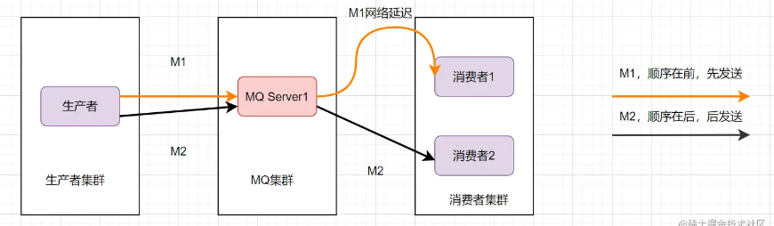

## 命令


## linux 环境下

1 .启动停止zookeeper

```
bin/zookeeper-server-start.sh config/zookeeper.properties
bin/zookeeper-server-stop.sh config/zookeeper.properties
```

2.启动停止kafka

```
bin/kafka-server-start.sh config/server.properties
bin/kafka-server-stop.sh config/server.properties
```


3.查看主题：

```
bin/kafka-topics.sh --list --zookeeper 10.10.0.94:2181
```


4.创建主题

```
bin/kafka-topics.sh --create --zookeeper 10.10.0.94:2181 --replication-factor 1 --partitions 1 -                                                                                     -topic test
```


5.发送消息 product

```
bin/kafka-console-producer.sh --broker-list 10.10.0.94:9092 --topic test
```


6.接受消息

```
bin/kafka-console-consumer.sh --bootstrap-server 10.10.0.94:9092 --topic test --from-beginning
```


## windows 环境下

1.window下启动zookeeper

```
bin\windows\zookeeper-server-start.bat config/zookeeper.properties
```


2.window下启动kafka

```
bin\windows\kafka-server-start.bat config\server.properties
```


3.windows下启动kafka consumer

```
bin\windows\kafka-console-consumer.bat --bootstrap-server localhost:9092 --topic test --from-beginning
```


4.windows下启动kafka product

```
bin\windows\kafka-console-producer.bat --broker-list localhost:9092 --topic test
```

5.创建主题

```
#windows目录下
kafka-topics.bat --create --bootstrap-server localhost:9092  --replication-factor 1 --partitions 1 --topic test
```


6.查看主题

```
kafka-topics.bat --list --bootstrap-server localhost:9092
```


## 消息队列总结

### 什么是消息队列

可以把队列理解为一个使用队列来通信的组件。它的本质就是个转发器，包含了发消息、存消息、消费消息的过程。


### 消息队列使用场景

1. 应用解耦
2. 流量削峰
3. 异步处理
4. 消息通讯
5. 远程调用

#### **应用解耦**

比如一个常见的业务：下单后扣库存，用户下单后，订单系统去通知库存系统扣减。传统的做法就是订单系统直接调用库存系统：


这种做法订单系统和库存系统存在耦合关系，如果库存系统无法访问，下单就会失败。

如果业务进行了扩展，订单系统接入了越来越多的下游系统，那订单系统代码需要经常修改。如果使用了消息队列：

1. 订单系统：用户下单后，消息写入到消息队列，返回下单成功
2. 库存系统：订阅下单消息，获取下单信息，进行库存操作。


#### 流量削峰

流量削峰也是消息队列的常见场景。我们做秒杀实现的时候，需要避免流量暴涨，打垮应用系统的风险。可以在应用前面加入消息队列。


#### 异步处理

比如我项目中的一个业务场景：在用户注册成功后，给它发个邮件。

如果注册信息入库和发短信**串行执行**的话，会比较耗时。如果采用并行执行的方式，可以减少响应时间。注册信息入库成功写到消息队列后响应成功，然后异步读取发邮件的事件。

#### 消息通讯

消息队列内置了高效的通信机制，可用于消息通讯。如实现点对点消息队列、聊天室等。


### 可靠性

对于消息队列而言，如果不能保证消息的可靠性可能会引起重大的生产事故。如果我们在超市里买完东西用手机进行支付，这条支付的消息存进了Kafka，但是因为某些原因导致消息丢失，商家没有收到钱，而我们却已经显示扣费，这是绝对不能容忍的，所以消息队列的可靠性至关重要。

对于可靠性的保障，主要需要从生产者、Broker和消费者三个角度来进行实现，我们先简单介绍一下。

Kafka是基于发布订阅模型的消息队列，主要包括生产者、Broker和消费者三个部分。生产者在Kakfa模型中负责生产消息，并将生产的消息发送到	Broker中进行存储，消费者从Broker中拉取订阅的消息进行消费。如下图所示：

**保证生产者的消息可靠性**

从本质上来说，生产者与Broker之间是通过网络进行通讯的，因此保障生产者的消息可靠性就必须要保证网络可靠性，这里Kafka使用`acks=all`可以设置Broker收到消息并同步到所有从节点后给生产者一个确认消息。如果生产者没有收到确认消息就会多次重复向Broker发送消息，保证在生产者与Broker之间的消息可靠性。

**保证Broker的消息可靠性**

在Broker收到了生产者的消息后，也有可能会丢失消息，最常见的情况是消息到达某个Broker后服务器就宕机了。这里需要补充说明一下Kafka的高可用性，直观的看，Kafka一般可被分成多个Broker节点，而为了增加Kafka的吞吐量，一个topic通常被分为多个partition，每个partition分布在不同的Broker上。如果一个partition丢失就会导致topic内容的部分丢失，因此partition往往需要多个副本，以此来保证高可用。


如上图所示，一个topic被分成三个partition，每个partition又进行复制，假如此时Broker1挂了，在Broker2和Broker3上依然有完整的三个partition。此时只需要重新选举出partition的leader即可。这里还是需要强调一下，一定要将leader上的数据同步到follower上才能给生产者返回消息，否则可能造成消息丢失。

**保证消费者的消息可靠性**

这里比较容易发生消息丢失的情况是，消费者从Broker把消息拉过来，如果这个时候还没有消费完，消费者就挂了并且消费者自动提交了offset，那么此时就丢失了一条消息。所以解决办法就是关闭自动提交offset，等真正消费成功之后再手动提交offset。

### 幂等性

保证消息的幂等性，其实就是保证消息不会被重复消费。幂等性的保证需要根据具体业务具体分析，比如向MySQL插入一条订单信息，可以根据订单id查询数据库中是否已经存在该信息进行去重。如果是类似于Redis的设置key值，Redis天然支持消息的幂等性，所以这种情况下是不需要关心消息的幂等性的。总之，对于幂等性的保证完全可以根据业务需求进行具体分析。

### 有序性

前面说到可靠性的时候我们提到了Kafka的topic是由多个partition组成的，那么我们可以用一种最极端的方式保证消息有序性，一个topic只设置一个partition。这里的问题就是如果一个topic只对应一个partition，那么这个吞吐量肯定就大幅下降了，这就违背了Kafka的设计初衷。


还有一种方法是比较推荐的，由于不同partition之间是不能保证有序性的，因此保证消息在同一个partition中是保证消息有序性的关键，除了前面说的那种极端解决方案，其实还可以在发送消息时，指定一个partition，或者指定一个key，因为同一个key的消息可以保证只发送到同一个partition，这里的key一般可以用类似userid的属性来表示。在上面的场景来看就是妹子的userid先是进行了评论操作，又进行了删除好友的操作，这两个操作由于是同一个key值，因此被发往同一个partition中。

另外一套版本：

kafka这样保证消息有序性的：

- 一个 topic，一个 partition，一个 consumer，内部单线程消费，单线程吞吐量太低，一般不会用这个。（**全局有序性**）
- 写 N 个内存 queue，具有相同 key 的数据都到同一个内存 queue；然后对于 N 个线程，每个线程分别消费一个内存 queue 即可，这样就能保证顺序性。

大家可以看下消息队列的有序性是怎么推导的哈：

消息的有序性，就是指可以按照消息的发送顺序来消费。有些业务对消息的顺序是有要求的，比如**先下单再付款，最后再完成订单**，这样等。假设生产者先后产生了两条消息，分别是下单消息（M1），付款消息（M2），M1比M2先产生，**如何保证M1比M2先被消费**呢。

为了保证消息的顺序性，可以将将M1、M2发送到同一个Server上，当M1发送完收到ack后，M2再发送。如图：


这样还是可能会有问题，因为从MQ服务器到服务端，可能**存在网络延迟**，虽然M1先发送，但是它**比M2晚到**。



那还能怎么办才能保证消息的顺序性呢？将M1和M2发往**同一个消费者**，且发送M1后，等到消费端ACK成功后，才发送M2就得了。


消息队列保证顺序性**整体思路**就是这样啦。比如Kafka的全局有序消息，就是**这种思想**的体现: 就是生产者发消息时，1个`Topic`只能对应1个`Partition`，一个 `Consumer`，内部单线程消费。

但是这样**吞吐量太低**，一般保证消息局部有序即可。在发消息的时候指定`Partition Key`，Kafka对其进行Hash计算，根据计算结果决定放入哪个`Partition`。这样Partition Key相同的消息会放在同一个Partition。然后多消费者单线程消费指定的Partition。

### 处理消息积压问题

消息积压是因为生产者的生产速度，大于消费者的消费速度。遇到消息积压问题时，我们需要先排查，是不是有bug产生了。

如果不是bug，我们可以**优化一下消费的逻辑**，比如之前是一条一条消息消费处理的话，我们可以确认是不是可以优化为批量处理消息。如果还是慢，我们可以考虑水平扩容，增加Topic的队列数，和消费组机器的数量，提升整体消费能力。

如果是bug导致几百万消息持续积压几小时。有如何处理呢？ 需要解决bug，**临时紧急扩容**，大概思路如下：

> 先修复consumer消费者的问题，以确保其恢复消费速度，然后将现有consumer 都停掉。
>
> 新建一个 topic，partition 是原来的 10 倍，临时建立好原先10倍的queue 数量。
>
> 然后写一个临时的分发数据的 consumer 程序，这个程序部署上去消费积压的数据，消费之后不做耗时的处理，直接均匀轮询写入临时建立好的 10 倍数量的 queue。
>
> 接着临时征用 10 倍的机器来部署 consumer，每一批 consumer 消费一个临时 queue 的数据。这种做法相当于是临时将 queue 资源和 consumer 资源扩大 10 倍，以正常的 10 倍速度来消费数据。
>
> 等快速消费完积压数据之后，得恢复原先部署的架构，重新用原先的 consumer 机器来消费消息。

### 技术选型

- RabbitMQ是开源的，比较稳定的支持，活跃度也高，但是不是Java语言开发的。
- 很多公司用RocketMQ，是阿里出品的。
- 如果是大数据领域的实时计算、日志采集等场景，用 Kafka 是业内标准的。

### 数据一致性

> https://juejin.cn/post/6844903951448408071

大致流程：


**普通消息处理存在的一致性问题**

我们以订单创建为例，订单系统先创建订单(本地事务)，再发送消息给下游处理；如果订单创建成功，然而消息没有发送出去，那么下游所有系统都无法感知到这个事件，会出现脏数据；

```
public void processOrder() {
    // 订单处理(业务操作) 
    orderService.process();
    // 发送订单处理成功消息(发送消息) 
    sendBizMsg ();
}
```

如果先发送订单消息，再创建订单；那么就有可能消息发送成功，但是在订单创建的时候却失败了，此时下游系统却认为这个订单已经创建，也会出现脏数据。

```
public void processOrder() {
   // 发送订单处理成功消息(发送消息) 
    sendBizMsg ();
    // 订单处理(业务操作) 
    orderService.process();
}
```

> **远程调用，结果最终可能为成功、失败、超时；而对于超时的情况，处理方最终的结果可能是成功，也可能是失败，调用方是无法知晓的。**

**事务消息**


- 生产者产生消息，发送一条半事务消息到MQ服务器
- MQ收到消息后，将消息持久化到存储系统，这条消息的状态是待发送状态。
- MQ服务器返回ACK确认到生产者，此时MQ不会触发消息推送事件
- 生产者执行本地事务
- 如果本地事务执行成功，即commit执行结果到MQ服务器；如果执行失败，发送rollback。
- 如果是正常的commit，MQ服务器更新消息状态为可发送；如果是rollback，即删除消息。
- 如果消息状态更新为可发送，则MQ服务器会push消息给消费者。消费者消费完就回ACK。
- 如果MQ服务器长时间没有收到生产者的commit或者rollback，它会反查生产者，然后根据查询到的结果执行最终状态。

> 注意：由于MQ通常都会保证消息能够投递成功，因此，如果业务没有及时返回ACK结果，那么就有可能造成MQ的重复消息投递问题。**因此，对于消息最终一致性的方案，消息的消费者必须要对消息的消费支持幂等，不能造成同一条消息的重复消费的情况。**

### 架构设计

> 让你写一个消息队列，该如何进行架构设计？


首先是消息队列的整体流程，producer发送消息给broker，broker存储好，broker再发送给consumer消费，consumer回复消费确认等。

producer发送消息给broker，broker发消息给consumer消费，那就需要两次RPC了，RPC如何设计呢？可以参考开源框架Dubbo，你可以说说服务发现、序列化协议等等

broker考虑如何持久化呢，是放文件系统还是数据库呢，会不会消息堆积呢，消息堆积如何处理呢。

消费关系如何保存呢？ 点对点还是广播方式呢？广播关系又是如何维护呢？zk还是config server

消息可靠性如何保证呢？如果消息重复了，如何幂等处理呢？

消息队列的高可用如何设计呢？ 可以参考Kafka的高可用保障机制。多副本 -> leader & follower -> broker 挂了重新选举 leader 即可对外服务。

消息事务特性，与本地业务同个事务，本地消息落库;消息投递到服务端，本地才删除；定时任务扫描本地消息库，补偿发送。

MQ得伸缩性和可扩展性，如果消息积压或者资源不够时，如何支持快速扩容，提高吞吐？可以参照一下 Kafka 的设计理念，broker -> topic -> partition，每个 partition 放一个机器，就存一部分数据。如果现在资源不够了，简单啊，给 topic 增加 partition，然后做数据迁移，增加机器，不就可以存放更多数据，提供更高的吞吐量了？


说说Kafka的原理？怎么保证Kafka的高可用？Kafka怎么保证消息有序？

## Kafka总结

> https://juejin.cn/post/6844903495670169607

### 什么是kafka

kafka它是一个分布式，支持多分区，多副本，基于zookeeper的分布式消息流平台，它同时也是一款开源的基于发布订阅模式的消息引擎系统。

### Kafka基本术语

**消息**：kafka中的数据单元被称为消息，也被称为记录，可以把它看作数据库表中某一行的记录。

**批次**：为了提高效率，消息会分批次写入kafka，批次就代指的是一组消息。

**主题**：消息的种类称为主题，可以说一个主题代表了一类消息。相当于对消息进行分类。主题就像是数据库中的表。

**分区**：主题可以被分为若干个分区（partition），同一个主题中的分区可以不在一个机器上，有可能会部署在多个机器上，由此来实现kafka的伸缩性，单一主题中的分区有序，但是无法保证主题中所有的分区有序。


**生产者**：向主题发布消息的客户端应用程序称为生产者，生产者用于持续不断的向某个主题发送消息。

**消费者**：订阅主题消息的客户端程序被称为消费者，消费者用于处理生产者产生的消息。

**消费者群组**：生产者与消费者的关系就如同餐厅中的厨师和顾客之间的关系一样，一个厨师对应多个顾客，也就是一个生产者对应多个消费者，消费者群组指的就是由一个或多个消费者组成的群体。


**偏移量**：偏移量是一种元数据，它是一个不断递增的整数值，用来记录消费者发生重平衡时的位置，以便用来恢复数据。

**broker**：一个独立的kafka服务器就被称为broker，broker接收来自生产者的消息，为消息设置偏移量，并提交消息到磁盘保存。

**broker集群**：broker是集群的组成部分，broker集群由一个或多个broker组成，每个集群都有一个broker同时充当了集群控制器的角色（自动从集群的活跃成员中选举出来）。

**副本**：kafka中消息的备份又叫做副本，副本的数量是可以配置的，kafka定义了两类副本：领导者副本和追随者副本，前者对外提供服务，后者只是被动跟随。

**重平衡**：消费者组内某个消费者实例挂掉后，其他消费者实例自动重新分配订阅主题分区的过程。重平衡是kafka消费者端实现高可用的重要手段。

### kafka的特性（设计原则）

- 高吞吐、低延迟：kafka最大的特点就是收发消息非常的快，kafka每秒可以处理几十万条数据，它的最低延迟只有几毫秒。
- 高伸缩性：每个主题包含多个分区，主题中的分区可以发布在不同的主机broker中。
- 持久性、可靠性：kafka能够允许数据的持久化存储，消息被持久化到磁盘，并支持数据备份防止数据丢失，kafka底层的数据存储是基于Zookeeper存储的，zookeeper的数据能够持久存储。
- 容错性：允许集群中的节点失败，某个节点宕机，kafka集群能够正常工作。
- 高并发：允许数千个客户端同时读写。

### kafka的使用场景

- 活动跟踪：Kafka 可以用来跟踪用户行为，比如我们经常回去淘宝购物，你打开淘宝的那一刻，你的登陆信息，登陆次数都会作为消息传输到 Kafka ，当你浏览购物的时候，你的浏览信息，你的搜索指数，你的购物爱好都会作为一个个消息传递给 Kafka ，这样就可以生成报告，可以做智能推荐，购买喜好等。
- 传递消息：Kafka 另外一个基本用途是传递消息，应用程序向用户发送通知就是通过传递消息来实现的，这些应用组件可以生成消息，而不需要关心消息的格式，也不需要关心消息是如何发送的。
- 度量指标：Kafka也经常用来记录运营监控数据。包括收集各种分布式应用的数据，生产各种操作的集中反馈，比如报警和报告。
- 日志记录：Kafka 的基本概念来源于提交日志，比如我们可以把数据库的更新发送到 Kafka 上，用来记录数据库的更新时间，通过kafka以统一接口服务的方式开放给各种consumer，例如hadoop、Hbase、Solr等。
- 流式处理：流式处理是有一个能够提供多种应用程序的领域。
- 限流削峰：Kafka 多用于互联网领域某一时刻请求特别多的情况下，可以把请求写入Kafka 中，避免直接请求后端程序导致服务崩溃。

### kafka的消息队列

kafka的消息队列一般分为两种模式：点对点模式和发布订阅模式

kafkakafka是支持消费者群组的，也就是kafka中会有一个或者多个消费者，如果一个生产者生产的消息由一个消费者进行消费的话，那么这种模式就是点对点模式。


如果一个生产者或者多个生产者产生的消息能够被多个消费者同时消费的情况，这样的消息队列为发布订阅模式的消息队列。


### kafka系统架构


如上图所示，一个典型的 Kafka 集群中包含若干Producer（可以是web前端产生的Page View，或者是服务器日志，系统CPU、Memory等），若干broker（Kafka支持水平扩展，一般broker数量越多，集群吞吐率越高），若干Consumer Group，以及一个Zookeeper集群。Kafka通过Zookeeper管理集群配置，选举leader，以及在Consumer Group发生变化时进行rebalance。Producer使用push模式将消息发布到broker，Consumer使用pull模式从broker订阅并消费消息。

### 核心API

Kafka 有四个核心API，它们分别是

- Producer API，它允许应用程序向一个或多个 topics 上发送消息记录
- Consumer API，允许应用程序订阅一个或多个 topics 并处理为其生成的记录流
- Streams API，它允许应用程序作为流处理器，从一个或多个主题中消费输入流并为其生成输出流，有效的将输入流转换为输出流。
- Connector API，它允许构建和运行将 Kafka 主题连接到现有应用程序或数据系统的可用生产者和消费者。例如，关系数据库的连接器可能会捕获对表的所有更改


### Kafka 为何如此之快

Kafka 实现**零拷贝**原理来快速移动数据，避免了内核之间的切换。Kafka 可以将数据记录分批发送，从生产者到文件系统（Kafka 主题日志）到消费者，可以端到端的查看这些批次的数据。

批处理能够进行更有效的数据压缩并减少 I/O 延迟，Kafka 采取顺序写入磁盘的方式，避免了随机磁盘寻址的浪费。

总结一下其实就是四个要点

- 顺序读写
- 零拷贝
- 消息压缩
- 分批发送

### 消息的发送过程


我们从创建一个`ProducerRecord` 对象开始，ProducerRecord 是 Kafka 中的一个核心类，它代表了一组 Kafka 需要发送的 `key/value` 键值对，它由记录要发送到的主题名称（Topic Name），可选的分区号（Partition Number）以及可选的键值对构成。

在发送 ProducerRecord 时，我们需要将键值对对象由序列化器转换为字节数组，这样它们才能够在网络上传输。然后消息到达了分区器。

如果发送过程中指定了有效的分区号，那么在发送记录时将使用该分区。如果发送过程中未指定分区，则将使用key 的 hash 函数映射指定一个分区。如果发送的过程中既没有分区号也没有，则将以循环的方式分配一个分区。选好分区后，生产者就知道向哪个主题和分区发送数据了。

ProducerRecord 还有关联的时间戳，如果用户没有提供时间戳，那么生产者将会在记录中使用当前的时间作为时间戳。Kafka 最终使用的时间戳取决于 topic 主题配置的时间戳类型。

- 如果将主题配置为使用 `CreateTime`，则生产者记录中的时间戳将由 broker 使用。
- 如果将主题配置为使用`LogAppendTime`，则生产者记录中的时间戳在将消息添加到其日志中时，将由 broker 重写。

然后，这条消息被存放在一个记录批次里，这个批次里的所有消息会被发送到相同的主题和分区上。由一个独立的线程负责把它们发到 Kafka Broker 上。

Kafka Broker 在收到消息时会返回一个响应，如果写入成功，会返回一个 RecordMetaData 对象，**它包含了主题和分区信息，以及记录在分区里的偏移量，上面两种的时间戳类型也会返回给用户**。如果写入失败，会返回一个错误。生产者在收到错误之后会尝试重新发送消息，几次之后如果还是失败的话，就返回错误消息。

**简单消息发送：**

```
ProducerRecord<String,String> record =
                new ProducerRecord<String, String>("CustomerCountry","West","France");

producer.send(record);

调用的构造函数：
public ProducerRecord(String topic, K key, V value) {}
```

**同步发送消息：**

```
ProducerRecord<String,String> record =
                new ProducerRecord<String, String>("CustomerCountry","West","France");

try{
  RecordMetadata recordMetadata = producer.send(record).get();
}catch(Exception e){
  e.printStackTrace()；
}
```

这种发送消息的方式较上面的发送方式有了改进，首先调用 send() 方法，然后再调用 get() 方法等待 Kafka 响应。如果服务器返回错误，get() 方法会抛出异常，如果没有发生错误，我们会得到 `RecordMetadata` 对象，可以用它来查看消息记录。

生产者（KafkaProducer）在发送的过程中会出现两类错误：其中一类是重试错误，这类错误可以通过重发消息来解决。比如连接的错误，可以通过再次建立连接来解决；无`主`错误则可以通过重新为分区选举首领来解决。KafkaProducer 被配置为自动重试，如果多次重试后仍无法解决问题，则会抛出重试异常。另一类错误是无法通过重试来解决的，比如`消息过大`对于这类错误，KafkaProducer 不会进行重试，直接抛出异常。

**异步发送消息：**

同步发送消息都有个问题，那就是同一时间只能有一个消息在发送，这会造成许多消息无法直接发送，造成消息滞后，无法发挥效益最大化。

比如消息在应用程序和 Kafka 集群之间一个来回需要 10ms。如果发送完每个消息后都等待响应的话，那么发送100个消息需要 1 秒，但是如果是`异步`方式的话，发送 100 条消息所需要的时间就会少很多很多。大多数时候，虽然Kafka 会返回 `RecordMetadata` 消息，但是我们并不需要等待响应。

为了在异步发送消息的同时能够对异常情况进行处理，生产者提供了回调支持。下面是回调的一个例子：

```
ProducerRecord<String, String> producerRecord = new ProducerRecord<String, String>("CustomerCountry", "Huston", "America");
        producer.send(producerRecord,new DemoProducerCallBack());


class DemoProducerCallBack implements Callback {

  public void onCompletion(RecordMetadata metadata, Exception exception) {
    if(exception != null){
      exception.printStackTrace();;
    }
  }
}
```

首先实现回调需要定义一个实现了`org.apache.kafka.clients.producer.Callback`的类，这个接口只有一个 `onCompletion`方法。如果 kafka 返回一个错误，onCompletion 方法会抛出一个非空(non null)异常，这里我们只是简单的把它打印出来，如果是生产环境需要更详细的处理，然后在 send() 方法发送的时候传递一个 Callback 回调的对象。

### 生产者分区机制

Kafka 对于数据的读写是以`分区`为粒度的，分区可以分布在多个主机（Broker）中，这样每个节点能够实现独立的数据写入和读取，并且能够通过增加新的节点来增加 Kafka 集群的吞吐量，通过分区部署在多个 Broker 来实现`负载均衡`的效果。

当 Producer 生产者发送产生一条消息发给 topic 的时候，你如何判断这条消息会存在哪个分区中呢？

#### 分区策略

**顺序轮询**（Range)

顺序分配，消息是均匀的分配给每个partition，即每个分区存储一次消息。轮训策略是 Kafka Producer 提供的默认策略，如果你不使用指定的轮训策略的话，Kafka 默认会使用顺序轮训策略的方式。


**随机轮询**

随机轮询简而言之就是随机的向 partition 中保存消息。先计算出该主题总的分区数，然后随机地返回一个小于它的正整数。从实际表现来看，它要逊于轮询策略，所以**如果追求数据的均匀分布，还是使用轮询策略比较好**。事实上，随机策略是老版本生产者使用的分区策略，在新版本中已经改为轮询了。


**按照key进行消息保存**

这个策略也叫做 **key-ordering** 策略，Kafka 中每条消息都会有自己的key，一旦消息被定义了 Key，那么你就可以保证同一个 Key 的所有消息都进入到相同的分区里面，由于每个分区下的消息处理都是有顺序的，故这个策略被称为按消息键保序策略。


### 消费者消费机制

应用程序使用 `KafkaConsumer` 从 Kafka 中订阅主题并接收来自这些主题的消息，然后再把他们保存起来。

Kafka 消费者从属于`消费者群组`。一个群组中的消费者订阅的都是`相同`的主题，每个消费者接收主题一部分分区的消息。


向群组中增加消费者是横向伸缩消费能力的主要方式。总而言之，我们可以通过增加消费组的消费者来进行`水平扩展提升消费能力`。这也是为什么建议创建主题时使用比较多的分区数，这样可以在消费负载高的情况下增加消费者来提升性能。另外，消费者的数量不应该比分区数多，因为多出来的消费者是空闲的，没有任何帮助。

### 消费者组

`消费者组（Consumer Group）`是由一个或多个消费者实例（Consumer Instance）组成的群组，具有可扩展性和可容错性的一种机制。消费者组内的消费者`共享`一个消费者组ID，这个ID 也叫做 `Group ID`，组内的消费者共同对一个主题进行订阅和消费。

### 消费者重平衡

最初是一个消费者订阅一个主题并消费其全部分区的消息，后来有一个消费者加入群组，随后又有更多的消费者加入群组，而新加入的消费者实例`分摊`了最初消费者的部分消息，这种把分区的所有权通过一个消费者转到其他消费者的行为称为`重平衡` 。

重平衡非常重要，它为消费者群组带来了`高可用性` 和 `伸缩性`，我们可以放心的添加消费者或移除消费者，不过在正常情况下我们并不希望发生这样的行为。在重平衡期间，消费者无法读取消息，造成整个消费者组在重平衡的期间都不可用。另外，当分区被重新分配给另一个消费者时，消息当前的读取状态会丢失，它有可能还需要去刷新缓存，在它重新恢复状态之前会拖慢应用程序。


### 实现延迟队列

> [csdn](https://blog.csdn.net/feiying0canglang/article/details/121372275?ops_request_misc=%257B%2522request%255Fid%2522%253A%2522166460297416800184118534%2522%252C%2522scm%2522%253A%252220140713.130102334..%2522%257D&request_id=166460297416800184118534&biz_id=0&utm_medium=distribute.pc_search_result.none-task-blog-2~all~baidu_landing_v2~default-1-121372275-null-null.142^v51^control_1,201^v3^add_ask&utm_term=%E4%BD%BF%E7%94%A8kafka%E6%80%8E%E4%B9%88%E5%AE%9E%E7%8E%B0%E5%BB%B6%E8%BF%9F%E9%98%9F%E5%88%97&spm=1018.2226.3001.4187)
>
> [稀土](https://juejin.cn/post/6861118085739331591)

1、划分topic进行拦截消费： 延时的消息按照不同的延时等级，被放入不同的 topic 当中，如果是和等级不一致的消息，会被强制转为和等级一致的延时时间，这样延时的误差可以控制在两个延时等级的时间差范围内。producer写入数据到不同topic延时队列（delay_topic）中 ，消费者消费真正（real_topic）主题中的数据，我们可以在produce中默认启动一个拦截器，把拦截写入的数据写入到delay_topic中，当时间到了后消费者把延时队列中的数据加载到real_topic中供消费者消费。

如何延迟发送：

- 不能用sleep。 在轮询kafka拉取消息的时候，kafka会返回由max.poll.records配置指定的一批消息，当程序不能在max.poll.interval.ms配置的期望时间内处理这些消息的话，kafka就会认为这个消费者已经挂了，会进行rebalance，同时你这个消费者就无法再拉取到任何消息了。

  举个例子：当你需要一个24小时的延迟消息队列，在代码里面写下了Thread.sleep(1000*60*60 * 24);为了不发生rebalance，你把max.poll.interval.ms 也改成了1000*60*60*24，这个时候你或许会感觉到一丝丝的怪异，我是谁？我在哪？我为什么要写出来这样的代码？

-  KafkaConsumer 提供了暂停和恢复的API函数，调用消费者的暂停方法后就无法再拉取到新的消息，同时长时间不消费kafka也不会认为这个消费者已经挂掉了。

  为了更优雅，我们会启动一个定时器来替换sleep。

  完整流程如下图，当消费者发现消息不满足条件时，我们就暂停消费者，并把偏移量seek到上一次消费的位置以便等待下一个周期再次消费这条消息。

  

  ​

2、时间轮延时队列：Kafka有专门用于实现延迟功能的定时器（SystemTimer）。底层使用的是时间轮（TimingWheel）模型（环形队列，下面挂接双向链表）。时间轮由多个时间格组成，每个时间格代表当前时间轮的基本时间跨度（tickMs）。时间轮的时间格个数是固定的，可用wheelSize来表示，那么整个时间轮的总体时间跨度（interval）可以通过公式 tickMs × wheelSize计算得出。时间轮还有一个表盘指针（currentTime），用来表示时间轮当前所处的时间，currentTime是tickMs的整数倍。currentTime可以将整个时间轮划分为到期部分和未到期部分，currentTime当前指向的时间格也属于到期部分，表示刚好到期，需要处理此时间格所对应的TimerTaskList的所有任务。


Kafka中的时间轮（TimingWheel）是一个存储定时任务的环形队列，钟面上有很多 bucket ，每一个 bucket 上可以存放多个任务，使用一个 List 保存该时刻到期的所有任务，同时一个指针随着时间流逝一格一格转动，并执行对应 bucket 上所有到期的任务。任务通过 取模决定应该放入哪个 bucket 。bucket底层采用数组实现，数组中的每个元素可以存放一个定时任务列表（TimerTaskList）。TimerTaskList是一个环形的双向链表，链表中的每一项表示的都是定时任务项（TimerTaskEntry），其中封装了真正的定时任务TimerTask。

### Kafka、rabbitmq及rocketmq的区别


分区分配机制？？？？


kafka为什么吞吐量高？？？